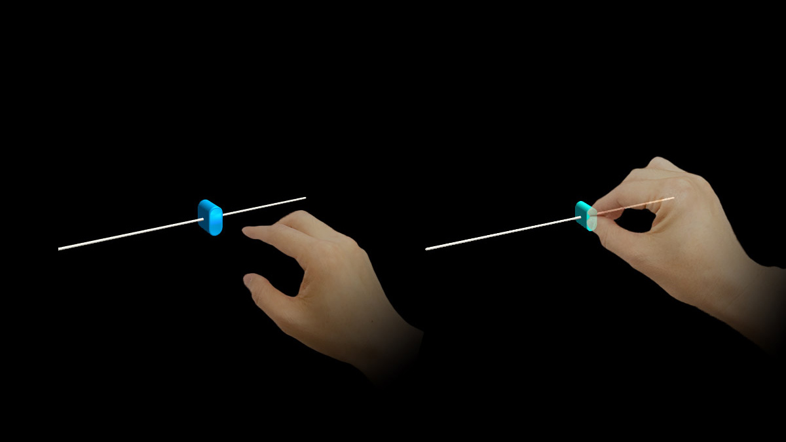

# Slider

A slider is a UI component used to set a value. It provides a visual indication of adjustable content, and the current setting in the total range of content. It's displayed as a track with options on either side. A knob or lever is dragged to one end or the other to make the choice, indicating the current value. The Pinch Slider can be moved by directly grabbing the slider, either directly or at a distance. Sliders work with various input types such as gaze and air-tap and a motion controller.

 

---

## Slider in MRTK (Mixed Reality Toolkit) for Unity

* [MRTK - Slider](https://docs.microsoft.com/windows/mixed-reality/mrtk-unity/features/ux-building-blocks/sliders)

 

---

## See also

* [Cursors](cursors.md)
* [Hand ray](point-and-commit.md)
* [Button](button.md)
* [Interactable object](interactable-object.md)
* [Bounding box and App bar](app-bar-and-bounding-box.md)
* [Manipulation](direct-manipulation.md)
* [Hand menu](hand-menu.md)
* [Near menu](near-menu.md)
* [Object collection](object-collection.md)
* [Voice command](voice-input.md)
* [Keyboard](keyboard.md)
* [Tooltip](tooltip.md)
* [Slate](slate.md)
* [Slider](slider.md)
* [Shader](shader.md)
* [Billboarding and tag-along](billboarding-and-tag-along.md)
* [Displaying progress](progress.md)
* [Surface magnetism](surface-magnetism.md)
