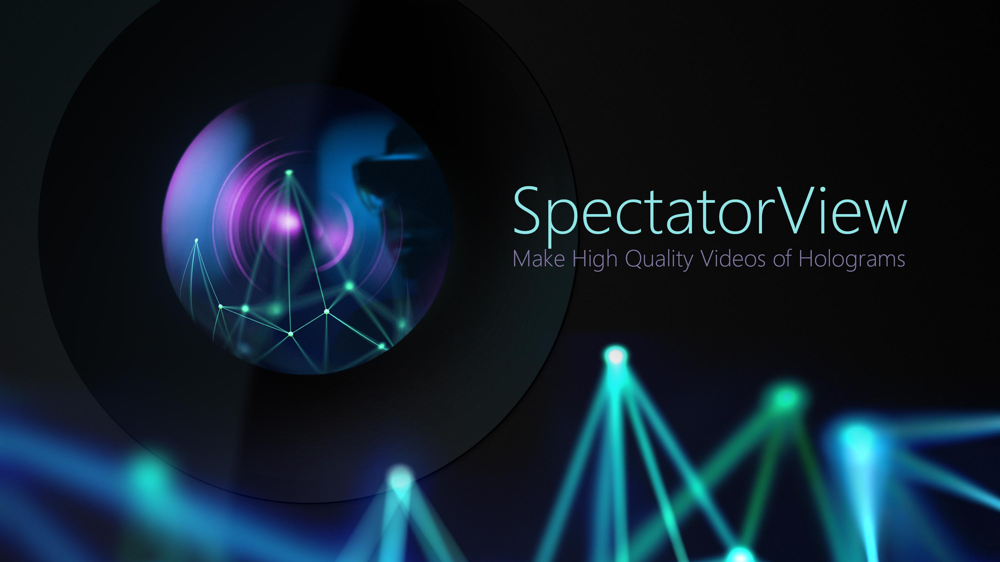
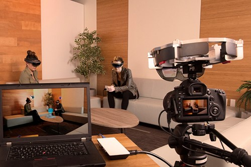
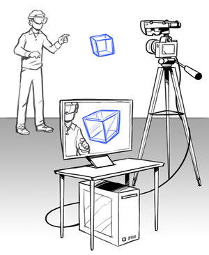

# Spectator View for HoloLens and HoloLens 2

> [!WARNING]
> Microsoft will be deprecating the Spectator View sample due to incompatibilities with the version of the Azure Spatial Anchors SDK package that the sample relies on. Additionally, the sample may cease to work due to other changes in the Unity environment as customers move to supported 2019 LTS builds.
>
> Although Microsoft is not currently investing resources to address the above issues, it may be possible to remove the Azure Spatial Anchors functionality from the sample and rely on technology such as QR codes for alignment.   If members of the community submit PRs to address these issues, we will review and accept them for the time being.

When you're wearing a HoloLens, it's easy to forget a person without one can't experience the same wonders you're seeing. Spectator View lets others see what a HoloLens user sees on a 2D screen. It's also a fast and affordable approach to recording holograms in HD with mobile devices and getting great quality recordings of holograms with video cameras.

## Key Resources

* [**Spectator View on GitHub**](https://github.com/microsoft/MixedReality-SpectatorView)
* [**Spectator View Documentation**](https://microsoft.github.io/MixedReality-SpectatorView/README.html)
* [**Spectator View Samples**](https://github.com/microsoft/MixedReality-SpectatorView/tree/master/samples)

## Use Cases

* You can record a mixed reality experience using an iPhone or Android device. Record in full HD and apply anti-aliasing to holograms and shadow for a cost-effective and quick way to capture video of holograms.
* Stream live mixed reality experiences to an Apple TV directly from your iPhone or iPad, lag-free!
* Share the experience with guests: Let non-HoloLens users experience holograms directly from their phones or tablets.

## Current Features

* Spatial synchronization of Holograms, so everyone sees holograms in the exact same place.
* iOS (ARKit-enabled devices) and Android (ARCore-enabled devices) support.
Multiple iOS guests.
Recording of video + holograms + ambient sound + hologram sound.
Share sheet so you can save video, email it, or share with other supporting apps.

 

The following table shows different Spectator View functionality and their capabilities. Choose the option that best fits your video recording needs:

|      Functionality                                | Mobile                  |                    Video Camera              |
|--------------------------------------|:-----------------------:|:-------------------------------------------:|
| HD quality                           |         Full HD         |        Professional quality filming (as determined by video camera)      |
| Easy camera movement                 |            ✔            |                      ✔                      |
| Third-person view                    |            ✔            |                      ✔                      |
| Can be streamed to screens           |            ✔            |                      ✔                      |
| Portable                             |            ✔            |                                             |
| Wireless                             |            ✔            |                                             |
| Additional required hardware         |     Android phone, iPhone    | HoloLens + Rig + Tripod + Video Camera + PC + Unity |
| Hardware investment                  |           Low            |                     High                    |
| Cross-platform                       |           Android, iOS   |                                             |
| Synchronized content                 |            ✔            |                      ✔                      |
| Runtime setup duration               |         Instant          |                     Slow                    |
## See also

* [Mixed reality capture](/hololens/holographic-photos-and-videos) 
* [Mixed reality capture for developers](../develop/advanced-concepts/mixed-reality-capture-overview.md)
* [Shared experiences in mixed reality](shared-experiences-in-mixed-reality.md)