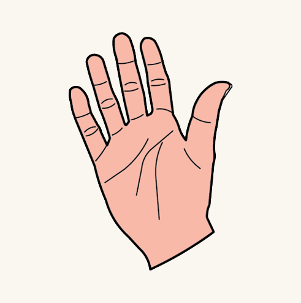
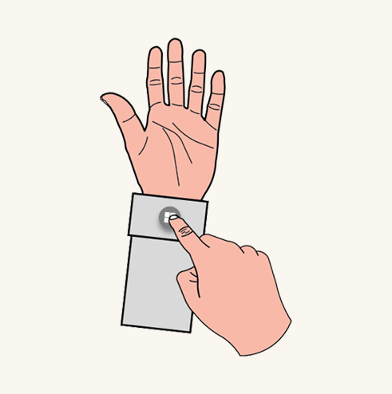
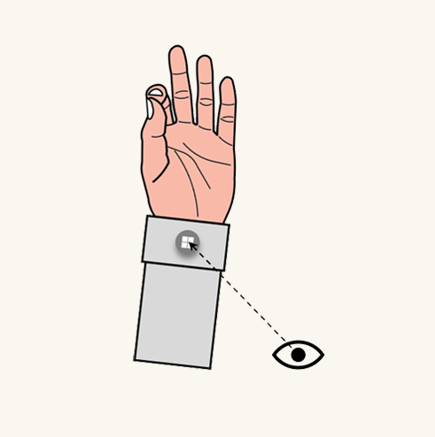

# Start gesture

The Start gesture is a hand gesture used to invoke the Start Menu. It's the equivalent of pressing the Windows key on keyboards, the Xbox icon on Xbox controllers, or the Windows icon on immersive headset motion controllers. Pay special attention to reserved system gestures on each Mixed Reality device to prevent conflicts when you're designing interactions.

## Device support

<table>
    <colgroup>
    <col width="25%" />
    <col width="25%" />
    <col width="25%" />
    <col width="25%" />
    </colgroup>
    <tr>
        <td><strong>Feature</strong></td>
        <td><a href="/hololens/hololens1-hardware"><strong>HoloLens (1st gen)</strong></a></td>
        <td><a href="/hololens/hololens2-hardware"><strong>HoloLens 2</strong></td>
        <td><a href="/windows/mixed-reality/enthusiast-guide/immersive-headset-hardware-details"><strong>Immersive headsets</strong></a></td>
    </tr>
     <tr>
        <td>Bloom</td>
        <td>✔️</td>
        <td>❌</td>
        <td>❌</td>
    </tr>
     <tr>
        <td>Wrist icon</td>
        <td>❌</td>
        <td>✔️</td>
        <td>❌</td>
    </tr>
    <tr>
        <td>Eye gaze and palm up pinch</td>
        <td>❌</td>
        <td>✔️</td>
        <td>❌</td>
    </tr>
</table>

## Bloom

We designed “Bloom” to bring up the start menu in HoloLens (1st gen), which is a symbolic gesture mimicking a flower blossom. It's distinctive for sure-footed interaction, easy of use, and quick to recall. To use the gesture, hold out your hand with your palm up and fingertips together, then open your hand by spreading your fingers.

:::row:::
    :::column:::
         
        **Step 1: Palm up with fingertips together** 
    :::column-end:::
    :::column:::
         
        **Step 2: Palm up with fingertips spread** 
    :::column-end:::
:::row-end:::

 

---

## Start gesture

In HoloLens 2, we replaced the Bloom gesture with a virtual wrist icon, which is more instinctual for users. By showing users the icon on the wrist, they can intuitively reach out and press it with their other hand.

:::row:::
    :::column:::
         
        **Step 1: Palm up to show the wrist icon** 
    :::column-end:::
    :::column:::
         
        **Step 2: Press the wrist icon** 
    :::column-end:::
:::row-end:::

 

---

## One-handed Start gesture

> [!IMPORTANT]
> For the one-handed Start gesture to work:
>
> 1. You must update to the November 2019 update (build 18363.1039) or later.
> 1. Your eyes must be calibrated on the device so that eye tracking functions correctly. If you do not see orbiting dots around the Start icon when you look at it, your eyes are not calibrated on the device.

You can also use the Start gesture with only one hand. Hold out your hand with your palm facing you and look at the **Start icon** on your inner wrist. **While keeping your eye on the icon**, pinch your thumb and index finger together. 
:::row:::
    :::column:::
         
        **Step 1: Palm up to show the wrist icon** 
    :::column-end:::
    :::column:::
         
        **Step 2: Eye gaze at the icon then pinch** 
    :::column-end:::
:::row-end:::

 

---

## See also

* [Instinctual interactions](interaction-fundamentals.md)
* [Eye-gaze](eye-tracking.md)
* [Voice input](voice-input.md)