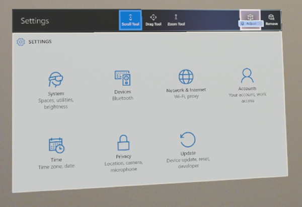
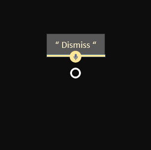

# Voice input

Voice is one of the key forms of input on HoloLens. It allows you to directly command a hologram without having to use [hand gestures](gaze-and-commit.md#composite-gestures). Voice input can be a natural way to communicate your intent. Voice is especially good at traversing complex interfaces, because it lets users cut through nested menus with one command.

Voice input is powered by the [same engine](/windows/uwp/design/input/speech-recognition) that supports speech in all _Universal Windows Apps_. On HoloLens, speech recognition will always function in the Windows display language configured in your device Settings. 

 

## Voice and gaze

When you're using voice commands, head or eye gaze is the typical targeting mechanism, whether with a cursor to "select" or to channel your command to an application you're looking at. It may not even be required to show any gaze cursor _("see it, say it")_. Some voice commands don't require a target at all, such as "go to start" or "Hey Cortana."

 

<iframe width="940" height="530" src="https://www.youtube.com/embed/eHMkOpNUtR8" frameborder="0" allow="accelerometer; autoplay; encrypted-media; gyroscope; picture-in-picture" allowfullscreen></iframe>

## Device support

<table>
    <colgroup>
    <col width="25%" />
    <col width="25%" />
    <col width="25%" />
    <col width="25%" />
    </colgroup>
    <tr>
        <td><strong>Feature</strong></td>
        <td><a href="/hololens/hololens1-hardware"><strong>HoloLens (1st gen)</strong></a></td>
        <td><a href="/hololens/hololens2-hardware"><strong>HoloLens 2</strong></td>
        <td><a href="/windows/mixed-reality/enthusiast-guide/immersive-headset-hardware-details"><strong>Immersive headsets</strong></a></td>
    </tr>
     <tr>
        <td>Voice input</td>
        <td>✔️</td>
        <td>✔️</td>
        <td>✔️ (with microphone)</td>
    </tr>
</table>

## The "select" command

**HoloLens (1st gen)**

Even without specifically adding voice support to your app, your users can activate holograms simply by saying the system voice command "select". This behaves the same as an [air tap](gaze-and-commit.md#composite-gestures) on HoloLens, pressing the select button on the [HoloLens clicker](/hololens/hololens1-clicker), or pressing the trigger on a [Windows Mixed Reality motion controller](motion-controllers.md). You'll hear a sound and see a tooltip with "select" appear as confirmation. "Select" is enabled by a low-power keyword detection algorithm, which means you can say it anytime with minimal battery life impact. You can even say "select" with your hands at your side.

 

---

:::row:::
    :::column:::
        **HoloLens 2**  
        To use the "select" voice command in HoloLens 2, you first need to bring up the gaze cursor to use as a pointer. The command to bring it up is easy to remember--just say, "select".  
        To exit the mode, use your hands again by air tapping, approaching a button with your fingers, or using the system gesture. 
          
        *Image: Say "select" to use the voice command for selection*
    :::column-end:::
        :::column:::
        
    :::column-end:::
:::row-end:::

 

---

## Hey Cortana

You can say "Hey Cortana" to bring up Cortana at any time. You don't have to wait for her to appear to continue asking her your question or giving her an instruction. For example, try saying "Hey Cortana, what's the weather?" as a single sentence. For more information about Cortana and what you can do, ask her! Say "Hey Cortana, what can I say?" and she'll pull up a list of working and suggested commands. If you're already in the Cortana app, select the **?** icon on the sidebar to pull up this same menu.

**HoloLens-specific commands**
* "What can I say?"
* "Go to Start" - instead of [bloom](system-gesture.md#bloom) to get to [Start Menu](../discover/navigating-the-windows-mixed-reality-home.md#start-menu)
* "Launch <app>"
* "Move <app> here"
* "Take a picture"
* "Start recording"
* "Stop recording"
* "Show hand ray"
* "Hide hand ray"
* "Increase the brightness"
* "Decrease the brightness"
* "Increase the volume"
* "Decrease the volume"
* "Mute" or "Unmute"
* "Shut down the device"
* "Restart the device"
* "Go to sleep"
* "What time is it?"
* "How much battery do I have left?"

 

---

:::row:::
    :::column:::
        ## "See It, Say It" 
        HoloLens has a "see it, say it" model for voice input, where labels on buttons tell users what voice commands they can say as well. For example, when looking at an app window in HoloLens (1st gen), a user can say "Adjust" command to adjust the position of the app in the world. 
         
        *Image: A user can say the "Adjust" command, which they see in the App bar to adjust the position of the app*
    :::column-end:::
        :::column:::
         
         
    :::column-end:::
:::row-end:::

 

:::row:::
    :::column:::
        When apps follow this rule, users can easily understand what to say to control the system. While gazing at a button in HoloLens (1st gen), you'll see a "voice dwell" tooltip that comes up after a second if the button is voice-enabled and displays the command to speak to "press" it. To reveal voice tooltips in HoloLens 2, show the voice cursor by saying "select" or "What can I say" (See image).  
         
        *Image: "See it, say it" commands appear below the buttons*
    :::column-end:::
        :::column:::
         
    :::column-end:::
:::row-end:::

 

---

## Voice commands for fast hologram manipulation

There are many voice commands you can say while gazing at a hologram to quickly do manipulation tasks. 
These voice commands work on app windows and 3D objects you've placed in the world.

**Hologram manipulation commands**
* Face me
* Bigger | Enhance
* Smaller

On HoloLens 2, you can also create more natural interactions in combination with eye-gaze, which implicitly provides contextual information about what you are referring to. 
For example, you could look at a hologram and say "put _this_" and then look over where you want to place it and say "over _here_".
Or you could look at a holographic part on a complex machine and say: "give me more information about _this_".

## Discovering voice commands

Some commands, like the commands for fast manipulation above, can be hidden. To learn about what commands you can use, gaze at an object and say, "what can I say?". A list of possible commands pops up. 
You can also use the head gaze cursor to look around and reveal the voice tooltips for each button in front of you. 

If you want a complete list, just say, "Show all commands" anytime. 

## Dictation

Rather than typing with [air taps](gaze-and-commit.md#composite-gestures), voice dictation can be more efficient to enter text into an app. This can greatly accelerate input with less effort for the user.

 
*Voice dictation starts by selecting the microphone button on the keyboard*

Anytime the holographic keyboard is active, you can switch to dictation mode instead of typing. Select the microphone on the side of the text input box to get started.

## Adding voice commands to your app

Consider adding voice commands to any experience that you build. Voice is a powerful way control the system and apps. Because users speak with different kinds of dialects and accents, proper choice of speech keywords will make sure your users' commands are interpreted unambiguously.

### Best practices

Below are some practices that will aid in smooth speech recognition.
* **Use concise commands** - When possible, choose keywords of two or more syllables. One-syllable words tend to use different vowel sounds when spoken by persons of different accents. Example: "Play video" is better than "Play the currently selected video"
* **Use simple vocabulary** - Example: "Show note" is better than "Show placard"
* **Make sure commands are non-destructive** - Make sure any speech command actions are non-destructive and can easily be undone in case another person speaking near the user accidentally triggers a command.
* **Avoid similar sounding commands** - Avoid registering multiple speech commands that sound similar. Example: "Show more" and "Show store" can be similar sounding.
* **Unregister your app when not it uses** - When your app isn't in a state in which a particular speech command is valid, consider unregistering it so that other commands aren't confused for that one.
* **Test with different accents** - Test your app with users of different accents.
* **Maintain voice command consistency** - If "Go back" goes to the previous page, maintain this behavior in your applications.
* **Avoid using system commands** - The following voice commands are reserved for the system, so avoid using them in your applications:
   * "Hey Cortana"
   * "Select"
   * "Go to start"

### Advantages of voice input

Voice input is a natural way to communicate our intents. 
Voice is especially good at interface **traversals** because it can help users cut through multiple steps of an interface. A user might say "go back" while looking at a webpage, instead of having to go up and hit the back button in the app. 
This small time saving has a powerful **emotional effect** on user’s perception of the experience and gives them a small amount superpower. 
Using voice is also a convenient input method when we have our arms full or are **multi-tasking**. 
On devices where typing on a keyboard is difficult, **voice dictation** can be an efficient alternative way to input text. 
Lastly, in some cases when the **range of accuracy** for gaze and gesture are limited, voice can help to disambiguate the user's intent. 

**How using voice can benefit the user**
* Reduces time - it should make the end goal more efficient.
* Minimizes effort - it should make tasks more fluid and effortless.
* Reduces cognitive load - it's intuitive, easy to learn, and remember.
* It's socially acceptable - it should fit in with societal norms of behavior.
* It's routine - voice can readily become a habitual behavior.

### Challenges for voice input

While voice input is great for many different applications, it also faces several challenges. 
Understanding both the advantages and challenges for voice input enables app developers to make smarter choices for how and when to use voice input and to create a great experience for their users.

**Voice input for continuous input control**
Fine-grained control is one of them. 
For example, a user might want to change their volume in their music app. 
She can say "louder", but it's not clear how much louder the system is supposed to make the volume. 
The user could say: "Make it a little louder", but "a little" is difficult to quantify. 
Moving or scaling holograms with voice is similarly difficult. 

**Reliability of voice input detection**
While voice input systems become better and better, sometimes they may incorrectly hear and interpret a voice command.
The key is to address the challenge in your application. Provide feedback to your users when the system is listening and what the system understood clarifies potential issues understanding the users' speech.  

**Voice input in shared spaces**
Voice may not be socially acceptable in spaces that you share with others.
Here are a few examples:
* The user may not want to disturb others (for example, in a quiet library or shared office)
* Users may feel awkward being seen talking to themselves in public,
* A user may feel uncomfortable dictating a personal or confidential message (including passwords) while others are listening

**Voice input of unique or unknown words**
Difficulties for voice input also come when users are dictating words that may be unknown to the system, such as nicknames, certain slang words, or abbreviations. 

**Learning voice commands**
While the ultimate goal is to naturally converse with your system, often apps still rely on specific pre-defined voice commands.
A challenge associated with a significant set of voice commands is how to teach them without overloading the user and how to help the user to keep them. 

 

---

### Voice feedback states

When Voice is applied properly, the user understands **what they can say and get clear feedback** the system **heard them correctly**. These two signals make the user feel confident in using Voice as a primary input. Below is a diagram showing what happens to the cursor when voice input is recognized and how it communicates that to the user.

:::row:::
    :::column:::
        
       **1. Regular cursor state** 
    :::column-end:::
    :::column:::
        
        **2. Communicates voice feedback and then disappears** 
    :::column-end:::
    :::column:::
        
       **3. Returns to regular cursor state** 
    :::column-end:::
:::row-end:::

 

---

 

## Top things users should know about "speech" in mixed reality

* Say **"Select"** while targeting a button (you can use this anywhere to select a button).
* You can say the **label name of an app bar button** in some apps to take an action. For example, while looking at an app, a user can say the command "Remove" to remove the app from the world (this saves time from having to select it with your hand).
* You can start Cortana listening by saying **"Hey Cortana."** You can ask her questions ("Hey Cortana, how tall is the Eiffel tower"), tell her to open an app ("Hey Cortana, open Netflix"), or tell her to bring up the Start Menu ("Hey Cortana, take me home") and more.

## Common questions and concerns users have about voice

* What can I say?
* How do I know the system heard me correctly?
   * The system keeps getting my voice commands wrong.
   * It doesn’t react when I give it a voice command.
* It reacts the wrong way when I give it a voice command.
* How do I target my voice to a specific app or app command?
* Can I use voice to command things out the holographic frame on HoloLens?

## Communication

For applications that want to take advantage of the customized audio input processing options provided by HoloLens, it's important to understand the various [audio stream categories](/windows/win32/api/audiosessiontypes/ne-audiosessiontypes-audio_stream_category) your app can consume. Windows 10 supports several different stream categories and HoloLens makes use of three of these to enable custom processing to optimize the microphone audio quality tailored for speech, communication, and other, which can be used for ambient environment audio capture (that is, "camcorder") scenarios.
* The AudioCategory_Communications stream category is customized for call quality and narration scenarios and provides the client with a 16-kHz 24-bit mono audio stream of the user's voice
* The AudioCategory_Speech stream category is customized for the HoloLens (Windows) speech engine and provides it with a 16-kHz 24-bit mono stream of the user's voice. This category can be used by third-party speech engines if needed.
* The AudioCategory_Other stream category is customized for ambient environment audio recording and provides the client with a 48-kHz 24-bit stereo audio stream.

All this audio processing is hardware accelerated which means the features drain a lot less power than if the same processing was done on the HoloLens CPU. Avoid running other audio input processing on the CPU to maximize system battery life and take advantage of the built-in, offloaded audio input processing.

## Languages

HoloLens 2 [supports multiple languages](/hololens/hololens2-language-support). Keep in mind that speech commands will always run in the system's display language even if multiple keyboards are installed or if apps attempt to create a speech recognizer in a different language.

## Troubleshooting

If you're having any issues using "select" and "Hey Cortana", try moving to a quieter space, turning away from the source of noise, or by speaking louder. At this time, all speech recognition on HoloLens is tuned and optimized specifically to native speakers of United States English.

For the Windows Mixed Reality Developer Edition release 2017, the audio endpoint management logic will work fine (forever) after logging out and back in to the PC desktop after the initial HMD connection. Before that first sign out/in event after going through WMR OOBE, the user could experience various audio functionality issues ranging from no audio to no audio switching depending on how the system was set up before connecting the HMD for the first time.

 

---

## Voice input in MRTK (Mixed Reality Toolkit) for Unity
With **[MRTK](https://github.com/Microsoft/MixedRealityToolkit-Unity)**, you can easily assign voice command on any objects. Use MRTK's **Speech Input Profile** to define your keywords. By assigning **SpeechInputHandler** script, you can make any object respond to the keywords defined in the Speech Input Profile. SpeechInputHandler also provides speech confirmation label to improve the user's confidence.

* [MRTK - Voice command](/windows/mixed-reality/mrtk-unity/features/input/speech)

---

## See also

* [Gaze and commit](gaze-and-commit.md)
* [Instinctual interactions](interaction-fundamentals.md)
* [Voice input in DirectX](../develop/native/voice-input-in-directx.md)
* [Voice input in Unity](../develop/unity/voice-input-in-unity.md)