# Installing PIX for HoloLens 2

[PIX](https://devblogs.microsoft.com/pix) is a performance tuning and debugging tool for DirectX 12 applications on Windows but can also be used for DirectX 11 using [Direct3D 11 on 12](https://docs.microsoft.com/windows/win32/direct3d12/direct3d-11-on-12).

## Prerequisites

1. Latest version of [PIX](https://devblogs.microsoft.com/pix/download) installed on the PC.
1. Latest [Windows SDK](https://developer.microsoft.com/windows/downloads/windows-sdk/) for **IPoverUSB** to be able to connect the HoloLens 2 to a PC via USB.
1. An **ARM64** build of your application. PIX only supports ARM64.
1. The HoloLens2 needs to be connected to the PC via a USB cable.

>[!NOTE]
> Some configurations, like using a [Windows Insider build](https://insider.windows.com) can break PIX on HoloLens 2. If that happens, [reflash your device](/hololens/hololens-recovery) to erase all data and repeat the instructions below.

## Setup

1. Enable **Developer Mode** and **Device Portal**:

* Open **Settings** from Mixed Reality Home:

* Select **Update & Security**:

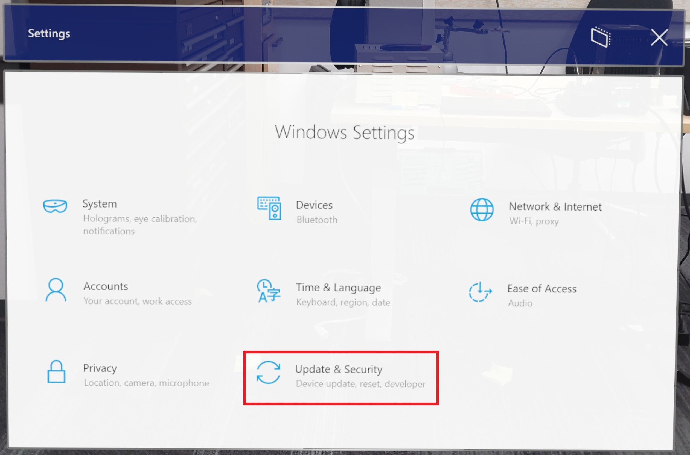

* Select **For Developers**:

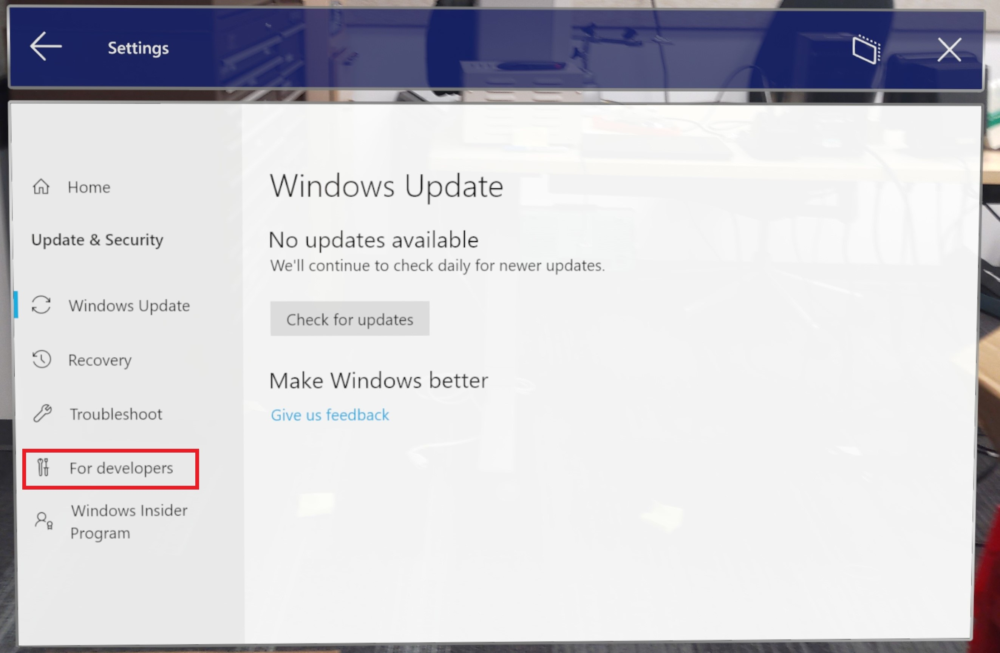

* Turn on **Use Developer Features** and **Enable Device Portal**

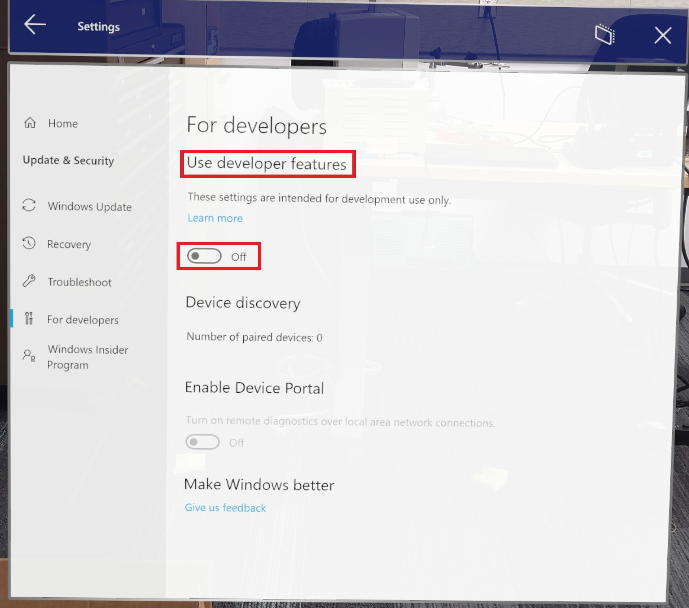

* With the device still connected, awake, and with the user logged in, launch Visual Studio.

> [!IMPORTANT]
> Make sure your device isn't in standby mode or asleep. If you're having trouble with this step, refer to the [Windows Device Portal instructions](./using-the-windows-device-portal.md).

## Preparing for deployment

1. In Visual Studio, set **ARM64** as the platform and **Device** as the device:

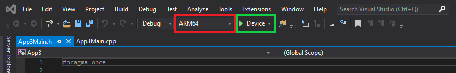

2. When Visual Studio prompts you for a **PIN** from the device:

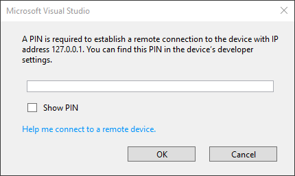

* Select **Settings** from Shell
* Select **Update & Security**
* Select **For Developers** and press Pair under **Device Discovery** 

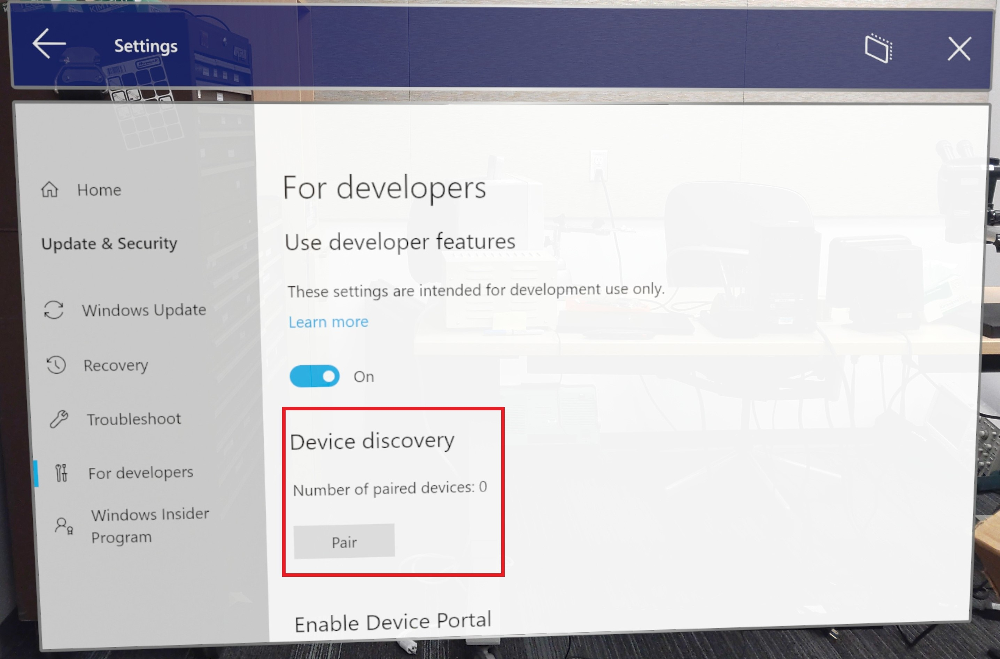

* Enter the generated PIN number in Visual Studio

3. Visual Studio will deploy the app to the connected HoloLens 2, which may take a few minutes depending on the app.

## Launching PIX

First, use Device Portal to verify the app isn't running on the HoloLens 2. Then, launch PIX, connect to your device, and select **Home**:

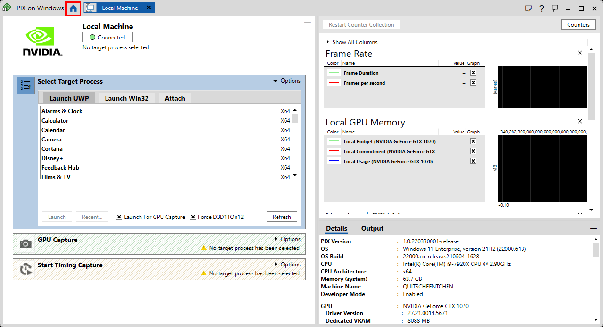

* Select **Connect** from the left-side menu:

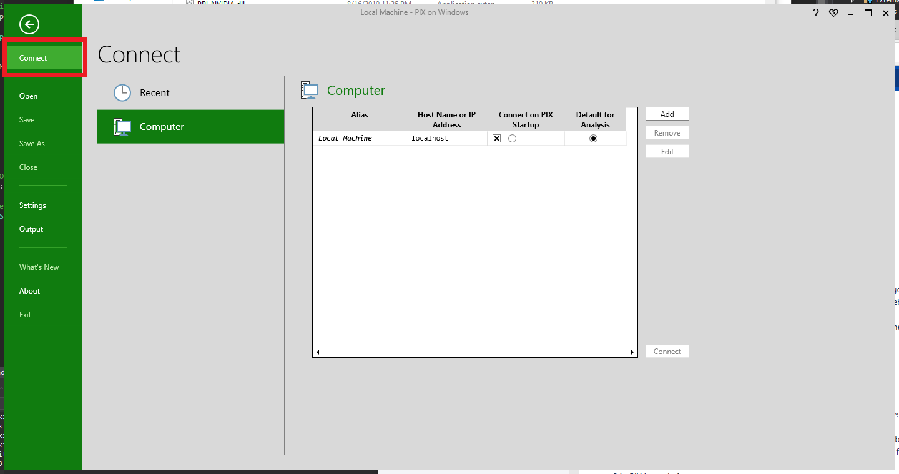

2. From the **Computer** tab, select **Add**, and enter the following credentials:
    * Alias: Up to user’s discretion
    * Host Name or IP Address: 127.0.0.1

3. Select **Connect** in the lower right of the **Computer** tab:

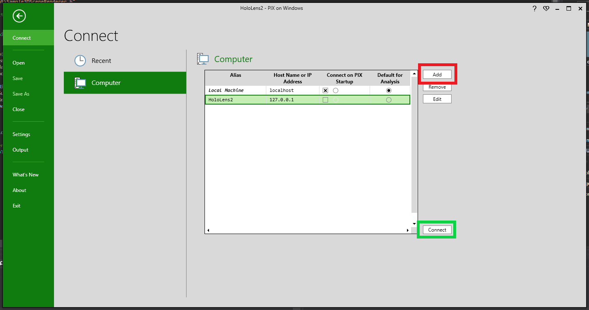

> [!NOTE]
> The first connection is always slower because binaries are being copied.

1. When PIX has connected to the HoloLens 2, find your app in the **Select Target Process** section in the Launch UWP tab, and then make sure **Launch for GPU Capture** is active. 

1. If your application is running on DX11, make sure that **Force D3D11On12** is selected. 

1. Click **Launch**:

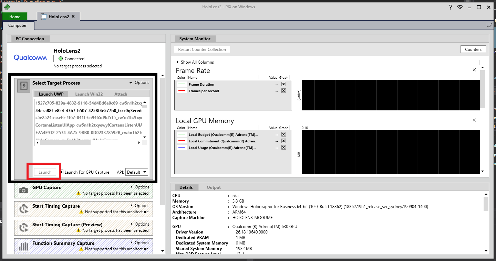

## GPU captured

1. Start the GPU capture by clicking **Photo** in the **GPU Capture** section:

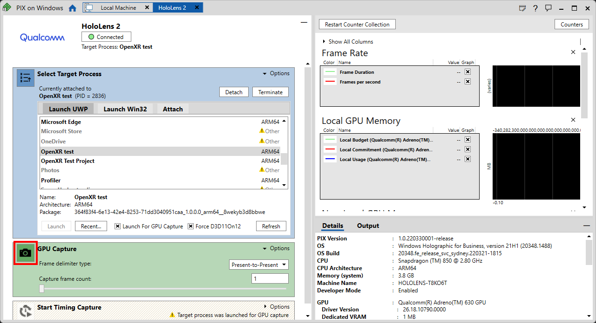

2. Open the capture for analysis by clicking on the generated screenshot in the **GPU Capture** panel:

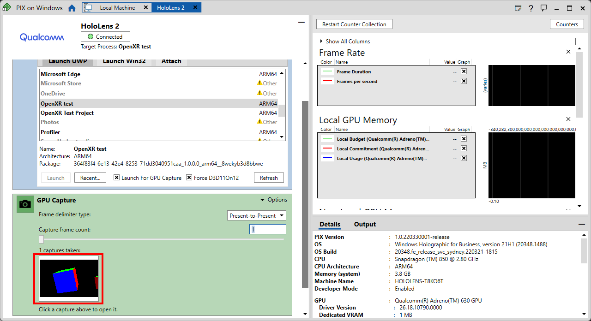

3. Press **Start** to begin the analysis:

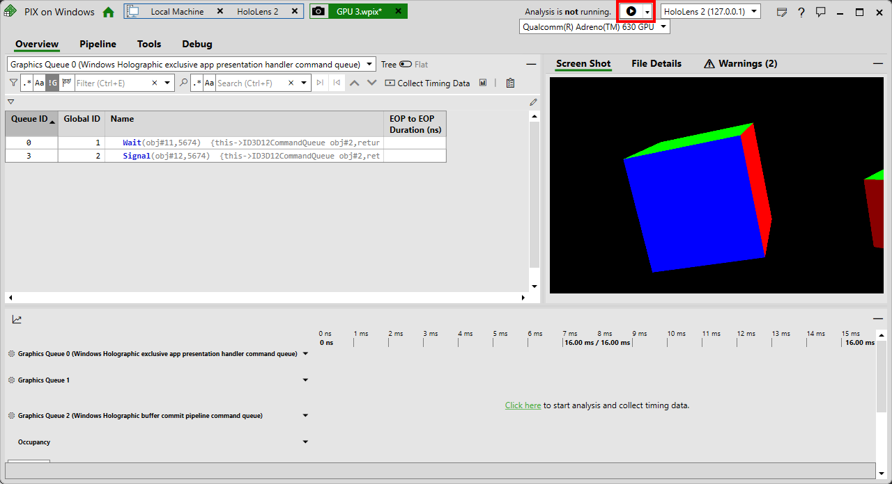

> [!IMPORTANT]
> If you collect timing data after taking a GPU capture, you'll be required to reboot the headset. This is a one-time restart of the device and is required for timing data collection.

PIX is now ready for use! For an introduction on how to use PIX, please refer to [PIX GPU captures](https://devblogs.microsoft.com/pix/gpu-captures/).

## See also
* [PIX homepage](https://devblogs.microsoft.com/pix)
* [PIX GPU captures](https://devblogs.microsoft.com/pix/gpu-captures/)