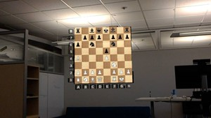
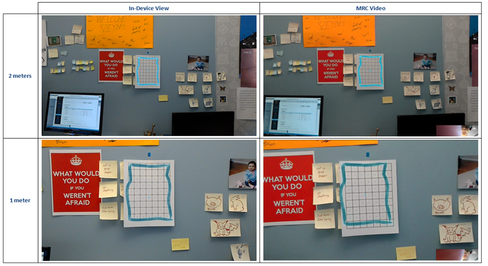

# Mixed reality capture overview

> [!NOTE]
> See [Render from the PV camera](#render-from-the-pv-camera-opt-in) below for guidance on a new MRC capability for HoloLens 2.

You can take a [mixed reality capture](/hololens/holographic-photos-and-videos) (MRC) photo or video at any time, but there are few things to keep in mind when developing your application. This includes best practices for MRC visual quality and being responsive to system changes while MRCs are being captured.

Developers can also seamlessly integrate mixed reality capture and insertion into their apps.

MRC on HoloLens (first-generation) supports videos and photos up to 720p, while MRC on HoloLens 2 supports videos up to 1080p and photos up to 4K resolution.

## The importance of quality MRC

Whether it's mixed reality screenshots on your Microsoft Store page or other users sharing capture content on social networks, Mixed Reality Capture media is often a users first exposure to your app. You can use MRC to demo your app, educate users, encourage users to share their mixed world interactions, and for user research and problem solving.

## How MRC impacts your app

### Enabling MRC in your app

By default, an app doesn't have to do anything to enable users to take mixed reality captures.

### Enabling improved alignment for MRC in your app

By default, mixed reality capture combines the right eye's holographic output with the photo/video (PV) camera. These two sources are combined using the focus point set by the currently running immersive app.

This means that holograms outside the focus plane won't align because of the physical distance between the PV camera and the right display.

#### Set the focus point

Immersive apps (on HoloLens) should set the [focus point](../unity/focus-point-in-unity.md) of where they want their stabilization plane to be. This ensures the best alignment in both the headset and in mixed reality capture.

If a focus point isn't set, the stabilization plane will default to 2 meters.

#### Render from the PV camera (opt-in)

HoloLens 2 adds the ability for an immersive app to **render from the PV camera** while mixed reality capture is running. To ensure the app supports the additional render correctly, the app has to opt in to this functionality.

Render from the PV camera offers the following improvements over the default MRC experience:
* Hologram alignment to your physical environment and hands for near interactions should be accurate at all distances. Avoid having an offset at distances other than the focus point as you might see in the default MRC.
* The right eye in the headset won't be compromised, as it won't be used to render the holograms for the MRC output.

[Learn more about rendering from the PV camera (DirectX)](../native/mixed-reality-capture-for-developers-cs-cpp.md#render-from-the-pv-camera-opt-in).

### Best practices (HoloLens-specific)

MRC is expected to work without additional development effort, but there are a few things to be aware of when providing the best mixed reality capture experience.

**MRC uses the hologram’s alpha channel to blend with the [camera](locatable-camera.md) imagery**

The most important step is to make sure your app is clearing to transparent black instead of clearing to opaque black. In Unity, this is done by default with the MixedRealityToolkit. If you're developing in non-Unity, you may need to make a one line change.

Here are some of the artifacts you might see in MRC if your app isn't clearing to transparent black:

**Example Failures**: Black edges around the content (failing to clear to transparent black)

<table>
<tr>
<td>

</td>
<td>

</td>
</tr>
</table>

**Example Failures**: The entire background scene of the hologram appears black. Setting a background alpha value of one results in a black background

**Expected Result**: Holograms appear properly blended with the real-world (expected result if clearing to transparent black)

**Solution**:
* Change any content that is showing up as opaque black to have an alpha value of 0.
* Ensure that the app is clearing to transparent black.
* Unity defaults to clear automatically with the MixedRealityToolkit, but if it’s a non-Unity app you should modify the color used with ID3D11DeiceContext::ClearRenderTargetView(). You want to ensure you clear to transparent black (0,0,0,0) instead of opaque black (0,0,0,1).

You can now tune the alpha values of your assets if you’d like, but typically don’t need to. Most of the time, MRCs will look good out of the box. MRC assumes pre-multiplied alpha. The alpha values will only affect the MRC capture.

### What to expect when MRC is enabled on HoloLens

The following apply to both HoloLens (first-generation) and HoloLens 2, unless otherwise noted:

* The system will throttle the application to 30-Hz rendering. This creates some headroom for MRC to run so the app doesn’t need to keep a constant budget reserve and also matches the MRC video record framerate of 30 fps
* Hologram content in the right eye of the device may appear to “sparkle” when recording/streaming MRC: text may become more difficult to read and hologram edges may appear more jaggy (opting in to third camera render on **HoloLens 2** avoids this compromise)
* MRC photos and videos will respect the application’s [focus point](../unity/focus-point-in-unity.md) if the application has enabled it, which will help ensure holograms are accurately positioned. For videos, the Focus Point is smoothed so holograms may appear to slowly drift into place if the Focus Point depth changes significantly. Holograms that are at different depths from the focus point may appear offset from the real world (see example below where Focus Point is set at 2 meters but hologram is positioned at 1 meter).

## Integrating MRC functionality from within your app

Your mixed reality app can start MRC photo or video capture from within the app, and the content captured is made available to your app without being stored to the device's "Camera roll." You can create a custom MRC recorder or take advantage of built-in camera capture UI.

### MRC with built-in camera UI

Developers can use the *[Camera Capture UI API](/windows/uwp/audio-video-camera/capture-photos-and-video-with-cameracaptureui)* to get a user-captured mixed reality photo or video with just a few lines of code.

This API launches the built-in MRC camera UI where users can take a photo or video and returns the resulting capture to your app. You can create a custom Mixed Reality Capture recorder if you need to add your own camera UI or lower-level access to capture streams.

### Creating a custom MRC recorder

While the user can always trigger a photo or video using the system MRC capture service, an application may want to build a custom camera app that include holograms in the camera stream just like MRC. This allows the application to kick off captures from user input, build custom recording UI, or customize MRC settings to name a few examples.

**HoloStudio adds a custom MRC camera using MRC effects**

Unity Applications should see [Locatable_camera_in_Unity](../unity/locatable-camera-in-unity.md) for the property to enable holograms.

Other applications can do this by using the [Windows Media Capture APIs](/uwp/api/Windows.Media.Capture.MediaCapture) to control the Camera and add an MRC Video and Audio effect to include virtual holograms and application audio in stills and videos.

[Learn more creating a custom MRC recorder (DirectX)](../native/mixed-reality-capture-for-developers-cs-cpp.md#creating-a-custom-mrc-recorder).

### Simultaneous MRC limitations

You need to be aware of certain limitations when multiple apps are accessing MRC at the same time.

#### Photo/video camera access

On HoloLens 1, MRC will fail to capture a photo or capture video while a process is recording video or taking a photo. The reverse is also true: if MRC is running, the application will fail to get access to the camera. 

With HoloLens 2, it's possible for you to share access to the camera. If you don't need direct control of the resolution or frame-rate, you can initialize MediaCapture using the [SharedMode property](/uwp/api/windows.media.capture.mediacaptureinitializationsettings.sharingmode) with SharedReadOnly.  

##### Built-in MRC photo/video camera access

[Learn about built-in MRC photo/video camera access (DirectX)](../native/mixed-reality-capture-for-developers-cs-cpp.md#built-in-mrc-photo-video-camera-access).

#### MRC access for developers

We recommend you always request Exclusive control for the camera when using MRC. This will ensure your application has full control of the settings for the camera as long as you're aware of the limitations listed above.

[Learn more about MRC access for developers (DirectX)](../native/mixed-reality-capture-for-developers-cs-cpp.md#mrc-access-for-developers).

## See also

* [Mixed reality capture](/hololens/holographic-photos-and-videos)
* [Spectator view](spectator-view.md)
* [Unity Development Overview](../unity/unity-development-overview.md)
* [Unreal development overview](../unreal/unreal-development-overview.md)
