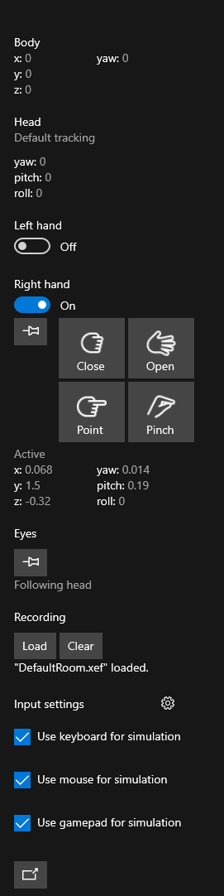
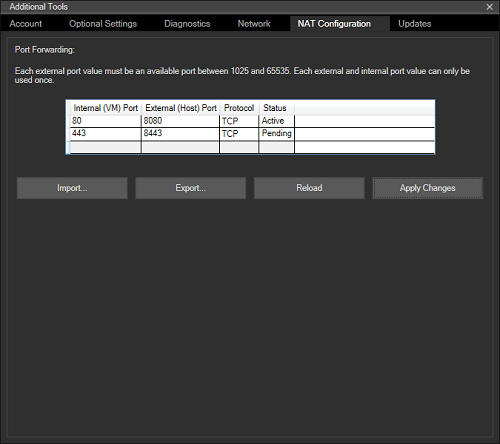
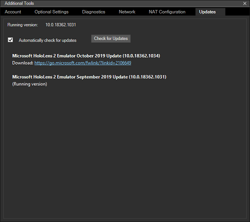
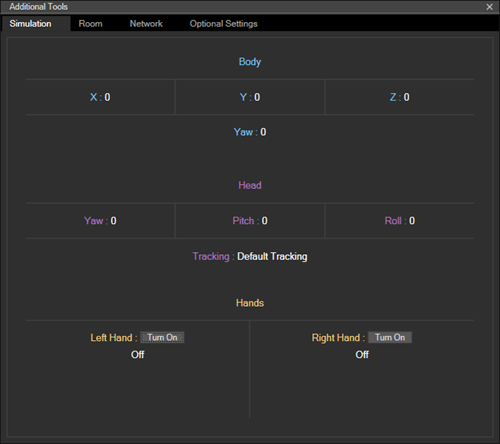

# Using the HoloLens Emulator

The HoloLens Emulator lets you test holographic applications on your PC without a physical HoloLens, including the HoloLens development toolset. The emulator uses a Hyper-V virtual machine, which means human and environmental inputs being read by HoloLens sensors are simulated from your keyboard, mouse, or Xbox controller. You don't even need to modify your projects to run on the emulator, the app doesn't know it isn't running on a real HoloLens.

If you're looking to develop Windows Mixed Reality immersive (VR) headset applications or games for desktop PCs, check out the [Windows Mixed Reality simulator](using-the-windows-mixed-reality-simulator.md), which lets you simulate desktop headsets.

## HoloLens 2 Emulator Overview

>[!VIDEO https://docs.microsoft.com/en-us/shows/Docs-Mixed-Reality/HoloLens-2-Emulator-Overview/player?format=ny]

## Installing the HoloLens Emulator

Download the HoloLens Emulator.

Versions:

* Download latest build from [HoloLens Emulator archive](hololens-emulator-archive.md) page.
* [HoloLens Emulator (first Gen) and holographic project templates](https://go.microsoft.com/fwlink/?linkid=2065980).

### HoloLens Emulator system requirements

The HoloLens Emulator uses Hyper-V with RemoteFx (first Gen Emulator) or GPU-PV (HoloLens 2 Emulator) for hardware accelerated graphics. To use the emulator, make sure your PC meets the following hardware requirements:

* 64-bit Windows 10 Pro, Enterprise, or Education
    >[!NOTE]
    >Windows 10 Home Edition does not support Hyper-V or the HoloLens Emulator.  
    >The HoloLens 2 Emulator requires the Windows 10 October 2018 update or later.
* 64-bit CPU
* CPU with four cores (or multiple CPUs with a total of four cores)
* 8 GB of RAM or more
* In the BIOS, the following features must be [supported and enabled](/archive/blogs/iftekhar/enable-hardware-settings-in-bios-to-run-hyper-v):
   * Hardware-assisted virtualization
   * Second Level Address Translation (SLAT)
   * Hardware-based Data Execution Prevention (DEP)
* GPU requirements
   * DirectX 11.0 or later
   * WDDM 1.2 graphics driver or later (first gen)
   * WDDM 2.5 graphics driver (HoloLens 2 Emulator)
   * The emulator might work with an unsupported GPU, but will be slower

If your system meets the requirements listed above, **ensure that the "Hyper-V" feature has been enabled on your system**. Go to **Control Panel -> Programs -> Programs and Features -> Turn Windows Features on or off** and check that **Hyper-V** is selected.

## Deploying apps to the HoloLens Emulator

1. Load your application solution in Visual Studio.
    >[!NOTE]
    >When using Unity, build your project from Unity and then load the built solution into Visual Studio, as usual.
2. For HoloLens Emulator (first gen), ensure that Platform is set to **x86**. For the HoloLens 2 Emulator, ensure that the Platform is set to **x86** or **x64**.
3. Select the **HoloLens Emulator** version you want as the target device for debugging.
4. Go to **Debug > Start Debugging** or press **F5** to launch the emulator and deploy your application for debugging.

The emulator may take a minute or more to boot when you first start it. We recommend that you keep the emulator open during your debugging session, so that you can quickly deploy applications to the emulator.

## Basic emulator input

Controlling the emulator is similar to many common 3D video games. Input options are available for using the keyboard, mouse, or Xbox controller. You control the emulator by directing the actions of a simulated user by wearing a HoloLens. Your actions move the simulated user around the environment. Applications running in the emulator respond like they would on a real device.

The cursor on HoloLens (first gen) follows head movement and rotation. In the HoloLens 2 Emulator, the cursor follows hand movement and orientation.

* **Walk forward, back, left, and right** - Use the W,A,S, and D keys on your keyboard, or the left stick on an Xbox controller.
* **Look up, down, left, and right** - Select and drag the mouse, use the arrow keys on your keyboard or the right stick on an Xbox controller.
* **Air tap gesture** - Right-click the mouse, press the Enter key on your keyboard or use the A button on an Xbox controller.
* **Bloom/System gesture** - Press the Windows key or F2 key on your keyboard or press the B button on an Xbox controller.
* **Hand movement for scrolling** - Simultaneously hold the Alt key and the right mouse button, and drag the mouse up or down. In an Xbox controller, hold down the right trigger and A button and move the right stick up and down.
* **Hand movement and orientation** (HoloLens 2 Emulator only) - Hold the Alt key and drag the mouse up or down, left or right to move the hand. You can also use the arrow keys and Q or E to rotate and tilt the hand. For an Xbox controller, hold the left or right bumper and use the left thumbstick to move the hand left, right, forward, and back, the right thumbstick to rotate it. Use up or down on the Dpad to raise or lower the hand.

Have a Windows Mixed Reality immersive headset?  Starting with the HoloLens 2 Emulator (Windows Holographic, version 2004), you can use your Windows Mixed Reality immersive headset and motion controllers to control the HoloLens 2 Emulator and view it in stereo.  See [Using a Windows Mixed Reality immersive headset and motion controllers with the HoloLens 2 Emulator](#using-a-windows-mixed-reality-immersive-headset-and-motion-controllers-with-the-hololens-2-emulator)

## Anatomy of the HoloLens 2 Emulator

### Main window

### Toolbar

To the right of the main window, find the emulator toolbar. The toolbar contains the following buttons:
*  **Close**: Closes the emulator.
*  **Minimize**: Minimizes the emulator window.
*  **Simulation control panel**: Show or hide the [Simulation control panel](#simulation-control-panel) for configuring and controlling [input to the emulator](#basic-emulator-input).
*  **Fit to screen**: Fits the emulator to screen.
*  **Zoom**: Make the emulator larger and smaller.
*  **Help**: Open emulators help.
*  **Open Device Portal**: Open the Windows Device Portal for the HoloLens OS in the emulator.
*  **Tools**: Open the **Additional tools** pane.

### Simulation control panel

The Simulation control panel lets you view the current position and orientation of the simulated human and input devices. It also allows you to configure both simulated input, such as showing or hiding one or both hands, and devices used for controlling simulated input, such as your PC's keyboard, mouse and gamepad.

* To hide or show the simulation panel, select the toolbar button or press F7 on your keyboard.
* Hover the mouse over a control or field to display a tooltip that contains keyboard, mouse, and gamepad controls for it.
* To show or hide a hand, toggle the appropriate switch under Left hand or Right hand.
* To control the hand, use either the left or right Alt keys on your keyboard or the left or right bumper on the gamepad.
* To direct all input to one or both hands, select the pushpin button under the toggle switch, which is the same as holding the Alt key for the hand.
* To control eye gaze direction, select the pushpin in the Eyes section, which is the same as holding down the Y key on the keyboard.
* To load a room recording, select the Load button in the Recording section. See [simulated rooms](#simulated-rooms) for more information.
* To adjust the speed that the simulated human or input devices will move or rotate in response to keyboard, mouse or gamepad input, select the gear icon next to Input settings, and adjust the sliders.
* By default, keyboard input controls the simulated human and simulated input. To have your PC's keyboard input sent through to the HoloLens, uncheck Use keyboard for simulation. F4 is the shortcut key for this setting.
* If the simulation panel is already visible, pressing F8 moves keyboard focus into it.
* To undock the simulation panel from the emulator window, select the button at the bottom of the panel or press F9 on your keyboard.  Closing the window or pressing F9 again returns the window to the emulator.
* The simulation control panel can be launched as a separate application, allowing you to connect to and control the HoloLens 2 Emulator, a HoloLens 2 device, or Windows Mixed Reality simulation by running PerceptionSimulationInput.exe from %ProgramFiles(x86)%\Windows Kits\10\Microsoft XDE\10.0.18362.0\.

### Account tab

The Account tab lets you configure the emulator to sign in with a Microsoft Account. This is useful for testing APIs that require the user to be signed in with an account. Toggling this option requires that you completely close and restart the HoloLens Emulator for the setting to take effect. If this option is enabled, later launches of the emulator will ask you to sign in, just like a user would the first-time HoloLens is started. To enter your credentials using your PC's keyboard, first turn off Use keyboard for simulation in the Simulation Control Panel or press F4 on your keyboard to toggle the keyboard setting on or off.

### Optional settings tab

The Optional settings tab displays a control to enable or disable hardware accelerated graphics. Hardware accelerated graphics are used by default, if supported by your PC's graphics adapter drive. If your graphics adapter's driver doesn't support GPU-PV, this option won't be visible.

### Diagnostics tab

The Diagnostics tab shows the emulator's IP address in the form of a link to Windows Device Portal along with the status of the virtual GPU.

### Network tab

The Network tab shows the network adapter details for the emulator, as well as network adapter details for the host machine. For the HoloLens 2 Emulator, this tab will only appear when running the emulator on the Windows 10 May 2019 Update or newer.

### NAT Configuration tab

This tab will only appear when running the emulator on the Windows 10 May 2019 Update or newer.

The emulator uses your PC's network connection and sits behind a NAT.  This tab allows you to map ports from your host PC to the emulator, which enables remote devices to connect to applications and services running in the emulator.

For example, if you want to access Device Portal on the emulator from a remote PC:

1. Add an entry for internal port 80 (the port on which Device Portal is listening) by double-clicking on a free row in the table.  For other applications, enter the port number on which that application is listening.
2. Choose any available external port.  In this example, we'll use port 8080 as the external port.
3. Select the protocol.  The default is TCP.  Since Device Portal uses TCP, we'll leave the default.
4. Click "Apply Changes" to enable the mapping.  The 'Status' will change from 'Pending' to 'Active'.
5. On the remote PC, open a browser and navigate to (IP-of-the-PC-running-the-emulator):8080.  The Device Portal interface will appear.  The IP address you use on a remote PC must be the IP address of the PC running the emulator, not of the emulator itself.  You can retrieve the IP through various means such as the Settings app on the PC in the 'Network & Internet' category, 'ipconfig' from a Command Prompt and from the Network tab in the emulator Tools dialog by looking for the Desktop Adapter entry.

Also note that if you add a port mapping for Device Portal, you can control the emulator remotely using the Perception Simulation Control tool included in the emulator installation or with the Perception Simulation APIs by connecting to the host PC's IP address and Device Portal external port, such as 8080 in the example above.  When using Perception Simulation Control to connect to and control the emulator remotely, only specify the PC's IP address and the configured port.  Don't include 'https://'.

There are no port mappings by default.  Any mappings you configure are persistent across launches of the HoloLens 2 Emulator and will be enabled automatically when the emulator has booted fully.

Use the 'Export' button to save your mappings to a file.  You can then share this file with other team members who can use the 'Import' button to automatically configure the same mappings.

### Updates tab

This tab will only appear when running the emulator on the Windows 10 May 2019 Update or newer.

On startup, the emulator will check for new versions.  If a new version is available, the emulator will display a prompt showing the version you have, along with the available version and asking if you want to update.  If you select 'Yes', the installer for the new version is downloaded.

The Updates tab allows you control whether or not the emulator checks for new versions by toggling the "Automatically check for updates" check box on this tab.  It also allows you to see and download other available emulator versions, starting with the September 2019 Update.  For versions other than the one currently running, a download link is provided.  Clicking this link will download the installer for that version.

### Using a Windows Mixed Reality immersive headset and motion controllers with the HoloLens 2 Emulator

Starting with the HoloLens 2 Emulator (Windows Holographic, version 2004), you can use a Windows Mixed Reality headset and motion controllers to view and interact with the HoloLens 2 Emulator in stereo.  This allows you to make faster, more natural movements with your head and hands without a HoloLens 2 device.  It isn't a complete replacement for a HoloLens 2 device, but is intended to give an improved experience beyond interacting with the emulator using keyboard, mouse and gamepad in a 2D desktop window.  To enable this feature:

1. Ensure that Windows Mixed Reality is configured on your PC and your Windows Mixed Reality immersive headset is connected.
2. Launch the HoloLens 2 Emulator
3. Open the Simulation panel by clicking the toolbar button or pressing F7.
4. Scroll the panel to the bottom.
5. Check the box labeled "Use HMD for simulation"
6. Windows Mixed Reality will start and the emulator display will change slightly.  Without a headset, the emulator places both eyes in the center of the head and displays only one eye.  With a headset, the emulator generates true stereo output but only renders one eye to its desktop window, while both eyes are rendered to your headset.
7. Optionally turn on one or both motion controllers.  Controller input is mapped to hand input in the emulator.  For example, to tap, pull the trigger on the motion controller.  To move around, use the thumbstick.  For a complete list of controls, see [Advanced HoloLens Emulator and Mixed Reality Simulator input](advanced-hololens-emulator-and-mixed-reality-simulator-input.md)

Having trouble seeing content in your headset?

- If the display is blank in both the headset and Mixed Reality Portal, but you see content in the HoloLens 2 Emulator window on your desktop, verify that hardware graphics acceleration is enabled in the emulator.  Windows Mixed Reality immersive headset support requires hardware graphics acceleration to be enabled in the emulator.
- If you see content in the headset but holograms are blurry or you see a double image, use the following steps to adjust the stereo view for your eyes:

1. Temporarily turn off "Use HMD for simulation".
2. Launch Registry Editor (regedit.exe)
3. Navigate to HKEY_CURRENT_USER\Software\Microsoft\Windows\CurrentVersion\PerceptionSimulation
4. Create a new DWORD value named "EnableEyePoseControl" and set its value to 1.
5. Enable "Use HMD for simulation" in the emulator.
6. When content appears in the headset, use the arrow keys to adjust eye rotation.  Hold Left Alt to adjust the left eye and Right Alt to adjust the right eye.  Use 'Q' and 'E' to adjust the roll for each eye, again holding the appropriate Alt key for the eye.  Use the '+' and '-' keys to adjust the distance between the eyes.  (Note that +/- on a number pad will not work.  Use the buttons on the main keyboard.)
7. When the stereo view appears correct, press 'S' to save your changes.  The new configuration will be saved for future launches of the emulator.
8. If you want to abandon your changes and revert to the previous configuration, press 'L' to load the default or previous configuration.
9. Change the "EnableEyePoseControl" value in the registry to 0 and cycle the "Use HMD for simulation" option.

If you have saved a configuration and want to remove it, you can delete the value named "DisplayConfiguration" at HKEY_CURRENT_USER\Software\Microsoft\Windows\CurrentVersion\PerceptionSimulation.  If you are currently using the headset with the emulator, you will need to turn off "Use HMD for simulation" and turn it back on to see this change take effect.

## Anatomy of the HoloLens (first gen) emulator

### Main window

When the emulator launches, you'll see a window, which displays the HoloLens OS.

### Toolbar

To the right of the main window, you'll find the emulator toolbar. The toolbar contains the following buttons:
*  **Close**: Closes the emulator.
*  **Minimize**: Minimizes the emulator window.
*  **Human input**: Mouse and keyboard are used to simulate human [input to the emulator](#basic-emulator-input).
*  **Keyboard and mouse input**: Keyboard and mouse input are passed directly to the HoloLens OS as keyboard and mouse events, as if you connected a Bluetooth keyboard and mouse.
*  **Fit to screen**: Fits the emulator to screen.
*  **Zoom**: Makes the emulator larger and smaller.
*  **Help**: Opens emulator help.
*  **Open Device Portal**: Open the Windows Device Portal for the HoloLens OS in the emulator.
*  **Tools**: Open the **Additional tools** pane.

### Simulation tab

The default tab within the **Additional tools** pane is the **Simulation** tab.

The Simulation tab shows the current state of the simulated sensors used to drive the HoloLens OS within the emulator. Hovering over any value in the Simulation tab provides a tooltip describing how to control that value.

### Room tab

The emulator simulates world input in the form of the spatial mapping mesh from simulated rooms. This tab lets you pick the room to load instead of the default room.

See [simulated rooms](#simulated-rooms) for more information.

### Account tab

The Account tab allows you to configure the emulator to sign in with a Microsoft Account. This is useful for testing APIs that require the user to be signed-in with an account. After checking the box on this page, later launches of the emulator will ask you to sign in, just like a user would the first time the HoloLens is started.

## Simulated rooms

Simulated rooms are useful for testing your application in multiple environments. Several rooms are shipped with the emulator. Once you install the emulation, you'll find them in %ProgramFiles(x86)%\Windows Kits\10\Microsoft XDE\\(version)\Plugins\Rooms. All of these rooms were captured in real environments using a HoloLens:

* **DefaultRoom.xef** - A small living room with a TV, coffee table, and two sofas. Loaded by default when you start the emulator.
* **Bedroom1.xef** - A small bedroom with a desk.
* **Bedroom2.xef** - A bedroom with a queen size bed, dresser, nightstands, and walk-in closet.
* **GreatRoom.xef** - A large open space great room with living room, dining table, and kitchen.
* **LivingRoom.xef** - A living room with a fireplace, sofa, armchairs, and a coffee table with a vase.

You can also record your own rooms to use in the emulator with the Simulation page of the [Windows Device Portal](using-the-windows-device-portal.md) on your HoloLens (first gen).

In the emulator, you'll only see holograms that you render. But you'll see the simulated room behind the holograms. This is in contrast to the actual HoloLens where you see both blended together. If you want to see the simulated room in the HoloLens Emulator, you  need to update your application to render the spatial mapping mesh in the scene.

## Known Issues

* When uninstalling the HoloLens 2 Emulator, the hard disk image (Flash.vhdx) may be left on your hard drive in the Windows Kits\10\Emulation\HoloLens\<build number> folder.  It's safe to delete this file.
* Hardware graphics acceleration may cause Holographic apps to crash on some systems with AMD or Intel graphics.  Disabling hardware graphics acceleration in the emulator Tools window works around this issue.
* After installing the latest Windows updates as of July 2020, hardware graphics acceleration in the HoloLens Emulator (first Gen) might no longer be available.
The RemoteFX component needed for hardware graphics acceleration has been deprecated and will be removed in a future Windows release.  To re-enable hardware graphics acceleration, use the [Enable-VMRemoteFXPhysicalVideoAdapter PowerShell cmdlet](/powershell/module/hyper-v/enable-vmremotefxphysicalvideoadapter).  Refer to the [documentation on the deprecation and removal of RemoteFX support in Windows](https://support.microsoft.com/help/4570006/update-to-disable-and-remove-the-remotefx-vgpu-component) for additional information.

## Troubleshooting

You may see an error message while installing the emulator, indicating that you need *"Visual Studio 2015 Update 1 and UWP tools version 1.2"*. There are three possible causes of this error:
* You don't have a recent enough version of Visual Studio (Visual Studio 2019, Visual Studio 2017, or Visual Studio 2015 Update 1 or later). To correct this, install the latest release of Visual Studio.
* You have a recent version of Visual Studio, but you don't have the Universal Windows Platform (UWP) tools installed. This is an optional feature for Visual Studio. For HoloLens (first Gen), you'll need UWP Tools for Visual Studio 2015 or Visual Studio 2017.

You may also see an error installing the emulator on a non-Pro/Enterprise/Education SKU of Windows or if you don't have Hyper-V feature enabled.
* Read the [system requirements](#hololens-emulator-system-requirements) section above for a complete set of requirements.
* Also ensure that the Hyper-V feature has been enabled on your system.

If your installation completes successfully, but you don't see the HoloLens Emulator as an option for deployment and debugging:
* Your Visual Studio project configuration is set to x86 (HoloLens first Gen), x86 or x64 (HoloLens 2 Emulator).
* If using Visual Studio 2019, the Platform Toolset in your project configuration is set to v142.

If your installation completes successfully, but Visual Studio displays an error attempting to launch the HoloLens Emulator:
* Run Visual Studio as Administrator
* If you've only ever had Visual Studio 2019 installed, verify that the registry value "KitsRoot10" at HKEY_LOCAL_MACHINE\Software\Microsoft\Windows Kits\Installed Roots points to your 32-bit Program Files folder (for example, "C:\Program Files (x86)\Windows Kits\10").  If it doesn't, uninstall the HoloLens Emulator, change the registry value to your 32-bit Program Files folder, then reinstall the HoloLens Emulator.  This issue is addressed in Visual Studio 2019 16.0.3.

If the emulator displays an "Invalid Byte Encoding" error dialog upon launch:
* Delete all files in %localappdata%\Microsoft\XDE\HCS and try again.

If your debug target list in Visual Studio is empty (for example, Start is the only option) and you've followed all troubleshooting steps above:
* Delete the ConfigurationCache folder in %localappdata%\Microsoft\VisualStudio\\<*installation id*>\CoreCon and try again.

If your system hangs when the emulator is starting, disable hardware acceleration for emulator graphics.
* Create a registry DWORD value named "DisableGPU" at HKEY_LOCAL_MACHINE\SOFTWARE\Microsoft\XDE\10.0 and set its value to 1.

If Hololens2 Emulator doesn't respond to input from your keyboard or mouse, try disabling your VPN connection. 

## See also
* [Advanced HoloLens Emulator and Mixed Reality Simulator input](advanced-hololens-emulator-and-mixed-reality-simulator-input.md)
* [HoloLens Emulator software history](hololens-emulator-archive.md)
* [Spatial mapping in Unity](../../develop/unity/spatial-mapping-in-unity.md)
* [Spatial mapping in DirectX](../../develop/native/spatial-mapping-in-directx.md)
