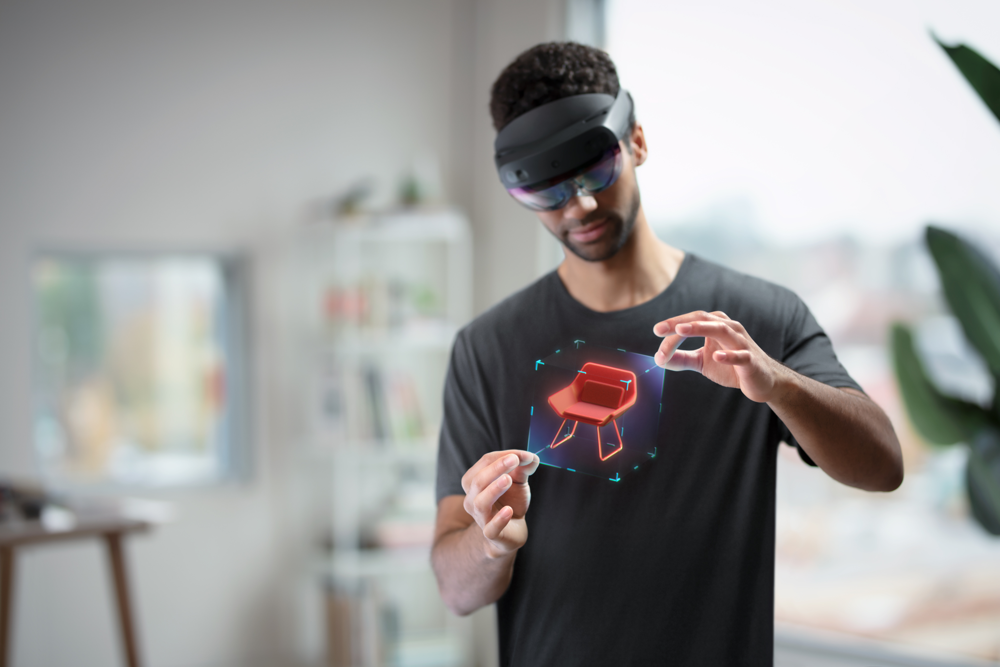

# Mixed reality samples

Every development journey starts with a look back at what other developers have successfully built - mixed reality is no different. Currently, all of our tutorials and sample apps are built in Unity or Unreal. As we develop content for other engines and platforms, you'll find them under the relevant heading in the Table of Contents.

* [Sample apps case studies](#sample-apps-case-studies)
* [Feature samples](#feature-samples)

## Sample apps case studies

[!INCLUDE]

## Feature samples

For each of the developer scenarios listed below, there are feature samples that correspond to specific implementations that are covered in our documentation and covers a range of development platforms and hardware devices.

| Scenario | Feature sample | Engine | Description |
| --- | --- | ---- | --- |
| Getting started | | | See [HoloLens (1st gen) Basics 100: Getting started with Unity](unity/tutorials/holograms-100.md) |
| [Build basic OpenXR scenarios](#build-basic-openxr-scenarios) | [OpenXR with Unity samples](#build-basic-openxr-scenarios) | Unity C# | Getting started with cross-platform developer tools. |
| Anchoring Strategies | Local anchor |  | See the [Spatial anchors](/windows/mixed-reality/design/spatial-anchors) article. |
|    | [Azure Spatial Anchors samples](https://github.com/Azure/azure-spatial-anchors-samples) |  | [Azure Spatial Anchors](/azure/spatial-anchors/overview) empower developers with essential capabilities to build spatially aware mixed reality applications. |
| | [QR Codes](#qr-codes) | Unity C# | Detect QR Codes in the environment. |
| [Collaboration in mixed reality](#collaboration-in-mixed-reality) | [User identity](#user-identity) | Unity C#, AAD | Set up your HoloLens 2 device using Azure Active Directory (AAD) credentials. |
| | [WebRTC sample](#webrtc) | Unity C#, NuGet | Integrate peer-to-peer audio, video, and data real-time communication into a mixed reality application. |
| | [Azure Spatial Anchors samples](https://github.com/Azure/azure-spatial-anchors-samples) |  | [Azure Spatial Anchors](/azure/spatial-anchors/overview) empower developers with essential capabilities to build spatially aware mixed reality applications. |
| [Spatial interaction](#spatial-interaction---basic-hologram-sample) | [Basic hologram sample](#spatial-interaction---basic-hologram-sample) | Windows 10 C++ |Windows mixed reality sample that renders a spinning cube. |
|  [Scene/Object understanding](#scene-understanding) | [Scene understanding samples](#scene-understanding) | Unity C# | Help design environmentally aware mixed reality applications. |
|    | [Azure Object Anchors samples](https://github.com/Azure/azure-object-anchors) | Unity C# | [Azure Object Anchors](/azure/object-anchors/overview) enable applications to detect an object in the physical world using a 3D model and estimate its 6DoF pose. |
| [Contextual data overlays](#contextual-data-overlays) | [QR Codes](#qr-codes) | Unity C# | Detect QR Codes in the environment. |
| | [Poster tracker sample](#poster-tracker-sample)  | Unity C# | Align a hologram with a real world object. |
| [Capturing camera data](#camera-captures) | [Mixed reality capture sample](#holographic-mixed-reality-capture) | Windows 10 C++ | Capture the first-person experience of mixing real and digital worlds as a photo or video. |
| | [Spectator view sample](#spectator-view) | Unity C# | Capture and render holograms at the correct size and orientation. |
| | [Research Mode samples](#research-mode) | Windows 10 C++ | Access to key censors on a HoloLens device for research applications. |
| [Holographic Remoting](#holographic-remoting) | [Holographic Remoting player](#holographic-remoting) |  Windows 10 C++ | Holographic Remoting streams holographic content from a PC to your Microsoft HoloLens in real time, by using a Wi-Fi connection. |
| | [Azure Remote Rendering samples](/azure/remote-rendering/samples/sample-model) | Unity C# | Some resources for sample data that can be used for testing the Azure Remote Rendering service. |
| Task management | [Dynamics 365 Remote Assist](/dynamics365/mixed-reality/remote-assist/ra-overview) | | Technicians can collaborate more efficiently by working together from different locations with Dynamics 365 Remote Assist on HoloLens, HoloLens 2, Android, or iOS devices. |
| World Locking holograms |  World Locking sample apps | Unity C# | See [World Locking Tools Concepts](https://microsoft.github.io/MixedReality-WorldLockingTools-Unity/DocGen/Documentation/Concepts.html). | 
| | [World locked physics sample](https://microsoft.github.io/MixedReality-WorldLockingTools-Unity/DocGen/Documentation/HowTos/Samples/WorldLockedPhysicsSample.html) | Unity C# | This Physics Beam Sample offers a few virtual physics experiences which are enabled by World Locking Tools' world locked coordinate system. |
| | [Space pin sample](https://microsoft.github.io/MixedReality-WorldLockingTools-Unity/DocGen/Documentation/HowTos/Samples/SpacePin.html) | Unity C# | The Space Pin sample offers a simplified and more focused view of the Space Pin feature. It is intended to be closer to the inner workings of a real world application which needs to align a large object or objects with real world features. |
| | [Ray pins example](https://microsoft.github.io/MixedReality-WorldLockingTools-Unity/DocGen/Documentation/HowTos/Samples/RayPins.html) | Unity C# | The Space Pins sample demonstrates setting up Space Pins by manually manipulating marker objects into position using MRTK affordances. |
| | [World Locking Tools with Azure Spatial Anchors sample](https://microsoft.github.io/MixedReality-WorldLockingTools-Unity/DocGen/Documentation/HowTos/Samples/WLT_ASA_Sample.html) | Unity C# | World Locking Tools for Unity (WLT) provides a stable coordinate system based on local tracking. When combined with Azure Spatial Anchors (ASA), that stable coordinate system can be persisted across sessions, and shared across devices. |

### Build basic OpenXR scenarios

If you're new to mixed reality cross-platform development, these samples will help you to getting started.

For developers targeting Unity 2020 to build HoloLens 2 or Mixed Reality applications, OpenXR plugin can be used instead of WindowsXR plugin for better cross platform compatibilities. The Mixed Reality OpenXR Plugin also works well with latest Mixed Reality Toolkit 2.7.

 

| Reference article | Sample | Platform | Description | 
| --- | --- | --- | --- |
| [Using the OpenXR plugin](./unity/xr-project-setup.md) | [Mixed Reality OpenXR with Unity samples](https://github.com/microsoft/OpenXR-Unity-MixedReality-Samples) | Unity C# | These sample projects showcase how to build Unity applications for HoloLens 2 or Mixed Reality headsets using the Mixed Reality OpenXR plugin. |
| N/A | [OpenXR MRTK Base Unity project](https://github.com/microsoft/UnityOpenXRMRTKBase) | Unity C# | his repo contains a Unity project that is setup with the Microsoft Mixed Reality Toolkit Foundations and Standard Assets packages as well as the Microsoft OpenXR Plugin package. |
| [What is MRTK](/windows/mixed-reality/mrtk-unity/) | [Using Unity 2020.3 and MRTK 2.7.2](https://github.com/microsoft/MixedRealityToolkit-Unity#example-scenes) | Unity C# | MRTK-Unity is a Microsoft-driven project that provides a set of components and features, used to accelerate cross-platform MR app development in Unity. |
| N/A | [OpenXR Explorer](https://github.com/maluoi/openxr-explorer#msdynttrid=udu2MjGd1z293SGMmgAul0BalrUKvy4iwBnBrc3lEn4) | C++, Windows, Linux, OpenXR | OpenXR Explorer is a handy debug tool for OpenXR developers. It allows for easy switching between OpenXR runtimes, shows lists of the runtime's supported extensions, and allows for inspection of common properties and enumerations, with direct links to relevant parts of the OpenXR specification! |
| [What is OpenXR](../develop/native/openxr.md#what-is-openxr) | [OpenXR Samples for Mixed Reality Developers](https://github.com/microsoft/OpenXR-MixedReality) | C++ | These OpenXR samples use C++17 and D3D11. The same source code works across UWP applications running on HoloLens 2 and Win32 applications running on Windows Desktop with Windows Mixed Reality immersive headsets. |

### Collaboration in mixed reality

In mixed reality, people come together virtually to share experiences and collaborate.  Samples listed here demonstrate some features that make such collaboration possible.

#### User identity 

This sample sets up your HoloLens 2 device using Azure Active Directory (AAD) credentials, and then configures the device to use iris login.

 

| Reference article | Sample |
| --- | --- |
| [Overview of Microsoft identity platform](/azure/active-directory/develop/v2-overview) | [AAD Login on HoloLens 2](https://github.com/peted70/aad-hololens) |

#### WebRTC

The MixedReality-WebRTC project is a collection of components to help mixed reality app developers to integrate peer-to-peer audio, video, and data real-time communication into their applications. WebRTC components are based on the WebRTC protocol for Real-Time Communication (RTC), which is supported by most modern web browsers.

 

| Reference article | Sample |
| --- | --- |
| [WebRTC](https://microsoft.github.io/MixedReality-WebRTC) | [WebRTC sample apps](https://github.com/microsoft/MixedReality-WebRTC/tree/master/examples) |

### Spatial interaction - basic hologram sample

This sample runs on Windows Mixed Reality and renders a spinning cube. You can interact with the cube by placing it in a new position, and various input methods are allowed. This sample works on PCs with headset devices attached, and also on Microsoft HoloLens.

 

| Reference article | Sample |
| --- | --- |
| N/A | [Windows Universal samples - basic hologram](https://github.com/microsoft/Windows-universal-samples/tree/main/Samples/BasicHologram) |

### Scene understanding

Scene understanding provides Mixed Reality developers with a structured, high-level environment representation.  Scene understanding is designed for developing intuitive and environmentally aware applications, by combining the power of existing mixed reality runtimes. These runtimes are the highly accurate but less structured spatial mapping and new AI driven runtimes.

 

| Reference article | Sample | Platform | Description |
| --- | --- | --- | --- |
| [Scene understanding](../design/scene-understanding.md) | [Mixed Reality Scene Understanding samples (SU SDK)](https://github.com/microsoft/MixedReality-SceneUnderstanding-Samples) | Unity C# and SU SDK | A Unity-based sample application that showcases Scene Understanding on HoloLens 2. |
| [Scene understanding observer (MRTK)](/windows/mixed-reality/mrtk-unity/features/spatial-awareness/scene-understanding) | [Scene Understanding sample (MRTK + SU SDK)](https://github.com/microsoft/MixedRealityToolkit-Unity/blob/main/Assets/MRTK/Examples/Experimental/SceneUnderstanding/Scenes/SceneUnderstandingExample.unity) |Unity C#, MRTK + SU SDK | MRTK + Scene Understanding SDK sample. |

### Contextual data overlays

Contextual data is the background information that provides a broader understanding of an event, person, or item.  With Augmented Reality (AR), this information can be displayed and precisely aligned with physical objects to provide insights, instructions, service records, and other important data.

#### QR codes

HoloLens 2 can detect QR codes in the environment around the headset, establishing a coordinate system at each code's real-world location.

 

| Reference article | Sample |
| --- | --- |
| [QR codes](platform-capabilities-and-apis/qr-code-tracking.md) | [QR code tracking in Unity](https://github.com/microsoft/MixedReality-QRCode-Sample) |

#### Poster tracker sample

It is often helpful to be able to align a hologram to a real world object, or align multiple HoloLens devices to a common set of world coordinates, so everyone sees the same holograms in the same location. For instance, in your Unity scene, you can add a "poster" where you want to anchor your scene (perhaps a game board), and then add holograms on or around it. Then you can print the poster, lay it on a table and run the calibration/alignment tool, which will move the holographic version of the poster to align with the physical version of the poster. Thus moving all of the linked holograms to the correct alignment.

 

| Reference article | Sample |
| --- | --- |
| N/A | [Poster calibration sample](https://github.com/microsoft/MixedRealityCompanionKit/tree/master/PosterCalibrationSample) |

### Camera captures

Unstructured environment sensor data that your Mixed Reality device captures are converted into powerful abstract or holographic representations of the physical world around us. 

#### Holographic Mixed Reality Capture

Mixed reality capture (MRC) captures the first-person experience of mixing real and digital worlds as a photo or video, sharing what you see with others in real time.

 

| Reference article | Sample |
| --- | --- |
| [Mixed Reality Capture](platform-capabilities-and-apis/mixed-reality-capture-for-developers.md) | [Mixed Reality Capture samples](/samples/microsoft/windows-universal-samples/holographicmixedrealitycapture/) |

#### Spectator view

Spectator view renders holograms from Unity over a color frame from a capture card. This sample uses the calibration data from the calibration app to render the holograms at the correct size and orientation.  

 

| Reference article | Sample application |
| --- | --- |
| N/A | [Spectator view mobile setup](https://github.com/microsoft/MixedReality-SpectatorView/blob/master/doc/SpectatorView.Setup.md#spectator-view-mobile-setup) |

#### Research Mode

Research Mode was introduced in the first-generation HoloLens to give access to key sensors on the device, specifically for research applications that are not intended for deployment. The sample applications below are examples for accessing and recording Research Mode streams and using the [intrinsic and extrinsic](/windows/mixed-reality/locatable-camera#locating-the-device-camera-in-the-world).

 

| Reference article | Sample application |
| --- | --- |
| [Research Mode](platform-capabilities-and-apis/research-mode.md) | [HoloLens (first gen)](https://github.com/microsoft/HoloLensForCV/tree/master/Samples) |
| [Research Mode](platform-capabilities-and-apis/research-mode.md) | [HoloLens 2](https://github.com/microsoft/HoloLens2ForCV/tree/main/Samples) |

### Holographic Remoting

The Holographic Remoting Player is a companion app that connects to PC apps and games that support Holographic Remoting. Holographic Remoting streams holographic content from a PC to your Microsoft HoloLens in real time, using a Wi-Fi connection, and is supported on HoloLens (first gen) and HoloLens 2.

 

| Reference article | Sample |
| --- | --- |
| [Holographic Remoting](platform-capabilities-and-apis/holographic-remoting-player.md) | [Holographic Remoting samples](https://github.com/microsoft/MixedReality-HolographicRemoting-Samples) |