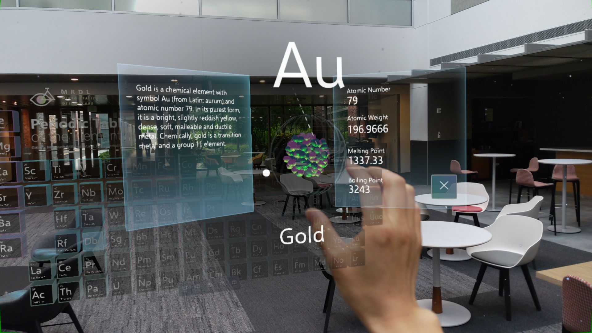
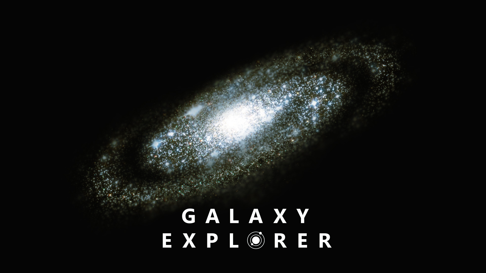
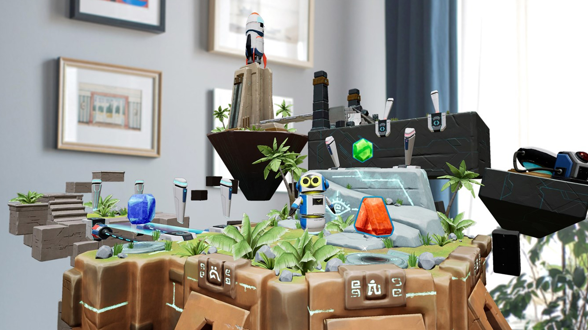

# [Unity](#tab/unity)

The open-source sample apps were created by our teams to help you get a handle on Mixed Reality development first-hand. We've provided the projects and full source code as a learning reference.

### HoloLens 2 open-source sample apps

These sample apps are made with the Mixed Reality Toolkit for Unity.

:::row:::
    :::column:::
       
        **[Periodic Table of the Elements 2.0](../unity/periodic-table-of-the-elements-2.md)**
    :::column-end:::
    :::column:::
       
        **[MRTK Examples Hub](/windows/mixed-reality/mrtk-unity/features/example-scenes/example-hub)**
    :::column-end:::
:::row-end:::

:::row:::
    :::column:::
       
        **[Surfaces](../unity/sampleapp-surfaces.md)**
    :::column-end:::
    :::column:::
       
        **[Galaxy Explorer 2.0](../unity/galaxy-explorer-update.md)**
    :::column-end:::
:::row-end:::

### HoloLens (first gen) open-source sample apps

* [Periodic Table of the Elements 1.0](../unity/periodic-table-of-the-elements.md)
* [Galaxy Explorer 1.0](../unity/galaxy-explorer.md)
* [Lunar Module](../unity/lunar-module.md)

# [Unreal](#tab/unreal)

Most of the open-source sample apps made by our team can be found in the Unreal mixed reality samples [repository](https://github.com/microsoft/MixedReality-Unreal-Samples) on GitHub. We've provided the source code so that developers can look at, learn from, and reuse our projects.

### HoloLens 2 open-source sample apps

* [HoloLens2Example](https://github.com/microsoft/MixedReality-Unreal-Samples/tree/master/HoloLens2Example)
* [HoloPipes](https://github.com/microsoft/MixedReality-Unreal-HoloPipes) - Download from the [Microsoft Store](https://www.microsoft.com/p/holopipes/9mszb3nnrxn9) in HoloLens 2

### Made with the Mixed Reality Toolkit for Unreal

A subset of the samples uses interactive UX components such as buttons and sliders, which are provided by the [UX Tools plugin](https://aka.ms/uxt-unreal) as part of the [Mixed Reality Toolkit for Unreal](https://aka.ms/mrtk-unreal).

:::row:::
    :::column:::
       
        **[Kippy's Escape](../unreal/unreal-kippys-escape.md)**
    :::column-end:::
    :::column:::
       
        **[Ford GT40](../unreal/unreal-ford-gt40.md)**
    :::column-end:::
:::row-end:::

:::row:::
    :::column:::
       
        **[Chess App](https://github.com/microsoft/MixedReality-Unreal-Samples/tree/master/ChessApp)**
    :::column-end:::
    :::column:::

    :::column-end:::
:::row-end:::

### Made by Epic Games

Our partners at Epic Games have released an excellent HoloLens 2 sample project on the Unreal Marketplace.

> [!NOTE]
> This experience must be streamed from a high-end PC to the headset.

* [Mission AR](https://docs.unrealengine.com/Resources/Showcases/MissionAR/index.html)
