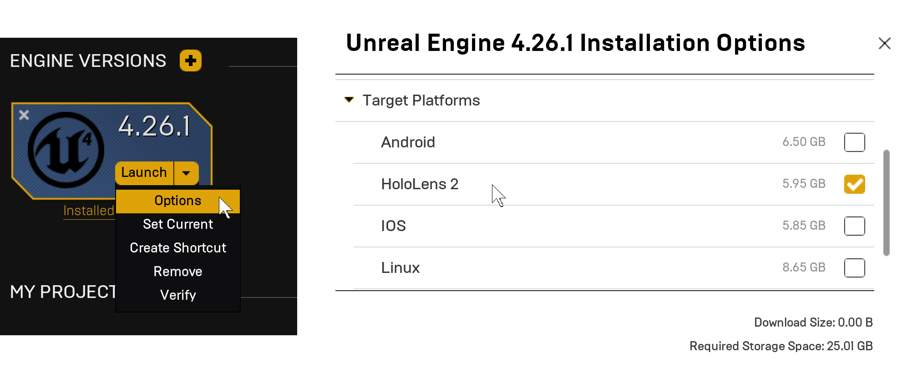

# [Unity](#tab/unity)

 

### 1. Download the latest version

We recommend the [Unity LTS (Long Term Support)](https://unity3d.com/unity/qa/lts-releases) stream as the best version to use when starting new projects, updating to its latest revision to pick up the latest stable fixes.
* Use Unity Hub to install and manage Unity.
* The current recommendation is to use **[Unity 2019.4 LTS](https://unity3d.com/unity/qa/lts-releases?version=2019.4)**, which is the LTS build required for MRTK v2 below.
* If you need to use a different version of Unity for specific reasons, Unity supports side-by-side installs of different versions.

When installing Unity, please make sure to check following components under **'Platforms'**.
* **Universal Windows Platform Build Support** 
* **Windows Build Support (IL2CPP)**

If you installed Unity without these options, you can add them through **'Add Modules'** menu in Unity Hub.

### 2. Install the Mixed Reality Feature Tool

The [Mixed Reality Feature Tool](../unity/welcome-to-mr-feature-tool.md) is a new way for developers to discover and add Mixed Reality feature packages into Unity projects. 

You can search packages by name or category, see their dependencies, and even view proposed changes to your projects manifest file before importing. Once you've validated the packages you want, the Mixed Reality Feature tool will download them into the project of your choice.

#### Importing the Mixed Reality Toolkit

[Mixed Reality Toolkit](../unity/mrtk-getting-started.md) (MRTK) is an open-source, cross-platform development kit for mixed reality applications. 

* Install the Mixed Reality Toolkit package by following the [installation and usage instructions](../unity/welcome-to-mr-feature-tool.md#system-requirements) and selecting the **Mixed Reality Toolkit Foundation** package.

We recommend completing the getting started section in our curated [HoloLens](../unity/unity-development-overview.md#1-getting-started) or [VR](../unity/unity-development-wmr-overview.md#1-getting-started) development journeys. If you're already following the Unity development for HoloLens journey, finish up the rest of the setup steps listed below and continue on to the [HoloLens 2 Getting Started tutorials](../unity/tutorials/mr-learning-base-01.md).

> [!IMPORTANT]
> Note that installation instructions are targeted for the latest stable combination of MRTK and Unity releases, which are **MRTK 2.6.1** and **Unity 2019.4 LTS**.

> [!NOTE]
> If you don't want to use MRTK for Unity, you'll need to [script all interactions and behaviors yourself](../unity/configure-unity-project.md).

:::row:::
    :::column:::
        <a href="https://github.com/Microsoft/MixedRealityToolkit-Unity" target="_blank"> **Mixed Reality Toolkit-Unity (GitHub)**</a> 
    :::column-end:::
:::row-end:::

#### Other tools [optional]
* <a href="https://github.com/Microsoft/MixedRealityCompanionKit" target="_blank">Mixed Reality Companion Kit (GitHub)</a> - code bits and components that might not run directly on HoloLens or immersive (VR) headsets, but instead pair with them to build experiences targeting Windows Mixed Reality.
* <a href="https://github.com/Microsoft/MixedRealityToolkit" target="_blank">Mixed Reality Toolkit - Common (GitHub)</a> - a collection of shared scripts and components.

### 3. Set up your PC for Mixed Reality development

The Windows 10 SDK works best on the Windows 10 operating system. This SDK is also supported on Windows 8.1, Windows 8, Windows 7, Windows Server 2012, Windows Server 2008 R2. Note that not all tools are supported on older operating systems.

> [!NOTE]
> You can develop and deploy your apps for HoloLens, VR immersive headsets, or both. Make sure you fulfill the requirements below depending on your needs.

#### For HoloLens development

When setting up your development PC for HoloLens development, please make sure it meets the system requirements for both <a href="https://unity3d.com/unity/system-requirements" target="_blank">Unity</a> and <a href="//visualstudio/releases/2019/system-requirements" target="_blank">Visual Studio</a>. If you want to run your app on a HoloLens device, you need to follow the [Windows Device Portal setup instructions](../platform-capabilities-and-apis/using-the-windows-device-portal.md#setting-up-hololens-to-use-windows-device-portal). If you plan on using the [HoloLens emulator](../platform-capabilities-and-apis/using-the-hololens-emulator.md), you'll want to make sure your PC meets the [HoloLens emulator system requirements](../platform-capabilities-and-apis/using-the-hololens-emulator.md#hololens-emulator-system-requirements) as well.

To get started with the HoloLens emulator, see [Using the HoloLens emulator](../platform-capabilities-and-apis/using-the-hololens-emulator.md).

If you plan to develop for both HoloLens and Windows Mixed Reality immersive (VR) headsets, use the system recommendations and requirements in the section below.

#### HoloLens troubleshooting

##### Setting Developer Mode is grayed out

If you're running into issues enabling Developer Mode on your device you might not be the [device owner](/hololens/security-adminless-os). In multi-user mode, the person who uses the device first is the device owner - any subsequent users won't have the required permissions to enable Developer Mode or other configuration changes. However, there is an exception where the first user may not be the device owner in an Autopilot environment, which is detailed in the [HoloLens security documentation](/hololens/security-adminless-os#device-owner).

Possible solutions include:

* Having the device owner turn Developer Mode on before passing the device to other users or developers
* Suggesting that your IT/MDM Admin enables CSP [Policy ApplicationManagement/AllowDeveloperUnlock](/windows/client-management/mdm/policy-csp-applicationmanagement#applicationmanagement-allowdeveloperunlock) for the specific device or a developer device group. 
    * This policy can be set by [Provisioning Packages](/hololens/hololens-provisioning) or via [MDM for HoloLens devices](/hololens/hololens-mdm-configure)
* Using the [Advanced Recovery Companion (ARC)](/hololens/hololens-recovery)

> [!NOTE]
> You can learn more about device management in the **[HoloLens device management](/hololens/hololens-csp-policy-overview)** overview.

##### I can't deploy over USB

If you're not able to deploy an application directly over USB, make sure you've met all the installation requirements listed above and follow our [step-by-step tutorial](../unity/tutorials/mr-learning-base-02.md#building-your-application-to-your-hololens-2).

#### Immersive (VR) headset requirements

>[!NOTE]
>The following guidelines are the current minimum and recommended specs for your immersive (VR) headset *development PC*, and are updated regularly.

>[!WARNING]
>Do not confuse this with the [minimum PC hardware compatibility guidelines](/windows/mixed-reality/enthusiast-guide/windows-mixed-reality-minimum-pc-hardware-compatibility-guidelines), which outlines the *consumer PC specs* to which you should target your immersive (VR) headset app or game.

If your immersive headset development PC does not have full-sized HDMI and/or USB 3.0 ports, you'll need [adapters](/windows/mixed-reality/enthusiast-guide/recommended-adapters-for-windows-mixed-reality-capable-pcs) to connect your headset.

There are currently [known issues](/windows/mixed-reality/enthusiast-guide/troubleshooting-windows-mixed-reality) with some hardware configurations, particularly notebooks that have hybrid graphics.

<table>
<tr>
<th></th><th> Minimum</th><th> Recommended</th>
</tr><tr>
<td> Processor</td><td> <b>Notebook:</b> Intel Mobile Core i5 7th generation CPU, Dual-Core with Hyper Threading <b>Desktop:</b> Intel Desktop i5 6th generation CPU, Dual-Core with Hyper Threading <b>OR</b> AMD FX4350 4.2Ghz Quad-Core equivalent</td><td> <b>Desktop:</b> Intel Desktop i7 6th generation (6 Core) <b>OR</b> AMD Ryzen 5 1600 (6 Core, 12 threads)</td>
</tr><tr>
<td> GPU</td><td> <b>Notebook:</b> NVIDIA GTX 965M, AMD RX 460M (2GB) equivalent or greater DX12 capable GPU <b>Desktop:</b> NVIDIA GTX 960/1050, AMD Radeon RX 460 (2GB) equivalent or greater DX12 capable GPU</td><td><b>Desktop:</b> NVIDIA GTX 980/1060, AMD Radeon RX 480 (2GB) equivalent or greater DX12 capable GPU</td>
</tr><tr>
<td> GPU driver WDDM version</td><td colspan="2"> WDDM 2.2 driver</td>
</tr><tr>
<td> Thermal Design Power</td><td colspan="2"> 15W or greater</td>
</tr><tr>
<td> Graphics display ports</td><td colspan="2"> 1x available graphics display port for&#160;headset (HDMI 1.4 or DisplayPort 1.2 for 60Hz headsets, HDMI 2.0 or DisplayPort 1.2 for 90Hz headsets)</td>
</tr><tr>
<td> Display resolution</td><td colspan="2"> Resolution: SVGA (800x600) or greater Bit depth: 32 bits of color per pixel</td>
</tr><tr>
<td> Memory</td><td> 8&#160;GB of RAM or greater</td><td> 16 GB of RAM or greater</td>
</tr><tr>
<td> Storage</td><td colspan="2"> &gt;10 GB additional free space</td>
</tr><tr>
<td> USB Ports</td><td colspan="2"> 1x available USB port for headset (USB 3.0 Type-A) <b>Note: USB must supply a minimum of 900mA</b></td>
</tr><tr>
<td> Bluetooth</td><td colspan="2"> Bluetooth 4.0 (for accessory connectivity)</td>
</tr>
</table>

If you're new to MRTK development with Unity, we recommend following our curated Unity development journey:

> [!div class="nextstepaction"]
> [Start your Unity for HoloLens journey](../unity/unity-development-overview.md)

> [!div class="nextstepaction"]
> [Start your Unity for VR journey](../unity/unity-development-wmr-overview.md)

## Next Development Checkpoint

If you're following the Unity for HoloLens development checkpoint journey we've laid out, your next task is to work through our HoloLens 2 tutorial series.

> [!div class="nextstepaction"]
> [HoloLens 2 tutorial series](../unity/tutorials/mr-learning-base-01.md)

If you're following the Unity for VR journey, your next task is to setup your project.

> [!div class="nextstepaction"]
> [Configuring your project for WMR](../unity/configure-unity-project.md)

You can always go back to the Unity development checkpoints for [HoloLens](../unity/unity-development-overview.md#1-getting-started) and [VR](../unity/unity-development-wmr-overview.md#1-getting-started) at any time.

# [Unreal](#tab/unreal)

### 1. Download the latest version

We recommend installing [Unreal Engine version 4.25](https://docs.unrealengine.com//GettingStarted/Installation/index.html) or later to take full advantage of built-in HoloLens support.

Go to the **Library** tab in the Epic Games Launcher, select the dropdown arrow next to **Launch** and click **Options**. Under **Target Platforms**, select **HoloLens 2** and click **Apply**.

### 2. Import Mixed Reality Toolkit (MRTK)

Mixed Reality Toolkit (MRTK) is an open-source, cross-platform development kit for mixed reality applications. MRTK provides a cross-platform input system, foundational components, and common building blocks for spatial interactions. The toolkit is intended to accelerate the development of applications targeting Microsoft HoloLens, Windows Mixed Reality immersive (VR) headsets, and the OpenVR platform.

For installation, we recommend completing the [Getting Started section](../unreal/unreal-development-overview.md#1-getting-started) of our curated [Unreal development journey](../unreal/unreal-development-overview.md). If you're already following the Unreal development journey, finish up the rest of the setup steps listed below and continue on to the [HoloLens 2 Getting Started tutorials](../unreal/tutorials/unreal-uxt-ch1.md).

:::row:::
    :::column:::
        <a href="https://github.com/Microsoft/MixedRealityToolkit-Unreal" target="_blank"> **Mixed Reality Toolkit-Unreal (GitHub)**</a> 
    :::column-end:::
:::row-end:::

> [!NOTE]
> If you don't want to use MRTK for Unreal, you'll need to script all interactions and behaviors yourself.

#### Other tools [optional]
* <a href="https://github.com/Microsoft/MixedRealityCompanionKit" target="_blank">Mixed Reality Companion Kit (GitHub)</a> - code bits and components that might not run directly on HoloLens or immersive (VR) headsets, but instead pair with them to build experiences targeting Windows Mixed Reality.
* <a href="https://github.com/Microsoft/MixedRealityToolkit" target="_blank">Mixed Reality Toolkit - Co mmon (GitHub)</a> - a collection of shared scripts and components.

### 3. Set up your PC for mixed reality development

The Windows 10 SDK works best on the Windows 10 operating system. This SDK is also supported on Windows 8.1, Windows 8, Windows 7, Windows Server 2012, Windows Server 2008 R2. Note that not all tools are supported on older operating systems.

> [!NOTE]
> You can develop and deploy your apps for HoloLens, VR immersive headsets, or both. Make sure you fulfill the requirements below depending on your needs.

#### For HoloLens development

When setting up your development PC for HoloLens development, please make sure you meet the system requirements for [Unreal](https://docs.unrealengine.com/GettingStarted/RecommendedSpecifications/index.html) and and <a href="//visualstudio/releases/2019/system-requirements" target="_blank">Visual Studio</a>. If you want to run your app on a HoloLens device, you need to follow the [Windows Device Portal setup instructions](../platform-capabilities-and-apis/using-the-windows-device-portal.md#setting-up-hololens-to-use-windows-device-portal). If you plan on using the [HoloLens emulator](../platform-capabilities-and-apis/using-the-hololens-emulator.md), you'll want to make sure your PC meets the [HoloLens emulator system requirements](../platform-capabilities-and-apis/using-the-hololens-emulator.md#hololens-emulator-system-requirements) as well.

If you plan to develop for both HoloLens and Windows Mixed Reality immersive (VR) headsets, use the system recommendations and requirements in the section below.

#### HoloLens troubleshooting

##### Setting Developer Mode is grayed out

If you're running into issues enabling Developer Mode on your device you might not be the [device owner](/hololens/security-adminless-os). In multi-user mode, the person who uses the device first is the device owner - any subsequent users won't have the required permissions to enable Developer Mode or other configuration changes. However, there is an exception where the first user may not be the device owner in an Autopilot environment, which is detailed in the [HoloLens security documentation](/hololens/security-adminless-os#device-owner).

Possible solutions include:

* Having the device owner turn Developer Mode on before passing the device to other users or developers
* Suggesting that your IT/MDM Admin enables CSP [Policy ApplicationManagement/AllowDeveloperUnlock](/windows/client-management/mdm/policy-csp-applicationmanagement#applicationmanagement-allowdeveloperunlock) for the specific device or a developer device group. 
    * This policy can be set by [Provisioning Packages](/hololens/hololens-provisioning) or via [MDM for HoloLens devices](/hololens/hololens-mdm-configure)
* Using the [Advanced Recovery Companion (ARC)](/hololens/hololens-recovery)

> [!NOTE]
> You can learn more about device management in the **[HoloLens device management](/hololens/hololens-csp-policy-overview)** overview.

##### I can't deploy over USB

If you're not able to deploy an application directly over USB, make sure you've met all the installation requirements listed above and follow our [step-by-step tutorial](../unreal/tutorials/unreal-uxt-ch6.md).

#### Immersive (VR) headset requirements

>[!NOTE]
>The following guidelines are the current minimum and recommended specs for your immersive (VR) headset *development PC*, and are updated regularly.

>[!WARNING]
>Do not confuse this with the [minimum PC hardware compatibility guidelines](/windows/mixed-reality/enthusiast-guide/windows-mixed-reality-minimum-pc-hardware-compatibility-guidelines), which outlines the *consumer PC specs* to which you should target your immersive (VR) headset app or game.

If your immersive headset development PC does not have full-sized HDMI and/or USB 3.0 ports, you'll need [adapters](/windows/mixed-reality/enthusiast-guide/recommended-adapters-for-windows-mixed-reality-capable-pcs) to connect your headset.

There are currently [known issues](/windows/mixed-reality/enthusiast-guide/troubleshooting-windows-mixed-reality) with some hardware configurations, particularly notebooks that have hybrid graphics.

<table>
<tr>
<th></th><th> Minimum</th><th> Recommended</th>
</tr><tr>
<td> Processor</td><td> <b>Notebook:</b> Intel Mobile Core i5 7th generation CPU, Dual-Core with Hyper Threading <b>Desktop:</b> Intel Desktop i5 6th generation CPU, Dual-Core with Hyper Threading <b>OR</b> AMD FX4350 4.2Ghz Quad-Core equivalent</td><td> <b>Desktop:</b> Intel Desktop i7 6th generation (6 Core) <b>OR</b> AMD Ryzen 5 1600 (6 Core, 12 threads)</td>
</tr><tr>
<td> GPU</td><td> <b>Notebook:</b> NVIDIA GTX 965M, AMD RX 460M (2GB) equivalent or greater DX12 capable GPU <b>Desktop:</b> NVIDIA GTX 960/1050, AMD Radeon RX 460 (2GB) equivalent or greater DX12 capable GPU</td><td><b>Desktop:</b> NVIDIA GTX 980/1060, AMD Radeon RX 480 (2GB) equivalent or greater DX12 capable GPU</td>
</tr><tr>
<td> GPU driver WDDM version</td><td colspan="2"> WDDM 2.2 driver</td>
</tr><tr>
<td> Thermal Design Power</td><td colspan="2"> 15W or greater</td>
</tr><tr>
<td> Graphics display ports</td><td colspan="2"> 1x available graphics display port for&#160;headset (HDMI 1.4 or DisplayPort 1.2 for 60Hz headsets, HDMI 2.0 or DisplayPort 1.2 for 90Hz headsets)</td>
</tr><tr>
<td> Display resolution</td><td colspan="2"> Resolution: SVGA (800x600) or greater Bit depth: 32 bits of color per pixel</td>
</tr><tr>
<td> Memory</td><td> 8&#160;GB of RAM or greater</td><td> 16 GB of RAM or greater</td>
</tr><tr>
<td> Storage</td><td colspan="2"> &gt;10 GB additional free space</td>
</tr><tr>
<td> USB Ports</td><td colspan="2"> 1x available USB port for headset (USB 3.0 Type-A) <b>Note: USB must supply a minimum of 900mA</b></td>
</tr><tr>
<td> Bluetooth</td><td colspan="2"> Bluetooth 4.0 (for accessory connectivity)</td>
</tr>
</table>

If you're new to MRTK development with Unreal, we recommend following our curated Unreal development journey:

> [!div class="nextstepaction"]
> [Start your Unreal journey](../unreal/unreal-development-overview.md)

## Next Development Checkpoint

If you're following the Unreal development checkpoint journey we've laid out, your next task is to work through our HoloLens 2 tutorial series.

> [!div class="nextstepaction"]
> [HoloLens 2 tutorial series](../unreal/tutorials/unreal-uxt-ch1.md)

You can always go back to the [Unreal development checkpoints](../unreal/unreal-development-overview.md#1-getting-started) at any time.

# [Native (OpenXR)](#tab/native)

 

Native OpenXR development doesn't have an engine for you to download. You can find everything you need to begin development in the [Getting started with OpenXR](../native/openxr-getting-started.md) document.

### 1. Set up your PC for mixed reality development

The Windows 10 SDK works best on the Windows 10 operating system. This SDK is also supported on Windows 8.1, Windows 8, Windows 7, Windows Server 2012, Windows Server 2008 R2. Note that not all tools are supported on older operating systems.

#### For HoloLens development

When setting up your development PC for HoloLens development, please make sure you meet the system requirements for <a href="//visualstudio/releases/2019/system-requirements" target="_blank">Visual Studio</a>. If you want to run your app on a HoloLens device, you need to follow the [Windows Device Portal setup instructions](../platform-capabilities-and-apis/using-the-windows-device-portal.md#setting-up-hololens-to-use-windows-device-portal). If you plan on using the [HoloLens emulator](../platform-capabilities-and-apis/using-the-hololens-emulator.md), you'll want to make sure your PC meets the [HoloLens emulator system requirements](../platform-capabilities-and-apis/using-the-hololens-emulator.md#hololens-emulator-system-requirements) as well.

If you plan to develop for both HoloLens and Windows Mixed Reality immersive (VR) headsets, use the system recommendations and requirements in the section below.

> [!NOTE]
> You can develop and deploy your apps for HoloLens, VR immersive headsets, or both. Make sure you fulfill the requirements below depending on your needs.

#### HoloLens troubleshooting

##### Setting Developer Mode is grayed out

If you're running into issues enabling Developer Mode on your device you might not be the [device owner](/hololens/security-adminless-os). In multi-user mode, the person who uses the device first is the device owner - any subsequent users won't have the required permissions to enable Developer Mode or other configuration changes. However, there is an exception where the first user may not be the device owner in an Autopilot environment, which is detailed in the [HoloLens security documentation](/hololens/security-adminless-os#device-owner).

Possible solutions include:

* Having the device owner turn Developer Mode on before passing the device to other users or developers
* Suggesting that your IT/MDM Admin enables CSP [Policy ApplicationManagement/AllowDeveloperUnlock](/windows/client-management/mdm/policy-csp-applicationmanagement#applicationmanagement-allowdeveloperunlock) for the specific device or a developer device group. 
    * This policy can be set by [Provisioning Packages](/hololens/hololens-provisioning) or via [MDM for HoloLens devices](/hololens/hololens-mdm-configure)
* Using the [Advanced Recovery Companion (ARC)](/hololens/hololens-recovery)

> [!NOTE]
> You can learn more about device management in the **[HoloLens device management](/hololens/hololens-csp-policy-overview)** overview.

#### Immersive (VR) headset requirements

>[!NOTE]
>The following guidelines are the current minimum and recommended specs for your immersive (VR) headset *development PC*, and are updated regularly.

>[!WARNING]
>Do not confuse this with the [minimum PC hardware compatibility guidelines](/windows/mixed-reality/enthusiast-guide/windows-mixed-reality-minimum-pc-hardware-compatibility-guidelines), which outlines the *consumer PC specs* to which you should target your immersive (VR) headset app or game.

If your immersive headset development PC does not have full-sized HDMI and/or USB 3.0 ports, you'll need [adapters](/windows/mixed-reality/enthusiast-guide/recommended-adapters-for-windows-mixed-reality-capable-pcs) to connect your headset.

There are currently [known issues](/windows/mixed-reality/enthusiast-guide/troubleshooting-windows-mixed-reality) with some hardware configurations, particularly notebooks that have hybrid graphics.

<table>
<tr>
<th></th><th> Minimum</th><th> Recommended</th>
</tr><tr>
<td> Processor</td><td> <b>Notebook:</b> Intel Mobile Core i5 7th generation CPU, Dual-Core with Hyper Threading <b>Desktop:</b> Intel Desktop i5 6th generation CPU, Dual-Core with Hyper Threading <b>OR</b> AMD FX4350 4.2Ghz Quad-Core equivalent</td><td> <b>Desktop:</b> Intel Desktop i7 6th generation (6 Core) <b>OR</b> AMD Ryzen 5 1600 (6 Core, 12 threads)</td>
</tr><tr>
<td> GPU</td><td> <b>Notebook:</b> NVIDIA GTX 965M, AMD RX 460M (2GB) equivalent or greater DX12 capable GPU <b>Desktop:</b> NVIDIA GTX 960/1050, AMD Radeon RX 460 (2GB) equivalent or greater DX12 capable GPU</td><td><b>Desktop:</b> NVIDIA GTX 980/1060, AMD Radeon RX 480 (2GB) equivalent or greater DX12 capable GPU</td>
</tr><tr>
<td> GPU driver WDDM version</td><td colspan="2"> WDDM 2.2 driver</td>
</tr><tr>
<td> Thermal Design Power</td><td colspan="2"> 15W or greater</td>
</tr><tr>
<td> Graphics display ports</td><td colspan="2"> 1x available graphics display port for&#160;headset (HDMI 1.4 or DisplayPort 1.2 for 60Hz headsets, HDMI 2.0 or DisplayPort 1.2 for 90Hz headsets)</td>
</tr><tr>
<td> Display resolution</td><td colspan="2"> Resolution: SVGA (800x600) or greater Bit depth: 32 bits of color per pixel</td>
</tr><tr>
<td> Memory</td><td> 8&#160;GB of RAM or greater</td><td> 16 GB of RAM or greater</td>
</tr><tr>
<td> Storage</td><td colspan="2"> &gt;10 GB additional free space</td>
</tr><tr>
<td> USB Ports</td><td colspan="2"> 1x available USB port for headset (USB 3.0 Type-A) <b>Note: USB must supply a minimum of 900mA</b></td>
</tr><tr>
<td> Bluetooth</td><td colspan="2"> Bluetooth 4.0 (for accessory connectivity)</td>
</tr>
</table>

If you're new to Native development with MRTK, we recommend following our curated Native development journey:

> [!div class="nextstepaction"]
> [Start your Native journey](../native/directx-development-overview.md)

## Next Development Checkpoint

If you're following the Native development checkpoint journey we've laid out, your next task is to configure your development environment for HoloLens 2.

> [!div class="nextstepaction"]
> [Setup for HoloLens 2](../native/openxr-getting-started.md#getting-started-with-openxr-for-hololens-2)

You can always go back to the [Native development checkpoints](../native/directx-development-overview.md#1-getting-started) at any time.