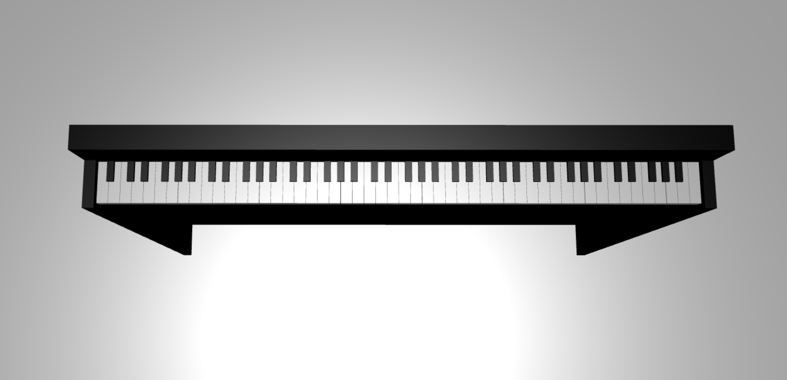
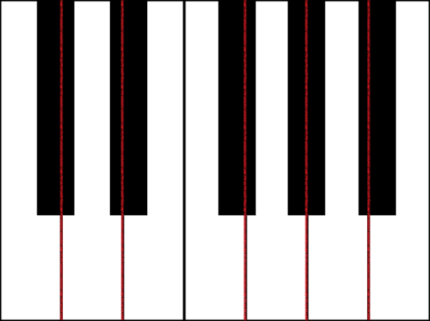
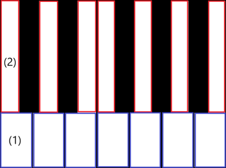
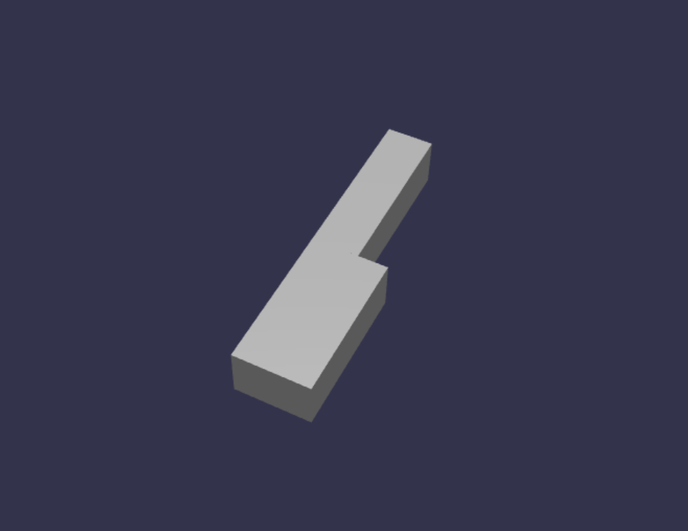
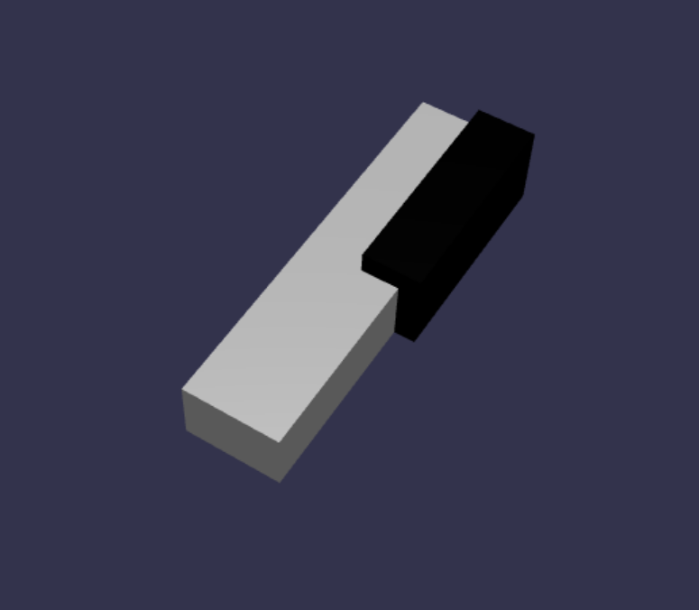
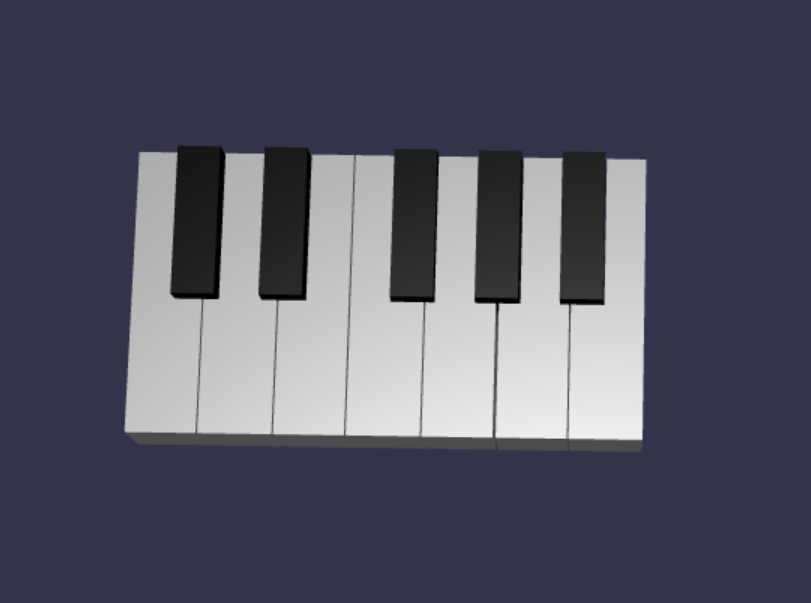
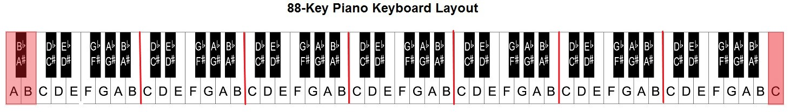
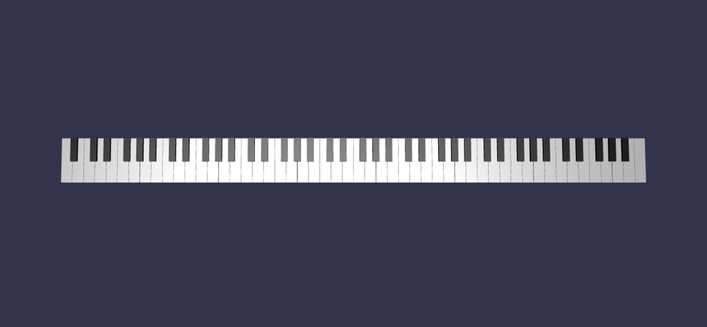

# Tutorial: Building a piano model in the 3D space

In the previous tutorial in the series, we have setup a web page containing a babylon.js scene with a camera and a light. In this tutorial, we will be building and adding a piano model into the scene.



In this tutorial, you will learn how to:

> [!div class="checklist"]
> * Create, position, and merge meshes
> * Build a piano keyboard from box meshes
> * Import a 3D model of a piano frame

## Before you begin

Make sure that you have gone through the [previous tutorial in the series](introduction-01.md) and are ready to continue adding to the code.

*index.html*

```html
<html>
    <head>
        <title>Piano in BabylonJS</title>
        <script src="https://cdn.babylonjs.com/babylon.js"></script>
        <script src="scene.js"></script>
        <style>
            body,#renderCanvas { width: 100%; height: 100%;}
        </style>
    </head>
    <body>
        <canvas id="renderCanvas"></canvas>
        <script type="text/javascript">
            const canvas = document.getElementById("renderCanvas");
            const engine = new BABYLON.Engine(canvas, true); 

            createScene(engine).then(sceneToRender => {
                engine.runRenderLoop(() => sceneToRender.render());
            });
            
            // Watch for browser/canvas resize events
            window.addEventListener("resize", function () {
                engine.resize();
            });
        </script>
    </body>
</html>
```

*scene.js*

```javascript
const createScene = async function(engine) {
    const scene = new BABYLON.Scene(engine);

    const alpha =  3*Math.PI/2;
    const beta = Math.PI/50;
    const radius = 220;
    const target = new BABYLON.Vector3(0, 0, 0);
    
    const camera = new BABYLON.ArcRotateCamera("Camera", alpha, beta, radius, target, scene);
    camera.attachControl(canvas, true);
    
    const light = new BABYLON.HemisphericLight("light", new BABYLON.Vector3(0, 1, 0), scene);
    light.intensity = 0.6;

    const xrHelper = await scene.createDefaultXRExperienceAsync();

    return scene;
}
```

## Getting started

Let's begin by making a simple piano keyboard which has this structure:


In this image, there are 7 white keys and 5 black keys, each labeled with the note's name. A full 88-key piano keyboard contains 7 full repetitions of this selection of keys (also called a register) and 4 extra keys. Every register has double the frequency of its previous register. For example, the pitch frequency of C5 (which means the C note in the fifth register) is double of C4's, D5's pitch frequency is double of D4's, and so on.

Visually, each register looks exactly the same as another, so we can start with investigating how to create a simple piano keyboard with this selection of keys. Later, we can find a way to expand the scope to an 88-key full piano keyboard.

## Build a simple piano keyboard

> [!NOTE]
> While it is possible to find pre-made 3D models of piano keyboards from online sources and import them into our webpage, we will build the keyboard from scratch in this tutorial to allow maximum customizability and to showcase how 3D models can be created through babylon.js.

1. Before we begin to create any meshes for building the keyboard, notice that each black key is not perfectly aligned at the middle of the two white keys around it, and not every key has the same width. This means that we must create and position the mesh for each key individually.

    

1. For white keys, we can make an observation that each white key is composed of two parts: (1) the bottom part below the black key(s) and (2) the top part next to the black key(s). The two parts have different dimensions but are stacked together to crete a full white key.

    

1. Here is the code for creating a single white key for the note C (don't worry about adding this into *scene.js* yet):

    ```javascript
    const whiteKeyBottom = BABYLON.MeshBuilder.CreateBox("whiteKeyBottom", {width: 2.3, height: 1.5, depth: 4.5}, scene);
    const whiteKeyTop = BABYLON.MeshBuilder.CreateBox("whiteKeyTop", {width: 1.4, height: 1.5, depth: 5}, scene);
    whiteKeyTop.position.z += 4.75;
    whiteKeyTop.position.x -= 0.45;

    const whiteKeyV1 = BABYLON.Mesh.MergeMeshes([whiteKeyBottom, whiteKeyTop], true, false, null, false, false);
    whiteKeyV1.material = whiteMat;
    whiteKeyV1.name = "C4";
    ```

    Here we created two [Box](https://doc.babylonjs.com/divingDeeper/mesh/creation/set/box#box-mesh) meshes, one for the bottom part and one for the top part of the white key. We then modify the position of the top part to stack it on top of the bottom part and to move it towards the left to leave space for the neighboring black key (C#).

    Finally, these two parts were merged using the [MergeMeshes](https://doc.babylonjs.com/divingDeeper/mesh/mergeMeshes) function to become one complete white key. This is the resulting mesh that this code would produce:

    

1. Creating a black key is simpler. Since all black keys are of the shape of a box, we can create a black key just by creating a box mesh with a black-colored [StandardMaterial](https://doc.babylonjs.com/divingDeeper/materials/using/materials_introduction#color).

    > [!NOTE]
    > Since the default mesh color is a light grey that resembles white, this tutorial doesn't include steps to add a white color material to the white keys. However, feel free to add the material yourself if you'd like a true, bright white color on the white keys.

    Here is the code to create the black key C# (don't worry about adding this to *scene.js* either):

    ```javascript
    const blackMat = new BABYLON.StandardMaterial("black");
    blackMat.diffuseColor = new BABYLON.Color3(0, 0, 0);

    const blackKey = BABYLON.MeshBuilder.CreateBox("C#4", {width: 1.4, height: 2, depth: 5}, scene);
    blackKey.position.z += 4.75;
    blackKey.position.y += 0.25;
    blackKey.position.x += 0.95;
    blackKey.material = blackMat;
    ```

    The black key produced by this code (along with the previous white key) would look like this:

    

1. As you can see, creating each key can result in a lot of similar code since we have to specify each of their dimensions and position. Let's try to make the creation process more efficient in the next section.

## Build a simple piano keyboard efficiently

1. While each white key has a slightly different shape than each other, all of them can be created by combining a top part and a bottom part. Let's implement a generic function to create and position any white key.

    Add the function below to *scene.js*, outside the `createScene()` function:

    ```javascript
    const WhiteKey = function (note, topWidth, bottomWidth, topPositionX, wholePositionX) {
        return {
            build(scene, register, referencePositionX) {
                // Create bottom part
                const bottom = BABYLON.MeshBuilder.CreateBox("whiteKeyBottom", {width: bottomWidth, height: 1.5, depth: 4.5}, scene);

                // Create top part
                const top = BABYLON.MeshBuilder.CreateBox("whiteKeyTop", {width: topWidth, height: 1.5, depth: 5}, scene);
                top.position.z =  4.75;
                top.position.x += topPositionX;
    
                // Merge bottom and top parts
                const key = BABYLON.Mesh.MergeMeshes([bottom, top], true, false, null, false, false);
                key.position.x = referencePositionX + wholePositionX;
                key.name = note + register;
    
                return key;
            }
        }
    }
    ```

    In this block of code, we created a function named `WhiteKey()` which returns an object with a `build()` function.

    The parameters of `WhiteKey()` are:
    * **name**: the name of the note which the key represents
    * **topWidth**: width of the top part
    * **bottomWidth**: width of the bottom part
    * **topPositionX**: x-position of the top part relative to the bottom part
    * **wholePositionX**: x-position of the whole key relative to the end point of the octave (the right edge of key B).

    For the `build()` function, the parameters are:
    * **scene**: scene that the key is in
    * **register**: register that the key belongs to (a number between 0 and 8)
    * **referencePositionX**: x-coordinate of the end point of the octave (used as a reference point).

    By having these two layers of abstraction, we are able to initialize a `WhiteKey` object with the parameters needed to create a specific type of key (e.g. C) within a register, and then call `build()` function on the object multiple times to create that key in different registers (e.g. C4, C5).

1. Similarly, we can also write a generic function to create a black key. Add the code below to *scene.js*, also outside of the `createScene()` function:

    ```javascript
    const BlackKey = function (note, wholePositionX) {
        return {
            build(scene, register, referencePositionX) {
                // Create black color material
                const blackMat = new BABYLON.StandardMaterial("black");
                blackMat.diffuseColor = new BABYLON.Color3(0, 0, 0);
                
                // Create black key
                const key = BABYLON.MeshBuilder.CreateBox(note + register, {width: 1.4, height: 2, depth: 5}, scene);
                key.position.z += 4.75;
                key.position.y += 0.25;
                key.position.x = referencePositionX + wholePositionX;
                key.material = blackMat;
    
                return key;
            }
        }
    }
    ```

    The parameters for `BlackKey()` are a lot simpler because creating a black key only involves creating a box, and every black key's width and z-position are the same. The parameters of `BlackKey()` are:

    * **name**: the name of the note which the key represents
    * **wholePositionX**: x-position of the whole key relative to the end point of the octave (the right edge of key B)

    The `build()` function takes in the same parameters as the `build()` function in `WhiteKey()`.

1. Now that we have a more efficient way of creating the keys, let's initialize an array that stores all of the `WhiteKey` and `BlackKey` objects and call the `build()` function on each of them to create a simple keyboard in the 4th register. We will also store all of the created key meshes created in a [Set](https://developer.mozilla.org/en-US/docs/Web/JavaScript/Reference/Global_Objects/Set) named `keys`.

    Append the following lines of code in the `createScene()` function:

    ```javascript
    const keyParams = [
        WhiteKey("C", 1.4, 2.3, -0.45, -14.4),
        BlackKey("C#", -13.45),
        WhiteKey("D", 1.4, 2.4, 0, -12),
        BlackKey("D#", -10.6),
        WhiteKey("E", 1.4, 2.3, 0.45, -9.6),
        WhiteKey("F", 1.3, 2.4, -0.55, -7.2),
        BlackKey("F#", -6.35),
        WhiteKey("G", 1.3, 2.3, -0.2, -4.8),
        BlackKey("G#", -3.6),
        WhiteKey("A", 1.3, 2.3, 0.2, -2.4),
        BlackKey("A#", -0.85),
        WhiteKey("B", 1.3, 2.4, 0.55, 0)
    ]
    
    const keys = new Set();
    
    keyParams.forEach(key => {
        keys.add(key.build(scene, 4, 0))
    })
    ```

    As you have probably noticed, in this code block we are placing all the keys relative to the origin of the space.

1. This is what the resulting keyboard would look like:

    

## Expanding to an 88-key piano

In this section, let's expand the usage of the key-creation functions to generating a full, 88-key piano keyboard.

1. As mentioned earlier, a full, 88-key piano keyboard contains 7 repeated registers and 4 other notes. 3 of those extra notes are in register 0 (left end of the keyboard), and 1 is in register 8 (right end of the keyboard).

    

1. We will first work on building the 7 full repetitions by adding an additional loop around the loop we wrote earlier. Replace the previous loop for the `key.build()` function with the following code:

    ```javascript
    // Register 1 through 7
    var referencePositionX = -2.4*14;
    for (let register = 1; register <= 7; register++) {
        keyParams.forEach(key => {
            keys.add(key.build(scene, register, referencePositionX));
        })
        referencePositionX += 2.4*7;
    }
    ```

    In this loop, we build the keys for register 1 through 7 and increment the reference position every time we move on to the next register.

1. Next, let's create the rest of the keys. Add the following snippet to the `createScene()` function:

    ```javascript
    // Register 0
    keys.add(WhiteKey("A", 1.9, 2.3, -0.20, -2.4).build(scene, 0, -2.4*21))
    keyParams.slice(10, 12).forEach(key => {
        keys.add(key.build(scene, 0, -2.4*21));
    })
    
    // Register 8
    keys.add(WhiteKey("C", 2.3, 2.3, 0, -2.4*6).build(scene, 8, 84));
    ```

    Note that the left-most key and the right-most key of the piano keyboard don't fit into the dimensions of the objects defined in `keyParams` (because they are not next to a black key at the edge), so we need to create a new `WhiteKey` object for each of them to specify their special shape.

1. The keyboard produced should look like this after the changes are made:

    

## Adding a piano frame

1. The scene looks a little odd with just a keyboard floating in the space. Let's add a piano frame around the keyboard to create the look of a standup piano.

1. Similar to how we created the keys, we can also create the frame by positioning and combining a group of box meshes. 

    However, we will leave that challenge for you to try on your own and use [BABYLON.SceneLoader.ImportMesh](https://doc.babylonjs.com/divingDeeper/importers/loadingFileTypes#sceneloaderimportmesh) to import a pre-made mesh of a standup piano frame. Add this line of code to `createScene()`:

    ```javascript
    // Import piano frame
    BABYLON.SceneLoader.ImportMesh("frame", "https://raw.githubusercontent.com/JING1201/babylonjs-exploration/main/piano-keys/", "pianoFrame.babylon", scene);
    ```

1. Once the frame is imported, notice that the keyboard is lying at the bottom of the frame (since the y-coordinates of the keys are at 0 by default). Let's lift the keyboard so that it fits into the standup piano frame:

    ```javascript
    // Lift piano keys
    keys.forEach(key => {
        key.position.y += 80;
    })
    ```

1. The final code of *scene.js* should look like this:

    ```javascript
    const WhiteKey = function (note, topWidth, bottomWidth, topPositionX, wholePositionX) {
        return {
            build(scene, register, referencePositionX) {
                // Create bottom part
                const bottom = BABYLON.MeshBuilder.CreateBox("whiteKeyBottom", {width: bottomWidth, height: 1.5, depth: 4.5}, scene);

                // Create top part
                const top = BABYLON.MeshBuilder.CreateBox("whiteKeyTop", {width: topWidth, height: 1.5, depth: 5}, scene);
                top.position.z =  4.75;
                top.position.x += topPositionX;
    
                // Merge bottom and top parts
                const key = BABYLON.Mesh.MergeMeshes([bottom, top], true, false, null, false, false);
                key.position.x = referencePositionX + wholePositionX;
                key.name = note + register;
    
                return key;
            }
        }
    }

    const BlackKey = function (note, wholePositionX) {
        return {
            build(scene, register, referencePositionX) {
                // Create black color material
                const blackMat = new BABYLON.StandardMaterial("black");
                blackMat.diffuseColor = new BABYLON.Color3(0, 0, 0);
                
                // Create black key
                const key = BABYLON.MeshBuilder.CreateBox(note + register, {width: 1.4, height: 2, depth: 5}, scene);
                key.position.z += 4.75;
                key.position.y += 0.25;
                key.position.x = referencePositionX + wholePositionX;
                key.material = blackMat;
    
                return key;
            }
        }
    }

    const createScene = async function(engine) {
        const scene = new BABYLON.Scene(engine);
    
        const alpha =  3*Math.PI/2;
        const beta = Math.PI/50;
        const radius = 220;
        const target = new BABYLON.Vector3(0, 0, 0);
        
        const camera = new BABYLON.ArcRotateCamera("Camera", alpha, beta, radius, target, scene);
        camera.attachControl(canvas, true);
        
        const light = new BABYLON.HemisphericLight("light", new BABYLON.Vector3(0, 1, 0), scene);
        light.intensity = 0.6;

        const keyParams = [
            WhiteKey("C", 1.4, 2.3, -0.45, -14.4),
            BlackKey("C#", -13.45),
            WhiteKey("D", 1.4, 2.4, 0, -12),
            BlackKey("D#", -10.6),
            WhiteKey("E", 1.4, 2.3, 0.45, -9.6),
            WhiteKey("F", 1.3, 2.4, -0.55, -7.2),
            BlackKey("F#", -6.35),
            WhiteKey("G", 1.3, 2.3, -0.2, -4.8),
            BlackKey("G#", -3.6),
            WhiteKey("A", 1.3, 2.3, 0.2, -2.4),
            BlackKey("A#", -0.85),
            WhiteKey("B", 1.3, 2.4, 0.55, 0)
        ]
        
        const keys = new Set();

        // Register 1 through 7
        var referencePositionX = -2.4*14;
        for (let octave = 1; octave <= 7; octave++) {
            keyParams.forEach(key => {
                keys.add(key.build(scene, octave, referencePositionX));
            })
            referencePositionX += 2.4*7;
        }

        // Register 0
        keys.add(WhiteKey("A", 1.9, 2.3, -0.20, -2.4).build(scene, 0, -2.4*21))
        keyParams.slice(10, 12).forEach(key => {
            keys.add(key.build(scene, 0, -2.4*21));
        })
        
        // Register 8
        keys.add(WhiteKey("C", 2.3, 2.3, 0, -2.4*6).build(scene, 8, 84));

        // Import piano frame
        BABYLON.SceneLoader.ImportMesh("frame", "https://raw.githubusercontent.com/JING1201/babylonjs-exploration/main/piano-keys/", "pianoFrame.babylon", scene);

        // Lift piano keys
        keys.forEach(key => {
            key.position.y += 80;
        })
    
        const xrHelper = await scene.createDefaultXRExperienceAsync();
    
        return scene;
    }
    ```

1. Now we should have a standup piano that looks like this:


## Next steps

> [!div class="nextstepaction"]
> [Next steps: Interact with the piano keys](keyboard-interaction-03.md)
