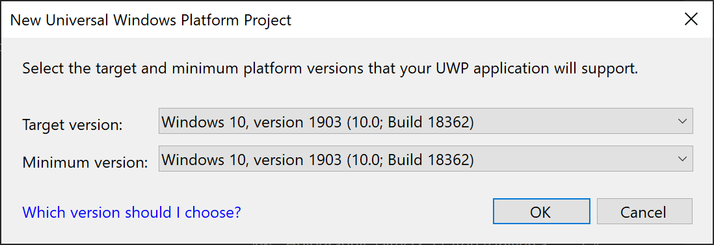

# Creating a holographic DirectX project

> [!NOTE]
> This article relates to the legacy WinRT native APIs.  For new native app projects, we recommend using the **[OpenXR API](openxr-getting-started.md)**.

A holographic app you create for a HoloLens will be a <a href="/windows/uwp/get-started/universal-application-platform-guide" target="_blank">Universal Windows Platform (UWP) app</a>.  If targeting desktop Windows Mixed Reality headsets, you can create a UWP app or a Win32 app.

The DirectX 11 holographic UWP app template is much like the DirectX 11 UWP app template. The template includes a program loop, a **DeviceResources** class to manage the Direct3D device and context, and a simplified content renderer class. It also has an <a href="/uwp/api/windows.applicationmodel.core.iframeworkview" target="_blank">IFrameworkView</a>, just like any other UWP app.

The mixed reality app, however, has some additional capabilities that aren't present in a typical Direct3D UWP app. The Windows Mixed Reality app template can:
* Handle Direct3D device resources associated with holographic cameras.
* Retrieve camera back buffers from the system. In the case of Direct3D12, create holographic back buffer resources and manage resource lifetimes.
* Handle [gaze](../../design/gaze-and-commit.md) input, and recognize a [gesture](../../design/gaze-and-commit.md#composite-gestures).
* Go into full-screen stereo rendering mode.

## How do I get started?

First [install the tools](../install-the-tools.md), following the instructions on downloading Visual Studio 2019 and the Windows Mixed Reality app templates. The mixed reality app templates are available on the Visual Studio marketplace as a [web download](https://marketplace.visualstudio.com/items?itemName=WindowsMixedRealityteam.WindowsMixedRealityAppTemplatesVSIX), or by installing them as an extension through the Visual Studio UI.

Now you're ready to create your DirectX 11 Windows Mixed Reality app! Note, to remove the sample content, comment out the **DRAW_SAMPLE_CONTENT** preprocessor directive in *pch.h*.

## Creating a UWP project

Once the tools are [installed](../install-the-tools.md), you can then create a holographic DirectX UWP project.

To create a new project in Visual Studio 2019:
1. Start **Visual Studio**.
2. In the **Get Started** section on the right, select **Create a new project**.
3. In the drop-down menus in the **Create a new project** dialog, select **C++**, **Windows Mixed Reality**, and **UWP**.
4. Select **Holographic DirectX 11 App (Universal Windows) (C++/WinRT)**.
   <br>
   *Holographic DirectX 11 C++/WinRT UWP app project template in Visual Studio 2019*
   >[!IMPORTANT]
   >Be sure that the project template's name includes "(C++/WinRT)".  If not, you have an older version of the holographic project templates installed.  To get the latest project templates, [install them](../install-the-tools.md) as an extension to Visual Studio 2019.
5. Select **Next**.
5. Fill in the **Project name** and **Location** text boxes, and select or tap **Create**. The holographic app project is created.
6. For development targeting only HoloLens 2, ensure that the **Target version** and **Minimum version** are set to **Windows 10, version 1903**.  If you're also targeting HoloLens (1st gen) or desktop Windows Mixed Reality headsets, you can set **Minimum version** to **Windows 10, version 1809**. This will require some <a href="/windows/uwp/debug-test-perf/version-adaptive-code" target="_blank">version adaptive checks</a> in your code when using new features of HoloLens 2.
   <br>
   *Setting **Windows 10, version 1903** as the target and minimum versions*
   >[!IMPORTANT]
   >If you do not see **Windows 10, version 1903** as an option, you do not have the latest Windows 10 SDK installed.  To get this option to appear, <a href="https://developer.microsoft.com/windows/downloads/windows-10-sdk" target="_blank">install version 10.0.18362.0 or later of the Windows 10 SDK</a>.

To create a new project in Visual Studio 2017:
1. Start **Visual Studio**.
2. From the **File** menu, point to **New** and select **Project** from the context menu. The **New Project** dialog opens.
3. Expand **Installed** on the left and expand the **Visual C++** language node.
4. Navigate to the **Windows Universal > Holographic** node and select **Holographic DirectX 11 App (Universal Windows) (C++/WinRT)**.
   <br>
   *Holographic DirectX 11 C++/WinRT UWP app project template in Visual Studio 2017*
   >[!IMPORTANT]
   >Be sure that the project template's name includes "(C++/WinRT)".  If not, you have an older version of the holographic project templates installed.  To get the latest project templates, [install them](../install-the-tools.md) as an extension to Visual Studio 2017.
5. Fill in the **Name** and **Location** text boxes, and select or tap **OK**. The holographic app project is created.
6. For development targeting only HoloLens 2, ensure that the **Target version** and **Minimum version** are set to **Windows 10, version 1903**.  If you're also targeting HoloLens (1st gen) or desktop Windows Mixed Reality headsets, you can set **Minimum version** to **Windows 10, version 1809**. This will require some <a href="/windows/uwp/debug-test-perf/version-adaptive-code" target="_blank">version adaptive checks</a> in your code when using new features of HoloLens 2.
   <br>
   *Setting **Windows 10, version 1903** as the target and minimum versions*
   >[!IMPORTANT]
   >If you do not see **Windows 10, version 1903** as an option, you do not have the latest Windows 10 SDK installed.  To get this option to appear, <a href="https://developer.microsoft.com/windows/downloads/windows-10-sdk" target="_blank">install version 10.0.18362.0 or later of the Windows 10 SDK</a>.

The template generates a project using <a href="/windows/uwp/cpp-and-winrt-apis/" target="_blank">C++/WinRT</a>, a C++17 language projection of the Windows Runtime APIs that supports any standards-compliant C++17 compiler.  The project shows how to create a world-locked cube that's placed 2 meters from the user. The user can [air-tap](../../design/gaze-and-commit.md#composite-gestures) or press a button on the controller to place the cube in a different position specified by the user's [gaze](../../design/gaze-and-commit.md). You can modify this project to create any mixed reality app.

You can also create a new project using the **Visual C#** holographic project template, which is based on SharpDX.  If your holographic C# project didn't start from the Windows Holographic app template, you'll need to copy the ms.fxcompile.targets file from a Windows Mixed Reality C# template project and import it in your.csproj file to compile HLSL files that you add to your project. A Direct3D 12 template is also provided in the Windows Mixed Reality app templates extension to Visual Studio.

Review [Using Visual Studio to deploy and debug](../advanced-concepts/using-visual-studio.md) for information on how to build and deploy the sample to your HoloLens, PC with immersive device attached, or an emulator.

The rest of the instructions below will assume that you're using C++ to build your app.

### UWP app entry point

Your holographic UWP app starts in the **wWinMain** function in AppView.cpp. The **wWinMain** function creates the app's <a href="/uwp/api/windows.applicationmodel.core.iframeworkview" target="_blank">IFrameworkView</a> and starts the <a href="/uwp/api/windows.applicationmodel.core.coreapplication" target="_blank">CoreApplication</a> with it.

From **AppView.cpp**:

```cpp
// The main function bootstraps into the IFrameworkView.
int __stdcall wWinMain(HINSTANCE, HINSTANCE, PWSTR, int)
{
    winrt::init_apartment();
    CoreApplication::Run(AppViewSource());
    return 0;
}
```

From that point on, the AppView class handles interaction with Windows basic input events, CoreWindow events and messaging, and so on. It will also create the HolographicSpace used by your app.

## Creating a Win32 project

The easiest way to get started building a Win32 holographic project is to adapt the <a href="https://github.com/Microsoft/Windows-classic-samples/tree/master/Samples/BasicHologram" target="_blank">*BasicHologram* Win32 sample</a>.

This Win32 sample uses <a href="/windows/uwp/cpp-and-winrt-apis/" target="_blank">C++/WinRT</a>, a C++17 language projection of the Windows Runtime APIs that supports any standards-compliant C++17 compiler.  The project shows how to create a world-locked cube that's placed 2 meters from the user. The user can press a button on the controller to place the cube in a different position that's specified by the user's [gaze](../../design/gaze-and-commit.md). You can modify this project to create any mixed reality app.

### Win32 app entry point

Your holographic Win32 app starts in the **wWinMain** function in AppMain.cpp. The **wWinMain** function creates the app's HWND and starts its message loop.

From **AppMain.cpp**:

```cpp
int APIENTRY wWinMain(
    _In_     HINSTANCE hInstance,
    _In_opt_ HINSTANCE hPrevInstance,
    _In_     LPWSTR    lpCmdLine,
    _In_     int       nCmdShow)
{
    UNREFERENCED_PARAMETER(hPrevInstance);
    UNREFERENCED_PARAMETER(lpCmdLine);

    winrt::init_apartment();

    App app;

    // Initialize global strings, and perform application initialization.
    app.Initialize(hInstance);

    // Create the HWND and the HolographicSpace.
    app.CreateWindowAndHolographicSpace(hInstance, nCmdShow);

    // Main message loop:
    app.Run(hInstance);

    // Perform application teardown.
    app.Uninitialize();

    return 0;
}
```

From that point on, the AppMain class handles interaction with basic window messages, and so on. It will also create the HolographicSpace used by your app.

## Render holographic content

The project's **Content** folder contains classes for rendering holograms in the [holographic space](getting-a-holographicspace.md). The default hologram in the template is a spinning cube that's placed 2 meters away from the user. Drawing this cube is implemented in **SpinningCubeRenderer.cpp**, which has these key methods:

|  Method  |  Explanation | 
|----------|----------|
|  `CreateDeviceDependentResources` |  Loads shaders and creates the cube mesh. | 
|  `PositionHologram` |  Places the hologram at the location specified by the provided <a href="/uwp/api/windows.ui.input.spatial.spatialpointerpose" target="_blank">SpatialPointerPose</a>. | 
|  `Update` |  Rotates the cube, and sets the model matrix. | 
|  `Render` |  Renders a frame using the vertex and pixel shaders. | 

The **Shaders** subfolder contains four default shader implementations:

|  Shader  |  Explanation | 
|----------|----------|
|  `GeometryShader.hlsl` |  A pass-through that leaves the geometry unmodified. | 
|  `PixelShader.hlsl` |  Passes through the color data. The color data is interpolated and assigned to a pixel at the rasterization step. | 
|  `VertexShader.hlsl` |  Simple shader to do vertex processing on the GPU. | 
|  `VPRTVertexShader.hlsl` |  Simple shader to do vertex processing on the GPU, that is optimized for Windows Mixed Reality stereo rendering. | 

`VertexShaderShared.hlsl` contains common code shared between `VertexShader.hlsl` and `VPRTVertexShader.hlsl`.

Note: The Direct3D 12 app template also includes `ViewInstancingVertexShader.hlsl`. This variant uses D3D12 optional features to render stereo images more efficiently.

The shaders compile when the project is built, and loaded in the **SpinningCubeRenderer::CreateDeviceDependentResources** method.

## Interact with your holograms

User input is processed in the **SpatialInputHandler** class, which gets a <a href="/uwp/api/windows.ui.input.spatial.spatialinteractionmanager" target="_blank">SpatialInteractionManager</a> instance and subscribes to the <a href="/uwp/api/windows.ui.input.spatial.spatialinteractionmanager.sourcepressed" target="_blank">SourcePressed</a> event. This enables detecting the air-tap gesture and other spatial input events.

## Update holographic content

Your mixed reality app updates in a game loop, which by default is implemented in the **Update** method in `AppMain.cpp`. The **Update** method updates scene objects, like the spinning cube, and returns a <a href="/uwp/api/windows.graphics.holographic.holographicframe" target="_blank">HolographicFrame</a> object that is used to get up-to-date view and projection matrices and to present the swap chain.

The **Render** method in `AppMain.cpp` takes the <a href="/uwp/api/windows.graphics.holographic.holographicframe" target="_blank">HolographicFrame</a> and renders the current frame to each holographic camera, according to the current app and spatial positioning state.

## Notes

The Windows Mixed Reality app template now supports compilation with the Spectre mitigation flag enabled (/Qspectre). Make sure to install the Spectre-mitigated version of the Microsoft Visual C++ (MSVC) runtime libraries before compiling a configuration with Spectre mitigation enabled. To install the Spectre-mitigated C++ libraries, launch the Visual Studio Installer and select **Modify**. Navigate to **Individual components** and search for "spectre". Select the boxes corresponding to the target platforms and MSVC version that you need to compile Spectre-mitigated code for, and click **Modify** to begin the install.

## See also
* [Getting a HolographicSpace](getting-a-holographicspace.md)
* [HolographicSpace](/uwp/api/Windows.Graphics.Holographic.HolographicSpace)
* [Rendering in DirectX](rendering-in-directx.md)
* [Using Visual Studio to deploy and debug](../advanced-concepts/using-visual-studio.md)
* [Using the HoloLens emulator](../advanced-concepts/using-the-hololens-emulator.md)
* [Using XAML with holographic DirectX apps](using-xaml-with-holographic-directx-apps.md)
