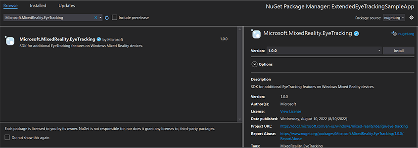

# Extended eye tracking in native engine

Extended eye tracking is a new capability in HoloLens 2. It's a superset of the standard eye tracking, which only provides combined eye gaze data. Extended eye tracking also provides individual eye gaze data and allows applications to set different framerates for the gaze data, such as 30, 60, and 90fps. Other features like eye openness and eye vergence aren't supported by HoloLens 2 at this time.

The [Extended Eye Tracking SDK](https://www.nuget.org/packages/Microsoft.MixedReality.EyeTracking) enables applications to access data and features of extended eye tracking. It could be used together with WinRT APIs or OpenXR APIs.

This article covers the ways to use the extended eye tracking SDK in native engine (C# or C++/WinRT), together with WinRT APIs.

## Project setup

1. [Create](./creating-a-holographic-directx-project.md)  a `Holographic DirectX 11 App (Universal Windows)` or `Holographic DirectX 11 App (Universal Windows) (C++/WinRT)` project with Visual Studio 2019 or newer, or open your existing holographic Visual Studio project.
1. Import the extended eye tracking SDK into the project.
    1. In the Visual Studio Solution Explorer, right-click your project -> Manage NuGet Packages...
    1. Make sure the Package source in the top right corner points to nuget.org: https://api.nuget.org/v3/index.json
    1. Click the Browser tab, and then search `Microsoft.MixedReality.EyeTracking`.
    1. Click the Install button to install the latest version of the SDK.  

          

1. Set Gaze Input capability
    1. Double-click the Package.appxmanifest file in Solution Explorer.
    1. Click the **Capabilities** tab, and then check the Gaze Input.
1. Include head file and use namespace.
    * For a C# project:
    ```C#
    using Microsoft.MixedReality.EyeTracking;
    ```
    * For a C++/WinRT project:
    ```C++
    #include <winrt/Microsoft.MixedReality.EyeTracking.h>
    using namespace winrt::Microsoft::MixedReality::EyeTracking;
    ```
1. Consume the extended eye tracking SDK APIs and implement your logic.
1. [Build and deploy to HoloLens](../advanced-concepts/using-visual-studio.md).

## Steps overview to get the gaze data

Getting the eye gaze data through the Extended Eye Tracking SDK APIs requires the following steps:
1. Obtain access to the Eye Tracking features from the user.
1. Watch for eye gaze tracker connections and disconnections.
1. Open the eye gaze tracker, and then query its capabilities.
1. Repeatedly read gaze data from the eye gaze tracker.
1. Transfer gaze data to other SpatialCoordinateSystems.

## Get access to the eye tracking features

In order to use any eye-related information, the application must first request user consent.

```C#
var status = await Windows.Perception.People.EyesPose.RequestAccessAsync();
bool useGaze = (status == Windows.UI.Input.GazeInputAccessStatus.Allowed);
```

```Cpp
auto accessStatus = co_await winrt::Windows::Perception::People::EyesPose::RequestAccessAsync();
bool useGaze = (accessStatus.get() == winrt::Windows::UI::Input::GazeInputAccessStatus::Allowed);
```

## Detect eye gaze tracker

Eye gaze tracker detection is made through the use of the `EyeGazeTrackerWatcher` class. `EyeGazeTrackerAdded` and `EyeGazeTrackerRemoved` events are respectively raised when an eye gaze tracker is detected or disconnected.

The watcher must be explicitly started with the `StartAsync()` method, which completes asynchronously when trackers that are already connected have been signaled through the `EyeGazeTrackerAdded` event.

When an eye gaze tracker is detected, an `EyeGazeTracker` instance is passed to the application in the `EyeGazeTrackerAdded` event parameters; reciprocally, when a tracker is disconnected, the corresponding `EyeGazeTracker` instance is passed to the EyeGazeTrackerRemoved event.

```C#
EyeGazeTrackerWatcher watcher = new EyeGazeTrackerWatcher();
watcher.EyeGazeTrackerAdded += _watcher_EyeGazeTrackerAdded;
watcher.EyeGazeTrackerRemoved += _watcher_EyeGazeTrackerRemoved;
await watcher.StartAsync();
...

private async void _watcher_EyeGazeTrackerAdded(object sender, EyeGazeTracker e)
{
    // Implementation is in next section
}

private void _watcher_EyeGazeTrackerRemoved(object sender, EyeGazeTracker e)
{
    ...
}
```

```Cpp
EyeGazeTrackerWatcher watcher;
watcher.EyeGazeTrackerAdded(std::bind(&SampleEyeTrackingNugetClientAppMain::OnEyeGazeTrackerAdded, this, _1, _2));
watcher.EyeGazeTrackerRemoved(std::bind(&SampleEyeTrackingNugetClientAppMain::OnEyeGazeTrackerRemoved, this, _1, _2));
co_await watcher.StartAsync();
...

winrt::Windows::Foundation::IAsyncAction SampleAppMain::OnEyeGazeTrackerAdded(const EyeGazeTrackerWatcher& sender, const EyeGazeTracker& tracker)
{
    // Implementation is in next section
}
void SampleAppMain::OnEyeGazeTrackerRemoved(const EyeGazeTrackerWatcher& sender, const EyeGazeTracker& tracker)
{
    ...
}
```


## Open eye gaze tracker

When receiving an `EyeGazeTracker` instance, the application must first open it by calling the `OpenAsync()` method. It can then query for the tracker capabilities if needed. The `OpenAsync()` method takes a boolean parameter; this indicates if the application needs to access features not belonging to standard eye tracking, such as individual eye gaze vectors or changing the tracker's framerate. 

Combined gaze is a mandatory feature supported by all eye gaze trackers. Other features, such as access to individual gaze, are optional and might be supported or not depending on the tracker and its driver. For these optional features, the `EyeGazeTracker` class exposes a property indicating if the feature is supported--for example, the  `AreLeftAndRightGazesSupported` property, which indicates whether individual eye gaze info is supported by the device.

All spatial information exposed by eye gaze tracker is published related to a the tracker itself, which is identified by a **Dynamic Node ID**. Using the nodeId to obtain a `SpatialCoordinateSystem` with WinRT APIs could transform the coordinates of gaze data into another coordinate system. 

```C#
private async void _watcher_EyeGazeTrackerAdded(object sender, EyeGazeTracker e)
{
    try
    {
        // Try to open the tracker with access to restricted features
        await e.OpenAsync(true);

        // If it has succeeded, store it for future use
        _tracker = e;

        // Check support for individual eye gaze
        bool supportsIndividualEyeGaze = _tracker.AreLeftAndRightGazesSupported;

        // Get a spatial locator for the tracker, this will be used to transfer the gaze data to other coordinate systems later
        var trackerNodeId = e.TrackerSpaceLocatorNodeId;
        _trackerLocator = Windows.Perception.Spatial.Preview.SpatialGraphInteropPreview.CreateLocatorForNode(trackerNodeId);
    }
    catch (Exception ex)
    {
        // Unable to open the tracker
    }
}
```

```Cpp
winrt::Windows::Foundation::IAsyncAction SampleEyeTrackingNugetClientAppMain::OnEyeGazeTrackerAdded(const EyeGazeTrackerWatcher&, const EyeGazeTracker& tracker)
{
   auto newTracker = tracker;

   try
   {
        // Try to open the tracker with access to restricted features
        co_await newTracker.OpenAsync(true);

        // If it has succeeded, store it for future use
        m_gazeTracker = newTracker;

        // Check support for individual eye gaze
        const bool supportsIndividualEyeGaze = m_gazeTracker.AreLeftAndRightGazesSupported();

        // Get a spatial locator for the tracker. This will be used to transfer the gaze data to other coordinate systems later
        const auto trackerNodeId = m_gazeTracker.TrackerSpaceLocatorNodeId();
        m_trackerLocator = winrt::Windows::Perception::Spatial::Preview::SpatialGraphInteropPreview::CreateLocatorForNode(trackerNodeId);
   }
   catch (const winrt::hresult_error& e)
   {
       // Unable to open the tracker
   }
}
```

## Set eye gaze tracker frame rate

The `EyeGazeTracker.SupportedTargetFrameRates` property returns the list of the target frame rate supported by the tracker. HoloLens 2 supports 30, 60, and 90fps. 

Use the `EyeGazeTracker.SetTargetFrameRate()` method to set the target frame rate.

```C#
// This returns a list of supported frame rate: 30, 60, 90 fps in order
var supportedFrameRates = _tracker.SupportedTargetFrameRates;

// Sets the tracker at the highest supported frame rate (90 fps)
var newFrameRate = supportedFrameRates[supportedFrameRates.Count - 1];
_tracker.SetTargetFrameRate(newFrameRate);
uint newFramesPerSecond = newFrameRate.FramesPerSecond;
```

```Cpp
// This returns a list of supported frame rate: 30, 60, 90 fps in order
const auto supportedFrameRates = m_gazeTracker.SupportedTargetFrameRates();

// Sets the tracker at the highest supported frame rate (90 fps)
const auto newFrameRate = supportedFrameRates.GetAt(supportedFrameRates.Size() - 1);
m_gazeTracker.SetTargetFrameRate(newFrameRate);
const uint32_t newFramesPerSecond = newFrameRate.FramesPerSecond();
```


## Read gaze data from the eye gaze tracker

An eye gaze tracker publishes its states periodically in a circular buffer. This enables the application to read the state of the tracker at a time belonging to a small time span. It allows, for example, the retrieval of the most recent state of the tracker, or its state at the time of some event such as a hand gesture from the user.

Methods that retrieve the tracker state as an `EyeGazeTrackerReading` instance:

* The `TryGetReadingAtTimestamp()` and `TryGetReadingAtSystemRelativeTime()` methods return the `EyeGazeTrackerReading` closest to the time passed by the application. The tracker controls the publishing schedule, so the returned reading might be slightly older or newer than the request time. The `EyeGazeTrackerReading.Timestamp` and `EyeGazeTrackerReading.SystemRelativeTime` properties enable the application to know the exact time of the published state.

* The `TryGetReadingAfterTimestamp()` and `TryGetReadingAfterSystemRelativeTime()` methods return the first `EyeGazeTrackerReading` with a timestamp strictly superior to the time passed as a parameter. This enables an application to sequentially read all the states published by the tracker. Note that all these methods are querying the existing buffer and that they return immediately. If no state is available, they'll return null (in other words, they won't make the application wait for a state to be published).

In addition to its timestamp, an `EyeGazeTrackerReading` instance has an `IsCalibrationValid` property, which indicates if the eye tracker calibration is valid or not.

Finally, gaze data can be retrieved through a set of methods such as `TryGetCombinedEyeGazeInTrackerSpace()` or `TryGetLeftEyeGazeInTrackerSpace()`. All these methods return a boolean indicating a success. Failure to get some data might either mean that the data is not supported (`EyeGazeTracker` has properties to detect this case) or that the tracker could not get the data (for example, invalid calibration or eye hidden).

If, for example, the application wants to display a cursor corresponding to the combined gaze, it can query the tracker using a timestamp of the prediction of the frame being prepared as follows.

```C#
var holographicFrame = holographicSpace.CreateNextFrame();
var prediction = holographicFrame.CurrentPrediction;
var predictionTimestamp = prediction.Timestamp;
var reading = _tracker.TryGetReadingAtTimestamp(predictionTimestamp.TargetTime.DateTime);
if (reading != null)
{
    // Vector3 needs the System.Numerics namespace
    if (reading.TryGetCombinedEyeGazeInTrackerSpace(out Vector3 gazeOrigin, out Vector3 gazeDirection))
    {
        // Use gazeOrigin and gazeDirection to display the cursor
    }
}
```

```Cpp
auto holographicFrame = m_holographicSpace.CreateNextFrame();
auto prediction = holographicFrame.CurrentPrediction();
auto predictionTimestamp = prediction.Timestamp();
const auto reading = m_gazeTracker.TryGetReadingAtTimestamp(predictionTimestamp.TargetTime());
if (reading)
{
    float3 gazeOrigin;
    float3 gazeDirection;
    if (reading.TryGetCombinedEyeGazeInTrackerSpace(gazeOrigin, gazeDirection))
    {
        // Use gazeOrigin and gazeDirection to display the cursor
    }
}
```


## Transform gaze data to other SpatialCoordinateSystem

WinRT APIs that return spatial data such as a position always require both a `PerceptionTimestamp` and a `SpatialCoordinateSystem`. For example, to retrieve the combined gaze of HoloLens 2 using the WinRT API, the API [SpatialPointerPose.TryGetAtTimestamp()](https://learn.microsoft.com/uwp/api/windows.ui.input.spatial.spatialpointerpose.trygetattimestamp) requires two parameters: a `SpatialCoordinateSystem` and a `PerceptionTimestamp`. When the combined gaze is then accessed through `SpatialPointerPose.Eyes.Gaze`, its origin and direction are expressed in the `SpatialCoordinateSystem` passed in.

Extended tye tracking SDK APIs don't need to take a `SpatialCoordinateSystem` and the gaze data are always expressed in the tracker's coordinate system. But you can transform those gaze data to another coordinate system with the tracker's pose related to the other coordinate system.

* As the section above named "Open eye gaze tracker"  mentioned, to get a `SpatialLocator` for the eye gaze tracker, call `Windows.Perception.Spatial.Preview.SpatialGraphInteropPreview.CreateLocatorForNode()` with the `EyeGazeTracker.TrackerSpaceLocatorNodeId` property.

* Gaze origins and directions retrieved through `EyeGazeTrackerReading` are related to the eye gaze tracker.

* `SpatialLocator.TryLocateAtTimestamp()` returns the full 6DoF location of the eye gaze tracker at a given `PerceptionTimeStamp` and related to a given `SpatialCoordinateSystem`, which could be used to construct a Matrix4x4 transformation matrix.

* Use the Matrix4x4 transformation matrix constructed to transfer the gaze origins and directions to other SpatialCoordinateSystem.

The following code samples show how to compute the position of a cube located in the direction of the combined gaze, two meters in front of the gaze origin; 

```C#
var predictionTimestamp = prediction.Timestamp;
var stationaryCS = stationaryReferenceFrame.CoordinateSystem;
var trackerLocation = _trackerLocator.TryLocateAtTimestamp(predictionTimestamp, stationaryCS);
if (trackerLocation != null)
{
    var trackerToStationaryMatrix = Matrix4x4.CreateFromQuaternion(trackerLocation.Orientation) * Matrix4x4.CreateTranslation(trackerLocation.Position);
    var reading = _tracker.TryGetReadingAtTimestamp(predictionTimestamp.TargetTime.DateTime);
    if (reading != null)
    {
        if (reading.TryGetCombinedEyeGazeInTrackerSpace(out Vector3 gazeOriginInTrackerSpace, out Vector3 gazeDirectionInTrackerSpace))
        {
            var cubePositionInTrackerSpace = gazeOriginInTrackerSpace + 2.0f * gazeDirectionInTrackerSpace;
            var cubePositionInStationaryCS = Vector3.Transform(cubePositionInTrackerSpace, trackerToStationaryMatrix);
        }
    }
}
```

```Cpp
auto predictionTimestamp = prediction.Timestamp();
auto stationaryCS = m_stationaryReferenceFrame.CoordinateSystem();
auto trackerLocation = m_trackerLocator.TryLocateAtTimestamp(predictionTimestamp, stationaryCS);
if (trackerLocation) 
{
    auto trackerOrientation = trackerLocation.Orientation();
    auto trackerPosition = trackerLocation.Position();
    auto trackerToStationaryMatrix = DirectX::XMMatrixRotationQuaternion(DirectX::XMLoadFloat4(reinterpret_cast<const DirectX::XMFLOAT4*>(&trackerOrientation))) * DirectX::XMMatrixTranslationFromVector(DirectX::XMLoadFloat3(&trackerPosition));

    const auto reading = m_gazeTracker.TryGetReadingAtTimestamp(predictionTimestamp.TargetTime());
    if (reading)
    {
        float3 gazeOriginInTrackerSpace;
        float3 gazeDirectionInTrackerSpace;
        if (reading.TryGetCombinedEyeGazeInTrackerSpace(gazeOriginInTrackerSpace, gazeDirectionInTrackerSpace))
        {
            auto cubePositionInTrackerSpace = gazeOriginInTrackerSpace + 2.0f * gazeDirectionInTrackerSpace;
            float3 cubePositionInStationaryCS;
            DirectX::XMStoreFloat3(&cubePositionInStationaryCS, DirectX::XMVector3TransformCoord(DirectX::XMLoadFloat3(&cubePositionInTrackerSpace), trackerToStationaryMatrix));
        }
    }
}
```

## API reference of extended eye tracking SDK

```C#
namespace Microsoft.MixedReality.EyeTracking
{
    /// <summary>
    /// Allow discovery of Eye Gaze Trackers connected to the system
    /// This is the only class from Extended Eye Tracking SDK that the application will instantiate, 
    /// other classes' instances will be returned by method calls or properties.
    /// </summary>
    public class EyeGazeTrackerWatcher
    {
        /// <summary>
        /// Constructs an instance of the watcher
        /// </summary>
        public EyeGazeTrackerWatcher();

        /// <summary>
        /// Starts trackers enumeration.
        /// </summary>
        /// <returns>Task representing async action; completes when the initial enumeration is completed</returns>
        public System.Threading.Tasks.Task StartAsync();

        /// <summary>
        /// Stop listening to trackers additions and removal
        /// </summary>
        public void Stop();

        /// <summary>
        /// Raised when an Eye Gaze tracker is connected
        /// </summary>
        public event System.EventHandler<EyeGazeTracker> EyeGazeTrackerAdded;

        /// <summary>
        /// Raised when an Eye Gaze tracker is disconnected
        /// </summary>
        public event System.EventHandler<EyeGazeTracker> EyeGazeTrackerRemoved;        
    }

    /// <summary>
    /// Represents an Eye Tracker device
    /// </summary>
    public class EyeGazeTracker
    {
        /// <summary>
        /// True if Restricted mode is supported, which means the driver supports to provide individual 
        /// eye gaze vector and framerate 
        /// </summary>
        public bool IsRestrictedModeSupported;

        /// <summary>
        /// True if Vergence Distance is supported by tracker
        /// </summary>
        public bool IsVergenceDistanceSupported;

        /// <summary>
        /// True if Eye Openness is supported by the driver
        /// </summary>
        public bool IsEyeOpennessSupported;

        /// <summary>
        /// True if individual gazes are supported
        /// </summary>
        public bool AreLeftAndRightGazesSupported;

        /// <summary>
        /// Get the supported target frame rates of the tracker
        /// </summary>
        public System.Collections.Generic.IReadOnlyList<EyeGazeTrackerFrameRate> SupportedTargetFrameRates;

        /// <summary>
        /// NodeId of the tracker, used to retrieve a SpatialLocator or SpatialGraphNode to locate the tracker in the scene
        /// for Perception API, use SpatialGraphInteropPreview.CreateLocatorForNode
        /// for Mixed Reality OpenXR API, use SpatialGraphNode.FromDynamicNodeId
        /// </summary>
        public Guid TrackerSpaceLocatorNodeId;

        /// <summary>
        /// Opens the tracker
        /// </summary>
        /// <param name="restrictedMode">True if restricted mode active</param>
        /// <returns>Task representing async action; completes when the initial enumeration is completed</returns>
        public System.Threading.Tasks.Task OpenAsync(bool restrictedMode);

        /// <summary>
        /// Closes the tracker
        /// </summary>
        public void Close();

        /// <summary>
        /// Changes the target frame rate of the tracker
        /// </summary>
        /// <param name="newFrameRate">Target frame rate</param>
        public void SetTargetFrameRate(EyeGazeTrackerFrameRate newFrameRate);

        /// <summary>
        /// Try to get tracker state at a given timestamp
        /// </summary>
        /// <param name="timestamp">timestamp</param>
        /// <returns>State if available, null otherwise</returns>
        public EyeGazeTrackerReading TryGetReadingAtTimestamp(DateTime timestamp);

        /// <summary>
        /// Try to get tracker state at a system relative time
        /// </summary>
        /// <param name="time">time</param>
        /// <returns>State if available, null otherwise</returns>
        public EyeGazeTrackerReading TryGetReadingAtSystemRelativeTime(TimeSpan time);

        /// <summary>
        /// Try to get first first tracker state after a given timestamp
        /// </summary>
        /// <param name="timestamp">timestamp</param>
        /// <returns>State if available, null otherwise</returns>
        public EyeGazeTrackerReading TryGetReadingAfterTimestamp(DateTime timestamp);

        /// <summary>
        /// Try to get the first tracker state after a system relative time
        /// </summary>
        /// <param name="time">time</param>
        /// <returns>State if available, null otherwise</returns>
        public EyeGazeTrackerReading TryGetReadingAfterSystemRelativeTime(TimeSpan time);
    }

    /// <summary>
    /// Represents a Frame Rate supported by an Eye Tracker
    /// </summary>
    public class EyeGazeTrackerFrameRate
    {
        /// <summary>
        /// Frames per second of the frame rate
        /// </summary>
        public UInt32 FramesPerSecond;
    }

    /// <summary>
    /// Snapshot of Gaze Tracker state
    /// </summary>
    public class EyeGazeTrackerReading
    {
        /// <summary>
        /// Timestamp of state
        /// </summary>
        public DateTime Timestamp;

        /// <summary>
        /// Timestamp of state as system relative time
        /// Its SystemRelativeTime.Ticks could provide the QPC time to locate tracker pose 
        /// </summary>
        public TimeSpan SystemRelativeTime;

        /// <summary>
        /// Indicates user calibration is valid
        /// </summary>
        public bool IsCalibrationValid;

        /// <summary>
        /// Tries to get a vector representing the combined gaze related to the tracker's node
        /// </summary>
        /// <param name="origin">Origin of the gaze vector</param>
        /// <param name="direction">Direction of the gaze vector</param>
        /// <returns></returns>
        public bool TryGetCombinedEyeGazeInTrackerSpace(out System.Numerics.Vector3 origin, out System.Numerics.Vector3 direction);

        /// <summary>
        /// Tries to get a vector representing the left eye gaze related to the tracker's node
        /// </summary>
        /// <param name="origin">Origin of the gaze vector</param>
        /// <param name="direction">Direction of the gaze vector</param>
        /// <returns></returns>
        public bool TryGetLeftEyeGazeInTrackerSpace(out System.Numerics.Vector3 origin, out System.Numerics.Vector3 direction);

        /// <summary>
        /// Tries to get a vector representing the right eye gaze related to the tracker's node position
        /// </summary>
        /// <param name="origin">Origin of the gaze vector</param>
        /// <param name="direction">Direction of the gaze vector</param>
        /// <returns></returns>
        public bool TryGetRightEyeGazeInTrackerSpace(out System.Numerics.Vector3 origin, out System.Numerics.Vector3 direction);

        /// <summary>
        /// Tries to read vergence distance
        /// </summary>
        /// <param name="value">Vergence distance if available</param>
        /// <returns>bool if value is valid</returns>
        public bool TryGetVergenceDistance(out float value);

        /// <summary>
        /// Tries to get left Eye openness information
        /// </summary>
        /// <param name="value">Eye Openness if valid</param>
        /// <returns>bool if value is valid</returns>
        public bool TryGetLeftEyeOpenness(out float value);

        /// <summary>
        /// Tries to get right Eye openness information
        /// </summary>
        /// <param name="value">Eye Openness if valid</param>
        /// <returns>bool if value is valid</returns>
        public bool TryGetRightEyeOpenness(out float value);
    }
}
```

## See also

* [Use extended eye tracking in Unity](../unity/extended-eye-tracking-unity.md)
