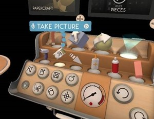

# Mixed reality capture for developers (DirectX)

> [!NOTE]
> See [Render from the PV camera](#render-from-the-pv-camera-opt-in) below for guidance on a new MRC capability for HoloLens 2.

Before getting started here, we recommend that you take a look at our [mixed reality capture overview](../advanced-concepts/mixed-reality-capture-overview.md) article.

#### Render from the PV camera (opt-in)

HoloLens 2 adds the ability for an immersive app to **render from the PV camera** while mixed reality capture is running. To ensure the app supports the additional render correctly, the app has to opt in to this functionality.

Render from the PV camera offers the following improvements over the default MRC experience:
* Hologram alignment to your physical environment and hands for near interactions should be accurate at all distances. Avoid having an offset at distances other than the focus point as you might see in the default MRC.
* The right eye in the headset won't be compromised, as it won't be used to render the holograms for the MRC output.

There are three steps to enable rendering from the PV camera:
1. Enable the PhotoVideoCamera HolographicViewConfiguration
2. Handle the additional HolographicCamera render
3. Verify your shaders and code render correctly from this additional HolographicCamera

##### Enable the PhotoVideoCamera HolographicViewConfiguration in DirectX

To opt in to rendering from the PV Camera, an app simply enables the PhotoVideoCamera's [HolographicViewConfiguration](/uwp/api/Windows.Graphics.Holographic.HolographicViewConfiguration):
```csharp
var display = Windows.Graphics.Holographic.HolographicDisplay.GetDefault();
var view = display.TryGetViewConfiguration(Windows.Graphics.Holographic.HolographicViewConfigurationKind.PhotoVideoCamera);
if (view != null)
{
    view.IsEnabled = true;
}
```

##### Handle the additional HolographicCamera render in DirectX

When the app has opt-in to render from the PV camera and mixed reality capture starts:
1. HolographicSpace's CameraAdded event will fire. This event can be deferred if the app can't handle the camera at this time.
2. Once the event has completed with no outstanding deferrals, the HolographicCamera will appear in the next HolographicFrame's AddedCameras list.

When mixed reality capture stops (or if the app disables the view configuration while mixed reality capture is running): the HolographicCamera will appear in the next HolographicFrame's RemovedCameras list and the HolographicSpace's CameraRemoved event will fire.

A [ViewConfiguration](/uwp/api/windows.graphics.holographic.holographiccamera.viewconfiguration) property has been added to HolographicCamera to help identify the configuration a camera belongs to.

##### Verify shaders and code support additional cameras

Run a mixed reality capture and check for unusual alignment, missing content, or performance issues. Update shaders and code as appropriate.

If there are certain scenes that can't support rendering to an additional camera, you can disable the PhotoVideoCamera's HolographicViewConfiguration.

### Disabling MRC in your app

#### 2D app

2D apps can choose to have their visual content obscured when mixed reality capture is running by:
* Present with the [DXGI_PRESENT_RESTRICT_TO_OUTPUT](/windows/desktop/direct3ddxgi/dxgi-present) flag
* Create the app's swap chain with the [DXGI_SWAP_CHAIN_FLAG_HW_PROTECTED](/windows/desktop/api/dxgi/ne-dxgi-dxgi_swap_chain_flag) flag
* With the Windows 10 May 2019 Update, setting ApplicationView's [IsScreenCaptureEnabled](/uwp/api/windows.ui.viewmanagement.applicationview.isscreencaptureenabled)

#### Immersive app

Immersive apps can choose to have their visual content excluded from mixed reality capture by:
* Setting HolographicCameraRenderingParameter's [IsContentProtectionEnabled](/uwp/api/windows.graphics.holographic.holographiccamerarenderingparameters.iscontentprotectionenabled) to disable mixed reality capture for its associated frame
* Setting HolographicCamera's [IsHardwareContentProtectionEnabled](/uwp/api/windows.graphics.holographic.holographiccamera.ishardwarecontentprotectionenabled) to disable mixed reality capture for its associated holographic camera

#### Password Keyboard

With the Windows 10 May 2019 Update, visual content is automatically excluded from mixed reality capture when a password or pin keyboard is visible.

### Knowing when MRC is active

The [AppCapture](/uwp/api/Windows.Media.Capture.AppCapture) class can be used by an app to know when system mixed reality capture is running (for either audio or video).

>[!NOTE]
>AppCapture's [GetForCurrentView](/uwp/api/windows.media.capture.appcapture.getforcurrentview) API can return null if mixed reality capture isn't available on the device. It's also important to de-register the CapturingChanged event when your app is suspended, otherwise MRC can get into a blocked state.

## Integrating MRC functionality from within your app

Your mixed reality app can start MRC photo or video capture from within the app, and the content captured is made available to your app without being stored to the device's "Camera roll." You can create a custom MRC recorder or take advantage of built-in camera capture UI. 

### MRC with built-in camera UI

Developers can use the *[Camera Capture UI API](/windows/uwp/audio-video-camera/capture-photos-and-video-with-cameracaptureui)* to get a user-captured mixed reality photo or video with just a few lines of code.

This API launches the built-in MRC camera UI where users can take a photo or video and returns the resulting capture to your app. You can create a custom Mixed Reality Capture recorder if you need to add your own camera UI or lower-level access to capture streams.

### Creating a custom MRC recorder

While the user can always trigger a photo or video using the system MRC capture service, an application may want to build a custom camera app that include holograms in the camera stream just like MRC. This allows the application to kick off captures from user input, build custom recording UI, or customize MRC settings to name a few examples.

**HoloStudio adds a custom MRC camera using MRC effects**



Other applications can do this by using the [Windows Media Capture APIs](/uwp/api/Windows.Media.Capture.MediaCapture) to control the Camera and add an MRC Video and Audio effect to include virtual holograms and application audio in stills and videos.

Applications have two options to add the effect:
* The older API: [Windows.Media.Capture.MediaCapture.AddEffectAsync()](/uwp/api/windows.media.capture.mediacapture.addeffectasync)
* The new Microsoft recommended API (returns an object, making it possible to manipulate dynamic properties): [Windows.Media.Capture.MediaCapture.AddVideoEffectAsync()](/uwp/api/windows.media.capture.mediacapture.addvideoeffectasync) / [Windows.Media.Capture.MediaCapture.AddAudioEffectAsync()](/uwp/api/windows.media.capture.mediacapture.addaudioeffectasync) which require the app create its own implementation of [IVideoEffectDefinition](/uwp/api/Windows.Media.Effects.IVideoEffectDefinition) and [IAudioEffectDefinition](/uwp/api/windows.media.effects.iaudioeffectdefinition). See the [MRC sample app](https://github.com/microsoft/Windows-universal-samples/tree/master/Samples/HolographicMixedRealityCapture) for examples.

>[!NOTE]
> The Windows.Media.MixedRealityCapture namespace will not be recognized by Visual Studio, but the strings are still valid.

MRC Video Effect (**Windows.Media.MixedRealityCapture.MixedRealityCaptureVideoEffect**)

|  Property Name  |  Type  |  Default Value  |  Description |
|----------|----------|----------|----------|
|  StreamType  |  UINT32 ([MediaStreamType](/uwp/api/Windows.Media.Capture.MediaStreamType))  |  1 (VideoRecord)  |  Describe which capture stream this effect is used for. Audio isn't available. |
|  HologramCompositionEnabled  |  boolean  |  TRUE  |  Flag to enable or disable holograms in video capture. |
|  RecordingIndicatorEnabled  |  boolean  |  TRUE  |  Flag to enable or disable recording indicator on screen during hologram capturing. |
|  VideoStabilizationEnabled  |  boolean  |  FALSE  |  Flag to enable or disable video stabilization powered by the HoloLens tracker. |
|  VideoStabilizationBufferLength  |  UINT32  |  0  |  Set how many historical frames are used for video stabilization. 0 is 0-latency and nearly "free" from a power and performance perspective. 15 is recommended for highest quality (at the cost of 15 frames of latency and memory). |
|  GlobalOpacityCoefficient  |  float  |  0.9 (HoloLens) 1.0 (Immersive headset)  |  Set global opacity coefficient of hologram in range from 0.0 (fully transparent) to 1.0 (fully opaque). |
|  BlankOnProtectedContent  |  boolean  |  FALSE  |  Flag to enable or disable returning an empty frame if there's a 2d UWP app showing protected content. If this flag is false and a 2d UWP app is showing protected content, the 2d UWP app will be replaced by a protected content texture in both the headset and in the mixed reality capture. |
|  ShowHiddenMesh  |  boolean  |  FALSE  |  Flag to enable or disable showing the holographic camera's hidden area mesh and neighboring content. |
| OutputSize | Size | 0, 0 | Set the desired output size after cropping for video stabilization. A default crop size is chosen if 0 or an invalid output size is specified. |
| PreferredHologramPerspective | UINT32 | **Render from Camera** setting in the Windows Device Portal | Enum used to indicate which holographic camera view configuration should be captured: 0 (Display) means that the app won't be asked to render from the photo/video camera, 1 (PhotoVideoCamera) will ask the app to render from the photo/video camera (if the app supports it). Only supported on HoloLens 2 |

>[!NOTE]
> You can change the default value of **PreferredHologramPerspective** in the Windows Device Portal by going to the [Mixed Reality Capture page](../advanced-concepts/using-the-windows-device-portal.md#mixed-reality-capture) and unchecking **Render from Camera**. The setting defaults to **1 (PhotoVideoCamera)**, but can be unchecked to set it to **0 (Display)**.
>
> The default value of **PreferredHologramPerspective** was **0 (Display)** prior to the June 2020 update (Windows Holographic, version 2004 build 19041.1106 and Windows Holographic, version 1903 build 18362.1064).

MRC Audio Effect (**Windows.Media.MixedRealityCapture.MixedRealityCaptureAudioEffect**)

| Property Name | Type | Default Value | Description |
|----------|----------|----------|----------|
| MixerMode | UINT32 | 2 (Mic and System audio) | Enum used to indicate which audio sources should be used: 0 (Mic audio only), 1 (System audio only), 2 (Mic and System audio) |
| LoopbackGain | float | **App Audio Gain** setting in the Windows Device Portal | Gain to apply to system audio volume. Ranges from 0.0 to 5.0. Only supported on HoloLens 2 |
| MicrophoneGain | float | **Mic Audio Gain** setting in the Windows Device Portal | Gain to apply to mic volume. Ranges from 0.0 to 5.0. Only supported on HoloLens 2 |

>[!NOTE]
> You can change the default value of **LoopbackGain** or **MicrophoneGain** in the Windows Device Portal by going to the [Mixed Reality Capture page](../advanced-concepts/using-the-windows-device-portal.md#mixed-reality-capture) and adjusting the slider next to their respective settings. Both settings default to **1.0**, but can be set to any value between **0.0** and **5.0**.
>
> Using Windows Device Portal to configure the default gain values was added with the June 2020 update (Windows Holographic, version 2004 build 19041.1106 and Windows Holographic, version 1903 build 18362.1064).

### Simultaneous MRC limitations

You need to be aware of certain limitations when multiple apps are accessing MRC at the same time.

#### Photo/video camera access

On HoloLens 1, MRC will fail to capture a photo or capture video while a process is recording video or taking a photo. The reverse is also true: if MRC is running, the application will fail to get access to the camera. 

With HoloLens 2, it's possible for you to share access to the camera. If you don't need direct control of the resolution or frame-rate, you can initialize MediaCapture using the [SharedMode property](/uwp/api/windows.media.capture.mediacaptureinitializationsettings.sharingmode) with SharedReadOnly.  

##### Built-in MRC photo and video camera access

MRC functionality built into Windows 10 (via Cortana, Start Menu, hardware shortcuts, Miracast, Windows Device Portal):

* Will run with ExclusiveControl by default

However, support has been added to MRC subsystem to operate in a shared mode: 

* If an app requests ExclusiveControl access to the photo/video camera, built-in MRC will automatically stop using the photo/video camera so the app's request will succeed 
* If built in MRC is started while an app has ExclusiveControl, built-in MRC will run in SharedReadOnly mode 

This shared mode functionality has certain restrictions:

* Photo via Cortana, hardware shortcuts, or Start Menu: Requires the Windows 10 April 2018 Update (or later)
* Video via Cortana, hardware shortcuts, or Start Menu: Requires the Windows 10 April 2018 Update (or later)
* Streaming MRC over Miracast: Requires the Windows 10 October 2018 Update (or later)
* Streaming MRC over Windows Device Portal or via the HoloLens companion app: Requires HoloLens 2

>[!NOTE]
> The resolution and frame-rate of the built-in MRC camera UI might be reduced from its normal values when another app is using the photo/video camera.

#### MRC access for developers

We recommend you always request Exclusive control for the camera when using MRC. This will ensure your application has full control of the settings for the camera as long as you're aware of the limitations listed above. 

* Create a media capture object using the [initialization settings](/uwp/api/windows.media.capture.mediacaptureinitializationsettings)
* Set the [SharingMode](/uwp/api/windows.media.capture.mediacaptureinitializationsettings.sharingmode#Windows_Media_Capture_MediaCaptureInitializationSettings_SharingMode) property to **exclusive**

> [!CAUTION]
> Be sure to carefully read the [SharingMode remarks](/uwp/api/windows.media.capture.mediacaptureinitializationsettings.sharingmode#remarks) before continuing.

* Set up your camera the way you want it
* Start the app, capture video frames with the start API, then enable MRC

> [!CAUTION]
> If you start MRC before you start your app, we can't guarantee the feature will work as expected.

You can find a full sample of the above process in the [holographic face tracking sample](/samples/microsoft/windows-universal-samples/holographicfacetracking).

> [!NOTE]
> Before the Windows 10 April 2018 Update, an app's custom MRC recorder was mutually exclusive with system MRC (capturing photos, capturing videos, or streaming from the Windows Device Portal).

## See also

* [Mixed reality capture overview](../advanced-concepts/mixed-reality-capture-overview.md)
* [Mixed reality capture for HoloLens users](/hololens/holographic-photos-and-videos)
* [Spectator view](../../design/spectator-view.md)

