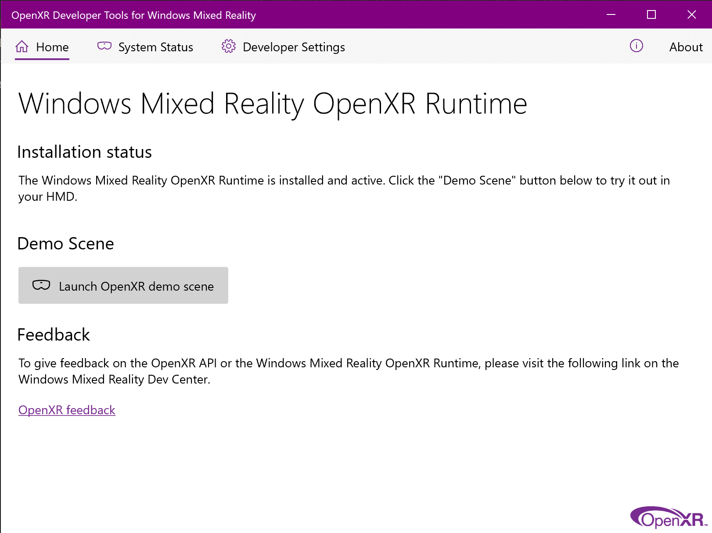
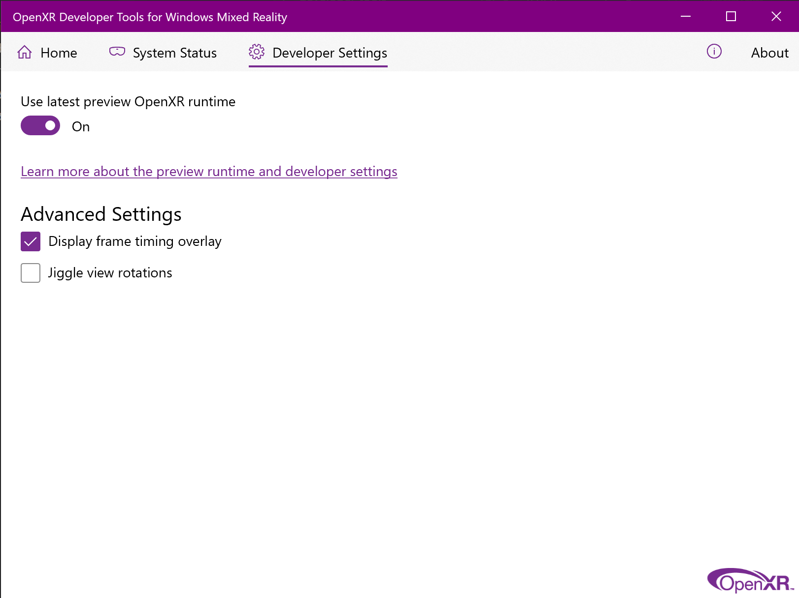
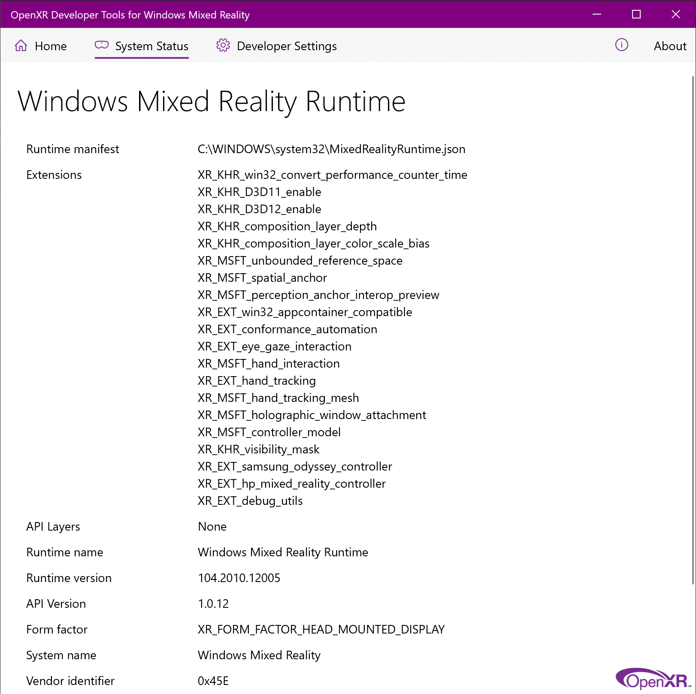

# Getting started with OpenXR

You can develop using OpenXR on a HoloLens 2 or Windows Mixed Reality immersive headset on the desktop.  If you don't have access to a headset, you can use the HoloLens 2 Emulator or the Windows Mixed Reality Simulator instead.

## Getting started with OpenXR for HoloLens 2

To start developing OpenXR applications for HoloLens 2:

1. Set up a HoloLens 2 or follow the instructions to [install a recent version of the HoloLens 2 emulator](../advanced-concepts/using-the-hololens-emulator.md). You should already have OpenXR 1.0 ready to go if you're using a recent emulator image or the device has updated its OS.
2. Make sure you've got the latest OpenXR runtime with all [extensions](openxr.md#roadmap) present by launching the **Store** app from the device or emulator.
    * Open the menu in the upper-right, select **Downloads and updates**, and choose **Get updates**.  

> [!NOTE]
> If you're using the emulator, the emulator image will reset each time you start it, and so your best bet is to just make sure that you have [the latest version of the HoloLens 2 emulator image](../advanced-concepts/using-the-hololens-emulator.md).

## Getting started with OpenXR for Windows Mixed Reality headsets

To start developing OpenXR applications for immersive Windows Mixed Reality headsets:

1. Be sure you're running at least the Windows 10 May 2019 Update (1903), which is the minimum requirement for Windows Mixed Reality end users to run OpenXR applications.  If you're on an earlier version of Windows 10, you can upgrade by using the <a href="https://www.microsoft.com/software-download/windows10" target="_blank">Windows 10 Update Assistant</a>.
2. Set up a Windows Mixed Reality headset or follow the instructions to [enable the Windows Mixed Reality simulator](../advanced-concepts/using-the-windows-mixed-reality-simulator.md).

That's it!  The Windows Mixed Reality OpenXR runtime is installed and made active automatically for all Windows Mixed Reality users.  The Microsoft Store then keeps the runtime up to date.

To activate the Windows Mixed Reality OpenXR Runtime again, launch Mixed Reality Portal from the Start menu, and select "Fix it" at the top of the window.  If that button is missing, the OpenXR runtime is already active. 

## Getting the OpenXR Developer Tools for Windows Mixed Reality

To try out the Windows Mixed Reality OpenXR Runtime, you can install the <a href="https://www.microsoft.com/store/productId/9n5cvvl23qbt" target="_blank">OpenXR Developer Tools for Windows Mixed Reality app</a>.  This app provides a demo of various OpenXR features, along with a System Status page with key information about the active runtime and current headset.

When using the HoloLens 2 emulator, the easiest way to install the OpenXR Developer Tools for Windows Mixed Reality is through the [Windows Device Portal](../advanced-concepts/using-the-windows-device-portal.md). Navigating to the "OpenXR" page and then clicking the "Install" button under "Developer Features", which also works on physical HoloLens 2 devices.

## Exploring the OpenXR API and sample app

Be sure to [install the tools](../install-the-tools.md) you'll need for OpenXR development if you haven't already.

The <a href="https://github.com/microsoft/OpenXR-MixedReality/tree/master/samples/BasicXrApp" target="_blank">BasicXrApp</a> project shows a simple OpenXR sample with Win32 and UWP HoloLens 2 project files in Visual Studio. Because the solution contains a HoloLens UWP project, you'll need the [Universal Windows Platform development workload](../install-the-tools.md#installation-checklist) installed in Visual Studio to fully open it.

While the Win32 and UWP project files are separate because of differences in packaging and deployment, the app code inside each project is almost exactly the same!

## Running your OpenXR app

After building an OpenXR Win32 desktop .EXE, you can use it with a VR headset on any desktop VR platform that supports OpenXR, whatever the headset type.

After building an OpenXR UWP app package, you can [deploy that package](../advanced-concepts/using-visual-studio.md) to either a HoloLens 2 device or the HoloLens 2 Emulator.

## Learning the OpenXR API

For a tour of the OpenXR API, check out this 60-minute video of the <a href="https://github.com/microsoft/OpenXR-MixedReality/tree/master/samples/BasicXrApp" target="_blank">BasicXrApp</a> sample in Visual Studio.  The video shows how each of the major components of the OpenXR API can be used in your own engine, and also demonstrates some of the applications built on OpenXR today:

>[!VIDEO https://channel9.msdn.com/Shows/Docs-Mixed-Reality/OpenXR-Cross-platform-native-mixed-reality/player?format=ny]

## Using OpenXR in an existing project

To get started with OpenXR in an existing project, you'll include the OpenXR loader.  The loader discovers the active OpenXR runtime on the device and provides access to the core functions and extension functions that it implements.

You can [reference the official OpenXR NuGet package](#reference-official-openxr-nuget-package) from your Visual Studio project or [include the official OpenXR loader source](#include-official-openxr-loader-source) from the Khronos GitHub repo.  Either approach will give you access to OpenXR 1.0 core features, plus published `KHR`, `EXT` and `MSFT` extensions.

If you're interested to experiment with `MSFT_preview` extensions as well, you can [copy in preview OpenXR headers](#using-preview-extensions) from the Mixed Reality GitHub repo.

### Reference official OpenXR NuGet package

The <a href="https://www.nuget.org/packages/OpenXR.Loader/" target="_blank">**OpenXR.Loader** NuGet package</a> is the easiest way to reference a prebuilt OpenXR loader .DLL in your Visual Studio C++ solution.  This will give you access to OpenXR 1.0 core features, plus published `KHR`, `EXT` and `MSFT` extensions.

To add an OpenXR.Loader NuGet package reference to your Visual Studio C++ solution:
1. In **Solution Explorer**, right-click the project that will use OpenXR and select **Manage NuGet Packages...**.
2. Switch to the **Browse** tab and search for **OpenXR.Loader**.
3. Select the **OpenXR.Loader** package and select Install in the details pane to the right.
4. Select OK to accept the changes to your project.
5. Add `#include <openxr/openxr.h>` to a source file to start using the OpenXR API.

To see an example of the OpenXR API in action, check out the <a href="https://github.com/microsoft/OpenXR-MixedReality/tree/master/samples/BasicXrApp" target="_blank">BasicXrApp</a> sample app.

### Include official OpenXR loader source

If you want to build the loader yourself, for example to avoid the extra loader .DLL, you can pull the official Khronos OpenXR loader sources into your project.  This will give you access to OpenXR 1.0 core features, plus published `KHR`, `EXT` and `MSFT` extensions.

To get started here, follow the instructions in the <a href="https://github.com/KhronosGroup/OpenXR-SDK" target="_blank">Khronos OpenXR-SDK repo on GitHub</a>.  The project is set up to build with CMake - if you're using MSBuild, you'll need to copy the code into your own project.

## Using preview extensions

The `MSFT_preview` extensions listed in the [extension roadmap](openxr.md#roadmap) are experimental vendor extensions being previewed to gather feedback.  These extensions are for developer devices only and will be removed when the real extension ships.

If you're interested to try out the available `MSFT_preview` extensions, go through the following steps to update your project:
1. Follow either of the approaches above to integrate an OpenXR loader into your project.
2. Replace the standard OpenXR headers in your project with the <a href="https://github.com/microsoft/OpenXR-MixedReality/tree/master/openxr_preview/include/openxr" target="_blank">preview headers from the Mixed Reality OpenXR repo on GitHub</a>.

To then activate preview extension support on your target HoloLens 2 or desktop PC:
  1. To make sure you've got the latest OpenXR runtime with all [extensions](openxr.md#roadmap) present, launch the **Store** app from within the target device or emulator, open the menu in the upper-right, select **Downloads and updates** and choose **Get updates**.
  2. Install the <a href="https://www.microsoft.com/store/productId/9n5cvvl23qbt" target="_blank">OpenXR Developer Tools for Windows Mixed Reality app</a> from the Microsoft Store onto the target device and run it.
  3. Navigate to the **Developer Settings** tab and enable **Use latest preview OpenXR runtime**.  This enables the preview runtime on your device, which has preview extensions activated.
     
  4. Confirm the **Runtime version** shown on the **System Status** tab of the [OpenXR Developer Tools for Windows Mixed Reality](openxr-getting-started.md#getting-the-openxr-developer-tools-for-windows-mixed-reality) matches the required version of the preview extensions you plan to try.  If so, you should see the extension in the **Extensions** list.  Once a stable extension is available, its preview extension will be removed. 
     

See the <a href="https://github.com/microsoft/OpenXR-MixedReality#openxr-preview-extensions" target="_blank">Mixed Reality OpenXR repo</a> for documentation of these preview extensions and samples of how to use them.

## Troubleshooting

If you have trouble getting up and running with OpenXR development, check out our [troubleshooting tips](openxr-troubleshooting.md).