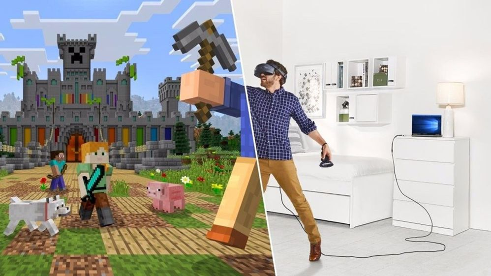

# OpenXR

OpenXR is an open royalty-free API standard from <a href="https://www.khronos.org/" target="_blank">Khronos</a>, providing engines with native access to a range of devices across the [mixed reality spectrum](../../discover/mixed-reality.md).

You can develop using OpenXR on a HoloLens 2 or Windows Mixed Reality immersive VR headset on the desktop.  If you don't have access to a headset, you can use the HoloLens 2 Emulator or the Windows Mixed Reality Simulator instead.

## Why OpenXR?

With OpenXR, you can build engines that target both holographic devices, like HoloLens 2, and immersive VR devices, like Windows Mixed Reality headsets for desktop PCs. OpenXR lets you write code once that's then portable across a wide range of hardware platforms.

The OpenXR API uses a loader to connect your application directly to your headset's native platform support. End users get maximum performance and minimum latency, whether they're using a Windows Mixed Reality or any other headset.

## What is OpenXR?

The OpenXR API provides the core pose prediction, frame timing, and spatial input functionality you'll need to build an engine that can target both holographic and immersive devices.

To learn about the OpenXR API, check out the OpenXR 1.0 <a href="https://www.khronos.org/registry/OpenXR/specs/1.0/html/xrspec.html" target="_blank">specification</a>, <a href="https://www.khronos.org/registry/OpenXR/specs/1.0/man/html/openxr.html" target="_blank">API reference</a>, and <a href="https://www.khronos.org/files/openxr-10-reference-guide.pdf" target="_blank">quick reference guide</a>.  For more information, see the <a href="https://www.khronos.org/openxr/" target="_blank">Khronos OpenXR page</a>.

To target the full feature set of HoloLens 2, you'll also use cross-vendor and vendor-specific OpenXR extensions that enable additional features beyond the OpenXR 1.0 core, such as articulated hand tracking, eye tracking, spatial mapping, and spatial anchors. For more information, see the [Roadmap section](#roadmap) below on the extensions coming later this year.

OpenXR isn't itself a mixed reality engine.  Instead, OpenXR enables engines like Unity and Unreal to write portable code once that can then access the native platform features of the user's holographic or immersive device, whatever vendor built that platform.

## Roadmap

The OpenXR specification defines an extension mechanism that enables runtime implementers to expose additional functionality beyond the [core features](#what-is-openxr) defined in the <a href="https://www.khronos.org/registry/OpenXR/specs/1.0/html/xrspec.html" target="_blank">base OpenXR 1.0 specification</a>.

There are three kinds of OpenXR extensions:
* **Vendor extensions (for example, `MSFT`):** Enables per-vendor innovation in hardware or software features.  Any runtime vendor can introduce and ship a vendor extension at any time.
  * **Experimental vendor extensions (for example, `MSFT_preview`):** Experimental vendor extensions being previewed to gather feedback.  `MSFT_preview` extensions are for developer devices only and will be removed when the real extension ships.  To experiment with them, you can [enable preview extensions on your developer device](openxr-getting-started.md#using-preview-extensions).
* **Cross-vendor `EXT` extensions:** Cross-vendor extensions that multiple companies define and implement.  Groups of interested companies can introduce EXT extensions at any time.
* **Official `KHR` extensions:** Official Khronos extensions ratified as part of a core spec release.  KHR extensions are covered by the same license as the core spec itself.

The Windows Mixed Reality OpenXR Runtime supports a set of `MSFT` and `EXT` extensions that brings the full set of HoloLens 2 features to OpenXR applications:

| Feature area | Extension availability |
|--------------|------------------------|
| Systems + sessions | **OpenXR 1.0 core spec:** <code><a href="https://www.khronos.org/registry/OpenXR/specs/1.0/html/xrspec.html#instance" target="_blank">XrInstance</a></code>, <code><a href="https://www.khronos.org/registry/OpenXR/specs/1.0/html/xrspec.html#system" target="_blank">XrSystemId</a></code>, <code><a href="https://www.khronos.org/registry/OpenXR/specs/1.0/html/xrspec.html#session" target="_blank">XrSession</a></code> |
| [Reference spaces (view, local, stage)](../../design/coordinate-systems.md) | **OpenXR 1.0 core spec:** <code><a href="https://www.khronos.org/registry/OpenXR/specs/1.0/html/xrspec.html#spaces" target="_blank">XrSpace</a></code> |
| View configurations (mono, stereo) | **OpenXR 1.0 core spec:** <code><a href="https://www.khronos.org/registry/OpenXR/specs/1.0/html/xrspec.html#view_configurations" target="_blank">XrView...</a></code> |
| [Swapchains](../advanced-concepts/rendering-overview.md) + [frame timing](../advanced-concepts/understanding-performance-for-mixed-reality.md) | **OpenXR 1.0 core spec:** <code><a href="https://www.khronos.org/registry/OpenXR/specs/1.0/html/xrspec.html#rendering" target="_blank">XrSwapchain...</a></code> + <code><a href="https://www.khronos.org/registry/OpenXR/specs/1.0/html/xrspec.html#frame-synchronization" target="_blank">xrWaitFrame</a></code> |
| Composition layers (projection, quad) | **OpenXR 1.0 core spec:** <code><a href="https://www.khronos.org/registry/OpenXR/specs/1.0/html/xrspec.html#compositing" target="_blank">XrCompositionLayer...</a></code> + <code><a href="https://www.khronos.org/registry/OpenXR/specs/1.0/html/xrspec.html#frame-submission" target="_blank">xrEndFrame</a></code> |
| [Input and haptics](../../design/interaction-fundamentals.md) | **OpenXR 1.0 core spec:** <code><a href="https://www.khronos.org/registry/OpenXR/specs/1.0/html/xrspec.html#input" target="_blank">XrAction...</a></code> |
| Direct3D 11/12 integration | **Official `KHR` extensions released:** <code><a href="https://www.khronos.org/registry/OpenXR/specs/1.0/html/xrspec.html#XR_KHR_D3D11_enable" target="_blank">XR_KHR_D3D11_enable</a> <code><a href="https://www.khronos.org/registry/OpenXR/specs/1.0/html/xrspec.html#XR_KHR_D3D12_enable" target="_blank">XR_KHR_D3D12_enable</a></code> |
| [Unbounded reference space (world-scale experiences)](../../design/coordinate-systems.md#building-a-world-scale-experience) | **`MSFT` extension released:** <code><a href="https://www.khronos.org/registry/OpenXR/specs/1.0/html/xrspec.html#XR_MSFT_unbounded_reference_space" target="_blank">XR_MSFT_unbounded_reference_space</a></code> |
| [Spatial anchors](../../design/spatial-anchors.md) | 
**`MSFT` extension released:** <code><a href="https://www.khronos.org/registry/OpenXR/specs/1.0/html/xrspec.html#XR_MSFT_spatial_anchor">XR_MSFT_spatial_anchor</a></code>

**`MSFT` extension released in runtime 108:** *(HoloLens 2 only)* <code><a href="https://www.khronos.org/registry/OpenXR/specs/1.0/html/xrspec.html#XR_MSFT_spatial_anchor_persistence">XR_MSFT_spatial_anchor_persistence</a></code>
 |
| [Hand interaction (grip/aim pose, air-tap, grasp)](../../design/hands-and-tools.md)
*HoloLens 2 only*
 | **`MSFT` extension released:** <code><a href="https://www.khronos.org/registry/OpenXR/specs/1.0/html/xrspec.html#XR_MSFT_hand_interaction">XR_MSFT_hand_interaction</a></code> |
| [Hand articulation + hand mesh](../../design/hands-and-tools.md)
*HoloLens 2 only*
 | 
**`EXT` extension released:** <code><a href="https://www.khronos.org/registry/OpenXR/specs/1.0/html/xrspec.html#XR_EXT_hand_tracking">XR_EXT_hand_tracking</a></code>

**`MSFT` extension released:** <code><a href="https://www.khronos.org/registry/OpenXR/specs/1.0/html/xrspec.html#XR_MSFT_hand_tracking_mesh">XR_MSFT_hand_tracking_mesh</a></code>
 |
| [Eye gaze](../../design/eye-tracking.md)
*HoloLens 2 only*
 | **`EXT` extension released:** <code><a href="https://www.khronos.org/registry/OpenXR/specs/1.0/html/xrspec.html#XR_EXT_eye_gaze_interaction" target="_blank">XR_EXT_eye_gaze_interaction</a></code> |
| [Mixed Reality Capture (third render from PV camera)](../advanced-concepts/mixed-reality-capture-overview.md#render-from-the-pv-camera-opt-in)
*HoloLens 2 only*
 | **`MSFT` extensions released:** <code><a href="https://www.khronos.org/registry/OpenXR/specs/1.0/html/xrspec.html#XR_MSFT_secondary_view_configuration">XR_MSFT_secondary_view_configuration</a></code> <code><a href="https://www.khronos.org/registry/OpenXR/specs/1.0/html/xrspec.html#XR_MSFT_first_person_observer">XR_MSFT_first_person_observer</a></code> |
| Motion controller interaction profiles (Samsung Odyssey and HP Reverb G2) | **`MSFT` extensions released in runtime 103:** <code><a href="https://www.khronos.org/registry/OpenXR/specs/1.0/html/xrspec.html#XR_EXT_samsung_odyssey_controller">XR_EXT_samsung_odyssey_controller</a></code> <code><a href="https://www.khronos.org/registry/OpenXR/specs/1.0/html/xrspec.html#XR_EXT_hp_mixed_reality_controller">XR_EXT_hp_mixed_reality_controller</a></code> |
| [Motion controller render models](../../design/motion-controllers.md#rendering-the-motion-controller-model) | **`MSFT` extension released in runtime 104:** <code><a href="https://www.khronos.org/registry/OpenXR/specs/1.0/html/xrspec.html#XR_MSFT_controller_model">XR_MSFT_controller_model</a></code> |
| [Scene understanding (planes, meshes)](../../design/scene-understanding.md)
*HoloLens 2 only*
 | **`MSFT` extension released in runtime 106:** <code><a href="https://www.khronos.org/registry/OpenXR/specs/1.0/html/xrspec.html#XR_MSFT_scene_understanding">XR_MSFT_scene_understanding</a></code> <code><a href="https://www.khronos.org/registry/OpenXR/specs/1.0/html/xrspec.html#XR_MSFT_scene_understanding_serialization">XR_MSFT_scene_understanding_serialization</a></code> |
| [Composition layer reprojection modes (auto-planar or orientation-only reprojection)](../advanced-concepts/hologram-stability.md#reprojection) | **`MSFT` extension released in runtime 106:** <code><a href="https://www.khronos.org/registry/OpenXR/specs/1.0/html/xrspec.html#XR_MSFT_composition_layer_reprojection">XR_MSFT_composition_layer_reprojection</a></code> |
| Interop with other Mixed Reality SDKs (for example, [QR](../advanced-concepts/qr-code-tracking-overview.md)) | **`MSFT` extension released:** <code><a href="https://www.khronos.org/registry/OpenXR/specs/1.0/html/xrspec.html#XR_MSFT_spatial_graph_bridge">XR_MSFT_spatial_graph_bridge</a></code> |
| Interop with UWP CoreWindow API (for example, for keyboard/mouse) | **`MSFT` extension released in runtime 103:** <code><a href="https://www.khronos.org/registry/OpenXR/specs/1.0/html/xrspec.html#XR_MSFT_holographic_window_attachment">XR_MSFT_holographic_window_attachment</a></code>
| Interop with legacy Mixed Reality WinRT APIs (for example, <code><a href="/uwp/api/Windows.Perception.Spatial.SpatialAnchorTransferManager">SpatialAnchorTransferManager</a></code>)) | 
**`MSFT` extension released in runtime 105:** <code><a href="https://www.khronos.org/registry/OpenXR/specs/1.0/html/xrspec.html#XR_MSFT_perception_anchor_interop">XR_MSFT_perception_anchor_interop</a></code> |
| Other cross-vendor extensions | 
**Official `KHR` extensions released:** <code><a href="https://www.khronos.org/registry/OpenXR/specs/1.0/html/xrspec.html#XR_KHR_composition_layer_depth" target="_blank">XR_KHR_composition_layer_depth</a></code> <code><a href="https://www.khronos.org/registry/OpenXR/specs/1.0/html/xrspec.html#XR_KHR_visibility_mask" target="_blank">XR_KHR_visibility_mask</a></code> <code><a href="https://www.khronos.org/registry/OpenXR/specs/1.0/html/xrspec.html#XR_KHR_win32_convert_performance_counter_time" target="_blank">XR_KHR_win32_convert_performance_counter_time</a></code> <code><a href="https://www.khronos.org/registry/OpenXR/specs/1.0/html/xrspec.html#XR_KHR_composition_layer_color_scale_bias" target="_blank">XR_KHR_composition_layer_color_scale_bias</a></code>

**`EXT` extensions released:** <code><a href="https://www.khronos.org/registry/OpenXR/specs/1.0/html/xrspec.html#XR_EXT_win32_appcontainer_compatible" target="_blank">XR_EXT_win32_appcontainer_compatible</a></code> <code><a href="https://www.khronos.org/registry/OpenXR/specs/1.0/html/xrspec.html#XR_EXT_debug_utils" target="_blank">XR_EXT_debug_utils</a></code>
 |

While some of these extensions may start out as vendor-specific `MSFT` extensions, Microsoft and other OpenXR runtime vendors are working together to design cross-vendor `EXT` or `KHR` extensions for many of these feature areas. Cross-vendor extensions will make the code you write for those features portable across runtime vendors, as with the core specification.

## Where can you use OpenXR?

*Minecraft's new RenderDragon engine has built its desktop VR support using OpenXR!*

Microsoft has been working with Unity and Epic Games to ensure the future of mixed reality is open, not just for HoloLens 2, but across the full breadth of PC VR, including [HP’s new Reverb G2 headset](https://www.microsoft.com/mixed-reality/windows-mixed-reality?rtc=1).  OpenXR powers the cross-vendor VR support for major titles shipping today, such as Minecraft and Microsoft Flight Simulator!  For more information on developing for HoloLens (1st gen), see the [release notes](/hololens/hololens1-release-notes).

To learn how you can get started with OpenXR in Unity, Unreal Engine or your own engine, read on!

### OpenXR in Unity

Microsoft’s current recommended Unity configuration for HoloLens 2 and Windows Mixed Reality development is **Unity 2020.3 LTS** with the latest Mixed Reality OpenXR plugin.  This plugin includes support for the OpenXR extensions that light up the [full capabilities of HoloLens 2 and Windows Mixed Reality headsets](#roadmap), including hand/eye tracking, spatial anchors and HP Reverb G2 controllers.  MRTK-Unity supports OpenXR as of [MRTK 2.7](/learn/paths/beginner-hololens-2-tutorials/?tabs=openxr#importing-the-mixed-reality-toolkit-and-configuring-the-unity-project).  For more information about getting started with Unity 2020 and OpenXR, see [Choosing a Unity version and XR plugin](../unity/choosing-unity-version.md).

If you are developing for HoloLens (1st gen), you'll need to continue using **Unity 2019.4 LTS** with the legacy WinRT API backend.  If you’re targeting the new HP Reverb G2 controller in a Unity 2019 app, see our [HP Reverb G2 input docs](../unity/unity-reverb-g2-controllers.md).

Starting in **Unity 2021.2**, OpenXR will be the only supported Unity backend for targeting HoloLens 2 and Windows Mixed Reality headsets.

### OpenXR in Unreal Engine

Unreal Engine 4.23 was the first major game engine release to ship preview support for OpenXR 1.0!  Now in **Unreal Engine 4.26**, support for HoloLens 2, Windows Mixed Reality and other desktop VR headsets is available through Unreal Engine's built-in OpenXR support.  Unreal Engine 4.26 also supports [Microsoft's OpenXR extension plugin](https://github.com/microsoft/Microsoft-OpenXR-Unreal), enabling hand interaction and HP Reverb G2 controller support, lighting up the [full feature set of HoloLens 2 and Windows Mixed Reality headsets](#roadmap).  Unreal Engine 4.26 is available today on the [Epic Games Launcher](https://www.unrealengine.com/download/creators), with MRTK-Unreal 0.12 supporting OpenXR projects.

### OpenXR for native development

You can develop using OpenXR on a HoloLens 2 or Windows Mixed Reality immersive VR headset on the desktop.  If you don't have access to a headset, you can use the HoloLens 2 Emulator or the Windows Mixed Reality Simulator instead.

To start developing OpenXR applications for HoloLens 2 or Windows Mixed Reality VR headsets, see [how to get started with OpenXR development](openxr-getting-started.md).

For a tour through all the major components of the OpenXR API, along with examples of the real-world applications using OpenXR today, check out this 60-minute walkthrough video:

>[!VIDEO https://docs.microsoft.com/en-us/shows/Mixed-Reality/OpenXR-Cross-platform-native-mixed-reality/player?format=ny]

## See also

* <a href="https://www.khronos.org/openxr/" target="_blank">More information on OpenXR</a>
* <a href="https://www.khronos.org/registry/OpenXR/specs/1.0/html/xrspec.html" target="_blank">OpenXR 1.0 specification</a>
* <a href="https://www.khronos.org/registry/OpenXR/specs/1.0/man/html/openxr.html" target="_blank">OpenXR 1.0 API reference</a>
* <a href="https://www.khronos.org/files/openxr-10-reference-guide.pdf" target="_blank">OpenXR 1.0 quick reference guide</a>