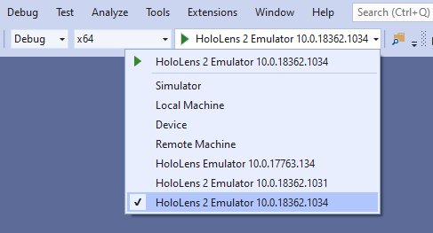
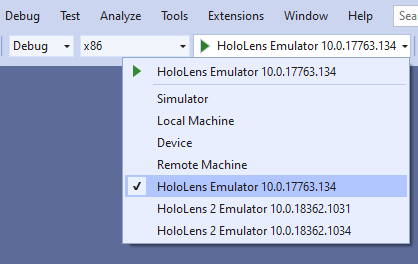

# [HoloLens 2](#tab/hl2)

* Choose either the **x86** or **x64** configuration option:

* Select **HoloLens 2 Emulator** in the deployment target drop-down menu

# [HoloLens (1st gen)](#tab/hl)

* Choose the **x86** configuration option:

* Select **HoloLens Emulator** in the deployment target drop-down menu:

