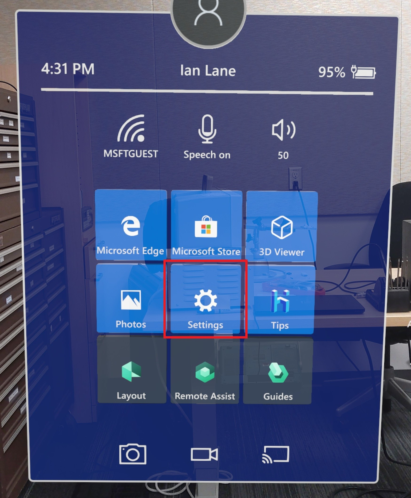
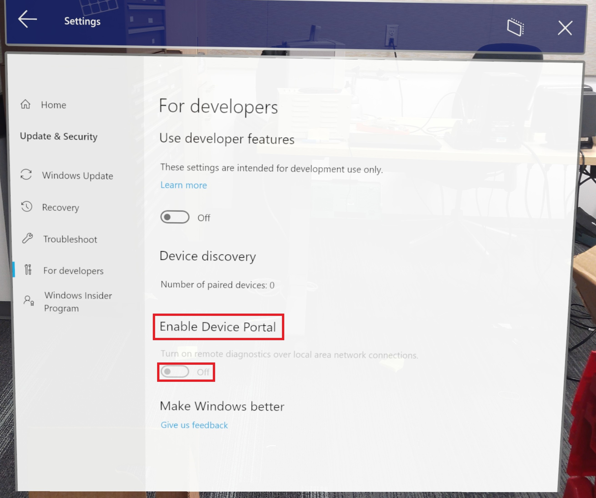
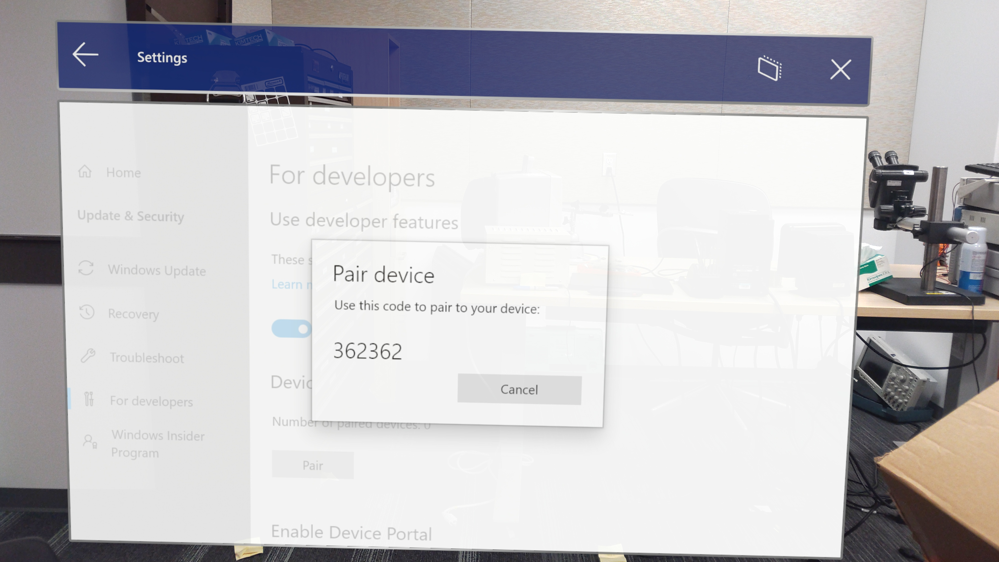
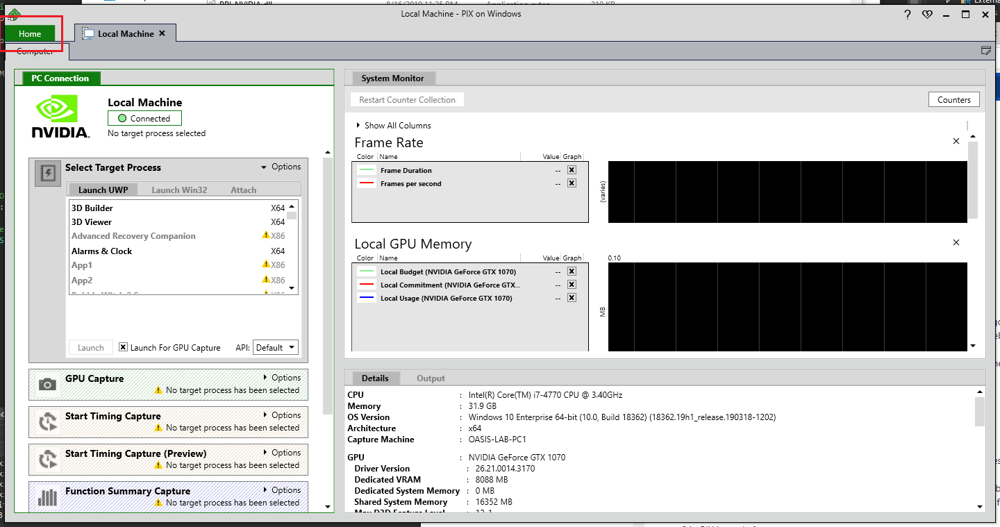
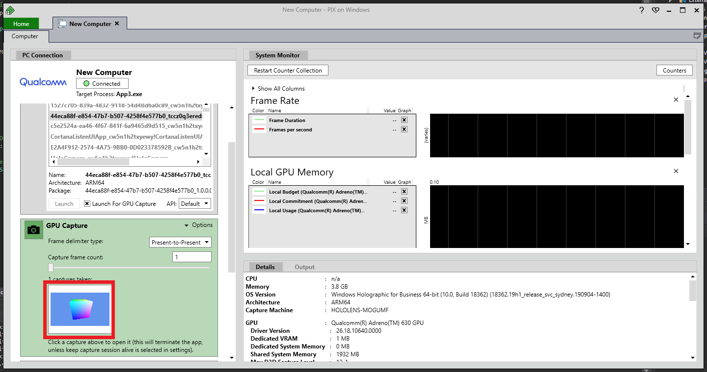
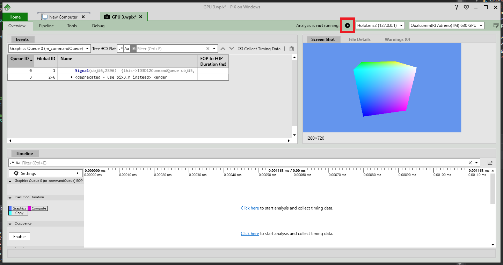

# Installing PIX for HoloLens 2

[PIX](https://devblogs.microsoft.com/pix) is a performance tuning and debugging tool for DirectX 12 applications on Windows. 

## Setup

1. Grab the latest PIX [release]( https://devblogs.microsoft.com/pix/download) from your host PC and connect your HoloLens 2 to your PC via a USB cable.

2. If your HoloLens 2 is on a [Windows Insider build](https://insider.windows.com) or has a configuration that breaks PIX,  [re-flash your device](https://docs.microsoft.com/en-us/hololens/hololens-recovery) to erase all data.

3. Enable **Developer Mode** and **Device Portal**:

* Open **Settings** from Shell:

* Select **Update & Security**:

* Click **For Developers**:

* Turn on **Use Developer Features** and **Enable Device Portal**

* With the device still connected, awake, and with the user logged in, launch Visual Studio.

> [!IMPORTANT]
> Make sure your device isn't in standby mode or asleep. If you're having trouble with this step, refer to the [Windows Device Portal instructions](https://docs.microsoft.com/windows/mixed-reality/develop/platform-capabilities-and-apis/using-the-windows-device-portal).

## Preparing for deployment

1. In Visual Studio, set **ARM64** as the platform and **Device** as the device:

2. When Visual Studio prompts you for a **PIN** from the device:

* Select **Settings** from Shell
* Select **Update & Security**
* Click **For Developers** and press Pair under **Device Discovery** 

* Enter the generated PIN number in Visual Studio

3. Visual Studio will deploy the app to the connected HoloLens 2, which may take a few minutes depending on the app.

## Launching PIX

First, use Device Portal to verify the app is not running on the HoloLens 2. Then, launch PIX, connect to your device, and click **Home**:

* Select **Connect** from the left-side menu:

2. From the **Computer** tab, click **Add** and enter the following credentials:
    * Alias: Up to user’s discretion
    * Host Name or IP Address: 127.0.0.1

3. Click **Connect** in the lower-right of the **Computer** tab:

> [!NOTE]
> The first connection is always slower because binaries are being copied.

4. When PIX has connected to the HoloLens 2, find your app in the **Select Target Process** section in the Launch UWP tab, and click **Launch**:

## GPU capture

1. Start the GPU capture by clicking **Photo** in the **GPU Capture** section:

2. Open the capture for analysis by clicking on the generated screen shot in the **GPU Capture** panel:

3. Press **Start** to begin the analysis:

> [!IMPORTANT]
> If you collect timing data after taking a GPU capture, you'll be required to reboot the headset. This is a one-time restart of the device and is required for timing data collection.

PIX is now ready for use!

## See also
* [PIX homepage](https://devblogs.microsoft.com/pix)