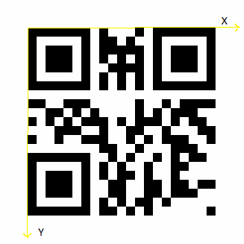

# QR code tracking

HoloLens 2 can detect QR codes in the environment around the headset, establishing a coordinate system at each code's real-world location. Once you enable your device's webcam, you'll be able to recognize QR codes in the latest versions of your Unreal or Unity projects. Before going to production, we recommend following the [best practices](#best-practices-for-qr-code-detection) we've laid at the end of the article.

## Device support

<table>
<tr>
<th>Feature</th><th style="width:150px"> <a href="/hololens/hololens1-hardware">HoloLens (first gen)</a></th><th style="width:150px">HoloLens 2</th><th style="width:150px"> <a href="../../discover/immersive-headset-hardware-details.md">Immersive headsets</a></th>
</tr><tr>
<td> QR code detection</td><td style="text-align: center;">️</td><td style="text-align: center;"> ✔️</td><td style="text-align: center;">✔️</td>
</tr>
</table>

>[!NOTE]
>QR code tracking with immersive Windows Mixed Reality headsets on desktop PCs is supported on Windows 10 Version 2004 and higher. Use the Microsoft.MixedReality.QRCodeWatcher.IsSupported() API to determine whether the feature is supported on the current device.

## Getting the QR package

You can download the NuGet package for QR code detection [here](https://nuget.org/Packages/Microsoft.MixedReality.QR).

## Using OpenXR

When using the OpenXR plugin, grab the [`SpatialGraphNodeId` from the QR API](../platform-capabilities-and-apis/qr-code-tracking.md#qr-api-reference) and use the `Microsoft.MixedReality.OpenXR.SpatialGraphNode` API to locate the QR code.

For reference, we have a [QR tracking sample project on GitHub](https://github.com/yl-msft/QRTracking) with more a detailed usage explanation for the [`SpatialGraphNode` API](https://github.com/yl-msft/QRTracking/blob/main/SampleQRCodes/Assets/Scripts/SpatialGraphNodeTracker.cs).

## Detecting QR codes

### Adding the webcam capability

You'll need to add the capability `webcam` to your manifest to detect QR codes. This capability is required as the data within detected codes in the user's environment may contain sensitive information.

Permission can be requested by calling `QRCodeWatcher.RequestAccessAsync()`:

_C#:_
```cs
await QRCodeWatcher.RequestAccessAsync();
```

_C++:_
```cpp
co_await QRCodeWatcher.RequestAccessAsync();
```

Permission must be requested before you construct a QRCodeWatcher object.

While QR code detection requires the `webcam` capability, the detection occurs using the device's tracking cameras. This provides a wider detection FOV and better battery life compared to detection with the device's photo/video (PV) camera.

### Detecting QR codes in Unity

You can use the QR code detection API in Unity without importing MRTK by installing the NuGet package using [NuGet for Unity](https://github.com/GlitchEnzo/NuGetForUnity). If you want to get a feel for how it works, download the [sample Unity app](https://github.com/chgatla-microsoft/QRTracking/tree/master/SampleQRCodes). The sample app has examples for displaying a holographic square over QR codes and associated data such as GUID, physical size, timestamp, and decoded data.

### Detecting QR codes in C++

```cpp
using namespace winrt::Windows::Foundation;
using namespace winrt::Microsoft::MixedReality::QR;

class QRListHelper
{
public:
    QRListHelper(MyApplication& app) :
        m_app(app)
    {}

    IAsyncAction SetUpQRCodes()
    {
        if (QRCodeWatcher::IsSupported())
        {
            QRCodeWatcherAccessStatus status = co_await QRCodeWatcher::RequestAccessAsync();
            InitializeQR(status);
        }
    }

private:
    void OnAddedQRCode(const IInspectable&, const QRCodeAddedEventArgs& args)
    {
        m_app.OnAddedQRCode(args);
    }

    void OnUpdatedQRCode(const IInspectable&, const QRCodeUpdatedEventArgs& args)
    {
        m_app.OnUpdatedQRCode(args);
    }

    void OnEnumerationComplete(const IInspectable&, const IInspectable&)
    {
        m_app.OnEnumerationComplete();
    }

    MyApplication& m_app;
    QRCodeWatcher m_qrWatcher{ nullptr };

    void InitializeQR(QRCodeWatcherAccessStatus status)
    {
        if (status == QRCodeWatcherAccessStatus::Allowed)
        {
            m_qrWatcher = QRCodeWatcher();
            m_qrWatcher.Added({ this, &QRListHelper::OnAddedQRCode });
            m_qrWatcher.Updated({ this, &QRListHelper::OnUpdatedQRCode });
            m_qrWatcher.EnumerationCompleted({ this, &QRListHelper::OnEnumerationComplete });
            m_qrWatcher.Start();
        }
        else
        {
            // Permission denied by system or user
            // Handle the failures
        }
    }
};
```

## Getting the coordinate system for a QR code

Each detected QR code exposes a [spatial coordinate system](../../design/coordinate-systems.md) aligned with the QR code at the top-left corner of the fast detection square in the top left:  

 

When directly using the QR SDK, the Z-axis is pointing into the paper (not shown) - when converted into Unity coordinates, the Z-axis points out of the paper and is left-handed.

A QR code's SpatialCoordinateSystem aligns as shown. You can get the coordinate system from the platform by calling <a href="/uwp/api/windows.perception.spatial.preview.spatialgraphinteroppreview.createcoordinatesystemfornode" target="_blank">SpatialGraphInteropPreview::CreateCoordinateSystemForNode</a> and passing in the code's SpatialGraphNodeId.

The C++ code below shows how to create a rectangle and place it using the QR code's coordinate system:

```cpp
// Creates a 2D rectangle in the x-y plane, with the specified properties.
std::vector<float3> MyApplication::CreateRectangle(float width, float height)
{
    std::vector<float3> vertices(4);

    vertices[0] = { 0, 0, 0 };
    vertices[1] = { width, 0, 0 };
    vertices[2] = { width, height, 0 };
    vertices[3] = { 0, height, 0 };

    return vertices;
}
```

You can use the physical size to create the QR rectangle:

```cpp
std::vector<float3> qrVertices = CreateRectangle(code.PhysicalSideLength(), code.PhysicalSideLength()); 
```

The coordinate system can be used to draw the QR code or attach holograms to the location:

```cpp
using namespace winrt::Windows::Perception::Spatial;
using namespace winrt::Windows::Perception::Spatial::Preview;
SpatialCoordinateSystem qrCoordinateSystem = SpatialGraphInteropPreview::CreateCoordinateSystemForNode(code.SpatialGraphNodeId());
```

Altogether, your *QRCodeAddedHandler* may look something like this:

```cpp
void MyApplication::OnAddedQRCode(const QRCodeAddedEventArgs& args)
{
    QRCode code = args.Code();
    std::vector<float3> qrVertices = CreateRectangle(code.PhysicalSideLength(), code.PhysicalSideLength());
    std::vector<unsigned short> qrCodeIndices = TriangulatePoints(qrVertices);
    XMFLOAT3 qrAreaColor = XMFLOAT3(DirectX::Colors::Aqua);

    SpatialCoordinateSystem qrCoordinateSystem = SpatialGraphInteropPreview::CreateCoordinateSystemForNode(code.SpatialGraphNodeId());
    std::shared_ptr<SceneObject> m_qrShape =
        std::make_shared<SceneObject>(
            m_deviceResources,
            qrVertices,
            qrCodeIndices,
            qrAreaColor,
            qrCoordinateSystem);

    m_sceneController->AddSceneObject(m_qrShape);
}
```

## Best practices for QR code detection

### Quiet zones around QR Codes

To be read correctly, QR codes require a margin around all sides of the code. This margin must not contain any printed content and should be four modules (a single black square in the code) wide. 

The [QR spec](https://www.qrcode.com/en/howto/code.html) contains more information about quiet zones.

### Lighting and backdrop
QR code detection quality is susceptible to varying illumination and backdrop. 

In a scene with bright lighting, print a code that is black on a gray background. Otherwise, print a black QR code on a white background.

If the backdrop to the code is dark, try a black on gray code if your detection rate is low. If the backdrop is relatively light, a regular code should work fine.

### Size of QR codes
Windows Mixed Reality devices don't work with QR codes with sides smaller than 5 cm each.

For QR codes between 5 cm and 10-cm length sides, you must be fairly close to detect the code. It will also take longer to detect codes at this size. 

The exact time to detect codes depends not only on the size of the QR codes, but how far you're away from the code. Moving closer to the code will help offset issues with size.

### Distance and angular position from the QR code
The tracking cameras can only detect a certain level of detail. For small codes - < 10 cm along the sides - you must be fairly close. For a version 1 QR code varying from 10 cm to 25 cm wide, the minimum detection distance ranges from 0.15 meters to 0.5 meters. 

The detection distance for size increases linearly, but also depends on QR version or module size. The higher the version, the smaller the modules, which can only be detected from a closer position. You can also try micro QR codes if you want the distance of detection to be longer. QR detection works with a range of angles += 45 deg to ensure we have proper resolution to detect the code.

> [!IMPORTANT]
> Always make sure you have enough contrast and a proper border.

### QR codes with logos
QR codes with logos haven't been tested and are currently unsupported.

### Managing QR code data
Windows Mixed Reality devices detect QR codes at the system level in the driver. When the device is rebooted, the detected QR codes are gone and will be redetected as new objects next time.

We recommend configuring your app to ignore QR codes older than a specific timestamp. Currently, the API doesn't support clearing QR code history.

### QR code placement in a space
For recommendations on where and how to place QR codes, refer to [Environment considerations for HoloLens](/hololens/hololens-environment-considerations).

## QR API reference

```cs
namespace Microsoft.MixedReality.QR
{
    /// <summary>
    /// Represents a detected QR code.
    /// </remarks>
    public class QRCode
    {
        /// <summary>
        /// Unique id that identifies this QR code for this session.
        /// </summary>
        public Guid Id { get; }

        /// <summary>
        /// Spatial graph node id for this QR code to create a coordinate system.
        /// </summary>
        public Guid SpatialGraphNodeId { get; }

        /// <summary>
        /// Version of this QR code. Version 1-40 are regular QR codes and M1 to M4 are Micro QR code formats 1-4.
        /// </summary>
        public QRVersion Version { get; }

        /// <summary>
        /// Physical width and height of this QR code in meters.
        /// </summary>
        public float PhysicalSideLength { get; }

        /// <summary>
        /// Decoded QR code data.
        /// </summary>
        public String Data { get; }

        /// <summary>
        /// Size of the RawData of this QR code.
        /// </summary>
        public UInt32 RawDataSize { get; }

        /// <summary>
        /// Gets the error-corrected raw data bytes.
        /// Used when the platform is unable to decode the code's format,
        /// allowing your app to decode as needed.
        /// </summary>
        public void GetRawData(byte[] buffer);

        /// <summary>
        /// The last detected time in 100ns QPC ticks.
        /// </summary>
        public System.TimeSpan SystemRelativeLastDetectedTime { get; }

        /// <summary>
        /// The last detected time.
        /// </summary>
        public System.DateTimeOffset LastDetectedTime { get; }
    }

    /// <summary>
    /// Event arguments for a QRCodeWatcher's Added event.
    /// </summary>
    public class QRCodeAddedEventArgs
    {
        /// <summary>
        /// Gets the QR Code that was added
        /// </summary>
        public QRCode Code { get; }
    }

    /// <summary>
    /// Event arguments for a QRCodeWatcher's Removed event.
    /// </summary>
    public class QRCodeRemovedEventArgs
    {
        /// <summary>
        /// Gets the QR Code that was removed.
        /// </summary>
        public QRCode Code { get; }
    }

    /// <summary>
    /// Event arguments for a QRCodeWatcher's Updated event.
    /// </summary>
    public class QRCodeUpdatedEventArgs
    {
        /// <summary>
        /// Gets the QR Code that was updated.
        /// </summary>
        public QRCode Code { get; }
    }

    /// <summary>
    /// Represents the status of an access request for QR code detection.
    /// </summary>
    public enum QRCodeWatcherAccessStatus
    {
        /// <summary>
        /// The system has denied permission for the app to detect QR codes.
        /// </summary>
        DeniedBySystem = 0,
        /// <summary>
        /// The app has not declared the webcam capability in its manifest.
        /// </summary>
        NotDeclaredByApp = 1,
        /// <summary>
        /// The user has denied permission for the app to detect QR codes.
        /// </summary>
        DeniedByUser = 2,
        /// <summary>
        /// A user prompt is required to get permission to detect QR codes.
        /// </summary>
        UserPromptRequired = 3,
        /// <summary>
        /// The user has given permission to detect QR codes.
        /// </summary>
        Allowed = 4,
    }

    /// <summary>
    /// Detects QR codes in the user's environment.
    /// </summary>
    public class QRCodeWatcher
    {
        /// <summary>
        /// Gets whether QR code detection is supported on the current device.
        /// </summary>
        public static bool IsSupported();

        /// <summary>
        /// Request user consent before using QR code detection.
        /// </summary>
        public static IAsyncOperation<QRCodeWatcherAccessStatus> RequestAccessAsync();

        /// <summary>
        /// Constructs a new QRCodeWatcher.
        /// </summary>
        public QRCodeWatcher();

        /// <summary>
        /// Starts detecting QR codes.
        /// </summary>
        /// <remarks>
        /// Start should only be called once RequestAccessAsync has succeeded.
        /// Start should not be called if QR code detection is not supported.
        /// Check that IsSupported returns true before calling Start.
        /// </remarks>
        public void Start();

        /// <summary>
        /// Stops detecting QR codes.
        /// </summary>
        public void Stop();

        /// <summary>
        /// Get the list of QR codes detected.
        /// </summary>
        /// <remarks>
        /// </remarks>
        public IList<QRCode> GetList();

        /// <summary>
        /// Event representing the addition of a QR Code.
        /// </summary>
        public event EventHandler<QRCodeAddedEventArgs> Added;

        /// <summary>
        /// Event representing the removal of a QR Code.
        /// </summary>
        public event EventHandler<QRCodeRemovedEventArgs> Removed;

        /// <summary>
        /// Event representing the update of a QR Code.
        /// </summary>
        public event EventHandler<QRCodeUpdatedEventArgs> Updated;

        /// <summary>
        /// Event representing the enumeration of QR Codes completing after a Start call.
        /// </summary>
        public event EventHandler<Object> EnumerationCompleted;
    }

    /// <summary>
    /// Version info for QR codes, including Micro QR codes.
    /// </summary>
    public enum QRVersion
    {
        QR1 = 1,
        QR2 = 2,
        QR3 = 3,
        QR4 = 4,
        QR5 = 5,
        QR6 = 6,
        QR7 = 7,
        QR8 = 8,
        QR9 = 9,
        QR10 = 10,
        QR11 = 11,
        QR12 = 12,
        QR13 = 13,
        QR14 = 14,
        QR15 = 15,
        QR16 = 16,
        QR17 = 17,
        QR18 = 18,
        QR19 = 19,
        QR20 = 20,
        QR21 = 21,
        QR22 = 22,
        QR23 = 23,
        QR24 = 24,
        QR25 = 25,
        QR26 = 26,
        QR27 = 27,
        QR28 = 28,
        QR29 = 29,
        QR30 = 30,
        QR31 = 31,
        QR32 = 32,
        QR33 = 33,
        QR34 = 34,
        QR35 = 35,
        QR36 = 36,
        QR37 = 37,
        QR38 = 38,
        QR39 = 39,
        QR40 = 40,
        MicroQRM1 = 41,
        MicroQRM2 = 42,
        MicroQRM3 = 43,
        MicroQRM4 = 44,
    }
}
```

## See also
* [Coordinate systems](../../design/coordinate-systems.md)
* <a href="/azure/spatial-anchors/overview" target="_blank">Azure Spatial Anchors</a>