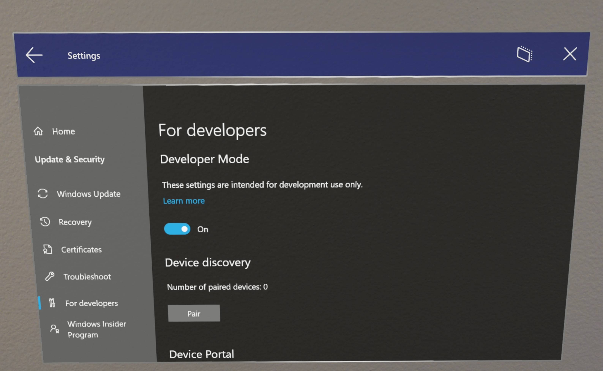
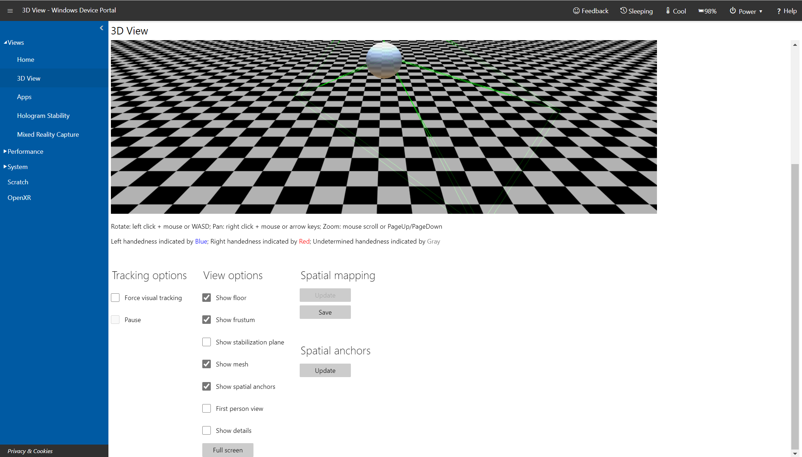
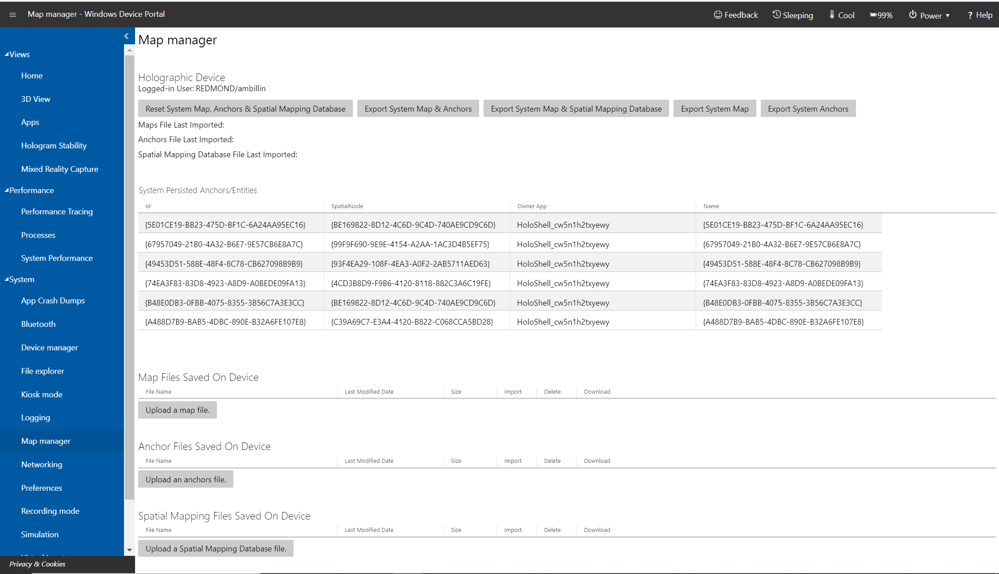
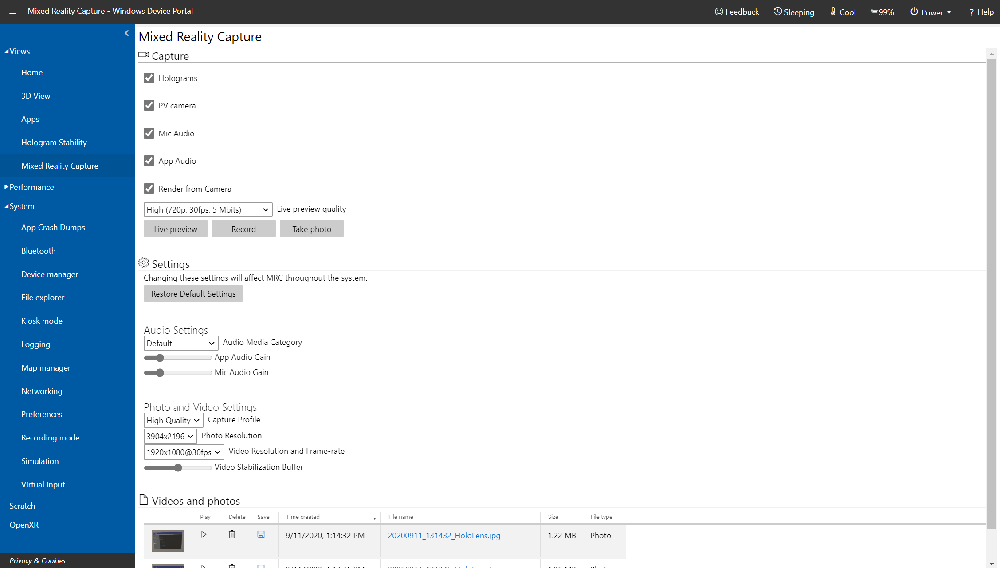
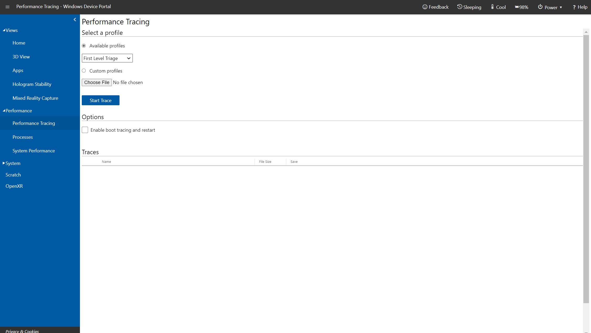
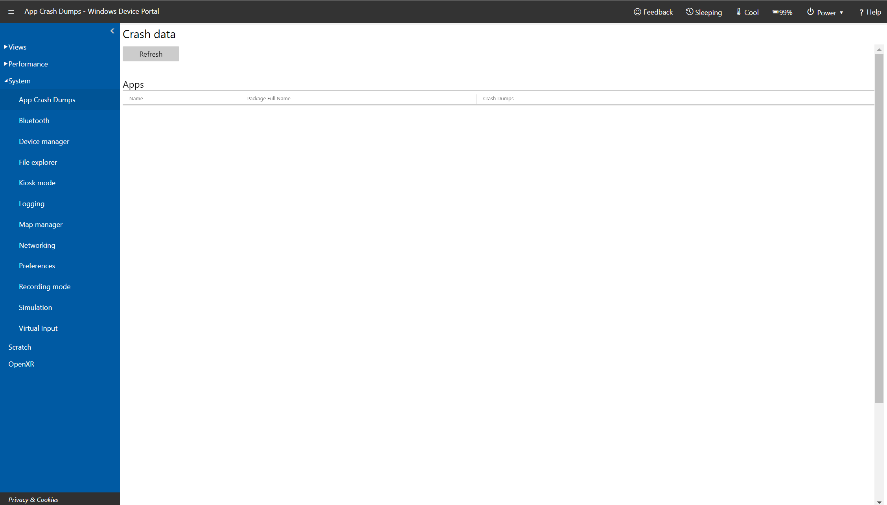
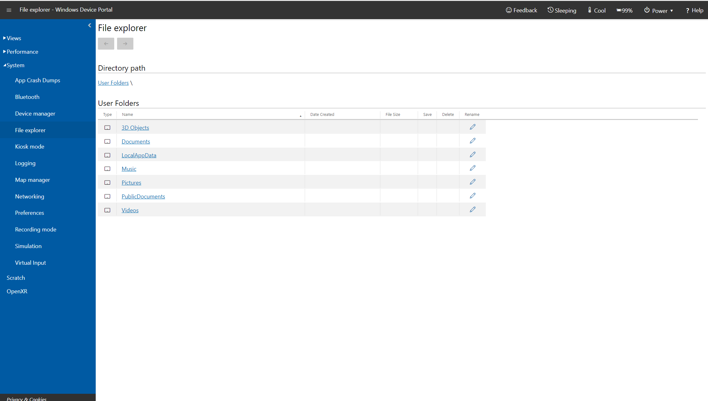
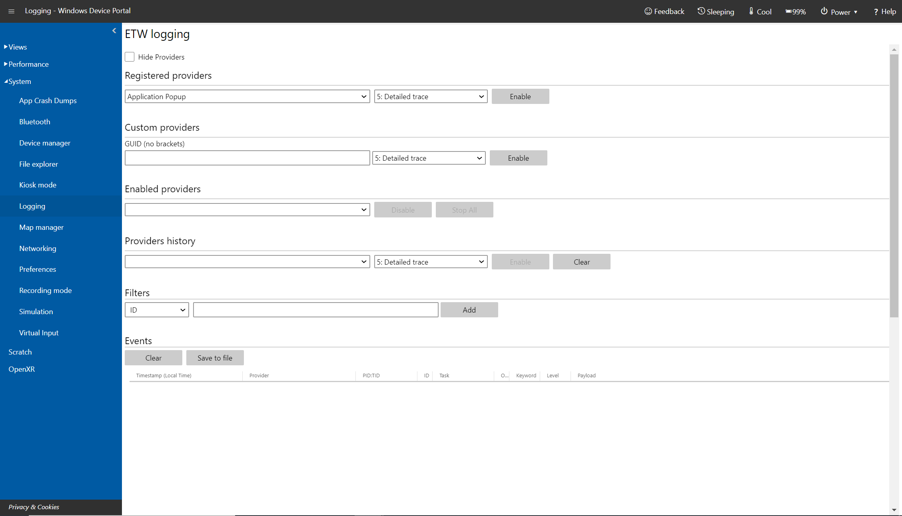
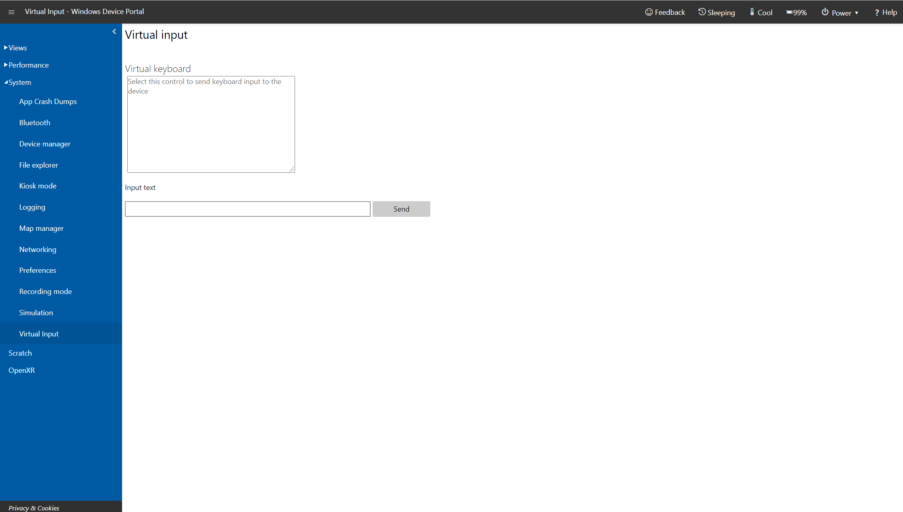

# Using the Windows Device Portal

<table>
<tr>
<th>Feature</th><th style="width:150px"><a href="/hololens/hololens1-hardware">HoloLens (1st gen)</a></th><th style="width:150px">HoloLens 2</th><th style="width:150px">
</tr><tr>
<td> Windows Device Portal</td><td style="text-align: center;"> ✔️</td><td style="text-align: center;"> ✔️</td><td style="text-align: center;"></td>
</tr>
</table>

The Windows Device Portal for HoloLens lets you configure and manage your device remotely over Wi-Fi or USB. The Device Portal is a web server on your HoloLens that you can connect to from a web browser on your PC. The Device Portal includes many tools that will help you manage your HoloLens and debug and optimize your apps.

This documentation is specifically about the Windows Device Portal for HoloLens. To use the Windows Device portal for desktop (including for Windows Mixed Reality), see [Windows Device Portal overview](/windows/uwp/debug-test-perf/device-portal)

## Setting up HoloLens to use Windows Device Portal

1. Power on your HoloLens and put on the device.
2. Use the [Start gesture](/hololens/hololens2-basic-usage#start-gesture) for HoloLens2 or [Bloom](/hololens/hololens1-basic-usage#open-the-start-menu-with-bloom) on HoloLens (1st Gen) to launch the main menu. 
3. Gaze at the **Settings** tile and do an [air-tap](/hololens/hololens1-basic-usage#select-holograms-with-gaze-and-air-tap) gesture on HoloLens (1st Gen). You can also select it on HoloLens 2 by [touching it or using a Hand ray](/hololens/hololens2-basic-usage). 
4. Select the **Update** menu item.
5. Select the **For developers** menu item.
6. Enable **Developer Mode**.

> [!IMPORTANT]
> If you're in multi-user and not an admin, the ability to enter Developer Mode may be grayed out. Please ensure that you are an **[admin on the device](/hololens/security-adminless-os)**.

7. [Scroll down](../../design/gaze-and-commit.md#composite-gestures) and enable **Device Portal**.
8. If you're setting up Windows Device Portal so you can deploy apps to this HoloLens over USB or Wi-Fi, select **Pair** to [generate a pairing PIN](using-visual-studio.md). Leave the Settings app at the PIN popup until you enter the PIN into Visual Studio during your first deployment.

## Connecting over Wi-Fi

1. [Connect your HoloLens to Wi-Fi](/hololens/hololens-network).
2. Look up your device's IP address by either:
   * Going to **Settings > Network & Internet > Wi-Fi > Advanced Options**.
   * Going to **Settings > Network & Internet** and selecting **Hardware properties**.

3. From a web browser on your PC, go to https://<YOUR_HOLOLENS_IP_ADDRESS>
   * The browser will display the following message: "There's a problem with this website's security certificate" because the certificate, which is issued to the Device Portal is a test certificate. You can ignore this certificate error for now and continue.

## Connecting over USB

> [!IMPORTANT]
> IpOverUsb is no longer recommended per new browser standards as it requires the use of port 10080. If you still wish to use IpOverUsb, check the 'IP over USB' box during Visual Studio installation, which isn't checked by default. Instead, we recommend connecting with UsbNcm, which is supported by default.

1.  Connect your HoloLens to your PC with a micro-USB cable for HoloLens (1st Gen) or USB-C for HoloLens 2.
2. Find your UsbNcm IP. There are two ways to do this:
  * In the Setting app on the device
    1. Go into the Setting app on the device
    2. Go to "Update & Security" > "For Developers." This is the same place you enabled Device Portal.
    3. At the bottom of the page, copy your Ethernet IP address. This is your UsbNcm IP. 
  * In Device Portal
    1. On your device, open Device Portal using your HoloLens' WiFi address If you don't know your HoloLens' WiFi address, you can use the voice command "What's my IP address?"
    2. Go to System > Networking
    3. On the far right side of the page in the "IP Configuration" panel, locate the section that starts with "Description: UsbNcm Function:
    4. Your UsbNcm IP is the "IPv4 address" line. You can copy the address or just click on the address - it is a hyperlink which will reopen Device Portal using the UsbNcm IP. 
3. If you copied your UsbNcm IP, from a web browser on your PC go to https:// followed by your UsbNcm IP.

### Moving files over USB

You can move files from your PC to your HoloLens without any additional setup.
1. Connect your PC to your HoloLens with a USB cord
2. Drag your files into **PC\\[Your_HoloLens_Device_Name]\Internal Storage** on your desktop
3. Open the **Start Menu** and select **All apps > File Explorer** on your HoloLens

> [!NOTE]
> You may need to select **This device** on the left side of the panel to navigate away from "Recently used" to locate your files. 

## Connecting to an emulator

You can also use the Device Portal with your emulator. To connect to the Device Portal, use the [toolbar](using-the-hololens-emulator.md). Select this icon:
 **Open Device Portal**: Open the Windows Device Portal for the HoloLens OS in the emulator.

## Creating a Username and Password

 
*Set up access to Windows Device Portal*

The first time you connect to the Device Portal on your HoloLens, you'll need to create a username and password.
1. In a web browser on your PC, enter the IP address of the HoloLens. The Setup access page opens.
2. Select or tap **Request pin** and look at the HoloLens display to get the generated PIN.
3. Enter the PIN in the **PIN displayed on your device** textbox.
4. Enter the user name you'll use to connect to the Device Portal. It doesn't need to be a Microsoft Account (MSA) name or a domain name.
5. Enter a password and confirm it. The password must be at least seven characters in length. It doesn't need to be an MSA or domain password.
6. Click **Pair** to connect to Windows Device Portal on the HoloLens.

If you wish to change this username or password at any time, you can repeat this process by visiting the device security page by  navigating to: https://<YOUR_HOLOLENS_IP_ADDRESS>/devicepair.htm.

## Security certificate

If you see a "certificate error" in your browser, you can fix it by creating a trust relationship with the device.

Each HoloLens generates a self-signed certificate for its SSL connection. By default, this certificate is not trusted by your PC's web browser and you may get a "certificate error". You can securely connect to your device by downloading this certificate from your HoloLens over USB or a Wi-Fi network you trust and trusting it on your PC.
1. **Make sure you are on a secure network (USB or a Wi-Fi network you trust).**
2. Download this device's certificate from the "Security" page on the Device Portal.
   * Navigate to: https://<YOUR_HOLOLENS_IP_ADDRESS>/devicepair.htm
   * Open the node for System > Preferences. 
   * Scroll down to Device Security, select the "Download this device's certificate" button.
3. Install the certificate in the "Trusted Root Certification Authorities" store on your PC.
   * From the Windows menu, type: Manage Computer Certificates and start the applet.
   * Expand the **Trusted Root Certification Authority** folder.
   * Select the **Certificates** folder.
   * From the Action menu, select: All Tasks > Import...
   * Complete the Certificate Import Wizard, using the certificate file you downloaded from the Device Portal.
4. Restart the browser.

>[!NOTE]
> This certificate will only be trusted for the device and the user will have to go through the process again if the device is flashed.

## Sideloading applications

### Installing a certificate

1. In Windows Device Portal, navigate to the **Apps** manager page
2. In the Deploy apps section, select **Install Certificate**
3. Under Select certificate file (.cer) used to sign an app package, select Choose File and browse to the certificate associated with the app package that you want to sideload
4. Select **Install** to start the installation

### Installing an app

> [!NOTE]
> In order for an app to install successfully via Device Portal it must be signed by a certificate, this certificate must be installed to the device prior to attempting to install the app. See the [previous section](#installing-a-certificate) for instructions.

1. When you've [created an app package from Visual Studio](using-visual-studio.md), you can remotely install it onto your device from the generated files:

2. In Windows Device Portal, navigate to the **Apps** manager page
3. In the **Deploy** apps section, select **Local Storage**
4. Under Select the application package, select Choose File and browse to the app package that you want to sideload
5. Check the respective boxes if you want to install optional or framework packages along with the app installation and select **Next**:

6. Select **Install** to start the installation
 
 

Once the installation is complete, go back to the **All apps** page on your HoloLens and launch your newly installed application!

## Device Portal Pages

### Home

 
*Windows Device Portal home page on Microsoft HoloLens*

Your Device Portal session starts at the Home page. Access other pages from the navigation bar along the left side of the home page.

The toolbar at the top of the page provides access to commonly used status and features.
* **Online**: Indicates whether the device is connected to Wi-Fi.
* **Shutdown**: Turns off the device.
* **Restart**: Cycles power on the device.
* **Security**: Opens the Device Security page.
* **Cool**: Indicates the temperature of the device.
* **A/C**: Indicates whether the device is plugged in and charging.
* **Help**: Opens the REST interface documentation page.

The home page shows the following info:
* **Device Status:** monitors the health of your device and reports critical errors.
* **Windows information:** shows the name of the HoloLens and the currently installed version of Windows.
* **Preferences** section contains the following settings:
   * **IPD**: Sets the interpupillary distance (IPD) - the distance, in millimeters, between the center of the user's pupils when looking straight ahead. The setting takes effect immediately. The default value was calculated automatically when you set up your device.
   * **Device name**: Assign a name to the HoloLens. eboot the device after changing this value for it to take effect. After clicking **Save**, a dialog will ask if you want to reboot the device immediately or reboot later.
   * **Sleep settings**: Sets the length of time to wait before the device goes to sleep when it's plugged in and when it's on battery.

### 3D View

 
*3D View page in Windows Device Portal on Microsoft HoloLens*

Use the 3D View page to see how HoloLens interprets your surroundings. Navigate the view by using the mouse:
* Rotate: left click + mouse;
* Pan: right click + mouse;
* Zoom: mouse scroll.
* **Tracking options**
   * Turn on continuous visual tracking by checking **Force visual tracking**. 
   * **Pause** stops visual tracking.
* **View options**: Set options on the 3D view:
  * **Tracking**: Indicates whether visual tracking is active.
  * **Show floor**: Displays a checkered floor plane.
  * **Show frustum**: Displays the view frustum.
  * **Show stabilization plane**: Displays the plane that HoloLens uses for stabilizing motion.
  * **Show mesh**: Displays the spatial mapping mesh that represents your surroundings.
  * **Show spatial anchors**: Displays spatial anchors for the active app. Select the Update button to get and refresh the anchors.
  * **Show details**: Displays hand positions, head rotation quaternions, and the device origin vector as they change in real time.
  * **Full screen button**: Shows the 3D View in full screen mode. Press ESC to exit full screen view.
* **Surface reconstruction**: Select or tap **Update** to display the latest spatial mapping mesh from the device. A full pass may take some time to complete (up to a few seconds). The mesh doesn't update automatically in the 3D view, and you must manually select **Update** to get the latest mesh from the device. Select **Save** to save the current spatial mapping mesh as an obj file on your PC.
* **Spatial anchors**: Select Update to display or update the spatial anchors for the active app.

### Map Manager

Map Manager allows you to share maps across devices, which can be used to set up shared experiences for Location-Based Entertainment customers. The tool allows you to import and export system maps and anchors.  

To access the Map Manager, log into the Device Portal and select **Mixed Reality -> Map Manager**: 

*Map Manager page in Windows Device Portal on Microsoft HoloLens*

#### Exporting and importing maps

To export maps, select **Export System Map & Anchors**. This could take a while so be prepared to wait for 30-60 seconds while the map is exported. Once it’s complete, the file will be downloaded in your browser.  

To import maps and anchors, select **Upload a map file** and **Upload an anchor file** respectively and select a map or anchor file that you've already exported. The uploaded map or anchor file can come from any other HoloLens device. 

> [!NOTE]
> On HoloLens, it's also possible to import and export the spatial mapping data base. However, this doesn't work on non-HoloLens devices.  

### Mixed Reality Capture

 
*Mixed Reality Capture page in Windows Device Portal on Microsoft HoloLens*

Use the Mixed Reality Capture page to save media streams from the HoloLens.
* **Capture Settings**: Control the media streams that are captured by checking the following settings:
  * **Holograms**: Captures the holographic content in the video stream. Holograms are rendered in mono, not stereo.
  * **PV camera**: Captures the video stream from the photo/video camera.
  * **Mic Audio**: Captures audio from the microphone array.
  * **App Audio**: Captures audio from the currently running app.
  * **Render from Camera**: Aligns the capture to be from the perspective of the photo/video camera, if [supported by the running app](mixed-reality-capture-for-developers.md#render-from-the-pv-camera-opt-in) (HoloLens 2 only).
  * **Live preview quality**: Select the screen resolution, frame rate, and streaming rate for the live preview.
* **Audio Settings** (HoloLens 2 only):
  * **Audio Media Category**: Select the category is used when processing the microphone. **Default**  will include some of the environment, while **Communications** applies background noise cancellation.
  * **App Audio Gain**: The gain applied to app audio's volume.
  * **Mic Audio Gain**: The gain applied to mic audio's volume.
* **Photo and Video Settings** (HoloLens 2, version 2004 or later):
  * **Capture Profile**: Select the profile used when taking photos and videos. The profile determines which resolutions and frame-rates are available.
  * **Photo Resolution**: The resolution the photo will be taken with.
  * **Video Resolution and Frame-rate**: The resolution and frame-rate the video will be taken with.
  * **Video Stabilization Buffer**: The buffer size used when taking a video. The higher the value, the better it can compensate for quick movements.
* Select or tap the **Live preview** button to show the capture stream. **Stop live preview** stops the capture stream.
* Select or tap **Record** to start recording the mixed-reality stream, using the specified settings. **Stop recording** ends the recording and saves it.
* Select or tap **Take photo** to take a still image from the capture stream.
* Select or tap **Restore Default Settings** to restore the default settings for audio, photo, and video settings.
* **Videos and photos**: Shows a list of video and photo captures taken on the device.

All settings on this page apply to captures taken using Windows Device Portal. Some additionally apply to System MRC, including start menu, hardware buttons, global voice commands, Miracast, and custom MRC Recorders.

|  Setting  |  Applies to System MRC  |  Applies to Custom MRC Recorders |
|----------|----------|----------|
|  Holograms  |  No  |  No |
|  PV camera  |  No  |  No |
|  Mic Audio  |  No  |  No |
|  App Audio  |  No  |  No |
|  Render from Camera  |  Yes    |  Yes (can be overridden) |
|  Live preview quality  |  No  |  No |
|  Audio Media Category  |  Yes  |  No |
|  App Audio Gain  |  Yes  |  Yes (can be overridden) |
|  Mic Audio Gain  |  Yes  |  Yes (can be overridden) |
|  Capture Profile  |  Yes  |  No |
|  Photo Resolution  |  Yes  |  No |
|  Video Resolution and Frame-rate  |  Yes  |  No |
|  Video Stabilization Buffer  |  Yes  |  Yes (can be overridden) |

> [!NOTE]
> There are [limitations to simultaneous MRC](mixed-reality-capture-for-developers.md#simultaneous-mrc-limitations):
> * If an app tries to access the photo/video camera while Windows Device Portal is recording a video, the video recording will stop.
>   * HoloLens 2 will not stop recording video if the app accesses the photo/video camera with SharedReadOnly mode.
> * If an app is actively using the photo/video camera, Windows Device Portal is able to take a photo or record a video.
> * Live streaming:
>   * HoloLens (1st gen) prevents an app from accessing the photo/video camera while live streaming from Windows Device Portal.
>   * HoloLens (1st gen) will fail to live stream if an app is actively using the photo/video camera.
>   * HoloLens 2 automatically stops live streaming when an app tries to access the photo/video camera in ExclusiveControl mode.
>   * HoloLens 2 is able to start a live stream while an app is actively using the PV camera.

### Performance Tracing

 
*Performance Tracing page in Windows Device Portal on Microsoft HoloLens*

Capture [Windows Performance Recorder](/previous-versions/windows/it-pro/windows-8.1-and-8/hh448205(v=win.10)) (WPR) traces from your HoloLens.
* **Available profiles**: Select the WPR profile from the dropdown, and select or tap **Start** to start tracing.
* **Custom profiles**: Select or tap **Browse** to choose a WPR profile from your PC. Select or tap **Upload and start** to start tracing.

To stop the trace, select the stop link. Stay on this page until the trace file has completed downloading.

Captured ETL files can be opened for analysis in [Windows Performance Analyzer](/previous-versions/windows/it-pro/windows-8.1-and-8/hh448170(v=win.10)).

### Processes

 
*Processes page in Windows Device Portal on Microsoft HoloLens*

Shows details about currently running processes. This includes both apps and system processes.

### System Performance

 
*System Performance page in Windows Device Portal on Microsoft HoloLens*

Shows real-time graphs of system diagnostic info, like power usage, frame rate, and CPU load.

These are the available metrics:
* **SoC power**: Instantaneous system-on-chip power usage, averaged over one minute
* **System power**: Instantaneous system power usage, averaged over one minute
* **Frame rate**: Frames per second, missed VBlanks per second, and consecutive missed VBlanks
* **GPU**: GPU engine usage, percent of total available
* **CPU**: percent of total available
* **I/O**: Reads and writes
* **Network**: Received and sent
* **Memory**: Total, in use, committed, paged, and non-paged

### Apps

 
*Apps page in Windows Device Portal on Microsoft HoloLens*

Manages the apps that are installed on the HoloLens.
* **Installed apps**: Remove and start apps.
* **Running apps**: Lists apps that are running currently.
* **Install app**: Select app packages for installation from a folder on your computer/network.
* **Dependency**: Add dependencies for the app you're going to install.
* **Deploy**: Deploy the selected app + dependencies to the HoloLens.

### App Crash Dumps

 
*App Crash Dumps page in Windows Device Portal on Microsoft HoloLens*

This page allows you to collect crash dumps for your side-loaded apps. Check the **Crash Dumps Enabled** checkbox for each app for which you want to collect crash dumps. Return to this page to collect crash dumps. Dump files can be [opened in Visual Studio for debugging](/previous-versions/visualstudio/visual-studio-2015/debugger/using-dump-files).

### File Explorer

 
*File Explorer page in Windows Device Portal on Microsoft HoloLens*

Use the file explorer to browse, upload, and download files. You can work with files in the Documents folder, Pictures folder, and in the local storage folders for apps that you deployed from Visual Studio or the Device Portal.

### Kiosk Mode

>[!NOTE]
>Kiosk mode is only available with the [Microsoft HoloLens Commercial Suite](/hololens/hololens-commercial-features).

Check the [Set up HoloLens in kiosk mode](/hololens/hololens-kiosk#set-up-kiosk-mode-using-the-windows-device-portal-windows-10-version-1607-and-version-1803) article in Windows IT Pro Center for up-to-date instructions on enabling kiosk mode via Windows Device Portal.

### Logging

 
*Logging page in Windows Device Portal on Microsoft HoloLens*

Manages real-time Event Tracing for Windows (ETW) on the HoloLens.

Check **Hide providers** to show the **Events** list only.
* **Registered providers**: Select the ETW provider and the tracing level. Tracing level is one of these values:
   1. Abnormal exit or termination
   2. Severe errors
   3. Warnings
   4. Non-error warnings

Select or tap **Enable** to start tracing. The provider is added to the **Enabled Providers** dropdown.
* **Custom providers**: Select a custom ETW provider and the tracing level. Identify the provider by its GUID. Don't include brackets in the GUID.
* **Enabled providers**: Lists the enabled providers. Select a provider from the dropdown and click or tap **Disable** to stop tracing. Click or tap **Stop all** to suspend all tracing.
* **Providers history**: Shows the ETW providers that were enabled during the current session. Click or tap **Enable** to activate a provider that was disabled. Click or tap **Clear** to clear the history.
* **Events**: Lists ETW events from the selected providers in table format. This table is updated in real time. Beneath the table, click the **Clear** button to delete all ETW events from the table. This doesn't disable any providers. You can click **Save to file** to export the currently collected ETW events to a CSV file locally.
* **Filters**: Allow you to filter the ETW events collected by ID, Keyword, Level, Provider Name, Task Name, or Text. You can combine several criteria together:
   1. For criteria applying to the same property, events that can satisfy any one of these criteria are shown.
   2. For criteria applying to a different property, events must satisfy all of the criteria

For example, you can specify the criteria *(Task Name contains 'Foo' or 'Bar') AND (Text contains 'error' or 'warning')*

### Simulation

 
*Simulation page in Windows Device Portal on Microsoft HoloLens*

Allows you to record and play back input data for testing.
* **Capture room**: Used to download a simulated room file that contains the spatial mapping mesh for the user's surroundings. Name the room and then click **Capture** to save the data as an .xef file on your PC. This room file can be loaded into the HoloLens emulator.
* **Recording**: Check the streams to record, name the recording, and click or tap **Record** to start recoding. Perform actions with your HoloLens and then click **Stop** to save the data as an .xef file on your PC. This file can be loaded on the HoloLens emulator or device.
  >[!NOTE]
  >The Recording feature is currently only available on the HoloLens 1st gen. Recording is not yet supported on HoloLens 2, but Playback of existing recordings is supported.
* **Playback**: Click or tap **Upload recording** to select a xef file from your PC and send the data to the HoloLens.
* **Control mode**: Select **Default** or **Simulation** from the dropdown, and click or tap the **Set** button to select the mode on the HoloLens. Choosing "Simulation" disables the real sensors on your HoloLens and uses uploaded simulated data instead. If you switch to "Simulation", your HoloLens won't respond to the real user until you switch back to "Default".

### Networking

 
*Networking page in Windows Device Portal on Microsoft HoloLens*

Manages Wi-Fi connections on the HoloLens.
* **WiFi adapters**: Select a Wi-Fi adapter and profile by using the dropdown controls. Click or tap **Connect** to use the selected adapter.
* **Available networks**: Lists the Wi-Fi networks that the HoloLens can connect to. Click or tap **Refresh** to update the list.
* **IP configuration**: Shows the IP address and other details of the network connection.

### Virtual Input

 
*Virtual Input page in Windows Device Portal on Microsoft HoloLens*

Sends keyboard input from the remote machine to the HoloLens.

Click or tap the region under **Virtual keyboard** to enable sending keystrokes to the HoloLens. Type in the **Input text** textbox and click or tap **Send** to send the keystrokes to the active app.

## Device Portal REST APIs

Everything in the device portal is built on top of [REST APIs](device-portal-api-reference.md) that you can optionally use to access the data and control your device programmatically.

## Troubleshooting

### How to fix the "It's lonely here" message

> [!NOTE]
> Going from a HoloLens 2 to HoloLens (1st gen) may cause the pages to become lonely if used on the HoloLens 2 prior to use on the HoloLens (1st gen).

1. Select **Reset layout** from the top-left Menu:

2. Click **Reset layout** under the **Reset workspace** heading. The portal page will automatically refresh and display your content.

