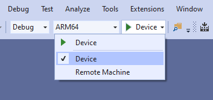

# Using Visual Studio to deploy and debug

Whether you're using DirectX or Unity to develop your mixed reality app, Visual Studio is your go-to tool for debugging and deployment. In this section, you will learn how to:
* Deploy applications to your HoloLens or Windows Mixed Reality immersive headset through Visual Studio.
* Use the HoloLens emulator built in to Visual Studio.
* Debug mixed reality apps.

## Prerequisites

1. See [Install the Tools](../../develop/install-the-tools.md#installation-checklist) for installation instructions.
2. Create a new Universal Windows app project in Visual Studio.  For HoloLens (1st gen), use Visual Studio 2017 or newer.  For HoloLens 2, use Visual Studio 2019 16.2 or newer. C# and C++ are supported. (Or follow the instructions to [create an app in Unity](../../develop/unity/tutorials/holograms-100.md).)

## Enabling Developer Mode

Start by enabling **Developer Mode** on your device, so Visual Studio can connect to it.

### HoloLens

1. Turn on your HoloLens and put on the device.
2. Use the [start gesture](../../design/system-gesture.md) to launch the main menu.
3. Select the **Settings** tile to launch the app in your environment.
4. Select the **Update** menu item.
5. Select the **For developers** menu item.
6. Enable **Developer Mode** to deploy apps from Visual Studio to your HoloLens.
7. Optional: Scroll down and also enable **Device Portal**, which lets you connect to the [Windows Device Portal](using-the-windows-device-portal.md) on your HoloLens from a web browser.

### Windows PC

If you're working with a Windows Mixed Reality headset connected to your PC, you must enable **Developer Mode** on the PC.
1. Go to **Settings**
2. Select **Update and Security**
3. Select **For developers**
4. Enable **Developer Mode**, read the disclaimer for the setting you chose, then select Yes to accept the change.

## Deploying a HoloLens app over Wi-Fi 

Configure your Visual Studio project with the following properties:

1. Select your apps compilation options
    * For Unity projects, choose either **Release** or **Master** 
    * For all other projects, choose **Release**

> [!NOTE]
> You can find complete definitions for each compilation option in [exporting and building Visual Studio solutions](../unity/exporting-and-building-a-unity-visual-studio-solution.md#building-and-deploying-a-unity-visual-studio-solution).

2. Select your build configuration based on your device

[!INCLUDE]

3. Select **Remote Machine** in the deployment target drop-down menu

Next, you need to set your remote connection. For C++ and JavaScript projects, go to **Project > Properties > Configuration Properties > Debugging**. If you're working in a C# project, a dialog should automatically appear.

> [!NOTE]
> If the remote connection dialog doesn't appear in your C# project, you can open it manually from **Properties > Debug**.

1. Enter the IP address of your device in the **Address** or **Machine Name** field. 
    * You can find the IP address on your HoloLens under **Settings > Network & Internet > Advanced Options**
    * We always recommend manually entering your IP address rather than depending on the Auto Detected feature

2. Set the **Authentication Mode** to **Universal (Unencrypted protocol)**

  

3. Build, deploy, and debug your app based on your needs
    * Select **Debug > Start debugging** to deploy your app and start debugging
    * Select **Build > Deploy** to build and deploy without debugging

4. The first time you deploy an app to your HoloLens from your PC, you'll be prompted for a PIN. Follow the **Pairing your device** instructions below.

## Deploying a HoloLens app over USB 

 

>[!VIDEO https://channel9.msdn.com/Shows/Docs-Mixed-Reality/Deploying-your-HoloLens-2-application/player?format=ny]

1. Select your apps compilation options
    * For Unity projects, choose either **Release** or **Master** 
    * For all other projects, choose **Release**

> [!NOTE]
> You can find complete definitions for each compilation option in [exporting and building Visual Studio solutions](../unity/exporting-and-building-a-unity-visual-studio-solution.md#building-and-deploying-a-unity-visual-studio-solution).

2. Select your build configuration based on your device

[!INCLUDE]

3. Select **Device** in the deployment target drop-down menu

4. Build, deploy, and debug your app based on your needs
    * Select **Debug > Start debugging** to deploy your app and start debugging
    * Select **Build > Deploy** to build and deploy without debugging

 

5. The first time you deploy an app to your HoloLens from your PC, you'll be prompted for a PIN. Follow the **Pairing your device** instructions below.

> [!NOTE]
> If you're seeing considerable lag time with your apps deployment over USB, we recommend using the [remote machine instructions](#deploying-a-hololens-app-over-wi-fi) in the previous section.

## Deploying an app to the HoloLens Emulator

1. Make sure you've **[installed either the HoloLens 2 or HoloLens (1st gen) Emulator](../install-the-tools.md#installation-checklist)**
2. Select your build configuration and emulator based on your device

[!INCLUDE]

3. Build, deploy, and debug your app based on your needs
    * Select **Debug > Start debugging** to deploy your app and start debugging
    * Select **Build > Deploy** to build and deploy without debuggingg

## Deploying a VR app to your Local PC 

To use a Windows Mixed Reality immersive headset that connects to your PC or the [Mixed Reality simulator](using-the-windows-mixed-reality-simulator.md):
1. Select an **x86** or **x64** build configuration for your app
2. Select **Local Machine** in the deployment target drop-down menu
3. Build, deploy, and debug your app based on your needs
    * Select **Debug > Start debugging** to deploy your app and start debugging
    * Select **Build > Deploy** to build and deploy without debugging

## Pairing your device

The first time you deploy an app from Visual Studio to your HoloLens, you'll be prompted for a PIN. On the HoloLens, generate a PIN by launching the Settings app, go to **Update > For Developers**, and tap on **Pair**. When the PIN is displayed on your HoloLens, type it into Visual Studio. After pairing is complete, tap **Done** on your HoloLens to dismiss the dialog. This PC is now paired with the HoloLens and you can deploy apps automatically. Repeat these steps for every PC that's used to deploy apps to your HoloLens.

To unpair your HoloLens from all paired computers:
* Launch the **Settings** app, go to **Update > For Developers**, and tap on **Clear**.

## Graphics Debugger for HoloLens (1st gen)

The Visual Studio Graphics Diagnostics tools are helpful when writing and optimizing a Holographic app. See [Visual Studio Graphics Diagnostics on MSDN](/previous-versions/visualstudio/visual-studio-2015/debugger/visual-studio-graphics-diagnostics) for full details.

**To Start the Graphics Debugger**
1. Follow the instructions above to target a device or emulator
2. Go to **Debug > Graphics > Start Diagnostics**
3. The first time you start diagnostics with a HoloLens, you may get an "access denied" error. Reboot your HoloLens to let the updated permissions take effect and try again.

## Profiling

The Visual Studio profiling tools allow you to analyze your app's performance and resource use. This includes tools to optimize CPU, memory, graphics, and network use. See [Run diagnostic tools without debugging on MSDN](/previous-versions/visualstudio/visual-studio-2015/profiling/profiling-tools) for full details.

**To Start the Profiling Tools with HoloLens**
1. Follow the instructions above to target a device or emulator
2. Go to **Debug > Start Diagnostic Tools Without Debugging...**
3. Select the tools you want to use
4. Select **Start**
5. The first time you start diagnostics without debugging with a HoloLens, you may get an "access denied" error. Reboot your HoloLens to let the updated permissions take effect and try again.

## Debugging an installed or running app

You can use Visual Studio to debug an installed Universal Windows app without deploying from a Visual Studio project. This is useful if you want to debug an installed app package or debug an app that's already running.
1. Go to **Debug -> Other Debug Targets -> Debug Installed App Package**
2. Select the **Remote Machine** target for HoloLens or **Local Machine** for immersive headsets.
3. Enter your device’s **IP address**
4. Choose the **Universal** Authentication Mode
5. The window shows both running and inactive apps. Pick the one what you’d like to debug.
6. Choose the type of code to debug (Managed, Native, Mixed)
7. Select **Attach** or **Start**

## Next Development Checkpoint

If you're following the Unity development checkpoint journey we've laid out, you're in the midst of the deployment stage. From here, you can continue to the next topic:

> [!div class="nextstepaction"]
> [Deploying to HoloLens emulator](using-the-hololens-emulator.md)

Or jump directly to adding advanced services:

> [!div class="nextstepaction"]
> [Advanced services](../../develop/unity/unity-development-overview.md#5-adding-services)

You can always go back to the [Unity development checkpoints](../../develop/unity/unity-development-overview.md#4-deploying-to-a-device-or-emulator) at any time.

## See also
* [Install the tools](../install-the-tools.md)
* [Using the HoloLens emulator](using-the-hololens-emulator.md)
* [Deploying and debugging Universal Windows Platform (UWP) apps](/windows/uwp/debug-test-perf/deploying-and-debugging-uwp-apps)
* [Enable your device for development](/windows/uwp/get-started/enable-your-device-for-development)