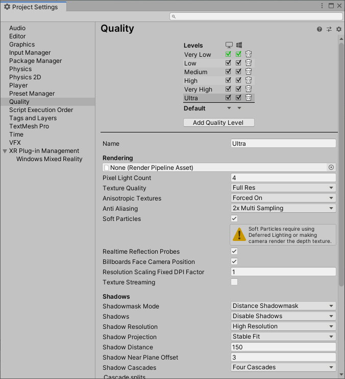
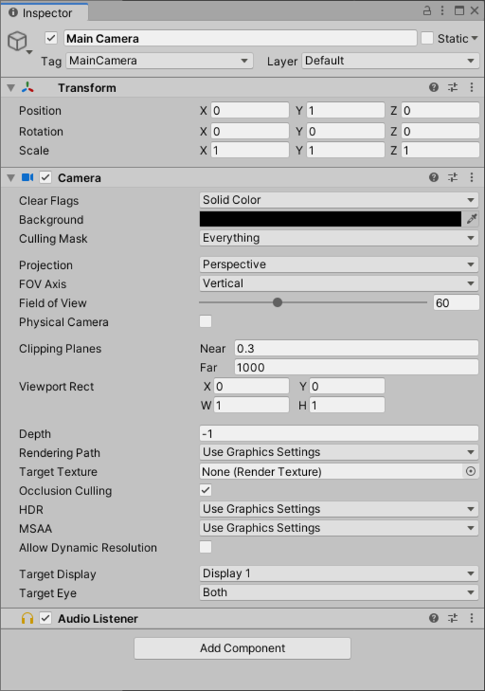

# Configuring your project without MRTK

Windows Mixed Reality (WMR) is a Microsoft platform introduced as part of the Windows 10 operating system. The WMR platform lets you build applications that render digital content on holographic and VR display devices.

While Microsoft and the community have created opensource tools such as the [Mixed Reality Toolkit (MRTK)](https://microsoft.github.io/MixedRealityToolkit-Unity/Documentation/Installation.html) that will automatically set up the WMR environment, many developers wish to build their experiences from the ground up.  The following documentation will demonstrate how to properly set up a project for Mixed Reality development whether you are using MRTK or not.  The settings you need to change are broken down into two categories: per-project settings and per-scene settings.

> [!NOTE]
> You can always import MRTK later on, so there's no penalty for going the manual route first.

If you choose the WMR manual setup, the settings you need to change are broken-down into two categories: per-project and per-scene.

## Per-project settings

If you're targeting Desktop VR, we suggest using the PC Standalone Platform selected by default on a new Unity project:

If you're targeting HoloLens 2, you need to switch to the Universal Windows Platform:

1.	Select **File > Build Settings...**
2.	Select **Universal Windows Platform** in the Platform list and select **Switch Platform**
3.	Set **Architecture** to **ARM 64**
4.	Set **Target device** to **HoloLens**
5.	Set **Build Type** to **D3D**
6.	Set **UWP SDK** to **Latest installed**
7.	Set **Build configuration** to **Release** because there are known performance issues with Debug

After setting your platform, you need to let Unity know to create an [immersive view](../../design/app-views.md) instead of a 2D view when exported.

### For XRSDK 

1. In the Unity Editor, navigate to **Edit > Project settings** and select **XR Plugin Management**

2. Select **Install XR Plugin Management**

3. Select **Initialize XR on Startup** and **Windows Mixed Reality**

4. Expand the **XR Plug-in Management** section and select **Univeral Windows Platform Settings** tab
5. If you're using Unity 2020 or later, you'll see the options to check **OpenXR** or **Windows Mixed Reality**. 
    * You can choose either runtime.  If you're specifically developing for the HoloLens 2 or the HP Reverb G2 and decide to try the **OpenXR**, select the OpenXR box and review our guide to [Using the Mixed Reality OpenXR Plugin for Unity](openxr-getting-started.md) to get yourself set up correctly for these devices before returning to this tutorial

> [!NOTE]
> Starting in Unity 2020 LTS, Microsoft is embracing development with OpenXR.  As we migrate to this path, in Unity 2021.1 the Windows XR plugin will be deprecated and removed in 2021.2 making OpenXR the only supported path. You can find more information in [Using the Mixed Reality OpenXR plugin](openxr-getting-started.md).

6. If you decide to choose the **Windows Mixed Reality** plugin, check all boxes and set **Depth Submission Mode** to **Depth 16 Bit**

### For Legacy XR 

> [!CAUTION]
> Legacy XR is deprecated in Unity 2019 and removed in Unity 2020.

1. Open **Player Settings...** from the **Build Settings... window** and expand the **XR Settings** group
2. In the **XR Settings** section, select **Virtual Reality Supported** to add the Virtual Reality Devices list
3. Set **Depth Format** to **16-bit Depth** and enable **Depth Buffer Sharing**
4. Set **Stereo Rendering Mode** to **Single Pass Instance**
5. Select **WSA Holographic Remoting Supported** if you'd like to use Holographic remoting 

### Updating the manifest

Your app can now handle holographic rendering and spatial input. However, your app needs to declare the appropriate capabilities in its manifest to take advantage of certain functionality. You can find your projects capabilities by going to **Player Settings > Settings for Universal Windows Platform > Publishing Settings > Capabilities**. 

It's recommended that you make the manifest declarations in Unity to include them in all future projects that you export. The applicable capabilities for enabling commonly used Unity APIs for Mixed Reality are:

|  Capability  |  APIs requiring capability | 
|----------|----------|
|  SpatialPerception  |  SurfaceObserver (access to [spatial mapping](../../design/spatial-mapping.md) meshes on HoloLens)&mdash;*No capability needed for general spatial tracking of the headset* | 
|  WebCam  |  PhotoCapture and VideoCapture | 
|  PicturesLibrary / VideosLibrary  |  PhotoCapture or VideoCapture, respectively (when storing the captured content) | 
|  Microphone  |  VideoCapture (when capturing audio), DictationRecognizer, GrammarRecognizer, and KeywordRecognizer | 
|  InternetClient  |  DictationRecognizer (and to use the Unity Profiler) | 

### Quality settings

HoloLens has a mobile-class GPU. If your app is targeting HoloLens, you'll want to start off with the quality settings in your app tuned for fastest performance to ensure it maintains full frame-rate.  Once you have your are further along in your development you may consider upping the quality settings to find the right balance of quality and performance: 

1. Select **Edit > Project Settings > Quality** 
2. Select the **dropdown** under the **Windows Store** logo and select **Very Low**. You'll know the setting is applied correctly when the box in the Windows Store column and Very Low row is green 
3. In the **Shadows** section, select **Disable Shadows** 

 
*Unity quality settings*

## Per-scene settings

### Unity camera settings

With **Virtual Reality Supported** checked, the [Unity Camera](camera-in-unity.md) component handles [head tracking and stereoscopic rendering](../platform-capabilities-and-apis/rendering.md). That means there's no need for you to replace the Main Camera object with a custom camera.

If your app is targeting HoloLens specifically, you need to change a few settings to optimize for the device's transparent displays. These settings allow your holographic content to show through to the physical world:

1. In the **Hierarchy**, select the **Main Camera**
2. In the **Inspector** panel, set the transform **position** to **0, 0, 0** so the location of the user's head starts at the Unity world origin.
3. Change **Clear Flags** to **Solid Color**.
4. Change the **Background** color to **RGBA 0,0,0,0**. Black renders as transparent in HoloLens.
5. Change **Clipping Planes - Near** to the [HoloLens recommended](camera-in-unity.md#clip-planes) 0.85 (meters).

 
*Unity camera settings*

> [!IMPORTANT]
> If you delete and create a new camera, make sure your new camera is tagged as **MainCamera**.

## Next steps

Now that your project is ready, you can start developing your Mixed Reality experience:

* Add [core building blocks](unity-development-overview.md#2-core-building-blocks)
* Check out available [platform capabilities and APIs](unity-development-overview.md#3-advanced-features)
* Learn how to [deploy your app](../platform-capabilities-and-apis/using-visual-studio.md#)
* Use the [Mixed Reality simulator](../platform-capabilities-and-apis/using-the-windows-mixed-reality-simulator.md)

## See also
* [Install the tools](../install-the-tools.md)