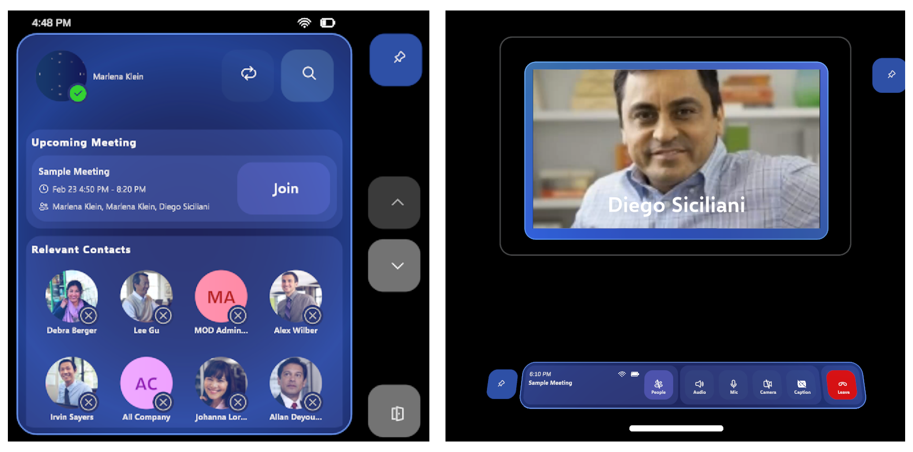

# Video Calling and Teams Integration

The Azure Communication Services Showcase demonstrates how to use [Azure Communication Services](https://learn.microsoft.com/azure/communication-services/overview) (ACS) within an immersive mixed reality application, running on HoloLens 2. The app uses Microsoft Graph, Azure Communication Services APIs, and MRTK3 to allow users to access their Microsoft Teams contacts and participate in calls and meetings via HoloLens 2.

> [!div class="nextstepaction"]
> [Go to the repo](https://github.com/microsoft/MixedReality-AzureCommunicationServices-Sample)

[Azure Communication Services](https://docs.microsoft.com/azure/communication-services/overview)  (ACS) empower developers to seamlessly integrate voice, video, chat, telephony, and email communications into their applications. In this HoloLens 2 sample application, we focus on Teams interoperability, specifically joining Teams meetings. Here’s what our app demonstrates:

1. **Authenticated Teams Integration:** Connect to ACS as an authenticated Teams user using your work/ school credentials.
2. **Microsoft Graph Integration:** Retrieve coworker information and upcoming meetings.
3. **Teams Meeting Participation:** Join Teams meetings with video and audio.
4. **Live Captions:** Render live captions during Teams meetings.
5. **Incoming Calls:** Accept 1:1 Teams video and audio calls.
6. **XR Interactions with MRTK3:** Utilize the [Mixed Reality Toolkit 3](http://www.mixedrealitytoolkit.org) for seamless XR interfaces.

Instructions for how to set up and run the sample app can be found in the [readme](https://github.com/microsoft/MixedReality-AzureCommunicationServices-Sample/blob/main/README.md).