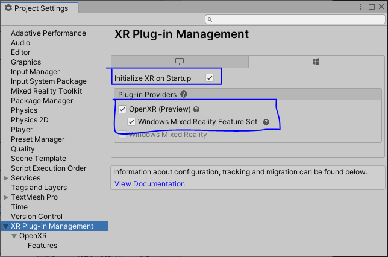
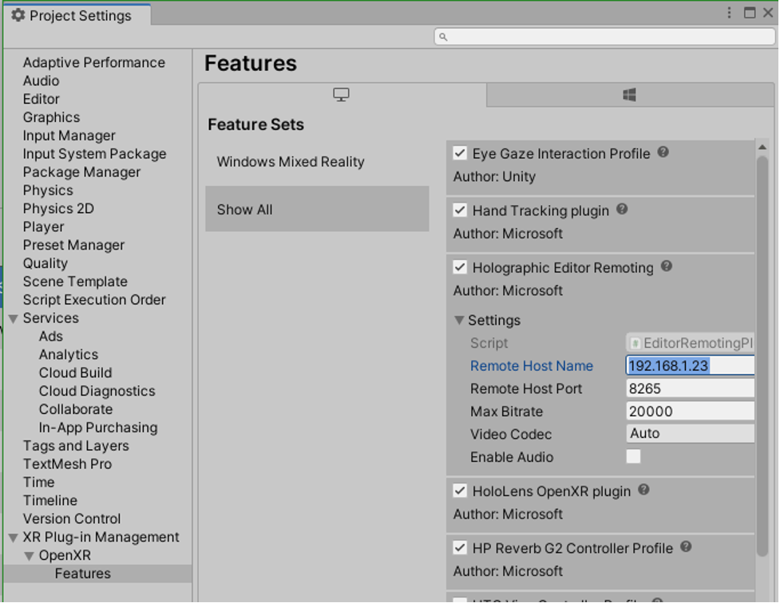

# Mixed Reality OpenXR Plugin's AppRemoting API behavior in different remoting configurations

This article assumes that you have already set up your project to use OpenXR (in other words, you've imported the required packages and chosen settings for the OpenXR plug-in). If you haven't yet done this, see our articles describing how to set up a new OpenXR project [with MRTK](./new-openxr-project-with-mrtk.md) or [without MRTK](./new-openxr-project-without-mrtk.md).

## Different remoting configurations available in Unity Mixed Reality OpenXR plugin:

In all of the following scenarios, inputs from the HoloLens--gaze, gesture, voice, and spatial mapping--are sent to the PC, where content is rendered in a virtual immersive view. The rendered frames are then sent to the HoloLens.

1. **Standalone Holographic AppRemoting App**:
A Standalone or UWP Unity App built after doing the following:

- In Unity, on the menu bar, navigate to **File** > **Build Settings** > **Project Settings**, and then select **XR Plug-in Management**.
- Select **Holographic remoting remote app feature group** and make sure that **Initialize XR on Startup** isn't selected.

This is a remote app which is connected to a "Holographic Remoting Player App" that runs on the HoloLens.

2. **Holographic AppRemoting App in regular Play Mode**:
- In Unity, on the menu bar, navigate to **File** > **Build Settings** > **Project Settings** >, and then select **XR Plug-in Management**.
- Select **Holographic remoting remote app feature group** and make sure that **Initialize XR on Startup** isn't selected.
- Click the Play button. 

This can be used to test the above remote app's functionality without building it and connect to a "Holographic Remoting Player App" that runs on the HoloLens.

3.**Holographic Remoting for Play Mode**:
- In Unity, on the menu bar, select **Mixed Reality** > **Remoting** > **Holographic Remoting for Play Mode.**
- Click the Play button. 

By using a using a "Holographic Remoting Player App", you can quickly debug your HoloLens 2 app without building and deploying a full project on the HoloLens.

**DISCLAIMER - Enabling Holographic Remoting for Play Mode in Cofiguration 3, only manages the remoting connection. All the [Holographic AppRemoting APIs](https://learn.microsoft.com/dotnet/api/microsoft.mixedreality.openxr.remoting?view=mixedreality-openxr-plugin-1.7) will be disabled for this duration of the Play Mode connection using remoting. To test Holographic AppRemoting APIs in Play Mode, use Configuration 2 using normal play mode, and establish the AppRemoting connection.

## The following table describes the App Remoting API behavior in different configurations:

AppRemoting feature configuration below refers to enabling **Holographic remoting remote app feature group** and disabling **Initialize XR on Startup**.

|  Mixed Reality OpenXR Plugin's AppRemoting API  | Holographic App Remoting App | App using regular play mode | App using Holographic Remoting for Play Mode |

| --- | --- | --- | --- |

| [StartConnectingToPlayer](/dotnet/api/microsoft.mixedreality.openxr.remoting.appremoting.startconnectingtoplayer) | This functionality works as expected | This functionality works as expected only when App Remoting feature is properly configured and throws an error/warning otherwise | This functionality is not supported and throws an error/warning |

| [StartListeningForPlayer](/dotnet/api/microsoft.mixedreality.openxr.remoting.appremoting.startlisteningforplayer) | This functionality works as expected  | This functionality works as expected only when App Remoting feature is properly configured and throws an error/warning otherwise | This functionality is not supported and throws an error/warning |

| [Disconnect](/dotnet/api/microsoft.mixedreality.openxr.remoting.appremoting.disconnect) | This functionality works as expected | This functionality works as expected only when App Remoting feature is properly configured and throws an error/warning otherwise | This functionality is not supported and throws an error/warning|

| [StopListening](/api/microsoft.mixedreality.openxr.remoting.appremoting.stoplistening) | This functionality works as expected  | This functionality works as expected only when App Remoting feature is properly configured and throws an error/warning otherwise| This functionality is not supported and throws an error/warning |

| [IsReadyToStart](/dotnet/api/microsoft.mixedreality.openxr.remoting.appremoting.isreadytostart)| This functionality works as expected  | This functionality works as expected only when App Remoting feature is properly configured and throws an error/warning otherwise | This functionality is not supported and throws an error/warning|

| [TryGetConnectionState](https://learn.microsoft.com/dotnet/api/microsoft.mixedreality.openxr.remoting.appremoting.trygetconnectionstate?view=mixedreality-openxr-plugin-1.7) | This functionality works as expected | This functionality works as expected only when App Remoting feature is properly configured and returns false otherwise  | This functionality returns false |

| [TryLocateUserReferenceSpace](/dotnet/api/microsoft.mixedreality.openxr.remoting.appremoting.trylocateuserreferencespace) | This functionality works as expected  | This functionality works as expected only when App Remoting feature is properly configured and returns false otherwise | This functionality returns false |

| [ReadyToStart](/dotnet/api/microsoft.mixedreality.openxr.remoting.appremoting.readytostart) | This functionality works as expected  | This event gets triggered as expected only when App Remoting feature is properly configured and is never triggered otherwise  | This event is never triggered |

| [Connected](/dotnet/api/microsoft.mixedreality.openxr.remoting.appremoting.connected) | This functionality works as expected | This event gets triggered as expected only when App Remoting feature is properly configured and is never triggered otherwise | This event is never triggered|

| [Disconnecting](/dotnet/api/microsoft.mixedreality.openxr.remoting.appremoting.disconnecting) | This functionality works as expected | This event gets triggered as expected only when App Remoting feature is properly configured and is never triggered otherwise | This event is never triggered |

## See Also
* [Holographic Remoting Player](../native/holographic-remoting-player.md)
* [Tutorial: Getting started with PC Holographic Remoting](/training/modules/pc-holographic-remoting-tutorials/)
* [Tutorial: Creating a Holographic Remoting PC application](/training/modules/pc-holographic-remoting-tutorials/4-create-holographic-remoting-pc-application)
