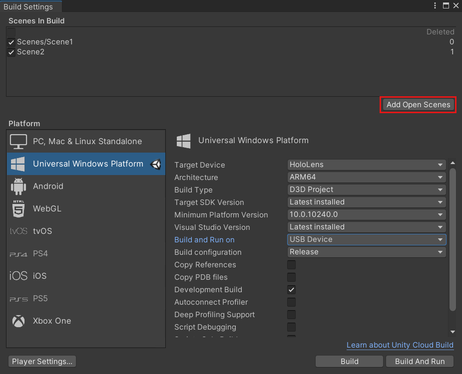

# Build and deploy to the HoloLens

Before you build and deploy your project, make sure that you have already [set up your XR configuration and switched to the Universal Windows Platform](xr-project-setup.md).

## Build the Unity project

1. In Unity on the menu bar, select **File** > **Build Settings...**.
1. In the **Build Settings** window, select the **Add Open Scenes** button. This adds your current scene to the **Scenes In Build** list.
1. If you followed the instructions in the [Setting up your XR configuration ](xr-project-setup.md) article, you should have all the correct settings for a Universal Windows Platform build in place. As a reminder, here are the settings once again:

    -Set **Target device** to *HoloLens*  
    -Set **Architecture** to *ARM 64*  
    -Set **Build Type** to *D3D Project*  

    > [!NOTE]
    > If your app doesn't need the system keyboard, our recommendation is to use *D3D* so that your app uses slightly less memory and a faster launch time. However, if you're using the system keyboard through the TouchScreenKeyboard API, you need to export the project as *XAML*.

    -Set **Target SDK Version** to *Latest   Installed*  
    -Set **Minimum Platform Version** to *10.0.10240.0*  
    -Set **Visual Studio Version** to *Latest installed*  
    -Set **Build and Run on** to *USB Device*  
    -Set **Build configuration** to *Release* (there are known performance issues with Debug)

1. Click the **Build** button.
1. In the **Build Universal Windows Platform** dialog, choose the folder you want to store your build in. (To keep things organized, you may want to create a folder named **Builds**, or something similar, and then save your build there.) 
1. Select the folder you chose and then click **Select Folder** to start the build process.

## Rebuilding your project

If you make changes to your project, you'll need to do another build from Unity. Some examples of changes are:
* You change a script.
* You add or remove assets in the Project tab.
* You change any value in the Inspector tab.
* You add or remove objects from the Hierarchy tab.
* You change any Unity project settings.

## Building and deploying a Unity Visual Studio solution

1. After Unity has finished building the project, a Windows Explorer window will open to the project root directory. Navigate into the folder that creates your newly-created solution file.
1. Find the solution file located inside this folder and open it.

The remainder of building and deploying apps happens in [Visual Studio](../advanced-concepts/using-visual-studio.md). 

