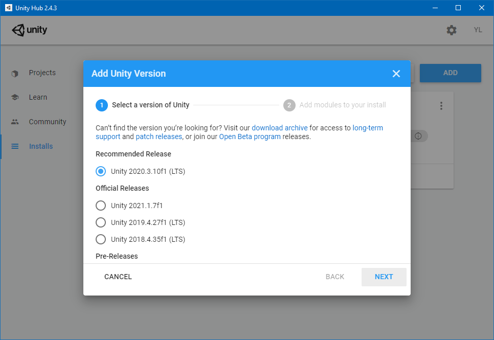
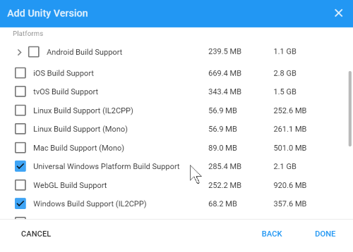
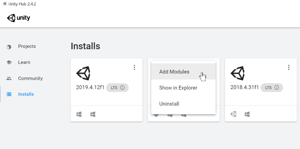

# Choosing a Unity version and XR plugin

While we currently **recommend installing Unity 2020.3 LTS with the latest Mixed Reality OpenXR plugin** for Mixed Reality development, you can build apps with other Unity configurations as well.

## Unity 2020.3 LTS (Recommended)

Microsoft’s current recommended Unity configuration for HoloLens 2 and Windows Mixed Reality development is **Unity 2020.3 LTS with the latest Mixed Reality OpenXR plugin**. You MUST use Unity patch release 2020.3.8f1 or later to avoid known performance issues with earlier 2020.3 builds.

> [!IMPORTANT]
> Unity 2020 does not support targeting HoloLens (1st gen). These headsets remain supported in **[Unity 2019 LTS](#unity-20194-lts)** with Legacy Built-in XR for the full lifecycle of Unity 2019 LTS through mid-2022.
>
> [!NOTE]
> Azure Remote Rendering has not yet shipped an updated release supporting Unity 2020.
>
> If your Unity project uses Azure Remote Rendering, we recommend holding off on upgrading your project to Unity 2020 until an updated package is available.

The best way to install and manage Unity is through the <a href="https://unity3d.com/get-unity/download" target="_blank">Unity Hub</a>. When it's installed, open Unity Hub:

1. Select the **Installs** tab and choose **ADD**
2. Select Unity 2020.3 LTS and click **Next**

3. Check following components under **'Platforms'**
    * **Universal Windows Platform Build Support**
    * **Windows Build Support (IL2CPP)**

4. If you installed Unity without these options, you can add them through **'Add Modules'** menu in Unity Hub:

> [!div class="nextstepaction"]
> [Using the OpenXR plugin](/windows/mixed-reality/develop/unity/xr-project-setup?tabs=openxr)

> [!NOTE]
> While we recommend using OpenXR for all new projects, Unity 2020.3 LTS also supports the [Windows XR plugin](/windows/mixed-reality/develop/unity/xr-project-setup?tabs=windowsxr). This plugin is fully supported, although it won't receive new features such as AR Foundation 4.0 support.

## Unity 2019.4 LTS

If you need to use Unity 2019, you can use **Unity 2019 LTS with Legacy Built-in XR**. To get started with Legacy Built-in XR in Unity 2019.4 LTS, click here:

> [!div class="nextstepaction"]
> [Set up Legacy Built-in XR](/windows/mixed-reality/develop/unity/xr-project-setup?tabs=legacy)

> [!NOTE]
> Unity has deprecated its Legacy Built-in XR support as of Unity 2019.  While Unity 2019 does offer a new XR Plug-in framework, Microsoft is not currently recommending that path in Unity 2019 due to Azure Spatial Anchors incompatibilities with AR Foundation 2.  In Unity 2020, Azure Spatial Anchors is supported within the XR Plug-in framework.

If you are developing apps for HoloLens (1st gen), these headsets remain supported in Unity 2019 LTS with Legacy Built-in XR for the full lifecycle of Unity 2019 LTS through mid-2022.

## Unity 2021.1

If you are trying out early **Unity 2021.1** builds, you should move forward to the **OpenXR plugin**, as the Windows XR plugin is deprecated there.  Starting in Unity 2021.2, the OpenXR plugin will be the only path for Mixed Reality development, as the Windows XR plugin will no longer be supported.

## Unity 2018.4 LTS

If you already have a project using Unity 2018.4 LTS, your Unity engine continues to be supported for 2 years after its release.  Unity 2018 LTS will reach end of service in the spring of 2021.
