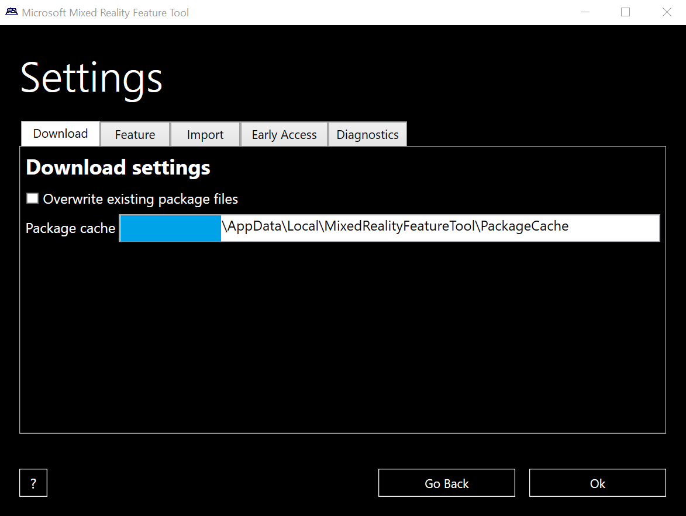
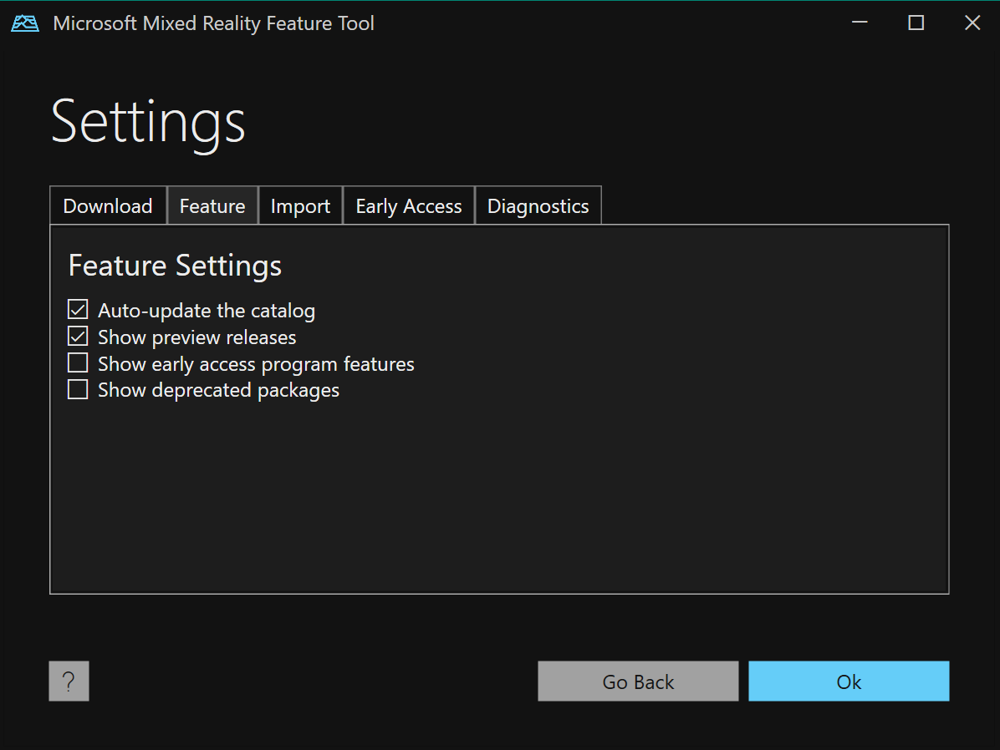
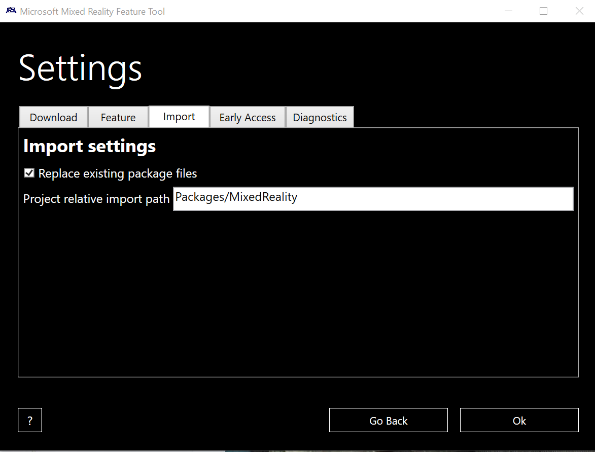
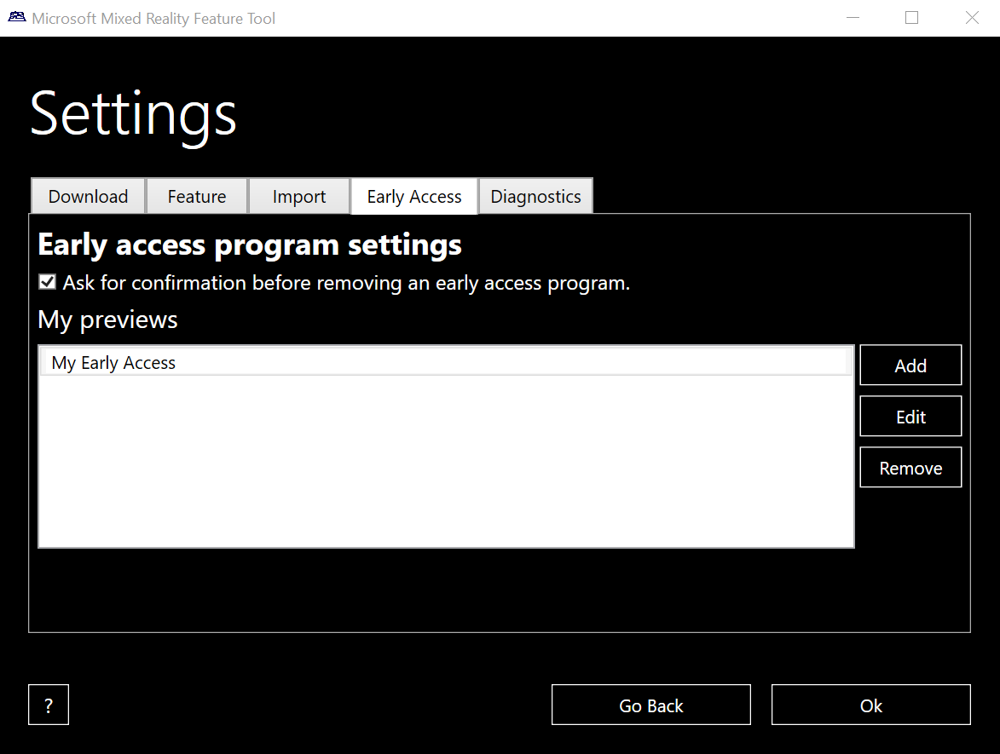
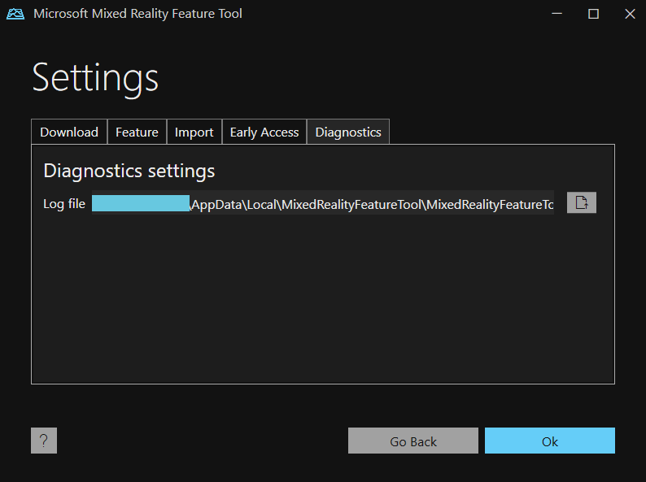
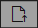

# Configuring the Mixed Reality Feature Tool

When using the Mixed Reality Feature Tool, you have access to three different settings categories that you can customize at will:

* [Download settings](#download-settings)
* [Feature settings](#feature-settings)
* [Import settings](#import-settings)

## Download settings

### Overwrite existing package files

Enabling this setting causes package files to be downloaded every time they're acquired. 

* **We recommend leaving this option disabled to reduce network bandwidth usage**
* By default, previously acquired package files aren't re-downloaded

### Package cache

Change this setting to update the location where feature packages are downloaded.

> [!NOTE]
> This setting is **read-only** in this release. Future releases may make this setting configurable.

## Feature settings

### Auto-update the catalog

Enalbe this setting to ensure that every time the Mixed Reality Feature Tool is started, the latest feature catalog is retrieved from the server.

### Show preview releases

Enable this setting to acquire preview releases.
* By default, preview releases are not shown in the Mixed Reality Feature Tool 

> [!NOTE]
> A preview release is defined as containing the **"-preview"** designation in the package version.

### Show early access program features

Enable this setting to acquire features from registered early access programs releases.

* By default, early access features are not shown in the Mixed Reality Feature Tool 

> [!NOTE]
> Enabling `Show early access program features` without `Show preview releases` may result in eary access packages not appearing in Discovery.

## Import settings

### Replace existing package files

By default, the Mixed Reality Feature Tool removes previous copies of the packages being imported to reduce the file size and unnecessary computations. 

* Uncheck this setting to keep all versions

### Project relative import path

Change this setting to update project folder path where feature packages are copied on import. 

* For example, if the project folder is **C:\GalaxyExplorer**, the fully qualified import path will be **C:\GalaxyExplorer\Packages\MixedReality**.

> [!NOTE]
> This setting is **read-only** in this release. Future releases may make this setting configurable.

## Early Access settings

 
### Ask for confirmation before removing an early access program

This setting determines if a prompt will be displayed each time an early access program is removed.

### My previews

The list of registered early access programs. Use the `Add`, `Edit` and `Remove` to manage the collection of registered programs.

## Diagnostic settings

### Log file

Displays the path to the diagnostic log file.

### Open file button

Clicking on the open file  button will open the file, using the default text editor.

## See also

- [Welcome to the Mixed Reality Feature Tool](welcome-to-mr-feature-tool.md)