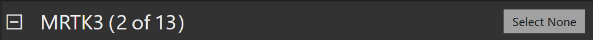
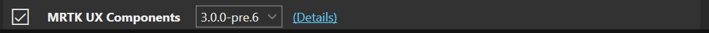
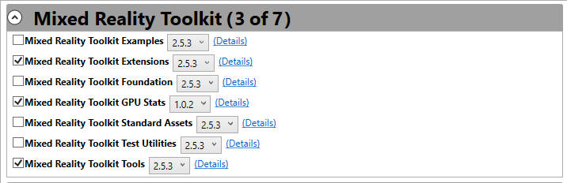

# Discovering and acquiring features

The sections in this article outline how to find feature packages in the Mixed Reality Feature Tool. Refer to the screenshot below if you need a reference for a given section:

## Available features

### Category

The Mixed Reality Feature Tool displays a collection of feature categories to make it easy to find what you want. Expand any of the categories to display its collection of available features.

> [!NOTE]
> If you can't find the functionality you're looking for, check **Other features**.

The category header in the above screenshot contains the following properties, from left to right:

- Expand and collapse button
- Category name (ex: Mixed Reality Toolkit)
- Count of selected features
- Count of available features

### Feature

Features are listed in their appropriate category. From left to right in the above screenshot, feature entries contain:

- Selection check box
- Feature name (ex: Mixed Reality Toolkit Foundation)
- List of available versions
- Link to the [feature package details](viewing-package-details.md)

## Refresh the feature catalog

To check for new and updated features, click the refresh  button. This will connect to the catalog site and retrieve the latest information. Once the catalog has been read, the date and time of the last update will be displayed.

## Select features

Features are selected by expanding a category, selecting a version, and clicking the check box:

Each category with one or more selected features will update to display the count.

## Acquiring features

Once you've chosen your features, select **Get features** to start downloading the selected feature package files.

> [!NOTE]
> By default, previously acquired feature package files won't be re-downloaded. To change this behavior please see [configuring the feature tool](configuring-feature-tool.md).

Once downloading is complete, the Mixed Reality Feature Tool will move to the [importing features](importing-features.md) step.

## Going back to the previous step

From **Discover features**, the Mixed Reality Feature Tool allows for navigating back to project selection. Select **Go back** to start again.

## See also

- [Welcome to the Mixed Reality Feature Tool](welcome-to-mr-feature-tool.md)
- [Configuring the feature tool](configuring-feature-tool.md)
- [Viewing feature package details](viewing-package-details.md)
- [Importing selected packages](importing-features.md)
