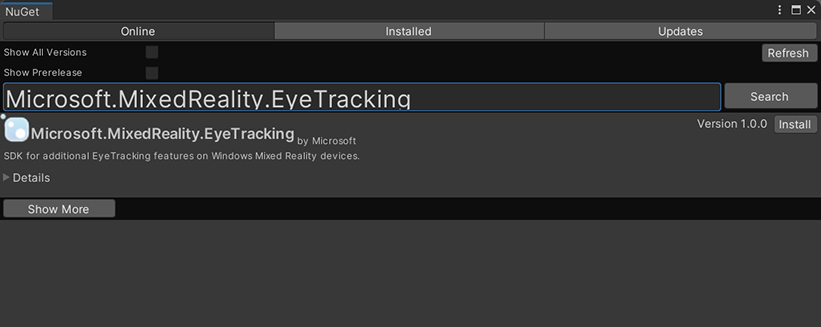

# Extended eye tracking in Unity

To access the GitHub repo for the extended eye tracking sample:

> [!div class="nextstepaction"]
> [Extended eye tracking in Unity](https://github.com/microsoft/MixedReality-EyeTracking-Sample)

Extended eye tracking is a new capability in HoloLens 2. It is a superset of the standard eye tracking, which only provides combined eye gaze data. Extended eye tracking also provides individual eye gaze data and allows applications to set different framerate for the gaze data, such as 30, 60, and 90fps. Other features like eye openness and eye vergence are not supported by HoloLens 2 at this time.

The [Extended Eye Tracking SDK](https://www.nuget.org/packages/Microsoft.MixedReality.EyeTracking) enables applications to access data and features of extended eye tracking. It could be used together with OpenXR APIs or legacy WinRT APIs.

This article covers the ways that to use the extended eye tracking SDK in Unity, together with the Mixed Reality OpenXR Plugin.

## Project setup

1. [Set up the Unity project for HoloLens development.](./unity-development-overview.md)
    - Select the Gaze Input capability
2. [Import the Mixed Reality OpenXR Plugin from MRTK feature tool.](./mixed-reality-openxr-plugin.md) 
3. Import the [Eye Tracking SDK NuGet package](https://www.nuget.org/packages/Microsoft.MixedReality.EyeTracking) into your Unity project.
    1. Download and install the [NuGetForUnity](https://github.com/GlitchEnzo/NuGetForUnity/releases) package.
    2. In the Unity editor, go to `NuGet`->`Manage NuGet Packages`, and then search for `Microsoft.MixedReality.EyeTracking`
    3. Click the Install button to import the latest version of NuGet package.  

          

4. Add the Unity helper scripts.
    1. Add the `ExtendedEyeGazeDataProvider.cs` script below into your Unity project.
    2. Create a scene, add an empty object, and then attach the `ExtendedEyeGazeDataProvider.cs` script to it.
5. Consume the functions of `ExtendedEyeGazeDataProvider.cs` and implement your logics.

## Consume functions of ExtendedEyeGazeDataProvider

> [!NOTE]
> The `ExtendedEyeGazeDataProvider` script depends on some APIs from Mixed Reality OpenXR Plugin to convert the coordinates of the gaze data. It cannot work if your Unity project uses deprecated Windows XR plugin or legacy Built-in XR in older Unity version. To make the extended eye tracking also work in those scenarios
> - If you just need to access the framerate settings, the Mixed Reality OpenXR Plugin is not necessary, and you could modify the `ExtendedEyeGazeDataProvider` to only keep the framerate related logics.
> - If you still need to access individual eye gaze data, you need to [use WinRT APIs in Unity](./using-the-windows-namespace-with-unity-apps-for-hololens.md). You can refer the see also section to see how to use extended eye tracking SDK with WinRT APIs.

The `ExtendedEyeGazeDataProvider` class wraps the extended eye tracking SDK APIs. It provides functions to get gaze reading in either Unity world space or relative to the main camera.

Code samples to consume `ExtendedEyeGazeDataProvider` to get the gaze data.

```C#
ExtendedEyeGazeDataProvider extendedEyeGazeDataProvider;
void Update() {
    timestamp = DateTime.Now;

    var leftGazeReadingInWorldSpace = extendedEyeGazeDataProvider.GetWorldSpaceGazeReading(extendedEyeGazeDataProvider.GazeType.Left, timestamp);
    var rightGazeReadingInWorldSpace = extendedEyeGazeDataProvider.GetWorldSpaceGazeReading(extendedEyeGazeDataProvider.GazeType.Right, timestamp);
    var combinedGazeReadingInWorldSpace = extendedEyeGazeDataProvider.GetWorldSpaceGazeReading(extendedEyeGazeDataProvider.GazeType.Combined, timestamp);

    var combinedGazeReadingInCameraSpace = extendedEyeGazeDataProvider.GetCameraSpaceGazeReading(extendedEyeGazeDataProvider.GazeType.Combined, timestamp);
}
```

When the `ExtendedEyeGazeDataProvider` script got executed, it sets the gaze data framerate to the highest option, which is currently 90fps.

## ExtendedEyeGazeDataProvider.cs script

```C#
// Copyright (c) Microsoft Corporation.
// Licensed under the MIT license.

using UnityEngine;
using System;
using Microsoft.MixedReality.OpenXR;
using Microsoft.MixedReality.EyeTracking;

/// <summary>
/// This class provides access to the Extended Eye Gaze Tracking API 
/// Values are given in Unity world space or relative to the main camera
/// </summary>
[DisallowMultipleComponent]
public class ExtendedEyeGazeDataProvider : MonoBehaviour
{
    public enum GazeType
    {
        Left,
        Right,
        Combined
    }

    public class GazeReading
    {
        public Vector3 EyePosition;
        public Vector3 GazeDirection;
        public GazeReading() { }
        public GazeReading(Vector3 position, Vector3 direction)
        {
            EyePosition = position;
            GazeDirection = direction;
        }
    }

    private Camera _mainCamera;
    private EyeGazeTrackerWatcher _watcher;
    private EyeGazeTracker _eyeGazeTracker;
    private EyeGazeTrackerReading _eyeGazeTrackerReading;
    private System.Numerics.Vector3 _trackerSpaceGazeOrigin;
    private System.Numerics.Vector3 _trackerSpaceGazeDirection;
    private GazeReading _gazeReading = new GazeReading();
    private GazeReading _transformedGazeReading = new GazeReading();
    private bool _gazePermissionEnabled;
    private bool _readingSucceeded;
    private SpatialGraphNode _eyeGazeTrackerNode;
    private Pose _eyeGazeTrackerPose;


    /// <summary>
    /// Get the current reading for the requested GazeType, relative to the main camera
    /// Will return null if unable to return a valid reading
    /// </summary>
    /// <param name="gazeType"></param>
    /// <returns></returns>
    public GazeReading GetCameraSpaceGazeReading(GazeType gazeType)
    {
        return GetCameraSpaceGazeReading(gazeType, DateTime.Now);
    }

    /// <summary>
    /// Get the reading for the requested GazeType at the given TimeStamp, relative to the main camera
    /// Will return null if unable to return a valid reading
    /// </summary>
    /// <param name="gazeType"></param>
    /// <param name="timestamp"></param>
    /// <returns></returns>
    public GazeReading GetCameraSpaceGazeReading(GazeType gazeType, DateTime timestamp)
    {
        if (GetWorldSpaceGazeReading(gazeType, timestamp) == null)
        {
            return null;
        }

        _transformedGazeReading.EyePosition = _mainCamera.transform.InverseTransformPoint(_gazeReading.EyePosition);
        _transformedGazeReading.GazeDirection = _mainCamera.transform.InverseTransformDirection(_gazeReading.GazeDirection).normalized;

        return _transformedGazeReading;
    }

    /// <summary>
    /// Get the current reading for the requested GazeType
    /// Will return null if unable to return a valid reading
    /// </summary>
    /// <param name="gazeType"></param>
    /// <returns></returns>
    public GazeReading GetWorldSpaceGazeReading(GazeType gazeType)
    {
        return GetWorldSpaceGazeReading(gazeType, DateTime.Now);
    }

    /// <summary>
    /// Get the reading for the requested GazeType at the given TimeStamp
    /// Will return null if unable to return a valid reading
    /// </summary>
    /// <param name="gazeType"></param>
    /// <param name="timestamp"></param>
    /// <returns></returns>
    public GazeReading GetWorldSpaceGazeReading(GazeType gazeType, DateTime timestamp)
    {
        if (!_gazePermissionEnabled || _eyeGazeTracker == null)
        {
            return null;
        }

        _eyeGazeTrackerReading = _eyeGazeTracker.TryGetReadingAtTimestamp(timestamp);
        if (_eyeGazeTrackerReading == null)
        {
            Debug.LogWarning($"Unable to get eyeGazeTrackerReading at: {timestamp.ToLongTimeString()}");
            return null;
        }

        _readingSucceeded = false;
        switch (gazeType)
        {
            case GazeType.Left:
                {
                    _readingSucceeded = _eyeGazeTrackerReading.TryGetLeftEyeGazeInTrackerSpace(out _trackerSpaceGazeOrigin, out _trackerSpaceGazeDirection);
                    break;
                }
            case GazeType.Right:
                {
                    _readingSucceeded = _eyeGazeTrackerReading.TryGetRightEyeGazeInTrackerSpace(out _trackerSpaceGazeOrigin, out _trackerSpaceGazeDirection);
                    break;
                }
            case GazeType.Combined:
                {
                    _readingSucceeded = _eyeGazeTrackerReading.TryGetCombinedEyeGazeInTrackerSpace(out _trackerSpaceGazeOrigin, out _trackerSpaceGazeDirection);
                    break;
                }
        }
        if (!_readingSucceeded)
        {
            return null;
        }

        // get tracker pose in Unity scene origin space
        if (!_eyeGazeTrackerNode.TryLocate(_eyeGazeTrackerReading.SystemRelativeTime.Ticks, out _eyeGazeTrackerPose))
        {
            return null;
        }
        transform.SetPositionAndRotation(_eyeGazeTrackerPose.position, _eyeGazeTrackerPose.rotation);

        _gazeReading.EyePosition = transform.TransformPoint(ToUnity(_trackerSpaceGazeOrigin));
        _gazeReading.GazeDirection = transform.TransformDirection(ToUnity(_trackerSpaceGazeDirection));
        return _gazeReading;
    }

    private async void Start()
    {
        _mainCamera = Camera.main;

        Debug.Log("Initializing ExtendedEyeTracker");
#if ENABLE_WINMD_SUPPORT
        Debug.Log("Triggering eye gaze permission request");
        // This function call may not required if you already use MRTK in your project 
        _gazePermissionEnabled = await AskForEyePosePermission();
#else
        // Always enable when running in editor
        _gazePermissionEnabled = true;
#endif

        if (!_gazePermissionEnabled)
        {
            Debug.LogError("Gaze is disabled");
            return;
        }

        _watcher = new EyeGazeTrackerWatcher();
        _watcher.EyeGazeTrackerAdded += _watcher_EyeGazeTrackerAdded;
        _watcher.EyeGazeTrackerRemoved += _watcher_EyeGazeTrackerRemoved;
        await _watcher.StartAsync();
    }

    private void _watcher_EyeGazeTrackerRemoved(object sender, EyeGazeTracker e)
    {
        Debug.Log("EyeGazeTracker removed");
        _eyeGazeTracker = null;
    }

    private async void _watcher_EyeGazeTrackerAdded(object sender, EyeGazeTracker e)
    {
        Debug.Log("EyeGazeTracker added");
        try
        {
            await e.OpenAsync(true);
            _eyeGazeTracker = e;
            var supportedFrameRates = _eyeGazeTracker.SupportedTargetFrameRates;
            foreach (var frameRate in supportedFrameRates)
            {
                Debug.Log($"  supportedFrameRate: {frameRate.FramesPerSecond}");
            }

            // Set to highest framerate, it is 90FPS at this time
            _eyeGazeTracker.SetTargetFrameRate(supportedFrameRates[supportedFrameRates.Count - 1]);
            _eyeGazeTrackerNode = SpatialGraphNode.FromDynamicNodeId(e.TrackerSpaceLocatorNodeId);
        }
        catch (Exception ex)
        {
            Debug.LogError("Unable to open EyeGazeTracker\r\n" + ex.ToString());
        }
    }

#if ENABLE_WINMD_SUPPORT
    /// <summary>
    /// Triggers a prompt to let the user decide whether to permit using eye tracking 
    /// </summary>
    private async System.Threading.Tasks.Task<bool> AskForEyePosePermission()
    {
        var accessStatus = await Windows.Perception.People.EyesPose.RequestAccessAsync();
        Debug.Log("Eye gaze access status: " + accessStatus.ToString());
        return accessStatus == Windows.UI.Input.GazeInputAccessStatus.Allowed;
    }
#endif

    private static UnityEngine.Vector3 ToUnity(System.Numerics.Vector3 v) => new UnityEngine.Vector3(v.X, v.Y, -v.Z);
}
```


## API reference of extended eye tracking SDK

```C#
namespace Microsoft.MixedReality.EyeTracking
{
    /// <summary>
    /// Allow discovery of Eye Gaze Trackers connected to the system
    /// This is the only class from Extended Eye Tracking SDK that the application will instantiate, 
    /// other classes' instances will be returned by method calls or properties.
    /// </summary>
    public class EyeGazeTrackerWatcher
    {
        /// <summary>
        /// Constructs an instance of the watcher
        /// </summary>
        public EyeGazeTrackerWatcher();

        /// <summary>
        /// Starts trackers enumeration.
        /// </summary>
        /// <returns>Task representing async action; completes when the initial enumeration is completed</returns>
        public System.Threading.Tasks.Task StartAsync();

        /// <summary>
        /// Stop listening to trackers additions and removal
        /// </summary>
        public void Stop();

        /// <summary>
        /// Raised when an Eye Gaze tracker is connected
        /// </summary>
        public event System.EventHandler<EyeGazeTracker> EyeGazeTrackerAdded;

        /// <summary>
        /// Raised when an Eye Gaze tracker is disconnected
        /// </summary>
        public event System.EventHandler<EyeGazeTracker> EyeGazeTrackerRemoved;        
    }

    /// <summary>
    /// Represents an Eye Tracker device
    /// </summary>
    public class EyeGazeTracker
    {
        /// <summary>
        /// True if Restricted mode is supported, which means the driver supports to provide individual 
        /// eye gaze vector and framerate 
        /// </summary>
        public bool IsRestrictedModeSupported;

        /// <summary>
        /// True if Vergence Distance is supported by tracker
        /// </summary>
        public bool IsVergenceDistanceSupported;

        /// <summary>
        /// True if Eye Openness is supported by the driver
        /// </summary>
        public bool IsEyeOpennessSupported;

        /// <summary>
        /// True if individual gazes are supported
        /// </summary>
        public bool AreLeftAndRightGazesSupported;

        /// <summary>
        /// Get the supported target framerates of the tracker
        /// </summary>
        public System.Collections.Generic.IReadOnlyList<EyeGazeTrackerFrameRate> SupportedTargetFrameRates;

        /// <summary>
        /// NodeId of the tracker, used to retrieve a SpatialLocator or SpatialGraphNode to locate the tracker in the scene
        /// for Perception API, use SpatialGraphInteropPreview.CreateLocatorForNode
        /// for Mixed Reality OpenXR API, use SpatialGraphNode.FromDynamicNodeId
        /// </summary>
        public Guid TrackerSpaceLocatorNodeId;

        /// <summary>
        /// Opens the tracker
        /// </summary>
        /// <param name="restrictedMode">True if restricted mode active</param>
        /// <returns>Task representing async action; completes when the initial enumeration is completed</returns>
        public System.Threading.Tasks.Task OpenAsync(bool restrictedMode);

        /// <summary>
        /// Closes the tracker
        /// </summary>
        public void Close();

        /// <summary>
        /// Changes the target framerate of the tracker
        /// </summary>
        /// <param name="newFrameRate">Target frame rate</param>
        public void SetTargetFrameRate(EyeGazeTrackerFrameRate newFrameRate);

        /// <summary>
        /// Try to get tracker state at a given timestamp
        /// </summary>
        /// <param name="timestamp">timestamp</param>
        /// <returns>State if available, null otherwhise</returns>
        public EyeGazeTrackerReading TryGetReadingAtTimestamp(DateTime timestamp);

        /// <summary>
        /// Try to get tracker state at a system relative time
        /// </summary>
        /// <param name="time">time</param>
        /// <returns>State if available, null otherwhise</returns>
        public EyeGazeTrackerReading TryGetReadingAtSystemRelativeTime(TimeSpan time);

        /// <summary>
        /// Try to get first first tracker state after a given timestamp
        /// </summary>
        /// <param name="timestamp">timestamp</param>
        /// <returns>State if available, null otherwhise</returns>
        public EyeGazeTrackerReading TryGetReadingAfterTimestamp(DateTime timestamp);

        /// <summary>
        /// Try to get the first tracker state after a system relative time
        /// </summary>
        /// <param name="time">time</param>
        /// <returns>State if available, null otherwhise</returns>
        public EyeGazeTrackerReading TryGetReadingAfterSystemRelativeTime(TimeSpan time);
    }

    /// <summary>
    /// Represents a Frame Rate supported by an Eye Tracker
    /// </summary>
    public class EyeGazeTrackerFrameRate
    {
        /// <summary>
        /// Frames per second of the frame rate
        /// </summary>
        public UInt32 FramesPerSecond;
    }

    /// <summary>
    /// Snapshot of Gaze Tracker state
    /// </summary>
    public class EyeGazeTrackerReading
    {
        /// <summary>
        /// Timestamp of state
        /// </summary>
        public DateTime Timestamp;

        /// <summary>
        /// Timestamp of state as system relative time
        /// Its SystemRelativeTime.Ticks could provide the QPC time to locate tracker pose 
        /// </summary>
        public TimeSpan SystemRelativeTime;

        /// <summary>
        /// Indicates of user calibration is valid
        /// </summary>
        public bool IsCalibrationValid;

        /// <summary>
        /// Tries to get a vector representing the combined gaze related to the tracker's node
        /// </summary>
        /// <param name="origin">Origin of the gaze vector</param>
        /// <param name="direction">Direction of the gaze vector</param>
        /// <returns></returns>
        public bool TryGetCombinedEyeGazeInTrackerSpace(out System.Numerics.Vector3 origin, out System.Numerics.Vector3 direction);

        /// <summary>
        /// Tries to get a vector representing the left eye gaze related to the tracker's node
        /// </summary>
        /// <param name="origin">Origin of the gaze vector</param>
        /// <param name="direction">Direction of the gaze vector</param>
        /// <returns></returns>
        public bool TryGetLeftEyeGazeInTrackerSpace(out System.Numerics.Vector3 origin, out System.Numerics.Vector3 direction);

        /// <summary>
        /// Tries to get a vector representing the right eye gaze related to the tracker's node position
        /// </summary>
        /// <param name="origin">Origin of the gaze vector</param>
        /// <param name="direction">Direction of the gaze vector</param>
        /// <returns></returns>
        public bool TryGetRightEyeGazeInTrackerSpace(out System.Numerics.Vector3 origin, out System.Numerics.Vector3 direction);

        /// <summary>
        /// Tries to read vergence distance
        /// </summary>
        /// <param name="value">Vergence distance if available</param>
        /// <returns>bool if value is valid</returns>
        public bool TryGetVergenceDistance(out float value);

        /// <summary>
        /// Tries to get left Eye openness information
        /// </summary>
        /// <param name="value">Eye Openness if valid</param>
        /// <returns>bool if value is valid</returns>
        public bool TryGetLeftEyeOpenness(out float value);

        /// <summary>
        /// Tries to get right Eye openness information
        /// </summary>
        /// <param name="value">Eye Openness if valid</param>
        /// <returns>bool if value is valid</returns>
        public bool TryGetRightEyeOpenness(out float value);
    }
}
```

## See also

* [Use extended eye tracking in native engine](../native/extended-eye-tracking-native.md)
