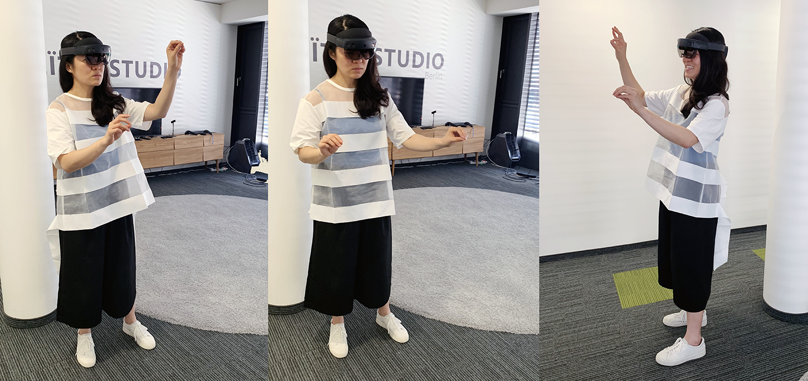
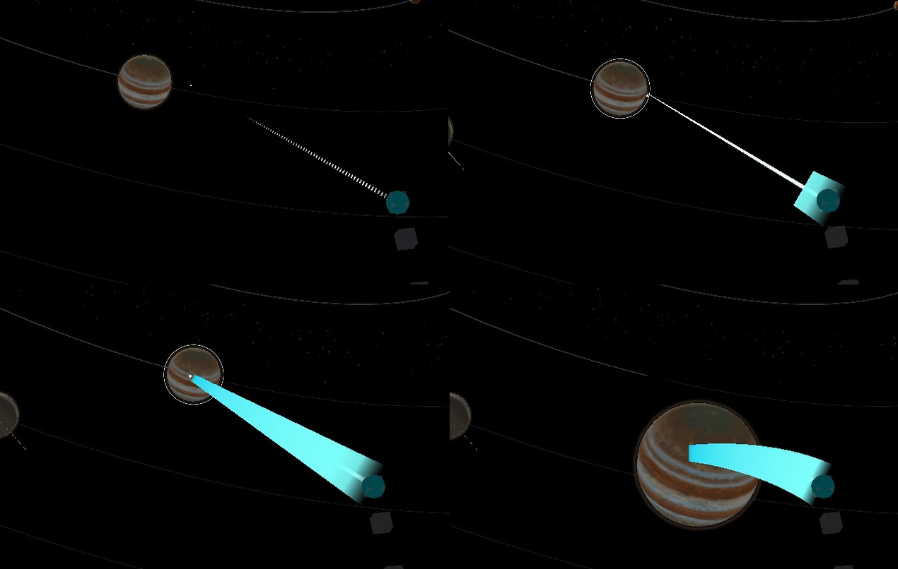
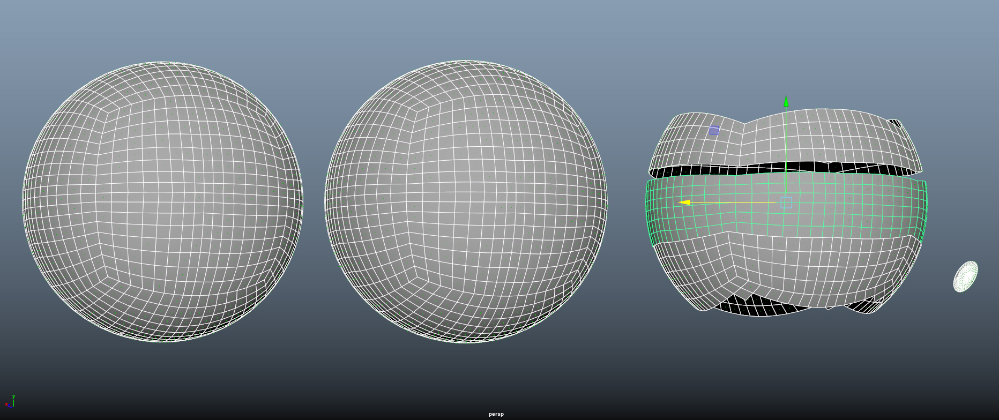
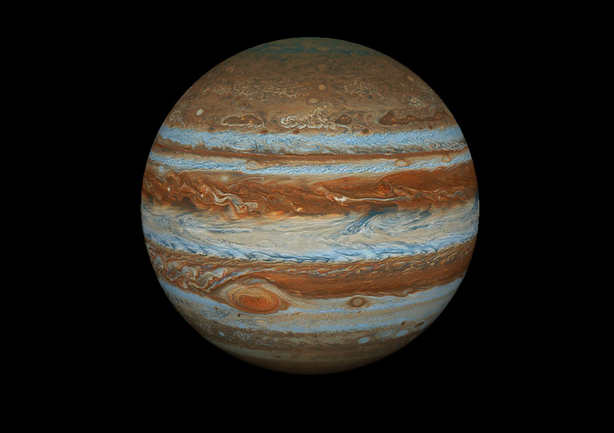
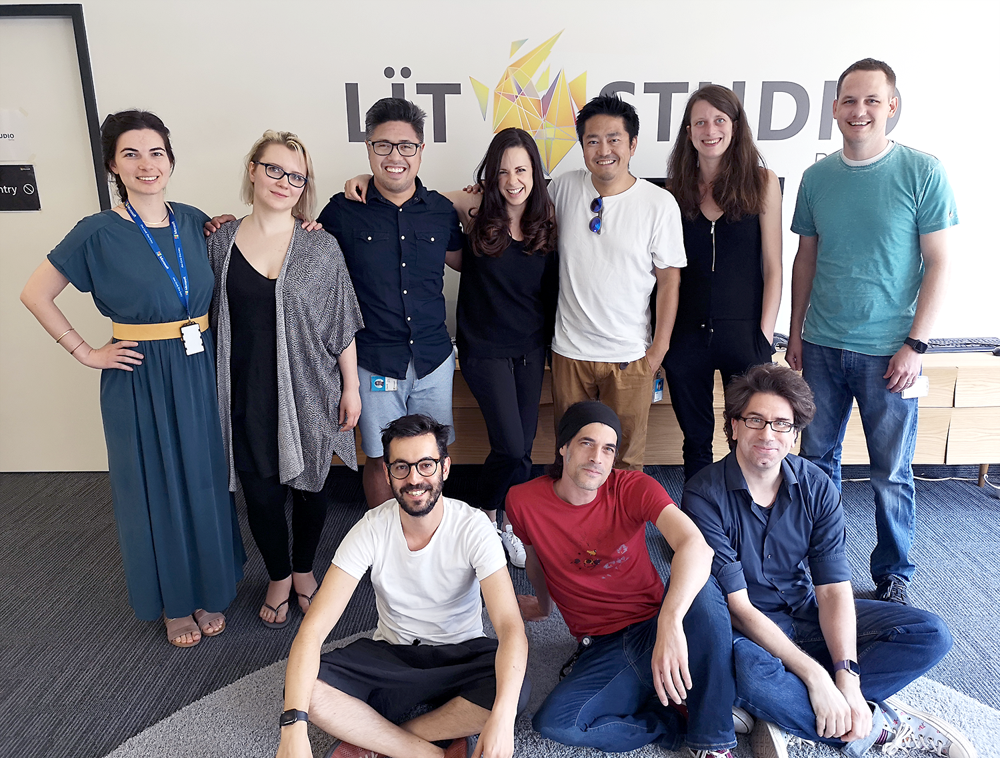

# The making of Galaxy Explorer for HoloLens 2

Welcome to the updated Galaxy Explorer for HoloLens 2 application! [Galaxy Explorer](/windows/mixed-reality/galaxy-explorer "Galaxy Explorer") was originally developed as an open-source application for HoloLens (first gen) through the Share Your Idea program, and is one of the first mixed reality experiences many people had. Now we're updating it for the [new and exciting capabilities of HoloLens 2](https://www.microsoft.com/hololens/hardware).

As one of the [Microsoft Mixed Reality Studios](galaxy-explorer-update.md#mixed-reality-studios), we usually develop commercial grade solutions and are developing & testing on target platforms throughout the creative and development process. We're embarking on this project using the frameworks and tools (like [MRTK](/windows/mixed-reality/mrtk-unity/)) as they become available to us and the community - and we want to bring you along for the ride.

Just like the original Galaxy Explorer, [our team](galaxy-explorer-update.md#meet-the-team) will be [open sourcing the project on GitHub](https://github.com/Microsoft/GalaxyExplorer) to ensure the community has full access. We'll also be documenting our journey here in complete transparency about how we ported from MRTK v1 to MRTK v2, enhanced the experience with new features available in HoloLens 2, and ensured that Galaxy Explorer remained a multi-platform experience. Whether you're viewing Galaxy Explorer on HoloLens (first gen), HoloLens 2, a Windows Mixed Reality headset or on your Windows 10 desktop, we want to make sure you're enjoying the journey as much as we are!

This page will expand as we progress through the project with links to more detailed articles, code, design artifacts, and additional MRTK documentation to provide you with an insider's look at the project.

## Download app from Microsoft Store in HoloLens 2
If you have HoloLens 2 device, you can directly download and install the app in your device.

## Thinking about interactions

As a creative studio, we were ecstatic about the privilege to port Galaxy Explorer to HoloLens 2. We knew from the start that we wanted the experience to be a celebration of the new device and to demonstrate that Mixed Reality empowerment is limited only by the imagination.

HoloLens 2 allows users to touch, grasp, and move holograms in ways that feel natural – they respond a lot like real objects. Fully articulated hand models are amazing, because it lets users do what feels natural. For example, everybody picks up a cup slightly differently – and instead of enforcing one particular way to do it, HoloLens 2 lets you do it your way.

>[!VIDEO https://www.youtube.com/embed/wogJv5v9x-s]

This is a significant change from the Air Tap-based interfaces on first-generation HoloLens devices. Instead of interacting with holograms from a distance, users can now get "up close and personal". When porting existing experiences over to HoloLens 2 or planning new ones, it's important to make yourself familiar with the direct manipulation of holograms.

### Direct manipulation vs. the vast distances in space

It's a magical experience to reach out, grab a planet and hold it in your hand. The challenge with this approach is the size of the solar system – it's huge! The user would need to walk around their room to get close to each planet to interact with it.

To allow users to interact with objects that are farther away, MRTK offers hand rays that shoot out from the center of the user's palm, acting as an extension of the hand. A donut-shaped cursor is attached to the end of the ray to indicate where the ray intersects with a target object. The object that the cursor lands on can then receive gestural commands from the hand. 

>[!VIDEO https://www.youtube.com/embed/Qol5OFNfN14]

In the original version of Galaxy Explorer, the user would target a planet with the gaze cursor and then air tap to call it closer. The easiest way to port the experience to HoloLens 2 is to take this behavior and use hand rays to select planets. While this was functional, it left us wanting more.

### Back to the drawing board

We came together to ideate what could be built on top of the existing interactions. The thinking was: Although HoloLens 2 allows users to interact with holograms in natural, realistic ways, holograms are by definition not real. So as long as an interaction is plausible for the user, it doesn't matter if that interaction would be possible with a real object or not – we can make it possible.

One concept that we explored was based on telekinesis – the power to manipulate objects with one's mind. Often seen in super hero movies, a person would reach out with their mind and call an object into their open hand. We played around with the idea some more and came up with a quick sketch of how the concept could work.

The user would point the hand ray at a planet, which would provide target feedback. As the user then extends their open hand, the planet would be pulled towards the user by a magical force until it's close enough to grab it. Hence our name for the interaction: force grab. As the user would push away the planet with their open hand, it would return again to its orbit.

### Force grab prototyping

We then created multiple prototypes to test the concept: How does the interaction feel overall? Should the called object stop in front of the user or stick to their hands until placed? Should the called object change size or scale while being called?

<!--
Here is Amit Rojtblat (Technical Artist) presenting one of the prototypes to Yasushi Zonno (Creative Lead).

------------------------------------------------------------------

__*--- VIDEO OF AMIT PLAYING AND EXPLAINING THE PROTOTYPE ---*__

__*--- NEEDS TO BE UPLOADED (TO YOUTUBE?) AND LINKED ---*__

------------------------------------------------------------------
-->

### Implementing force grab into the application

When we tried the force grab on planets, we realized that we had to change the scale of the solar system. It turned out that an accurate, medium-sized representation of the solar system is difficult for users to understand and navigate - they didn't know where to look. However, a small-sized-representation made some planets too small to be easily selected. As a result, the size of the planets and the spacing between solar objects was designed to feel comfortable within a medium-sized room while maintaining relative accuracy.

During the later stages of our development sprint, we were lucky enough to have fellow MSFT Mixed Reality experts in-house, so we got to work getting their input as expert testers and doing quick iterations on the force grab interaction.

In picture: Jenny Kam, Senior Design Lead, testing a work-in-progress of Galaxy Explorer.

### Adding affordances for targeting

As we experimented on HoloLens 2, we found that even though the new interactions are natural and intuitive, holograms remain the same: with no weight or tactile sensations. Since holograms don't provide natural feedback that humans are used to receiving when they interact with objects, we needed to create them.

We thought about the visual and audio feedback that users would be provided for the various stages of their interactions, and since the force grab mechanism is central to interacting with Galaxy Explorer, we did many iterations. The aim was to find the right balance of audio and visual feedback for each stage of the interaction: focusing on the intended object, calling it to the user, and then releasing it. What we learned is that more audio and visual feedback was required to reinforce the interaction than we were used to for HoloLens (first gen).

### Adding affordances for force grab
 
Once we had the basic force grab mechanism with audio and visual affordances, we looked at how to make selecting planets more user-friendly. There were two main things to address: Because the solar system is a 3D moving interface, there's added complexity for users to learn how to target objects consistently. This was compounded by the fact that the hand ray is fast at selecting an object, making planets move towards the user incredibly quickly.

We approached this with a three-pronged solution. The first was fairly intuitive: slow down the selection process so that planets approach the user at a more natural pace. Once the speed was adjusted, we had to revisit the audio and visual affordances, adding audio feedback as the planet tracked towards the user.

The second part of the solution was to make the visualization of the entire force grab interaction tangible. We visualized a thick line that moves towards the targeted object once the hand ray connects with it, and then brings the object back to the user - like a lasso. 

Finally, we optimized the scale of the solar system so that the planets were large enough for the user's gaze and hand ray to target them. 

These three improvements allowed users to make accurate selections, calling planets to them in an intuitive way. Overall, the effect of the final force grab is a more immersive and interactive experience in the solar system.

## Spotlight on Jupiter

Creating the solar bodies of the Milky Way was a humbling experience. In particular, the unique characteristics of Jupiter make it a sight to behold. It's the largest and most colorful of the gas giants, and contains more mass than all other planets combined. Its sheer size and mesmerizing bands of turbulence and cloud dynamics are prefect for special artistic attention.

### Geometry and meshes

As a gas giant, Jupiter's outer shells consists of gaseous layers. The combination of its fast rotational speed, inner heat exchange, and Coriolis forces creates colorful layers and streams that form into swirling cloud belts and vortices. Capturing this intricate beauty was key in creating our solar system.

It was immediately clear that using visualizing techniques like fluid simulations and animated textures with precomputed streams were out of question. The computing power required to simulate this in combination with everything else happening simultaneously would have had significant detrimental impacts on performance. 

The next approach was a 'smoke-and-mirror' solution, consisting of overlaying transparent texture layers, each of which addressed a specific aspect of the atmospheric movement, compiled on a composition of rotating meshes.

In the image below, you can see the inner shell on the left. This mat layer provided a background to the composition to guard against any small gaps between the multiple layers that made up the clouds. Because of the layer's slow rotation, it also served as a visual buffer between the faster moving bands to help build visual unity throughout the layers.

After setting this anchor to the model, the moving cloud layers were then projected on the middle and right meshes seen below.

### Texturing

The existing texture was separated into a three-part texture atlas: The upper third hosts a motionless layer of clouds with gaps to provide a parallax effect, the middle section contains the fast moving outer streams, and the lower third contains a slowly rotating inner base layer.

The characteristic Great Red Spot was also separated into its various moving parts and then inserted into an otherwise invisible area of the texture. These components can be seen as the red-toned speckles in the middle section of the image below.

Because each band has a specific direction and speed, the texture was applied to each mesh individually. The meshes then had a common center and pivot point, which made it possible to concentrically animate the whole surface.

### Rotation and texture behavior

Once the the visual composition of Jupiter was set, we needed to ensure the rotation and orbit speeds were properly calculated and applied accordingly. It takes roughly 9 hours for Jupiter to complete a full rotation. This is a matter of definition due to its Differential Rotation. Therefore the equatorial stream has been set as a 'master stream', taking 3600 frames for a full rotation. Every other layer needed to have a rotational speed as a factor of 3600 in order to match its initial position, allowing, e.g.,  600, 900, 1200, 1800 etc.

### The Great Red Spot

The individually rotating streams provided a good visual impression, but lacked in detail when observed at close range.

The most eye-catching part was Jupiter's Great Red Spot, so we created a set of meshes and textures specifically to showcase it.
 
We used a similar mechanism as with Jupiter's bands: a set of rotating parts was composed on top of each other, while also being grouped under its 'master layer' to ensure they remain in position no matter how fast the rest moves.

When the meshes were set up and in place, different layers of the stormy vortex were applied and each disc was then animated individually, the center pieces moving fastest, with the rest progressively slowing down as it moving outwards.

The composition also had the same pivot as every other mesh, while also keeping its tilt from its original y-axis (!) to allow freedom in animating the rotation. 3600 frames is the base rate, with each layer having a factor of this as a period of rotation.

### Getting it right in Unity

There are a couple of key things to keep in mind when implementing this in Unity.

Unity is easily confused when dealing with large sets of transparent layers. The solution was to duplicate the texture material for each mesh and apply ascending Render Queue values progressively from the inner to the outer by 5 to each material.

The result was the inner shell had a Render Queue value of 3000 (default), the static red-toned outer later had a value of 3005, the fast white outer clouds had 3010. The Great Red Spot (progressing from inner to outer layer), finished with a value of 3025 in this model.

### Final touches

The textured Jupiter layers were set up at first, which proved to be insufficient for implementation.

The original Planet Standard shader, and all of its variations, receive their lighting information via a script, the SunLightReceiver, which is not supported by the MRTK Standard shader.

Simply swapping the shaders wasn't a solution because the Planet Standard shader doesn't support texture maps with transparencies. We edited this shader to make the Jupiter build work as intended.

Finally, the Alpha Blends needed to be set up by setting the Source Blend to 10 and the Destination Blend to 5.

You can see the final rendering of Jupiter in Galaxy Explorer!

## Meet the team 

Our Mixed Reality studio team is made up of designers, 3D artists, UX specialists, developers, a program manager, and a studio head. We hail from all over the world: Belgium, Canada, Germany, Israel, Japan, the United Kingdom, and the United States. We're a multidisciplinary team that comes from a diverse background: gaming - both traditional and indie, digital marketing, health care and science.

We're excited to create Galaxy Explorer for HoloLens 2, and to update the HoloLens (first gen), VR, and desktop versions. 

On top from left to right: Artemis Tsouflidou (Developer), Angie Teickner (Visual Designer), David Janer (UX Designer), Laura Garrett (Delivery & Production Lead), Yasushi Zonno (Creative Lead), Eline Ledent (Developer), and Ben Turner (Sr. Developer).
Bottom from left to right: Amit Rojtblat (Technical Artist), Martin Wettig (3D Artist), and Dirk Songuer (Studio Head).
Not featured: Tim Gerken (Tech Lead) and Oscar Salandin (Visual Designer).

## Additional information

### Mixed Reality Studios

Microsoft Mixed Reality Studio teams - located in the Americas, Europe, and Asia-Pacific - are experts in user experience design, holographic computing, AR/VR technologies, and 3D development; including 3D asset creation, DirectX, Unity and Unreal. We help envision desired futures, design, build and deliver solutions, while enabling customers to create measurable impact across their organization. The studios work closely with over 22,000 Microsoft Services professionals for enterprise application integration, adoption, operations, and support.