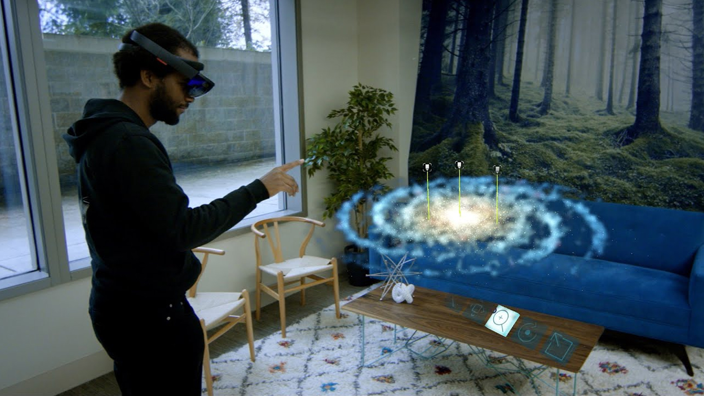

# Galaxy Explorer

**You shared your ideas. We’re sharing the code.**

The Galaxy Explorer Project is ready. You've shared your ideas with the community, chosen an app, watched a team build it, and now you can get the source code. If you have a device, the Galaxy Explorer Project is available for download from the Windows Store for Microsoft HoloLens.

>[!NOTE]
>This sample app was designed for HoloLens 1st gen. See [Galaxy Explorer 2.0](galaxy-explorer-update.md) for HoloLens 2 version.

Our HoloLens [development team](galaxy-explorer.md#meet-the-team) of designers, artists, and developers built Galaxy Explorer and invited all of you to be part of this journey with them. After six weeks of core development and two weeks of refinement, this app is now ready for you! You can also follow along our whole journey through the video series below.

 

>[!VIDEO https://www.youtube.com/embed/HsnH2Q7HxOA]

## Share your idea

The Galaxy Explorer journey begins with the "Share your idea" campaign.

 

>[!VIDEO https://www.youtube.com/embed/ZxGdW_ASrRc]

The Microsoft HoloLens community is bursting with spectacular ideas for how holographic computing will transform our world. We believe the most incredible HoloLens apps will come out of ideas you imagine together.

You shared over 5000 amazing ideas throughout those few weeks! Our development team reviewed the most successful and viable ideas and offered to build one of the top three ideas.

After a 24-hour Twitter poll, Galaxy Explorer was the winning idea! Our HoloLens development team of designers, artists, and developers built Galaxy Explorer and invited all of you to be part of this journey with them. You can follow the development process in the videos below.

## Ep 1: Trust the Process

>[!VIDEO https://www.youtube.com/embed/rIX2XrRQgDg]

In Episode 1, the development team begins the creative process: brainstorming, concepting, and deciding what to prototype.

## Ep 2: Let's Do This

>[!VIDEO https://www.youtube.com/embed/q1ee8a-84Ro]

In Episode 2, the development team completes the prototyping phase – tackling hard problems and figuring out which ideas to pursue further.

## Ep 3: Laying Foundations

>[!VIDEO https://www.youtube.com/embed/fUqni6C4nmo]

In Episode 3, the team starts the first week of development – creating a plan, writing production code, creating art assets, and figuring out the user interface.

## Ep 4: Make It Real

>[!VIDEO https://www.youtube.com/embed/ePA6hcaqoug]

In Episode 4, the team dives deeper into development – bringing in scientific data, optimizing the rendering process, and incorporating spatial mapping.

## Ep 5: See What Happens

>[!VIDEO https://www.youtube.com/embed/Up1EDRrCrho]

In Episode 5, the development team tests the app, searches for bugs that need to be fixed, and refines the experience.

## Ep 6: Coming to Life

>[!VIDEO https://www.youtube.com/embed/sMuJFKbylY4]

In Episode 6, the team finishes the last week of development, prepares for two weeks of polish work, and reflects on the progress they’ve made

## Ep 7: The Final Product

>[!VIDEO https://www.youtube.com/embed/HsnH2Q7HxOA]

In Episode 7, the team completes the project and shares their code.

## Case study

You can find even more insights and lessons from developing Galaxy Explorer by reading the ["Creating a galaxy in mixed reality" case study](../../out-of-scope/case-study-creating-a-galaxy-in-mixed-reality.md).

## Meet the team

 
*Galaxy Explorer development team*

We learned that building the right team is one of the most important investments we could make and decided to organize similarly to a game studio for those of you familiar with that development model. We chose to have 11 core team members to control scope, since we had a fixed timeframe (create something cool before Build on March 30, 2016).

For this project, we started with a producer, Jessica who conducted planning, reviewing progress, and keeping things running day to day. She's the one with pink hair. We had a design director (Jon) and a senior designer (Peter). They held the creative vision for Galaxy Explorer. Jon is the one in glasses in the front row, and Peter is the second from the right in the back.

We had three developers – BJ (between Jon and Jessica), Mike (second row on the left), and Karim (second row middle, next to BJ). They figured out the technical solutions needed to realize that creative vision.

We started out with four artists full-time – a concept artist (Jedd, second from left in the back), a modeler (Andy, third from right in the back), a technical artist (Alex (right-most person)) and an animator (Steve (left-most person). Each of them does more than that, too – but those are their primary responsibilities.

We had one full-time tester – Lena – who tested our builds every day, set up our build reviews, and reviewed features as they come online. Everyone tested constantly though, as we were always looking at our builds. Lena's the one rocking the leather jacket.

We're all a part of a larger studio here at Microsoft (think team in non-game development). There were a bunch of other people involved as well – we called on the talents of our art director, audio engineer, and studio leadership frequently throughout the project, but those folks were shared resources with other projects our broader team has.

## See also
* [Case study - Creating a galaxy in mixed reality](../../out-of-scope/case-study-creating-a-galaxy-in-mixed-reality.md)
* [Galaxy Explorer GitHub repo](https://github.com/Microsoft/GalaxyExplorer)
* [Galaxy Explorer 2.0](galaxy-explorer-update.md)
