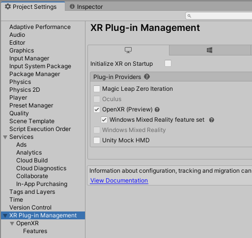
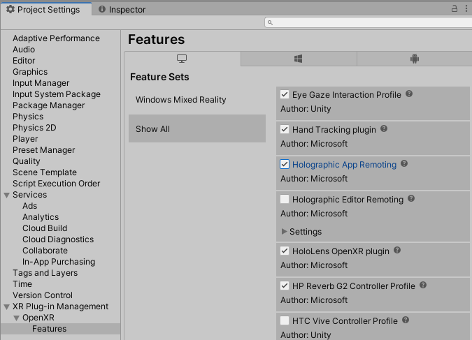

# Holographic Remoting in desktop app

> [!NOTE]
> Windows Standalone app remoting support was added in the 0.1.3 package release.
> As of version 0.1.3, this feature doesn’t support UWP builds.

1. Follow the steps in [Holographic Remoting setup](unity-play-mode.md#holographic-remoting-setup)
2. Open **Edit -> Project Settings**, navigate to **XR plug-in Management**, and check the **Windows Mixed Reality feature set** box. Also, uncheck **Initialize XR on Startup**:

    

3. Expand the **Features** section under **OpenXR** and select **Show All**
4. Check the **Holographic App Remoting** checkbox:

    

5. Next, write some code to set the remoting configuration and trigger XR initialization. The sample app distributed with the [Mixed Reality OpenXR Plugin](./xr-project-setup.md#unity-sample-projects-for-openxr-and-hololens-2) contains AppRemoting.cs, which shows an example scenario for connecting to a specific IP address at runtime. Deploying the sample app to a local machine at this point will display an IP address input field with a connect button. Typing an IP address and clicking Connect will initialize XR and attempt to connect to the target device:

    

6. To write custom connection code, call `Microsoft.MixedReality.OpenXR.Remoting.AppRemoting.Connect` with a filled-in `RemotingConfiguration`. The sample app exposes this in the inspector and shows how to fill in the IP address from a text field. Calling `Connect` will set the configuration and automatically initialize XR, which is why it must be called as a coroutine:

    ``` cs
    StartCoroutine(Remoting.AppRemoting.Connect(remotingConfiguration));
    ```

7. While running, you can obtain the current connection state with the `AppRemoting.TryGetConnectionState` API, and optionally disconnect and de-initialize XR using `AppRemoting.Disconnect()`. This could be used to disconnect and reconnect to a different device within the same app session. The sample app provides a tappable cube which will disconnect the remoting session if tapped.

### Migration from previous APIs

#### UnityEngine.XR.WSA.HolographicRemoting

From the sample code on [Unity's docs](https://docs.unity3d.com/2018.4/Documentation/ScriptReference/XR.WSA.HolographicRemoting.html):

| XR.WSA.HolographicRemoting | OpenXR.Remoting.AppRemoting |
| ---- | ---- |
| `HolographicRemoting.Connect(String)` | `AppRemoting.Connect(RemotingConfiguration)` |
| `HolographicRemoting.ConnectionState` | `AppRemoting.TryGetConnectionState(out ConnectionState, out DisconnectReason)`|
| `StartCoroutine(LoadDevice("WindowsMR"))`| [N/A: Automatically happens when calling `AppRemoting.Connect`]  |

#### Unity​Engine.​XR.​Windows​MR.WindowsMRRemoting

| XR.​Windows​MR.WindowsMRRemoting | OpenXR.Remoting.AppRemoting |
| ---- | ---- |
| `WindowsMRRemoting.Connect()` | `AppRemoting.Connect(RemotingConfiguration)` |
| `WindowsMRRemoting.Disconnect()` | `AppRemoting.Disconnect()` |
| `WindowsMRRemoting.TryGetConnectionState(out ConnectionState)` and `WindowsMRRemoting.TryGetConnectionFailureReason(out ConnectionFailureReason)`| `AppRemoting.TryGetConnectionState(out ConnectionState, out DisconnectReason)`|
| `WindowsMRRemoting.isAudioEnabled`, `WindowsMRRemoting.maxBitRateKbps`, `WindowsMRRemoting.remoteMachineName` | Passed into `AppRemoting.Connect` via the `RemotingConfiguration` struct |
| `WindowsMRRemoting.isConnected` | `AppRemoting.TryGetConnectionState(out ConnectionState state, out _) && state == ConnectionState.Connected`