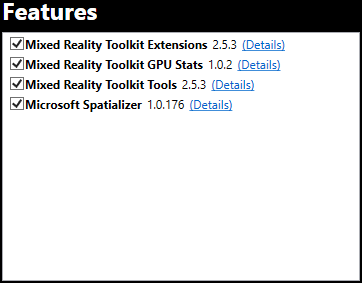
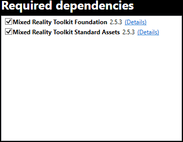
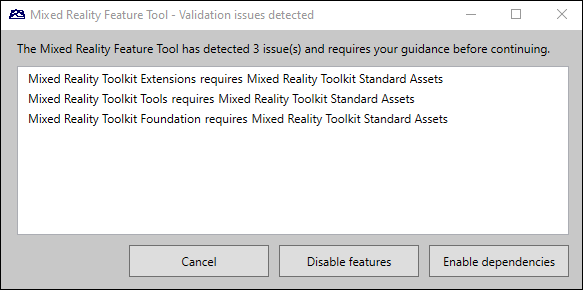
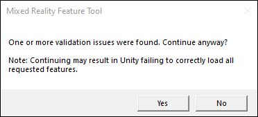

# Importing features

Once your features have been downloaded, they can be reviewed and imported into the Unity project. At this step, your application window should look like the following image:

## Features list

The **Features** list contains the collection of packages selected during discovery. Each feature can be selected or deselected before importing. Package details can be viewed using the **Details** link shown below

## Required dependencies list

The **Required dependencies** list contains the packages that one or more of the selected features requires to function. This list will also contain dependencies of dependencies. Each dependency can be selected or deselected before importing. Package details can be viewed using the **Details** link shown below

> [!NOTE]
> Deselecting required dependencies will result in one or more missing dependency errors when loading the project in Unity. These features won't be usable in the project.

## Validating selections

We highly recommend validating feature selections before importing. This step will raise any issues that are likely to impede successful project development.

The Mixed Reality Feature Tool provides two automatic issue resolutions, described in the following sections), and the option to cancel and resolve issues manually.

### Enable dependencies

The **Enable dependencies** button will automatically re-select the missing dependencies. This is true for dependencies that were explicitly selected (appear in the **Features** list) and those that were implicitly selected based on the requirements of the selected features.

### Disable features

Selecting **Disable features** will automatically deselect any feature that depends on one or more of the dependencies that have been unchecked. This is true for implicitly selected dependency packages and explicitly selected features.

## Importing

Select **Import** to add your selected features and give [final approval](reviewing-changes.md) before updating your target project.

> [!IMPORTANT]
> If a validation issue remains when importing, a warning message will be displayed. It is recommended to select No, click **Validate** and resolve any issues presented.
>
> 

## Going back to the previous step

From **Import features**, the Mixed Reality Feature Tool allows for navigating back to [discovery](discovering-features.md). Select **Go back** to download other feature packages.

## See also

- [Welcome to the Mixed Reality Feature Tool](welcome-to-mr-feature-tool.md)
- [Configuring the feature tool](configuring-feature-tool.md)
- [Discovery and acquisition](discovering-features.md)
- [Viewing feature package details](viewing-package-details.md)
- [Reviewing and approving project modifications](reviewing-changes.md)