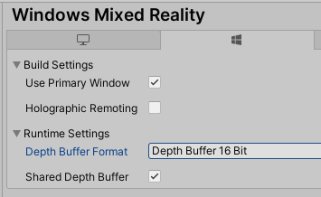
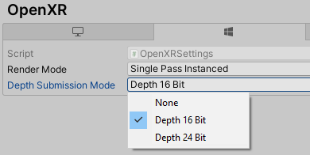
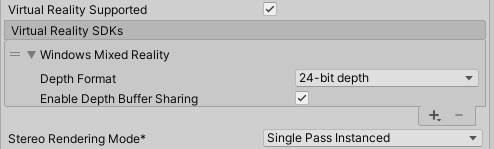

# [MRTK](#tab/mrtk)
<!-- NEVER CHANGE THE ABOVE LINE! -->

[MRTK's configuration dialog](https://docs.microsoft.com/windows/mixed-reality/mrtk-unity/configuration/mrtk-configuration-dialog) will attempt to set depth buffer settings for both XR SDK and legacy WSA, but it's good to check those tabs and verify the settings in Unity.

# [XR SDK](#tab/xr)
<!-- NEVER CHANGE THE ABOVE LINE! -->

To set whether your Unity app will provide a depth buffer to Windows:

1. Go to **Edit** > **Project Settings** > **XR Plug-in Management** and ensure the menu item is expanded.
2. Click on the menu item corresponding to the XR runtime you've chosen, either Windows Mixed Reality or OpenXR. Additionally, ensure the correct build platform is selected, as tabs for both Windows Standalone and Universal Windows Platform are available.
3. To enable and configure:
    1. For OpenXR, select either a depth format or "None" in the **Depth Submission Mode** dropdown.
    2. For Windows Mixed Reality, check or uncheck the **Shared Depth Buffer** check box. Then, select a format from the **Depth Buffer Format** dropdown.

> [!NOTE]
> It is generally recommended to use 16 bit depth buffers for improved performance. However, if using 16-bit depth format, stencil buffer required effects (like some Unity UI scroll panels) will not work because [Unity does not create a stencil buffer](https://docs.unity3d.com/ScriptReference/RenderTexture-depth.html) in this setting. Selecting *24-bit depth format* conversely will generally create an [8-bit stencil buffer](https://docs.unity3d.com/Manual/SL-Stencil.html) if applicable on the endpoint graphics platform.

# [Legacy WSA](#tab/wsa)
<!-- NEVER CHANGE THE ABOVE LINE! -->

To set whether your Unity app will provide a depth buffer to Windows:

1. Go to **Edit** > **Project Settings** > **Player** > **Universal Windows Platform tab** > **XR Settings**.
2. Expand the **Windows Mixed Reality SDK** item.
3. Check or uncheck the **Enable Depth Buffer Sharing** check box. Enable Depth Buffer Sharing is checked by default in new projects, but may have been unchecked by default in older projects.

A depth buffer can improve visual quality so long as Windows can accurately map the normalized per-pixel depth values in your depth buffer back to distances in meters, using the near and far planes you've set in Unity on the main camera. If your render passes handle depth values in typical ways, you should generally be fine here, though translucent render passes that write to the depth buffer while showing through to existing color pixels can confuse the reprojection.  If you know that your render passes will leave many of your final depth pixels with inaccurate depth values, you are likely to get better visual quality by unchecking "Enable Depth Buffer Sharing".

> [!NOTE]
> It is generally recommended to use 16 bit depth buffers for improved performance. However, if using 16-bit depth format, stencil buffer required effects (like some Unity UI scroll panels) will not work because [Unity does not create a stencil buffer](https://docs.unity3d.com/ScriptReference/RenderTexture-depth.html) in this setting. Selecting *24-bit depth format* conversely will generally create an [8-bit stencil buffer](https://docs.unity3d.com/Manual/SL-Stencil.html) if applicable on the endpoint graphics platform.