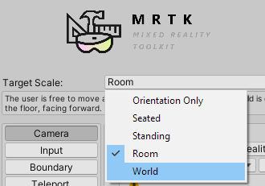
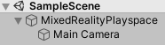
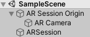

# [MRTK](#tab/mrtk)
<!-- NEVER CHANGE THE ABOVE LINE! -->

Follow this [step-by-step tutorial](../../tutorials/mr-learning-base-01.md) to add and automatically configure Mixed Reality Toolkit in your Unity project. It's also possible to work directly with the [MixedRealityPlayspace](https://docs.microsoft.com/dotnet/api/microsoft.mixedreality.toolkit.mixedrealityplayspace) class from MRTK for Unity and set the **Target Scale** to **World**:



MRTK should handle the position of the playspace and camera automatically, but it's good to double check:



1. From the **Hierarchy** panel, expand the **MixedRealityPlayspace** GameObject and find the **Main Camera** child object
2. In the **Inspector** panel, find the **Transform** component and change the **Position** to **(X: 0, Y: 0, Z: 0)**

# [XR SDK](#tab/xr)
<!-- NEVER CHANGE THE ABOVE LINE! -->

Set your tracking origin mode on the [XRInputSubsystem](https://docs.unity3d.com/Documentation/ScriptReference/XR.XRInputSubsystem.html). After obtaining the subsystem, call [TrySetTrackingOriginMode](https://docs.unity3d.com/Documentation/ScriptReference/XR.XRInputSubsystem.TrySetTrackingOriginMode.html):

```cs
xrInputSubsystem.TrySetTrackingOriginMode(TrackingOriginModeFlags.Device);
xrInputSubsystem.TrySetTrackingOriginMode(TrackingOriginModeFlags.Unbounded); // Recommendation for OpenXR
```

You can use [ARSession](https://docs.unity3d.com/Packages/com.unity.xr.arfoundation@2.1/manual/index.html#installing-ar-foundation) for HoloLens applications, which works better with anchors and ARKit/ARCore.



> [!IMPORTANT]
> AR Session and related features need AR Foundation installed.

It's also possible to apply the camera changes manually without using ARSession:

1. Select **Main Camera** in the **Hierarchy** panel
1. In the **Inspector** panel, find the **Transform** component and change the **Position** to **(X: 0, Y: 0, Z: 0)**

     
   *Camera in the Inspector pane in Unity*

1. Add a **TrackedPoseDriver** to the **Main Camera**

# [Legacy WSA](#tab/wsa)
<!-- NEVER CHANGE THE ABOVE LINE! -->

1. Select **Main Camera** in the **Hierarchy** panel
1. In the **Inspector** panel, find the **Transform** component and change the **Position** to **(X: 0, Y: 0, Z: 0)**

     
   *Camera in the Inspector pane in Unity*

1. Go to **Other Settings** section of the **Windows Store Player Settings**
1. Choose **Windows Mixed Reality** as the device, which may be listed as **Windows Holographic** in older versions of Unity
1. Select **Virtual Reality Supported**

Since the Main Camera object is automatically tagged as the camera, Unity powers all movement and translation.

>[!NOTE]
>These settings need to be applied to the Camera in each scene of your app.
>
>By default, when you create a new scene in Unity, it will contain a Main Camera GameObject in the Hierarchy which includes the Camera component, but may not have the settings properly applied.