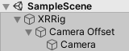

# [MRTK](#tab/mrtk)
<!-- NEVER CHANGE THE ABOVE LINE! -->

Use the [MixedRealityPlayspace](/dotnet/api/microsoft.mixedreality.toolkit.mixedrealityplayspace) class from MRTK for Unity and set the **Target Scale** to **Seated**:


MRTK should handle the position of the playspace and camera automatically, but it's good to double check:


1. From the **Hierarchy** panel, expand the **MixedRealityPlayspace** GameObject and find the **Main Camera** child object
2. In the **Inspector** panel, find the **Transform** component and change the **Position** to **(X: 0, Y: 0, Z: 0)**

# [XR SDK](#tab/xr)
<!-- NEVER CHANGE THE ABOVE LINE! -->

Set your tracking origin mode on the [XRInputSubsystem](https://docs.unity3d.com/Documentation/ScriptReference/XR.XRInputSubsystem.html). After obtaining the subsystem, call [TrySetTrackingOriginMode](https://docs.unity3d.com/Documentation/ScriptReference/XR.XRInputSubsystem.TrySetTrackingOriginMode.html):

```cs
xrInputSubsystem.TrySetTrackingOriginMode(TrackingOriginModeFlags.Device);
```

And work with Unity's [XRRig](https://docs.unity3d.com/Manual/configuring-project-for-xr.html).



# [Legacy WSA](#tab/wsa)
<!-- NEVER CHANGE THE ABOVE LINE! -->

1. Go to **Other Settings** section of the **Windows Store Player Settings**
2. Choose **Windows Mixed Reality** as the device, which may be listed as **Windows Holographic** in older versions of Unity
3. Select **Virtual Reality Supported**

Since the Main Camera object is automatically tagged as the camera, Unity powers all movement and translation.

>[!NOTE]
>These settings need to be applied to the Camera in each scene of your app.
>
>By default, when you create a new scene in Unity, it will contain a Main Camera GameObject in the Hierarchy which includes the Camera component, but does not have the settings below properly applied.

**Namespace:** *UnityEngine.XR*<br>
**Type:** *XRDevice*

To build an **orientation-only** or **seated-scale experience**, you need to set Unity to the Stationary tracking space type. Stationary tracking space sets Unity's world coordinate system to track the [stationary frame of reference](../../../../design/coordinate-systems.md#spatial-coordinate-systems). In the Stationary tracking mode, content placed in the editor just in front of the camera's default location (forward is -Z) will appear in front of the user when the app launches.

```cs
XRDevice.SetTrackingSpaceType(TrackingSpaceType.Stationary);
```

**Namespace:** *UnityEngine.XR*<br>
**Type:** *InputTracking*

For a pure **orientation-only experience** such as a 360-degree video viewer (where positional head updates would ruin the illusion), you can then set [XR.InputTracking.disablePositionalTracking](https://docs.unity3d.com/ScriptReference/XR.InputTracking-disablePositionalTracking.html) to true:

```cs
InputTracking.disablePositionalTracking = true;
```

For a **seated-scale experience**, to let the user later recenter the seated origin, you can call the [XR.InputTracking.Recenter](https://docs.unity3d.com/ScriptReference/XR.InputTracking.Recenter.html) method:

```cs
InputTracking.Recenter();
```

If you're building a [seated-scale experience](../../../../design/coordinate-systems.md), you can recenter Unity's world origin at the user's current head position by calling the **[XR.InputTracking.Recenter](https://docs.unity3d.com/ScriptReference/XR.InputTracking.Recenter.html)** method.