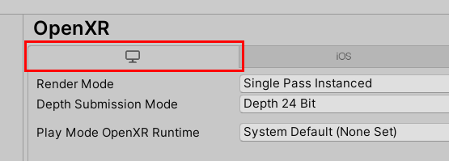
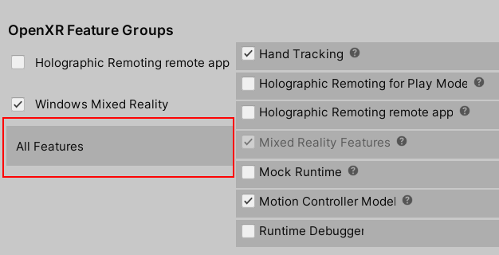

# [Unity 2020 + OpenXR](#tab/openxr)
<!-- This is inserted into "preview and debug -->
1. On your HoloLens, go to the **Microsoft Store** and install the **[Holographic Remoting Player](https://www.microsoft.com/store/p/holographic-remoting-player/9nblggh4sv40)** app.
1. On your HoloLens, launch and play the Holographic Remoting Player app. Note that on the Start menu, the tile for the app says **Holographic Remoting**. After launching the app, make sure to press the "Play" button on the app's interface. 
1. In Unity, on the menu bar, select **Mixed Reality** > **Remoting** > **Holographic remoting for play mode**.

    

1. In the **Holographic Remoting for Play Mode** window, in the **Remote Host Name** box, enter the IP address of your HoloLens.

    > [!TIP]
    > To find the IP address on your HoloLens, go to **Settings** > **Update & Security** > **For Developers** and then look in the last section under **Device Portal**. (Your IP address through USB is listed under **Ethernet**.)

1. Change other settings as needed.
1. Click the **Enable Holographic Remoting for Play Mode** button.
1. Close the **Holographic Remoting for Play Mode** window. The editor will attempt to connect once Play Mode is started.
1. On the menu bar, select **Edit** > **Project Settings**.
1. In the left-side column, under **XR Plug-in Management**, select **OpenXR**.
1. In the **OpenXR** panel, ensure that you're in the **PC, Mac & Linux Standalone settings** tab.

    

1. Under **OpenXR Feature Groups**, the three items in the left-side column are selectable. Make sure **All Features** is selected.

    

1. To the right of **All Features**, select **Holographic Remoting for Play Mode** if it's not already selected.
1. Close the **Project Settings** window.
1. Select the Play button to enter Play Mode, and then view the app in your HoloLens.

    > [!TIP]
    > To debug C# scripts in play mode, [attach Visual Studio to Unity](/visualstudio/gamedev/unity/get-started/using-visual-studio-tools-for-unity?pivots=windows).

# [Unity 2019/2020 + Windows XR Plugin](#tab/winxr)

1. On your HoloLens, go to the **Microsoft Store** and install the **[Holographic Remoting Player](https://www.microsoft.com/store/p/holographic-remoting-player/9nblggh4sv40)** app.
2. On your HoloLens, start the **Holographic Remoting Player** app.
3. In Unity, go to the **Edit** menu and select **Project Settings**.
4. Select **XR Plug-in Management**.
5. Ensure the **PC, Mac & Linux Standalone** tab is selected, find **Windows Mixed Reality** in the list, and check its checkbox.
6. Next, go to the **Window** menu, expand the **XR** submenu, and select **Windows XR Plugin Remoting**.
7. Set **Emulation Mode** to **Remote to Device**.
8. For **Remote Machine**, enter the IP address of your HoloLens.
9. To connect, either:
   1. To manually connect, uncheck **Connect on Play**, and select **Connect**. You should see **Connection Status** change to **Connected** and see the screen go blank in the HoloLens.
   2. To automatically connect, check **Connect on Play**. The editor will attempt to connect once Play Mode is started.
10. Select the **Play** button to start Play Mode and experience the app on your HoloLens. To debug C# scripts in play mode, [attach Visual Studio to Unity](/visualstudio/gamedev/unity/get-started/using-visual-studio-tools-for-unity?pivots=windows).

# [Legacy WSA](#tab/wsa)

1. On your HoloLens, go to the **Microsoft Store** and install the **[Holographic Remoting Player](https://www.microsoft.com/store/p/holographic-remoting-player/9nblggh4sv40)** app.
1. On your HoloLens, start the **Holographic Remoting Player** app.
1. In Unity, go to the **Window** menu, expand the **XR** submenu, and select **Holographic Emulation** (marked as deprecated in Unity 2019).
1. Set **Emulation Mode** to **Remote to Device**.
1. Set **Device Version** according to if you're using a first generation HoloLens or a HoloLens 2.
1. For **Remote Machine**, enter the IP address of your HoloLens.
1. Select **Connect**. You should see **Connection Status** change to **Connected** and see the screen go blank in the HoloLens.
1. Select the **Play** button to start Play Mode and experience the app on your HoloLens. To debug C# scripts in play mode, [attach Visual Studio to Unity](/visualstudio/gamedev/unity/get-started/using-visual-studio-tools-for-unity?pivots=windows).
