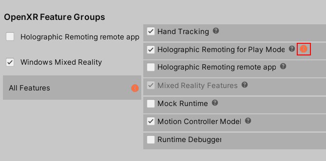

# [Unity 2020 + OpenXR](#tab/openxr)
<!-- This is inserted into "preview and debug -->
1. On your HoloLens, go to the **Microsoft Store** and install the **[Holographic Remoting Player](https://www.microsoft.com/store/p/holographic-remoting-player/9nblggh4sv40)** app.
1. On your HoloLens, start the **Holographic Remoting Player** app.
1. In Unity, on the menu bar, select **Edit** > **Project Settings**.
1. In the left-side column, select **XR Plug-in Management**.
1. Ensure the **PC, Mac & Linux Standalone settings** tab is selected (you can hover the cursor over a tab to see its name), and then select **OpenXR**.
1. Two feature groups are now displayed underneath**OpenXR**. Select **Windows Mixed Reality feature group**.
1. In the left-side column under **XR Plug-in Management**, select **OpenXR**.
1. Ensure that you're still in the **PC, Mac & Linux Standalone settings** tab, and then, under **OpenXR Feature Groups**, make sure **All Features** is selected.
1. To the right of **All Features**, select **Holographic Remoting for Play Mode**.

## Fixing Incompatible Settings

At this point, you might see a red warning symbol next to **Holographic Remoting for Play Mode**. 

    

If so, complete the steps below and then close the **Project Settings** window. If you don't see the symbol, close the **Project Settings** window and continue on.

1. On the menu bar, select **Window** > **XR** **Holographic remoting for play mode**.

    

1. Click **Enable Holographic Remoting for Play Mode**.

    

1. If errors appear, click the **Fix** button.
1. For **Remote Host Name**, enter the IP address of your HoloLens.
1. Change other settings as needed. The editor will attempt to connect once Play Mode is started.
1. Close the **Holographic Remoting for Play Mode** window.
1. Select the **Play** button to start Play Mode and experience the app on your HoloLens. To debug C# scripts in play mode, [attach Visual Studio to Unity](/visualstudio/gamedev/unity/get-started/using-visual-studio-tools-for-unity?pivots=windows).

# [Unity 2019/2020 + Windows XR Plugin](#tab/winxr)

1. On your HoloLens, go to the **Microsoft Store** and install the **[Holographic Remoting Player](https://www.microsoft.com/store/p/holographic-remoting-player/9nblggh4sv40)** app.
1. On your HoloLens, start the **Holographic Remoting Player** app.
1. In Unity, go to the **Edit** menu and select **Project Settings**.
1. Select **XR Plug-in Management**.
1. Ensure the **PC, Mac & Linux Standalone** tab is selected, find **Windows Mixed Reality** in the list, and check its checkbox.
1. Next, go to the **Window** menu, expand the **XR** submenu, and select **Windows XR Plugin Remoting**.
1. Set **Emulation Mode** to **Remote to Device**.
1. For **Remote Machine**, enter the IP address of your HoloLens.
1. To connect, either:
   1. To manually connect, uncheck **Connect on Play**, and select **Connect**. You should see **Connection Status** change to **Connected** and see the screen go blank in the HoloLens.
   1. To automatically connect, check **Connect on Play**. The editor will attempt to connect once Play Mode is started.
1. Select the **Play** button to start Play Mode and experience the app on your HoloLens. To debug C# scripts in play mode, [attach Visual Studio to Unity](/visualstudio/gamedev/unity/get-started/using-visual-studio-tools-for-unity?pivots=windows).

# [Legacy WSA](#tab/wsa)

1. On your HoloLens, go to the **Microsoft Store** and install the **[Holographic Remoting Player](https://www.microsoft.com/store/p/holographic-remoting-player/9nblggh4sv40)** app.
1. On your HoloLens, start the **Holographic Remoting Player** app.
1. In Unity, go to the **Window** menu, expand the **XR** submenu, and select **Holographic Emulation** (marked as deprecated in Unity 2019).
1. Set **Emulation Mode** to **Remote to Device**.
1. Set **Device Version** according to if you're using a first generation HoloLens or a HoloLens 2.
1. For **Remote Machine**, enter the IP address of your HoloLens.
1. Select **Connect**. You should see **Connection Status** change to **Connected** and see the screen go blank in the HoloLens.
1. Select the **Play** button to start Play Mode and experience the app on your HoloLens. To debug C# scripts in play mode, [attach Visual Studio to Unity](/visualstudio/gamedev/unity/get-started/using-visual-studio-tools-for-unity?pivots=windows).
