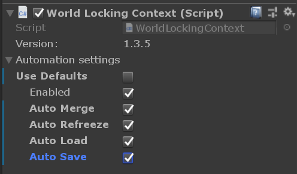
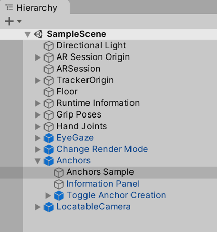
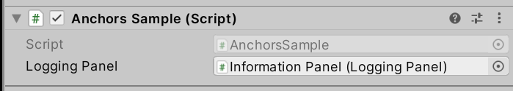

# [World Locking Tools (Recommended)](#tab/wlt)

By default, World Locking Tools will restore Unity's coordinate system relative to the physical world across sessions on devices that support persistence of local spatial anchors. In order to have a hologram appear in the same place in the physical world after quitting and re-running the application, the hologram only needs to have the same pose again.



If the application needs finer control, **Auto-Save** and **Auto-Load** may be disabled in the inspector, and persistence managed from a script as described in the [persistence section of the documentation](https://docs.microsoft.com/en-us/mixed-reality/world-locking-tools/documentation/concepts/advanced/persistence.md).

Local anchor persistence is currently only supported on the HoloLens family of devices. However, on Android and iOS, as well as HoloLens, persistence of coordinate spaces across sessions, as well as sharing coordinate spaces across devices, is supported via an integration with Azure Spatial Anchors. There is an abundance of [further information and samples](https://docs.microsoft.com/en-us/mixed-reality/world-locking-tools/documentation/howtos/wlt_asa.md) of using World Locking Tools in tandem with Azure Spatial Anchors.

# [ARAnchorManager](#tab/anchorstore)

An additional API called the **XRAnchorStore** enables anchors to be persisted between sessions. The XRAnchorStore is a representation of the saved anchors on a device. Anchors can be persisted from **ARAnchors** in the Unity scene, loaded from storage into new **ARAnchors**, or deleted from storage.

> [!NOTE]
> These anchors are to be saved and loaded on the same device. Cross-device anchors are supported through [Azure Spatial Anchors](/windows/mixed-reality/develop/unity/shared-experiences-in-unity#azure-spatial-anchors).

### Namespaces

For **Unity 2020 and OpenXR**:

```cs
using Microsoft.MixedReality.ARSubsystems.XRAnchorStore
```

or **Unity 2019/2020 + Windows XR Plugin**:

```cs
using UnityEngine.XR.WindowsMR.XRAnchorStore
```

### Public methods

```cs
{
    // A list of all persisted anchors, which can be loaded.
    public IReadOnlyList<string> PersistedAnchorNames { get; }

    // Clear all persisted anchors
    public void Clear();

    // Load a single persisted anchor by name. The ARAnchorManager will create this new anchor and report it in
    // the ARAnchorManager.anchorsChanged event. The TrackableId returned here is the same TrackableId the
    // ARAnchor will have when it is instantiated.
    public TrackableId LoadAnchor(string name);

    // Attempts to persist an existing ARAnchor with the given TrackableId to the local store. Returns true if
    // the storage is successful, false otherwise.
    public bool TryPersistAnchor(TrackableId id, string name);

    // Removes a single persisted anchor from the anchor store. This will not affect any ARAnchors in the Unity
    // scene, only the anchors in storage.
    public void UnpersistAnchor(string name);
}
```

### Getting an anchor store reference

To load the XRAnchorStore with **Unity 2020 and OpenXR**, use extension method on the XRAnchorSubsystem, the subsystem of an ARAnchorManager:

``` cs
public static Task<XRAnchorStore> LoadAnchorStoreAsync(this XRAnchorSubsystem anchorSubsystem)
```

To load the XRAnchorStore with **Unity 2019/2020 and the Windows XR Plugin**, use the extension method on the XRReferencePointSubsystem (Unity 2019) or XRAnchorSubsystem (Unity 2020), the subsystem of an ARReferencePointManager/ARAnchorManager:

```cs
// Unity 2019 + Windows XR Plugin
public static Task<XRAnchorStore> TryGetAnchorStoreAsync(this XRReferencePointSubsystem anchorSubsystem);

// Unity 2020 + Windows XR Plugin
public static Task<XRAnchorStore> TryGetAnchorStoreAsync(this XRAnchorSubsystem anchorSubsystem);
```

### Loading an anchor store

To load an anchor store in **Unity 2020 and OpenXR**, access it from an ARAnchorManager's subsystem as follows:

``` cs
ARAnchorManager arAnchorManager = GetComponent<ARAnchorManager>();
XRAnchorStore anchorStore = await arAnchorManager.subsystem.LoadAnchorStoreAsync();
```

or with **Unity 2019/2020 and the Windows XR Plugin**:

``` cs
// Unity 2019
ARReferencePointManager arReferencePointManager = GetComponent<ARReferencePointManager>();
XRAnchorStore anchorStore = await arReferencePointManager.subsystem.TryGetAnchorStoreAsync();

// Unity 2020
ARAnchorManager arAnchorManager = GetComponent<ARAnchorManager>();
XRAnchorStore anchorStore = await arAnchorManager.subsystem.TryGetAnchorStoreAsync();
```

To see a full example of persisting / unpersisting anchors, check out the Anchors -> Anchors Sample GameObject and AnchorsSample.cs script in the [Mixed Reality OpenXR Plugin Sample Scene](../../xr-project-setup.md#unity-sample-projects-for-openxr-and-hololens-2):





# [WorldAnchor](#tab/worldanchor)

The **WorldAnchorStore** is the key to creating holographic experiences where holograms stay in specific real world positions across instances of the application. Users can then pin individual holograms wherever they want, and find them later in the same spot over many uses of your app.

**Namespace:** *UnityEngine.XR.WSA.Persistence*<br>
**Class:** *WorldAnchorStore*

The WorldAnchorStore will allow you to persist the location of WorldAnchor's across sessions. To actually persist holograms across sessions, you'll need to separately keep track of your GameObjects that use a particular world anchor. It often makes sense to create a GameObject root with a world anchor and have children holograms anchored by it with a local position offset.

To load holograms from previous sessions:

1. Get the WorldAnchorStore
2. Load app data relating to the world anchor, which gives you the ID of the world anchor
3. Load a world anchor from its ID

To save holograms for future sessions:

1. Get the WorldAnchorStore
2. Save a world anchor specifying an ID
3. Save app data relating to the world anchor along with an ID

### Getting the WorldAnchorStore

You'll want to keep a reference to the WorldAnchorStore so you know when it's ready to perform an operation. Since this is an async call, potentially as soon as start up, you want to call:

```cs
WorldAnchorStore.GetAsync(StoreLoaded);
```

StoreLoaded in this case is our handler for when the WorldAnchorStore has completed loading:

```cs
private void StoreLoaded(WorldAnchorStore store)
{
    this.store = store;
}
```

We now have a reference to the WorldAnchorStore, which we'll use to save and load specific World Anchors.

### Saving a WorldAnchor

To save, we simply need to name what we are saving and pass it in the WorldAnchor we got before when we want to save. Note: trying to save two anchors to the same string will fail (store.Save will return false). Delete the previous save before saving the new one:

```cs
private void SaveGame()
{
    // Save data about holograms positioned by this world anchor
    if (!this.savedRoot) // Only Save the root once
    {
        this.savedRoot = this.store.Save("rootGameObject", anchor);
        Assert(this.savedRoot);
    }
}
```

### Loading a WorldAnchor

And to load:

```cs
private void LoadGame()
{
    // Save data about holograms positioned by this world anchor
    this.savedRoot = this.store.Load("rootGameObject", rootGameObject);
    if (!this.savedRoot)
    {
        s// We didn't actually have the game root saved! We have to re-place our objects or start over
    }
}
```

We additionally can use store.Delete() to remove an anchor we previously saved and store.Clear() to remove all previously saved data.

### Enumerating Existing Anchors

To discover previously stored anchors, call GetAllIds.

```cs
string[] ids = this.store.GetAllIds();
for (int index = 0; index < ids.Length; index++)
{
    Debug.Log(ids[index]);
}
```

## Persisting holograms for multiple devices

You can use <a href="/azure/spatial-anchors/overview" target="_blank">Azure Spatial Anchors</a> to create a durable cloud anchor from a local WorldAnchor, which your app can then locate across multiple HoloLens, iOS and Android devices, even if those devices aren't present together at the same time.  Because cloud anchors are persistent, multiple devices over time can each see content rendered relative to that anchor in the same physical location.

To get started building shared experiences in Unity, try out the 5-minute <a href="/azure/spatial-anchors/unity-overview" target="_blank">Azure Spatial Anchors Unity quickstarts</a>.

Once you're up and running with Azure Spatial Anchors, you can then <a href="/azure/spatial-anchors/concepts/create-locate-anchors-unity" target="_blank">create and locate anchors in Unity</a>.
