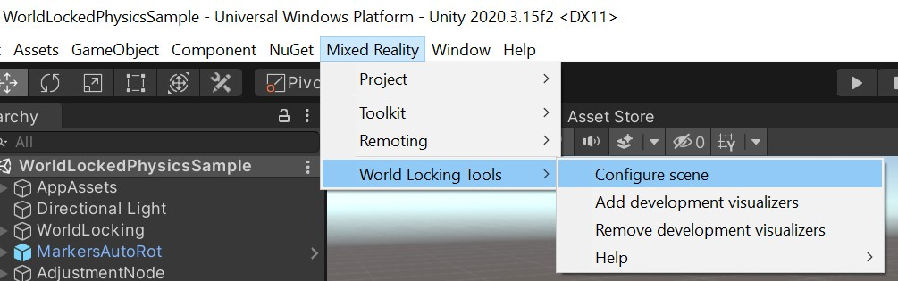

# [World Locking Tools (Recommended)](#tab/wlt)

To get started using the World Locking Tools, [download the Mixed Reality Feature Tool](../../welcome-to-mr-feature-tool.md). To learn more about the basics, see the main World Locking Tools documentation page for links to Overview, Quickstart, and other useful topics.

> [!div class="nextstepaction"]
> [World Locking Tools documentation](/mixed-reality/world-locking-tools/)

### Automated setup

When your project is ready to go, run the configure scene utility from **Mixed Reality > World Locking Tools**:



> [!IMPORTANT]
> The Configure scene utility can be rerun at any time. For example, it should be rerun if the AR target has been changed from Legacy to XR SDK. If the scene is already properly configured, running the utility has no effect.

### Visualizers

During early development, adding visualizers can be helpful to ensure WLT is setup and working properly. They can be removed for production performance, or if for any reason are no longer needed, using the Remove visualizers utility. More details on the visualizers can be found in the [Tools documentation](/mixed-reality/world-locking-tools/documentation/howtos/tools#visualizers).

# [ARAnchorManager](#tab/anchorstore)

The Mixed Reality OpenXR Plugin supplies basic anchor functionality through an implementation of Unity’s ARFoundation **ARAnchorManager**. To learn the basics on ARAnchors in ARFoundation, visit the [ARFoundation Manual for AR Anchor Manager](https://docs.unity3d.com/Packages/com.unity.xr.arfoundation@4.1/manual/anchor-manager.html). 

# [WorldAnchor](#tab/worldanchor)

**Namespace:** *UnityEngine.XR.WSA*<br>
**Type:** *WorldAnchor*

A key technique is to create a [spatial anchor](../../../../design/coordinate-systems.md#spatial-anchors) to lock a cluster of holograms precisely in place in the physical world, no matter how far the user has roamed, and then [find those holograms again in later sessions](../../../../design/coordinate-systems.md#spatial-anchor-persistence).

In older Unity versions, you create a spatial anchor by adding the **WorldAnchor** Unity component to a GameObject.

### Add a World Anchor

To add a world anchor, call `AddComponent<WorldAnchor>()` on the game object with the transform you want to anchor in the real world.

```cs
WorldAnchor anchor = gameObject.AddComponent<WorldAnchor>();
```

This game object is now anchored to its current location in the physical world. You might see its Unity world coordinates adjust slightly over time to ensure physical alignment. See [load a world anchor](#persistent-world-locking) to find this anchored location again in a future app session.

### Remove a World Anchor

If you no longer want the `GameObject` locked to a physical world location and don't intend on moving it this frame, call `Destroy` on the World Anchor component.

```cs
Destroy(gameObject.GetComponent<WorldAnchor>());
```

If you want to move the `GameObject` this frame, call `DestroyImmediate` instead.

```cs
DestroyImmediate(gameObject.GetComponent<WorldAnchor>());
```

### Move a World Anchored GameObject

You can't move a `GameObject` while a World Anchor is on it. If you need to move the `GameObject` this frame, you need to:

1. `DestroyImmediate` the World Anchor component.
2. Move the `GameObject`.
3. Add a new World Anchor component to the `GameObject`.

```cs
DestroyImmediate(gameObject.GetComponent<WorldAnchor>());
gameObject.transform.position = new Vector3(0, 0, 2);
WorldAnchor anchor = gameObject.AddComponent<WorldAnchor>();
```

### Handle locatability changes

A World Anchor might not be locatable in the physical world at a point in time. Unity then won't update the transform of the anchored object. This situation can also happen while an app is running. Failure to handle the change in locatability causes the object to not appear in the correct physical location in the world.

To be notified about locatability changes:

1. Subscribe to the `OnTrackingChanged` event. The `OnTrackingChanged` event is called whenever the underlying spatial anchor changes between a state of being locatable or not being locatable.
   
   ```cs
   anchor.OnTrackingChanged += Anchor_OnTrackingChanged;
   ```

1. Handle the event.

   ```cs
   private void Anchor_OnTrackingChanged(WorldAnchor self, bool located)
   {
       // This simply activates/deactivates this object and all children when tracking changes
       self.gameObject.SetActiveRecursively(located);
   }
   ```

If anchors are located immediately, the `isLocated` property of the anchor is set to `true` when `AddComponent<WorldAnchor>()` returns. Therefore, the `OnTrackingChanged` event isn't triggered. A cleaner pattern is to call the `OnTrackingChanged` handler with the initial `IsLocated` state after attaching an anchor.

```cs
Anchor_OnTrackingChanged(anchor, anchor.isLocated);
```
