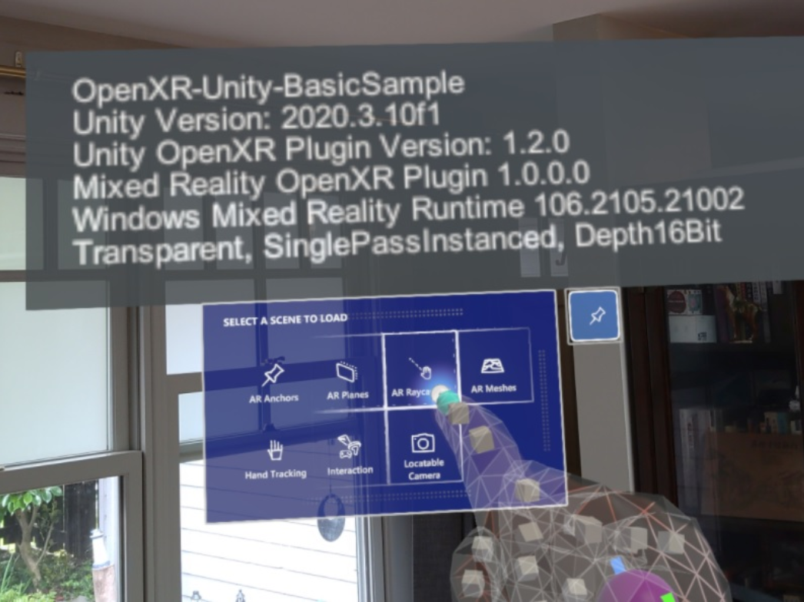

# [OpenXR](#tab/openxr)

The Mixed Reality OpenXR plugin is **Microsoft's recommendation** for Unity 2020 LTS or later. As new features are developed in the future, they will only be included in the Mixed Reality OpenXR plugin going forward.

The Mixed Reality OpenXR plugin fully supports AR Foundation 4.0, providing ARPlaneManager and ARRaycastManager implementations. This enables you to write raycasting code once that then spans HoloLens 2 and ARCore/ARKit phones and tablets.

### Prerequisites 

* Latest [tools for HoloLens 2 development](../../../install-the-tools.md?tabs=unity#installation-checklist)
* Latest Unity 2020.3 LTS: version 2020.3.8f1 or later

### Recommended package versions

The instructions in this page will set you up with the core Unity OpenXR packages required to deploy HoloLens 2 or Windows Mixed Reality apps:

* Unity OpenXR plugin: version 1.2 or later
* Mixed Reality OpenXR plugin: version 1.0.0 or later

If you use the following packages in your project, you will need to ensure that you use at least the minimum versions listed below:

* MRTK: version 2.7.2 or later
* Universal Render Pipeline (URP): version 10.5.1 or later
* Azure Spatial Anchors: version 2.10 or later
* Azure Remote Rendering: version 1.0.15 or later

<!--  -->

> [!NOTE]
> If you're building VR applications on Windows PC, the Mixed Reality OpenXR plugin is not necessarily required. However, you'll want to install the plugin if you're customizing controller mapping for HP Reverb G2 controllers or building apps that work on both HoloLens 2 and VR headsets.

# [Windows XR](#tab/windowsxr)

Microsoft doesn't recommend using the Windows XR plugin for any new projects in Unity 2020.

However, if you're using Unity 2019 and you need AR Foundation 2.0 for compatibility with ARCore/ARKit devices, this plugin enables that support.

> [!IMPORTANT]
> Using this plugin in Unity 2019 is not compatible with Azure Spatial Anchors.

# [Legacy XR](#tab/legacy)

If you're still on Unity 2019 or earlier, Microsoft recommends using the Legacy Built-in XR support.

While the Windows XR plugin is functional on Unity 2019, it's not recommended because this plugin is not compatible with Azure Spatial Anchors on Unity 2019.