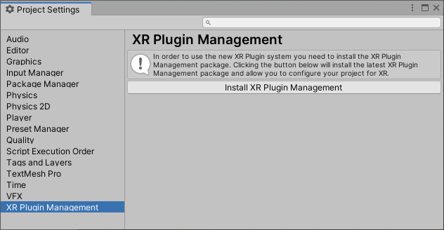
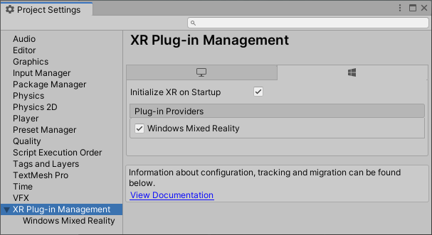
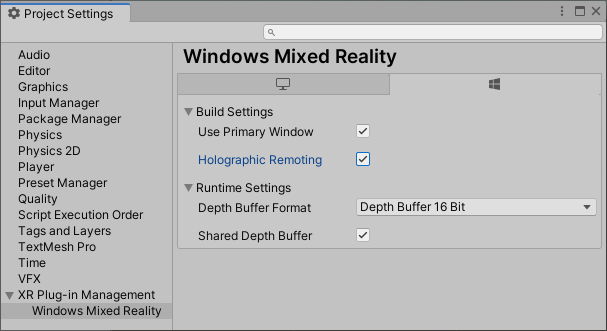
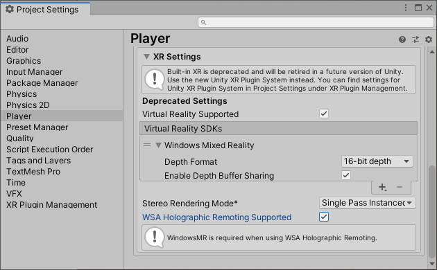

# [OpenXR](#tab/openxr)

If you're using the latest and greatest OpenXR in your Unity projects, check out our [getting started](../../openxr-getting-started.md) and [supported features](../../openxr-supported-features.md) documentation.

# [Windows XR](#tab/windowsxr)

If you're targeting Desktop VR, we suggest using the PC Standalone Platform selected by default on a new Unity project:

If you're targeting HoloLens 2, you need to switch to the Universal Windows Platform:

1.	Select **File > Build Settings...**
2.	Select **Universal Windows Platform** in the Platform list and select **Switch Platform**
3.	Set **Architecture** to **ARM 64**
4.	Set **Target device** to **HoloLens**
5.	Set **Build Type** to **D3D**
6.	Set **UWP SDK** to **Latest installed**
7.	Set **Build configuration** to **Release** because there are known performance issues with Debug

After setting your platform, you need to let Unity know to create an [immersive view](../../../../design/app-views.md) instead of a 2D view when exported:

1. In the Unity Editor, navigate to **Edit > Project settings** and select **XR Plugin Management**

2. Select **Install XR Plugin Management**

3. Select **Initialize XR on Startup** and **Windows Mixed Reality**

4. Expand the **XR Plug-in Management** section and select **Univeral Windows Platform Settings** tab
5. If you're using Unity 2020 or later, you'll see the options to check **OpenXR** or **Windows Mixed Reality**. 
    * You can choose either runtime.  If you're specifically developing for the HoloLens 2 or the HP Reverb G2 and decide to try the **OpenXR**, select the OpenXR box and review our guide to [Using the Mixed Reality OpenXR Plugin for Unity](../../openxr-getting-started.md) to get yourself set up correctly for these devices before returning to this tutorial

> [!NOTE]
> Starting in Unity 2020 LTS, Microsoft is embracing development with OpenXR.  As we migrate to this path, in Unity 2021.1 the Windows XR plugin will be deprecated and removed in 2021.2 making OpenXR the only supported path. You can find more information in [Using the Mixed Reality OpenXR plugin](../../openxr-getting-started.md).

6. If you decide to choose the **Windows Mixed Reality** plugin, check all boxes and set **Depth Submission Mode** to **Depth 16 Bit**

# [Legacy XR](#tab/legacy)

If you're targeting Desktop VR, we suggest using the PC Standalone Platform selected by default on a new Unity project:

If you're targeting HoloLens 2, you need to switch to the Universal Windows Platform:

1.	Select **File > Build Settings...**
2.	Select **Universal Windows Platform** in the Platform list and select **Switch Platform**
3.	Set **Architecture** to **ARM 64**
4.	Set **Target device** to **HoloLens**
5.	Set **Build Type** to **D3D**
6.	Set **UWP SDK** to **Latest installed**
7.	Set **Build configuration** to **Release** because there are known performance issues with Debug

After setting your platform, you need to let Unity know to create an [immersive view](../../../../design/app-views.md) instead of a 2D view when exported.

> [!CAUTION]
> Legacy XR is deprecated in Unity 2019 and removed in Unity 2020.

1. Open **Player Settings...** from the **Build Settings... window** and expand the **XR Settings** group
2. In the **XR Settings** section, select **Virtual Reality Supported** to add the Virtual Reality Devices list
3. Set **Depth Format** to **16-bit Depth** and enable **Depth Buffer Sharing**
4. Set **Stereo Rendering Mode** to **Single Pass Instance**
5. Select **WSA Holographic Remoting Supported** if you'd like to use Holographic remoting 

