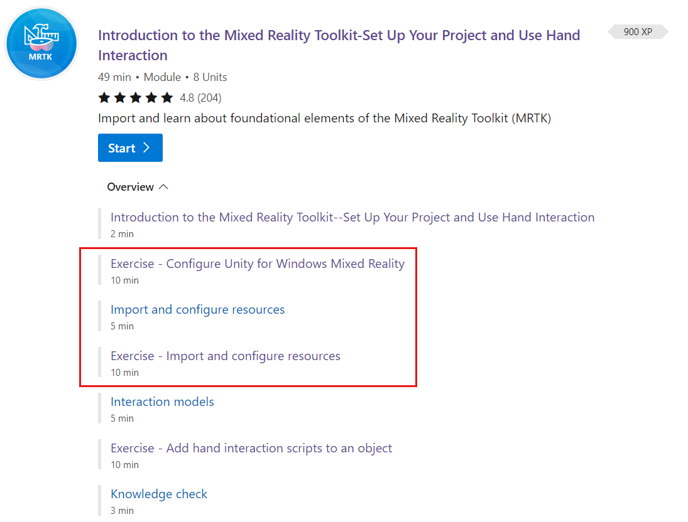
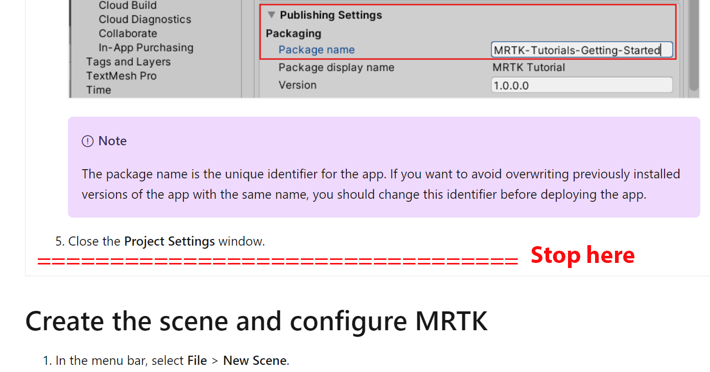

# [OpenXR](#tab/openxr)

To get started with a **new Unity project** using MRTK:
1. [Go to the HoloLens Fundamentals learning path.](/learn/paths/beginner-hololens-2-tutorials/?tabs=openxr) 
1. Scroll down to the first module in the learning path, "Introduction to the Mixed Reality Toolkit--Set Up Your Project and Use Hand Interaction."
1. Click the link to the second unit in the learn module, which is named **Exercise--Configure Unity for Windows Mixed Reality.**.
1. Complete that unit and the two units that follow,**Import and configure resources** and **Exercise--Import and configure resources**.

    

    In the third unit, stop after this step: "5. Close the project settings window." The instructions that follow to create the scene and configure MRTK are not necessary for OpenXR setup.



If you're upgrading an **existing MRTK project to OpenXR**, you'll first want to upgrade MRTK-Unity to the latest version (version 2.7.2 or later) to get key fixes for compatibility with the Mixed Reality OpenXR plugin.  Use the [Mixed Reality Feature Tool](../../welcome-to-mr-feature-tool.md) to upgrade to the latest version of MRTK and then follow the [manual OpenXR setup steps below](#manual-setup-without-mrtk). See the MRTK documentation for [more in-depth information on migrating an existing MRTK project to OpenXR](/windows/mixed-reality/mrtk-unity/configuration/getting-started-with-mrtk-and-xrsdk#configuring-mrtk-for-the-xr-sdk-pipeline).

> [!NOTE]
> When upgrading from a previous version of MRTK older than **2.5.3**, ensure the following line is in the **Assets/MixedRealityToolkit.Generated/link.xml** file:
>
> ```xml
> <assembly fullname = "Microsoft.MixedReality.Toolkit.Providers.OpenXR" preserve="all"/>
> ```
>
> This line will be added by default if you started with MRTK 2.5.4 or newer.

# [Windows XR](#tab/windowsxr)

To get started with a **new Unity project** using MRTK, start from step 2 in the MRTK tutorial:

> [!div class="nextstepaction"]
> [Set up a new Windows XR project with MRTK](/learn/paths/beginner-hololens-2-tutorials/?tabs=winxr)

# [Legacy XR](#tab/legacy)

To get started with a **new Unity project** using MRTK, start from step 2 in the MRTK tutorial:

> [!div class="nextstepaction"]
> [Set up a new Legacy XR project with MRTK](/learn/paths/beginner-hololens-2-tutorials/?tabs=wsa)
