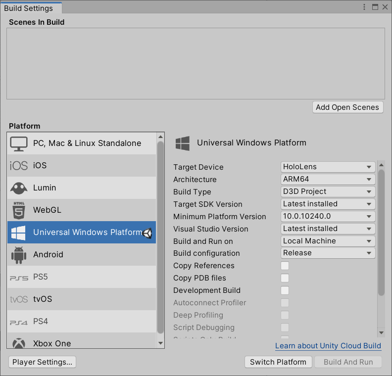

### Other non-OpenXR configuration options to consider

**Windows XR**: Microsoft doesn't recommend using the Windows XR plugin for any new projects in Unity 2020. Instead, you should use the Mixed Reality OpenXR plugin. However, if you're using Unity 2019 and you need AR Foundation 2.0 for compatibility with ARCore/ARKit devices, this plugin enables that support.

   > [!IMPORTANT]
   > Using this plugin in Unity 2019 is not compatible with Azure Spatial Anchors.

**Legacy XR**:

If you're still on Unity 2019 or earlier, Microsoft recommends using the Legacy Built-in XR support. While the Windows XR plugin is functional on Unity 2019, we don't recommend it  because it's not compatible with Azure Spatial Anchors on Unity 2019.

If you're starting a new project, we recommend that you install Unity 2020 instead and use the Mixed Reality OpenXR plugin.

## Getting started with OpenXR: Create a new Unity project

1. Launch the **Unity Hub**.
1. In the **Projects** tab,  click **New Project**.

   :::image type="content" source="../../images/001-new-project.png" alt-text="Screenshot of Unity Hub in Projects tab with the New Project button highlighted.":::

1. Click the drop-down underneath **New project** and then select the Editor version you want.

    :::image type="content" source="../../images/002-editor-version.png" alt-text="Screenshot of Unity Hub with the Editor version drop-down displayed.":::

1. Ensure the chosen template is **3D Core**.
1. In the **Project name** box, enter a name for your project--for example, "MRTK Tutorial."
1. In the **Location** box, click the folder icon, and then navigate to the folder where you want to save your project and select it. You can also create a new folder.

    :::image type="content" source="../../images/003-name-and-location.png" alt-text="Screenshot of Unity Hub with 3D, Project Name, Location, and Create highlighted.":::

1. Click **Create Project**. This opens your project in Unity.

    :::image type="content" source="../../images/004-project-open-in-unity.png" alt-text="Screenshot of your project open in Unity.":::

> [!CAUTION]
> When working on Windows, there is a MAX_PATH limit of 255 characters. Unity is affected by these limits and may fail to compile if any file path is longer than 255 characters. Therefore, we recommend that you store your Unity project as close to the root of the drive as possible.

## Set your build target

1. On the menu bar, select **File** > **Build Settings...**.

    To build an app for Windows Mixed Reality, you must choose a build target. The build settings for Universal Windows Platform (UWP) target any device, including immersive headsets like the [HP Reverb G2](https://www.microsoft.com/en-us/d/hp-reverb-g2-vr-headset/93qb262d0514?activetab=pivot:overviewtab). This is the best choice if you're building for the HoloLens 2; however, if you're targeting desktop VR, we recommend that you use the **PC, Mac & Linux Standalone** platform.

1. Do one of the following:

    **If you're targeting Desktop VR**:
    - Keep the **PC, Mac & Linux Standalone** platform which is selected by default on a new Unity project:

    

    **If you're targeting the HoloLens 2**:
    - Under **Platform**, select **Universal Windows Platform**. Make sure the following settings are active:

    **Build Type**: D3D Project

    **Target SDK Version**: Latest Installed

    **Minimum Platform Version**: 10.0.10240.0

    **Visual Studio Version**: Latest installed

    

1. Click the **Switch Platform** button. Unity displays a progress bar while it switches platforms.
1. After the switch platform process is finished, close the **Build Settings** window.