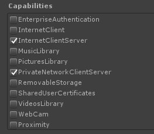
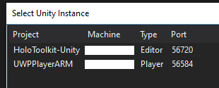

# Managed debugging with Unity

Follow these steps to attach a managed debugger to your Unity IL2CPP UWP build for HoloLens and HoloLens 2.

1. You'll need to be on a network that supports [multicast](https://en.wikipedia.org/wiki/Multicast).
2. Go to **UWP Publishing Settings Capabilities** and check **InternetClientServer** and **PrivateNetworkClientServer**:

    

3. Configure the Unity UWP build settings:
    - Development Build
    - Script Debugging
    - Wait for Managed Debugger (optional)

    

4. Build in Unity.
5. Build and deploy from the Visual Studio solution to your device. You should build with the **Debug** or **Release** configurations. The **Master** configuration disables the Unity profiler and can prevent optimal debugging. Optionally, verify **Internet (Client & Server)** and **Private Networks (Client & Server)** in the capabilities list in Package.appxmanifest in the solution.
6. Make sure your device is connected to the same network as your PC and start the app on your device.
7. Make sure the device **is not** connected to your PC via USB.
8. Double-click one of your scripts in Unity and go to the Visual Studio solution that opens to view and edit.
9. Debug -> Attach Unity Debugger.

    

10. Select your device in the list and click "OK" to attach.

    

## See also 

* [C# debugging](https://docs.microsoft.com/visualstudio/get-started/csharp/tutorial-debugger)
