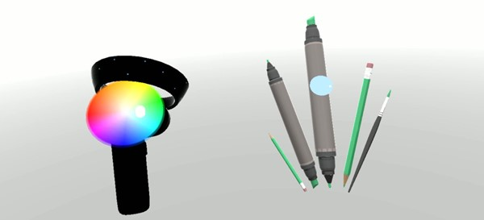

# Motion controllers in Unity

There are two key ways to take action on your [gaze in Unity](gaze-in-unity.md), [hand gestures](../../design/gaze-and-commit.md#composite-gestures) and [motion controllers](../../design/motion-controllers.md) in HoloLens and Immersive HMD. You access the data for both sources of spatial input through the same APIs in Unity.

Unity provides two primary ways to access spatial input data for Windows Mixed Reality. The common *Input.GetButton/Input.GetAxis* APIs work across multiple Unity XR SDKs, while the *InteractionManager/GestureRecognizer* API specific to Windows Mixed Reality exposes the full set of spatial input data.

## Unity XR input APIs

For new projects, we recommend using the new XR input APIs from the beginning. 

You can find more information about the [XR APIs here](https://docs.unity3d.com/Manual/xr_input.html).

## Unity button/axis mapping table

Unity's Input Manager for Windows Mixed Reality motion controllers supports the button and axis IDs listed below through the *Input.GetButton/GetAxis* APIs. The "Windows MR-specific" column refers to properties available off of the *InteractionSourceState* type. Each of these APIs is described in detail in the sections below.

The button/axis ID mappings for Windows Mixed Reality generally match the Oculus button/axis IDs.

The button/axis ID mappings for Windows Mixed Reality differ from OpenVR's mappings in two ways:
1. The mapping uses touchpad IDs that are distinct from thumbstick, to support controllers with both thumbsticks and touchpads.
2. The mapping avoids overloading the A and X button IDs for the Menu buttons to leave them available for the physical ABXY buttons.

<table>
<tr>
<th rowspan="2">Input </th><th colspan="2"><a href="motion-controllers-in-unity.md#common-unity-apis-inputgetbuttongetaxis">Common Unity APIs</a><br />(Input.GetButton/GetAxis) </th><th rowspan="2"><a href="motion-controllers-in-unity.md#windows-specific-apis-xrwsainput">Windows MR-specific Input API</a><br />(XR.WSA.Input)</th>
</tr><tr>
<th> Left hand </th><th> Right hand</th>
</tr><tr>
<td> Select trigger pressed </td><td> Axis 9 = 1.0 </td><td> Axis 10 = 1.0 </td><td> selectPressed</td>
</tr><tr>
<td> Select trigger analog value </td><td> Axis 9 </td><td> Axis 10 </td><td> selectPressedAmount</td>
</tr><tr>
<td> Select trigger partially pressed </td><td> Button 14 <i>(gamepad compat)</i> </td><td> Button 15 <i>(gamepad compat)</i> </td><td> selectPressedAmount &gt; 0.0</td>
</tr><tr>
<td> Menu button pressed </td><td> Button 6* </td><td> Button 7* </td><td> menuPressed</td>
</tr><tr>
<td> Grip button pressed </td><td> Axis 11 = 1.0 (no analog values)<br />Button 4 <i>(gamepad compat)</i> </td><td> Axis 12 = 1.0 (no analog values)<br />Button 5 <i>(gamepad compat)</i> </td><td> grasped</td>
</tr><tr>
<td> Thumbstick X <i>(left: -1.0, right: 1.0)</i> </td><td> Axis 1 </td><td> Axis 4 </td><td> thumbstickPosition.x</td>
</tr><tr>
<td> Thumbstick Y <i>(top: -1.0, bottom: 1.0)</i> </td><td> Axis 2 </td><td> Axis 5 </td><td> thumbstickPosition.y</td>
</tr><tr>
<td> Thumbstick pressed </td><td> Button 8 </td><td> Button 9 </td><td> thumbstickPressed</td>
</tr><tr>
<td> Touchpad X <i>(left: -1.0, right: 1.0)</i> </td><td> Axis 17* </td><td> Axis 19* </td><td> touchpadPosition.x</td>
</tr><tr>
<td> Touchpad Y <i>(top: -1.0, bottom: 1.0)</i> </td><td> Axis 18* </td><td> Axis 20* </td><td> touchpadPosition.y</td>
</tr><tr>
<td> Touchpad touched </td><td> Button 18* </td><td> Button 19* </td><td> touchpadTouched</td>
</tr><tr>
<td> Touchpad pressed </td><td> Button 16* </td><td> Button 17* </td><td> touchpadPressed</td>
</tr><tr>
<td> 6DoF grip pose or pointer pose </td><td colspan="2"> <i>Grip</i> pose only: <a href="https://docs.unity3d.com/ScriptReference/XR.InputTracking.GetLocalPosition.html">XR.InputTracking.GetLocalPosition</a><br /><a href="https://docs.unity3d.com/ScriptReference/XR.InputTracking.GetLocalRotation.html">XR.InputTracking.GetLocalRotation</a></td><td> Pass <i>Grip</i> or <i>Pointer</i> as an argument: sourceState.sourcePose.TryGetPosition<br />sourceState.sourcePose.TryGetRotation<br /></td>
</tr><tr>
<td> Tracking state </td><td colspan="2"> <i>Position accuracy and source loss risk only available through MR-specific API</i> </td><td> <a href="https://docs.unity3d.com/2017.2/Documentation/ScriptReference/XR.WSA.Input.InteractionSourcePose-positionAccuracy.html">sourceState.sourcePose.positionAccuracy</a><br /><a href="https://docs.unity3d.com/2017.2/Documentation/ScriptReference/XR.WSA.Input.InteractionSourceProperties-sourceLossRisk.html">sourceState.properties.sourceLossRisk</a></td>
</tr>
</table>

>[!NOTE]
>These button/axis IDs differ from the IDs that Unity uses for OpenVR due to collisions in the mappings used by gamepads, Oculus Touch and OpenVR.

<!-- ### Using HP Reverb G2 controllers

If you're using the HP Reverb G2 controllers, refer to the table below for button and axis IDs.

<table>
<tr>
<th rowspan="2"><a href="https://docs.unity3d.com/ScriptReference/XR.CommonUsages.html">Input </th><th colspan="2">Common Unity APIs</a><br />(Input.GetButton/GetAxis) </th><th rowspan="2">HP Reverb G2 Input API</a></th>
</tr><tr>
<th> Left hand </th><th> Right hand</th>
</tr><tr>
<td> Primary2DAxis </td><td> Axis 1 (X) / Axis 2 (Y) </td><td> Axis 4 (X) / Axis 5(Y) </td><td> Thumbstick</td>
</tr><tr>
<td> Trigger pressed </td><td> Axis 9 </td><td> Axis 10 </td><td> Index trigger</td>
</tr><tr>
<td> Grip </td><td> Axis 11d </td><td> Axis 12 </td><td> Grip trigger</td>
</tr><tr>
<td> PrimaryButton pressed </td><td> Button 2 </td><td> Button 0 </td><td> Menu button pressed</td>
</tr><tr>
<td> SecondaryButton pressed </td><td> Button 3 </td><td> Button 1 </td><td> A/X button</td>
</tr><tr>
<td> GripButton </td><td> Button 4 </td><td> Button 5 </td><td> Grip trigger</td>
</tr><tr>
<td> TriggerButton </td><td> Button 14 </td><td> Button 15 </td><td> Index trigger</td>
</tr><tr>
</tr>
</table> -->

### OpenXR

To learn the basics about mixed reality interactions in Unity, visit the [Unity Manual for Unity XR Input](https://docs.unity3d.com/2020.2/Documentation/Manual/xr_input.html). This Unity documentation covers the mappings from controller-specific inputs to more generalizable **InputFeatureUsage**s, how available XR inputs can be identified and categorized, how to read data from these inputs, and more.

The Mixed Reality OpenXR Plugin provides additional input interaction profiles, mapped to standard **InputFeatureUsage**s as detailed below:

| InputFeatureUsage | HP Reverb G2 Controller (OpenXR) | HoloLens Hand (OpenXR) |
| ---- | ---- | ---- |
| primary2DAxis | Joystick | |
| primary2DAxisClick | Joystick - Click | |
| trigger | Trigger  | |
| grip | Grip | Air tap or squeeze |
| primaryButton | [X/A] - Press | Air tap |
| secondaryButton | [Y/B] - Press | |
| gripButton | Grip - Press | |
| triggerButton | Trigger - Press | |
| menuButton | Menu | |

## Grip pose vs. pointing pose

Windows Mixed Reality supports motion controllers in a variety of form factors. Each controller's design differs in its relationship between the user's hand position and the natural "forward" direction that apps should use for pointing when rendering the controller.

To better represent these controllers, there are two kinds of poses you can investigate for each interaction source, the **grip pose** and the **pointer pose**. Both the grip pose and pointer pose coordinates are expressed by all Unity APIs in global Unity world coordinates.

### Grip pose

The **grip pose** represents the location of the users palm, either detected by a HoloLens or holding a motion controller.

On immersive headsets, the grip pose is best used to render **the user's hand** or **an object held in the user's hand**. The grip pose is also used when visualizing a motion controller. The **renderable model** provided by Windows for a motion controller uses the grip pose as its origin and center of rotation.

The grip pose is defined specifically as follows:
* The **grip position**: The palm centroid when holding the controller naturally, adjusted left or right to center the position within the grip. On the Windows Mixed Reality motion controller, this position generally aligns with the Grasp button.
* The **grip orientation's Right axis**: When you completely open your hand to form a flat 5-finger pose, the ray that is normal to your palm (forward from left palm, backward from right palm)
* The **grip orientation's Forward axis**: When you close your hand partially (as if holding the controller), the ray that points "forward" through the tube formed by your non-thumb fingers.
* The **grip orientation's Up axis**: The Up axis implied by the Right and Forward definitions.

You can access the grip pose through either Unity's cross-vendor input API (*[XR.InputTracking](https://docs.unity3d.com/ScriptReference/XR.InputTracking.html).GetLocalPosition/Rotation*) or through the Windows MR-specific API (*sourceState.sourcePose.TryGetPosition/Rotation*, requesting pose data for the **Grip** node).

### Pointer pose

The **pointer pose** represents the tip of the controller pointing forward.

The system-provided pointer pose is best used to raycast when you're **rendering the controller model itself**. If you're rendering some other virtual object in place of the controller, such as a virtual gun, you should point with a ray that's most natural for that virtual object, such as a ray that travels along the barrel of the app-defined gun model. Because users can see the virtual object and not the physical controller, pointing with the virtual object will likely be more natural for those using your app.

Currently, the pointer pose is available in Unity only through the Windows MR-specific API, *sourceState.sourcePose.TryGetPosition/Rotation*, passing in *InteractionSourceNode.Pointer* as the argument.

### OpenXR 

You have access to two sets of poses through OpenXR input interactions:

* The grip poses for rendering objects in the hand
* The aim poses for pointing into the world.

More information on this design and the differences between the two poses can be found in the [OpenXR Specification - Input Subpaths](https://www.khronos.org/registry/OpenXR/specs/1.0/html/xrspec.html#semantic-path-input).

Poses supplied by the InputFeatureUsages **DevicePosition**, **DeviceRotation**, **DeviceVelocity**, and **DeviceAngularVelocity** all represent the OpenXR **grip** pose. InputFeatureUsages related to grip poses are defined in Unity’s [CommonUsages](https://docs.unity3d.com/2020.2/Documentation/ScriptReference/XR.CommonUsages.html).

Poses supplied by the InputFeatureUsages **PointerPosition**, **PointerRotation**, **PointerVelocity**, and **PointerAngularVelocity** all represent the OpenXR **aim** pose. These InputFeatureUsages aren't defined in any included C# files, so you'll need to define your own InputFeatureUsages as follows:

``` cs
public static readonly InputFeatureUsage<Vector3> PointerPosition = new InputFeatureUsage<Vector3>("PointerPosition");
```

## Haptics

For information on using haptics in Unity’s XR Input system, documentation can be found at the [Unity Manual for Unity XR Input - Haptics](https://docs.unity3d.com/2020.2/Documentation/Manual/xr_input.html#Haptics).

## Controller tracking state

Like the headsets, the Windows Mixed Reality motion controller requires no setup of external tracking sensors. Instead, the controllers are tracked by sensors in the headset itself.

If the user moves the controllers out of the headset's field of view, Windows continues to infer controller positions in most cases. When the controller has lost visual tracking for long enough, the controller's positions will drop to approximate-accuracy positions.

At this point, the system will body-lock the controller to the user, tracking the user's position as they move around, while still exposing the controller's true orientation using its internal orientation sensors. Many apps that use controllers to point at and activate UI elements can operate normally while in approximate accuracy without the user noticing.

<!-- The best way to get a feel for this is to try it yourself. Check out this video with examples of immersive content that works with motion controllers across various tracking states:

<br>

 >[!VIDEO https://www.youtube.com/embed/QK_fOFDHj0g] -->

### Reasoning about tracking state explicitly

Apps that wish to treat positions differently based on tracking state may go further and inspect properties on the controller's state, such as *SourceLossRisk* and *PositionAccuracy*:

<table>
<tr>
<th> Tracking state </th><th> SourceLossRisk </th><th> PositionAccuracy </th><th> TryGetPosition</th>
</tr><tr>
<td> <b>High accuracy</b> </td><td> &lt; 1.0 </td><td> High </td><td> true</td>
</tr><tr>
<td> <b>High accuracy (at risk of losing)</b> </td><td> == 1.0 </td><td> High </td><td> true</td>
</tr><tr>
<td> <b>Approximate accuracy</b> </td><td> == 1.0 </td><td> Approximate </td><td> true</td>
</tr><tr>
<td> <b>No position</b> </td><td> == 1.0 </td><td> Approximate </td><td> false</td>
</tr>
</table>

These motion controller tracking states are defined as follows:
* **High accuracy:** While the motion controller is within the headset's field of view, it will generally provide high-accuracy positions, based on visual tracking. A moving controller that momentarily leaves the field of view or is momentarily obscured from the headset sensors (e.g. by the user's other hand) will continue to return high-accuracy poses for a short time, based on inertial tracking of the controller itself.
* **High accuracy (at risk of losing):** When the user moves the motion controller past the edge of the headset's field of view, the headset will soon be unable to visually track the controller's position. The app knows when the controller has reached this FOV boundary by seeing the **SourceLossRisk** reach 1.0. At that point, the app may choose to pause controller gestures that require a steady stream of high quality poses.
* **Approximate accuracy:** When the controller has lost visual tracking for long enough, the controller's positions will drop to approximate-accuracy positions. At this point, the system will body-lock the controller to the user, tracking the user's position as they move around, while still exposing the controller's true orientation using its internal orientation sensors. Many apps that use controllers to point at and activate UI elements can operate as normal while in approximate accuracy without the user noticing. Apps with heavier input requirements may choose to sense this drop from **High** accuracy to **Approximate** accuracy by inspecting the **PositionAccuracy** property, for example to give the user a more generous hitbox on off-screen targets during this time.
* **No position:** While the controller can operate at approximate accuracy for a long time, sometimes the system knows that even a body-locked position isn't meaningful at the moment. For example, a controller that was turned on may have never been observed visually, or a user may put down a controller that's then picked up by someone else. At those times, the system won't provide any position to the app, and *TryGetPosition* will return false.

## Common Unity APIs (Input.GetButton/GetAxis)

**Namespace:** *UnityEngine*, *UnityEngine.XR*<br>
**Types**: *Input*, *XR.InputTracking*

Unity currently uses its general *Input.GetButton/Input.GetAxis* APIs to expose input for [the Oculus SDK](https://docs.unity3d.com/Manual/OculusControllers.html), [the OpenVR SDK](https://docs.unity3d.com/Manual/OpenVRControllers.html) and Windows Mixed Reality, including hands and motion controllers. If your app uses these APIs for input, it can easily support motion controllers across multiple XR SDKs, including Windows Mixed Reality.

### Getting a logical button's pressed state

To use the general Unity input APIs, you'll typically start by wiring up buttons and axes to logical names in the [Unity Input Manager](https://docs.unity3d.com/Manual/ConventionalGameInput.html), binding a button or axis IDs to each name. You can then write code that refers to that logical button/axis name.

For example, to map the left motion controller's trigger button to the Submit action, go to **Edit > Project Settings > Input** within Unity, and expand the properties of the Submit section under Axes. Change the **Positive Button** or **Alt Positive Button** property to read **joystick button 14**, like this:

<br>
*Unity InputManager*

Your script can then check for the Submit action using *Input.GetButton*:

```cs
if (Input.GetButton("Submit"))
{
  // ...
}
```
You can add more logical buttons by changing the **Size** property under **Axes**.

### Getting a physical button's pressed state directly

You can also access buttons manually by their fully qualified name, using *Input.GetKey*:

```cs
if (Input.GetKey("joystick button 8"))
{
  // ...
}
```

### Getting a hand or motion controller's pose

You can access the position and rotation of the controller, using *XR.InputTracking*:

```cs
Vector3 leftPosition = InputTracking.GetLocalPosition(XRNode.LeftHand);
Quaternion leftRotation = InputTracking.GetLocalRotation(XRNode.LeftHand);
```

> [!NOTE] 
> The above code represents the controller's grip pose (where the user holds the controller), which is useful for rendering a sword or gun in the user's hand, or a model of the controller itself.
> 
> The relationship between this grip pose and the pointer pose (where the tip of the controller is pointing) may differ across controllers. At this moment, accessing the controller's pointer pose is only possible through the MR-specific input API, described in the sections below.

## Windows-specific APIs (XR.WSA.Input)

> [!CAUTION]
> If your project is using any of the XR.WSA APIs, these are being phased out in favor of the XR SDK in future Unity releases. For new projects, we recommend using the XR SDK from the beginning. You can find more information about the [XR Input system and APIs here](https://docs.unity3d.com/Manual/xr_input.html).

**Namespace:** *UnityEngine.XR.WSA.Input*<br>
**Types**: *InteractionManager*, *InteractionSourceState*, *InteractionSource*, *InteractionSourceProperties*, *InteractionSourceKind*, *InteractionSourceLocation*

To get at more detailed information about Windows Mixed Reality hand input (for HoloLens) and motion controllers, you can choose to use the Windows-specific spatial input APIs under the *UnityEngine.XR.WSA.Input* namespace. This lets you access additional information, such as position accuracy or the source kind, letting you tell hands and controllers apart.

### Polling for the state of hands and motion controllers

You can poll for this frame's state for each interaction source (hand or motion controller) using the *GetCurrentReading* method.

```cs
var interactionSourceStates = InteractionManager.GetCurrentReading();
foreach (var interactionSourceState in interactionSourceStates) {
    // ...
}
```

Each *InteractionSourceState* you get back represents an interaction source at the current moment in time. The *InteractionSourceState* exposes info such as:
* Which [kinds of presses](../../design/motion-controllers.md) are occurring (Select/Menu/Grasp/Touchpad/Thumbstick)

   ```cs
   if (interactionSourceState.selectPressed) {
       // ...
   }
   ```
* Other data specific to motion controllers, such the touchpad and/or thumbstick's XY coordinates and touched state

   ```cs
   if (interactionSourceState.touchpadTouched && interactionSourceState.touchpadPosition.x > 0.5) {
       // ...
   }
   ```

* The InteractionSourceKind to know if the source is a hand or a motion controller

   ```cs
   if (interactionSourceState.source.kind == InteractionSourceKind.Hand) {
       // ...
   }
   ```

### Polling for forward-predicted rendering poses

* When polling for interaction source data from hands and controllers, the poses you get are forward-predicted poses for the moment in time when this frame's photons will reach the user's eyes.  Forward-predicted poses are best used for **rendering** the controller or a held object each frame.  If you're targeting a given press or release with the controller, that will be most accurate if you use the historical event APIs described below.

   ```cs
   var sourcePose = interactionSourceState.sourcePose;
   Vector3 sourceGripPosition;
   Quaternion sourceGripRotation;
   if ((sourcePose.TryGetPosition(out sourceGripPosition, InteractionSourceNode.Grip)) &&
       (sourcePose.TryGetRotation(out sourceGripRotation, InteractionSourceNode.Grip))) {
       // ...
   }
   ```

* You can also get the forward-predicted head pose for this current frame.  As with the source pose, this is useful for **rendering** a cursor, although targeting a given press or release will be most accurate if you use the historical event APIs described below.

   ```cs
   var headPose = interactionSourceState.headPose;
   var headRay = new Ray(headPose.position, headPose.forward);
   RaycastHit raycastHit;
   if (Physics.Raycast(headPose.position, headPose.forward, out raycastHit, 10)) {
       var cursorPos = raycastHit.point;
       // ...
   }
   ```

### Handling interaction source events

To handle input events as they happen with their accurate historical pose data, you can handle interaction source events instead of polling.

To handle interaction source events:
* Register for a *InteractionManager* input event. For each type of interaction event that you are interested in, you need to subscribe to it.

   ```cs
   InteractionManager.InteractionSourcePressed += InteractionManager_InteractionSourcePressed;
   ```

* Handle the event. Once you have subscribed to an interaction event, you will get the callback when appropriate. In the *SourcePressed* example, this will be after the source was detected and before it is released or lost.

   ```cs
   void InteractionManager_InteractionSourceDetected(InteractionSourceDetectedEventArgs args)
       var interactionSourceState = args.state;

       // args.state has information about:
          // targeting head ray at the time when the event was triggered
          // whether the source is pressed or not
          // properties like position, velocity, source loss risk
          // source id (which hand id for example) and source kind like hand, voice, controller or other
   }
   ```

### How to stop handling an event

You need to stop handling an event when you're no longer interested in the event or you're destroying the object that has subscribed to the event. To stop handling the event, you unsubscribe from the event.

```cs
InteractionManager.InteractionSourcePressed -= InteractionManager_InteractionSourcePressed;
```

### List of interaction source events

The available interaction source events are:
* *InteractionSourceDetected* (source becomes active)
* *InteractionSourceLost* (becomes inactive)
* *InteractionSourcePressed* (tap, button press, or "Select" uttered)
* *InteractionSourceReleased* (end of a tap, button released, or end of "Select" uttered)
* *InteractionSourceUpdated* (moves or otherwise changes some state)

### Events for historical targeting poses that most accurately match a press or release

The polling APIs described earlier give your app forward-predicted poses.  While those predicted poses are best for rendering the controller or a virtual handheld object, future poses aren't optimal for targeting, for two key reasons:
* When the user presses a button on a controller, there can be about 20 ms of wireless latency over Bluetooth before the system receives the press.
* Then, if you're using a forward-predicted pose, there would be another 10-20 ms of forward prediction applied to target the time when the current frame's photons will reach the user's eyes.

This means that polling gives you a source pose or head pose that is 30-40 ms forward from where the user's head and hands actually were back when the press or release happened.  For HoloLens hand input, while there's no wireless transmission delay, there's a similar processing delay to detect the press.

To accurately target based on the user's original intent for a hand or controller press, you should use the historical source pose or head pose from that *InteractionSourcePressed* or *InteractionSourceReleased* input event.

You can target a press or release with historical pose data from the user's head or their controller:
* The head pose at the moment in time when a gesture or controller press occurred, which can be used for **targeting** to determine what the user was [gazing](../../design/gaze-and-commit.md) at:

   ```cs
   void InteractionManager_InteractionSourcePressed(InteractionSourcePressedEventArgs args) {
       var interactionSourceState = args.state;
       var headPose = interactionSourceState.headPose;
       RaycastHit raycastHit;
       if (Physics.Raycast(headPose.position, headPose.forward, out raycastHit, 10)) {
           var targetObject = raycastHit.collider.gameObject;
           // ...
       }
   }
   ```

* The source pose at the moment in time when a motion controller press occurred, which can be used for **targeting** to determine what the user was pointing the controller at.  This will be the state of the controller that experienced the press.  If you're rendering the controller itself, you can request the pointer pose rather than the grip pose, to shoot the targeting ray from what the user will consider the natural tip of that rendered controller:

   ```cs
   void InteractionManager_InteractionSourcePressed(InteractionSourcePressedEventArgs args)
   {
       var interactionSourceState = args.state;
       var sourcePose = interactionSourceState.sourcePose;
       Vector3 sourceGripPosition;
       Quaternion sourceGripRotation;
       if ((sourcePose.TryGetPosition(out sourceGripPosition, InteractionSourceNode.Pointer)) &&
           (sourcePose.TryGetRotation(out sourceGripRotation, InteractionSourceNode.Pointer))) {
           RaycastHit raycastHit;
           if (Physics.Raycast(sourceGripPosition, sourceGripRotation * Vector3.forward, out raycastHit, 10)) {
               var targetObject = raycastHit.collider.gameObject;
               // ...
           }
       }
   }
   ```

### Event handlers example

```cs
using UnityEngine.XR.WSA.Input;

void Start()
{
    InteractionManager.InteractionSourceDetected += InteractionManager_InteractionSourceDetected;
    InteractionManager.InteractionSourceLost += InteractionManager_InteractionSourceLost;
    InteractionManager.InteractionSourcePressed += InteractionManager_InteractionSourcePressed;
    InteractionManager.InteractionSourceReleased += InteractionManager_InteractionSourceReleased;
    InteractionManager.InteractionSourceUpdated += InteractionManager_InteractionSourceUpdated;
}

void OnDestroy()
{
    InteractionManager.InteractionSourceDetected -= InteractionManager_InteractionSourceDetected;
    InteractionManager.InteractionSourceLost -= InteractionManager_InteractionSourceLost;
    InteractionManager.InteractionSourcePressed -= InteractionManager_InteractionSourcePressed;
    InteractionManager.InteractionSourceReleased -= InteractionManager_InteractionSourceReleased;
    InteractionManager.InteractionSourceUpdated -= InteractionManager_InteractionSourceUpdated;
}

void InteractionManager_InteractionSourceDetected(InteractionSourceDetectedEventArgs args)
{
    // Source was detected
    // args.state has the current state of the source including id, position, kind, etc.
}

void InteractionManager_InteractionSourceLost(InteractionSourceLostEventArgs state)
{
    // Source was lost. This will be after a SourceDetected event and no other events for this
    // source id will occur until it is Detected again
    // args.state has the current state of the source including id, position, kind, etc.
}

void InteractionManager_InteractionSourcePressed(InteractionSourcePressedEventArgs state)
{
    // Source was pressed. This will be after the source was detected and before it is
    // released or lost
    // args.state has the current state of the source including id, position, kind, etc.
}

void InteractionManager_InteractionSourceReleased(InteractionSourceReleasedEventArgs state)
{
    // Source was released. The source would have been detected and pressed before this point.
    // This event will not fire if the source is lost
    // args.state has the current state of the source including id, position, kind, etc.
}

void InteractionManager_InteractionSourceUpdated(InteractionSourceUpdatedEventArgs state)
{
    // Source was updated. The source would have been detected before this point
    // args.state has the current state of the source including id, position, kind, etc.
}
```

## Motion Controllers in MRTK

You can access [gesture and motion controller](/windows/mixed-reality/mrtk-unity/features/input/controllers) from the input Manager.

## Follow along with tutorials

Step-by-step tutorials, with more detailed customization examples, are available in the Mixed Reality Academy:

- [MR Input 211: Gesture](tutorials/holograms-211.md)
- [MR Input 213: Motion controllers](../../deprecated/mixed-reality-213.md)

[](/windows/mixed-reality/mixed-reality-213)<br>
*MR Input 213 - Motion controller*

## Next Development Checkpoint

If you're following the Unity development journey we've laid out, you're in the midst of exploring the MRTK core building blocks. From here, you can continue to the next building block:

> [!div class="nextstepaction"]
> [Hand and eye tracking](./hand-eye-in-unity.md)

Or jump to Mixed Reality platform capabilities and APIs:

> [!div class="nextstepaction"]
> [Shared experiences](shared-experiences-in-unity.md)

You can always go back to the [Unity development checkpoints](unity-development-overview.md#2-core-building-blocks) at any time.

## See also

* [Head-gaze and commit](../../design/gaze-and-commit.md)
* [Motion controllers](../../design/motion-controllers.md)