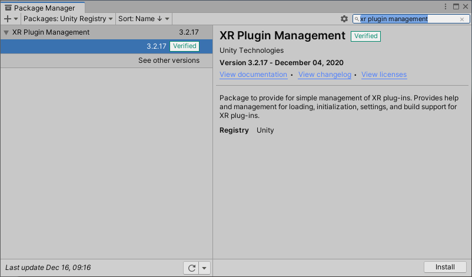

# Using the Mixed Reality OpenXR Plugin for Unity

Starting with Unity version 2020.2, Microsoft’s Mixed Reality OpenXR Plugin package is available using the Unity Package Manager (UPM).

## Prerequisites

*	Unity 2020.2 or later
*	Unity OpenXR plugin 0.1.1 or later
*	Visual Studio 2019 or later
*	Install **UWP** platform support in Unity for HoloLens 2 apps

> [!NOTE]
> If you're building VR applications on Windows PC, all you need is Unity's OpenXR plugin. You don't need to install UWP platform support or the Mixed Reality OpenXR plugin package. 

## Installing Unity’s OpenXR and XR Plugin Management packages

Before using the Mixed Reality OpenXR Plugin, you need to install Unity’s **OpenXR Plugin** and **XR Plugin Management** packages:

1. In the Unity Editor, navigate to **Edit > Project Settings > Package Manager**
2. Expand the **Scoped Registries** section, enter the following information, and select **Save**:   
    * Set **Name** to **Microsoft Mixed Reality**
    * Set **URL** to **https://pkgs.dev.azure.com/aipmr/MixedReality-Unity-Packages/_packaging/Unity-packages/npm/registry/**
    * Set **Scope(s)** to **com.microsoft.mixedreality**

3. Under **Advanced Settings**, select **Enable Preview Packages**


4. In the Unity Editor, navigate to **Window > Package Manager**, select **Packages: Unity Registry**, and check the search for **XR Plugin Management**
5. Select **Install** at the bottom right



3. Once installation is complete, search for **Open XR Plugin** and select **Install**

<!-- Image coming after Unity publishes -->

> [!NOTE]
> If you're not targeting HoloLens 2, you can skip to [configuring the XR Plugin Management for OpenXR](#configure-xr-plugin-management-for-openxr).

## Installing Mixed Reality features using the Unity Package Manager

The Unity Package Manager uses a manifest file named *manifest.json* to determine which packages to install and the registries they can be installed from.

> [!IMPORTANT]
> OpenXR is still experimental in Unity and this process may change over time as we work to optimize the developer experience.

### Registering the Mixed Reality dependencies

Once the Microsoft Mixed Reality scoped registry has been added to the manifest, the OpenXR package can be specified.
To add the OpenXR package:

1. Open **<projectRoot>/Packages/manifest.json** in a text editor like Visual Studio Code
2. Modify the dependencies section of the *Packages/manifest.json* file as follows:

> [!IMPORTANT]
> There may be more dependencies in your manifest file than shown here. Don't delete any of them, just add the OpenXR dependency to the list.

```
  "dependencies": {
    "com.microsoft.mixedreality.openxr": "0.1.0",
  }
```

## Managing OpenXR features with the Unity Package Manager

Once the OpenXR package has been added to the package manifest, it can be managed using the Unity Package Manager user interface.  


> [!Note] 
> If the OpenXR package is removed using the Unity Package Manager, you'll have to re-add it using the previously described steps.

## Configure XR Plugin Management for OpenXR

To set OpenXR as the the runtime in Unity: 

1. In the Unity Editor, navigate to **Edit > Project Settings**
2. In the list of Settings, select **XR Plugin Management**
3. Select **Initialize XR on Startup** and **OpenXR (Preview)**
4. If targeting HoloLens 2, select **Windows Mixed Reality Feature Set**


> [!IMPORTANT]
> If you see a red warning icon next to **OpenXR Plugin (Preview)**, click the icon and select **Fix all** before continuing. The Unity Editor may need to restart itself for the changes to take effect.


5. Select **OpenXR** under the XR Plug-in Management package
6. Set Render Mode to **Single Pass Instanced**
7. Set Depth Submission Mode to **Depth 16 Bit**


You're now ready to begin developing with OpenXR in Unity!  Continue on to the next section to learn how to use the OpenXR samples.

## Optimization

Navigate to **Mixed Reality> OpenXR > Apply recommended project settings for HoloLens 2** to get the best app performance.


## Using OpenXR examples

To utilize one or more of the examples, please use the following steps. 

> [!NOTE]
> You'll need to install [ARFoundation 4.0+](https://docs.unity3d.com/Packages/com.unity.xr.arfoundation@4.1/manual/index.html) to run the samples.

### HoloLens 2 samples

1. In the Unity Editor, navigate to **Window > Package Manager**
2. In the list of packages, select **Mixed Reality OpenXR Plugin**
3. Locate the sample in the **Samples** list and select **Import**


### For all other OpenXR samples

1. In the Unity Editor, navigate to **Window > Package Manager**
2. In the list of packages, select **OpenXR Plugin**
3. Locate the sample in the **Samples** list and select **Import**


> [!NOTE]
>  When a package is updated, Unity provides the option to update imported samples.  Updating an imported sample will overwrite any changes that have been made to the sample and associated assets.

## Next steps 

Now that you have your project configured for OpenXR and have access to samples, check out what [features](openxr-supported-features.md) are currently supported in our OpenXR plugin.

## See also
* [Configuring your project without MRTK](configure-unity-project.md)
* [Recommended settings for Unity](recommended-settings-for-unity.md)
* [Performance recommendations for Unity](performance-recommendations-for-unity.md#how-to-profile-with-unity)