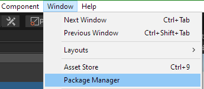
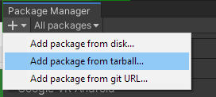
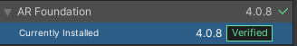
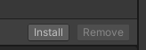
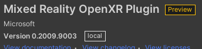
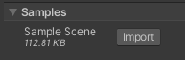
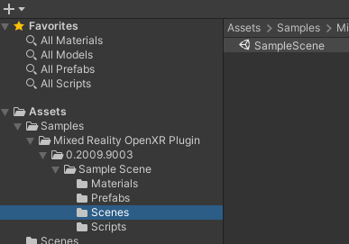
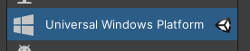
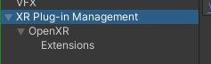

# Getting started with OpenXR

<!-- Need introductory context paragraph -->

## Getting the OpenXR packages

<!-- Coming soon -->
 
## Installing the OpenXR packages

Make sure you have at least the first 2 tarball files below ready. 
* **com.unity.xr.openxr-**<version>**.tgz**
* **com.microsoft.mixedreality.openxr-**<version>**.tgz**
* (optional) **com.microsoft.mixedreality.toolkit.openxr-**<version>**.tgz**

Next, you need to install the packages in Unity:

1. Open **Package Manager** in the Unity Editor:

2. Add the downloaded **com.unity.xr.openxr-*.tgz** from tarball file:

3. Add the downloaded **com.microsoft.mixedreality.openxr-*.tgz** from tarball file.
4. (Optional) See [MRTK support for OpenXR](file:///C:/display/OX/MRTK+support+for+OpenXR) for information on the **com.microsoft.mixedreality.toolkit.openxr-*.tgz** package.

## Using the sample scene

1. Add **AR Foundation 4.0.*** package from Unity store:

2. Open **Package Manager** for **Mixed Reality OpenXR Plugin** and import the **Sample Scene**:

3. Open the **SampleScene** from the **Project** pane:

## Running OpenXR projects on HoloLens 2

1. Select **File > Build Settings... > Switch platform to Universal Windows Platform**:

2. Go to **Edit > Project Settings ... > XR plugin Management** and check **OpenXR Loader**:

3. Also make sure the **Mixed Reality OpenXR Plugin** extension is enabled:

4. Update your project settings for best quality by following our [Unity best practices on HoloLens 2](file:///C:/display/OX/Unity+best+practices+on+HL2)
5. Click **Build** and choose a save location for the Visual Studio project:

6. Open the **.sln** file in to generated folder in latest release of Visual Studio.
7. Set configuration to **Release, ARM64**, and **Device** then press F5 to build, deploy and run on your HoloLens 2 device.

> [!NOTE]
> Debug mode has known visual bugs.
