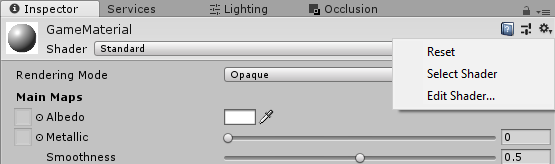

# Performance recommendations for Unity

This article builds on the [performance recommendations for mixed reality](../advanced-concepts/understanding-performance-for-mixed-reality.md), but focuses on Unity-specific improvements.

We recently released an application called Quality Fundamentals that covers common performance, design, and environment issues and solutions for HoloLens 2 apps. This app is a great visual demo for the content that follows.

> [!div class="nextstepaction"]
> [Download the Quality Fundamentals app](https://www.microsoft.com/p/quality-fundamentals/9mwz852q88fw)

## Use recommended Unity project settings

The most important first step when optimizing performance of mixed reality apps in Unity is to be sure you're using the [recommended environment settings for Unity](recommended-settings-for-unity.md). That article contains content with some of the most important scene configurations for building performant Mixed Reality apps. Some of these recommended settings are highlighted below, as well.

## How to profile with Unity

Unity provides the **[Unity Profiler](https://docs.unity3d.com/Manual/Profiler.html)** built-in, which is a great resource to gather valuable performance insights for your particular app. Although you can run the profiler in-editor, these metrics don't represent the true runtime environment so results should be used cautiously. We recommend that you remotely profile your application while running on-device for the most accurate and actionable insights.

Unity provides great documentation for:

1) How to connect the [Unity profiler to UWP applications remotely](https://docs.unity3d.com/Manual/windowsstore-profiler.html)
2) How to effectively [diagnose performance problems with the Unity Profiler](https://learn.unity.com/tutorial/diagnosing-performance-problems-2019-3)

### GPU profiling

#### Unity profiler

With the Unity Profiler connected and after adding the GPU profiler (see *Add Profiler* in top right corner), one can see how much time is being spent on the CPU & GPU respectively in the middle of the profiler. This allows the developer to get a quick approximation if their application is CPU or GPU bounded.


>[!NOTE]
> To use GPU profiling, you need to disable **Graphics Jobs** in the Unity **Player Settings**. See Unity's **[GPU Usage Profiler module](https://docs.unity3d.com/Manual/Profiler.html)** for more details.

#### Unity frame debugger

Unity's [Frame Debugger](https://docs.unity3d.com/Manual/FrameDebugger.html) is also a powerful and insightful tool to use. It will give you a good overview of what the GPU is doing each frame. Things to look out for are additional rendering targets and blit commands to copy between them as these are very expensive on HoloLens. Ideally, no off-screen render targets should be used on HoloLens. These are usually added when enabling expensive rendering features (for example MSAA, HDR or full-screen effects like bloom) which should be avoided.

#### HoloLens frame rate overlay

The Device Portal [System Performance](../advanced-concepts/using-the-windows-device-portal.md#system-performance) page has a good summary of CPU and GPU performance of the device.
You can enable **Display frame rate counter in headset** and **Display frame rate graph in headset**. These options will enable an FPS counter and graph, respectively, that will give you immediate feedback in any running application on your device.

#### PIX

[PIX](https://devblogs.microsoft.com/pix/download/) can be used to profile Unity applications as well. There are also detailed instructions on how to use and install [PIX for HoloLens 2](../advanced-concepts/installing-pix-hololens.md).
In a development build, the same scopes that you see in Unity's [Frame Debugger](https://docs.unity3d.com/Manual/FrameDebugger.html) will be shown in PIX as well and can be inspected and profiled in more detail.

>[!NOTE]
>Unity provides the ability to easily modify the render target resolution of your application at runtime through the *[XRSettings.renderViewportScale](https://docs.unity3d.com/ScriptReference/XR.XRSettings-renderViewportScale.html)* property. The final image presented on-device has a fixed resolution. The platform will sample the lower resolution output to build a higher resolution image for rendering on displays.
>
>```CS
>UnityEngine.XR.XRSettings.renderViewportScale = 0.7f;
>```

## CPU performance recommendations

The content below covers more in-depth performance practices, especially targeted for Unity & C# development.

#### Cache references

We recommend caching references to all relevant components and GameObjects at initialization because repeating function calls such as *[GetComponent\<T>()](https://docs.unity3d.com/ScriptReference/GameObject.GetComponent.html)* and [Camera.main](https://docs.unity3d.com/ScriptReference/Camera-main.html) are more expensive relative to the memory cost to store a pointer. . *Camera.main* just uses *[FindGameObjectsWithTag()](https://docs.unity3d.com/ScriptReference/GameObject.FindGameObjectsWithTag.html)* underneath, which expensively searches your scene graph for a camera object with the *"MainCamera"* tag.

```CS
using UnityEngine;
using System.Collections;

public class ExampleClass : MonoBehaviour
{
    private Camera cam;
    private CustomComponent comp;

    void Start() 
    {
        cam = Camera.main;
        comp = GetComponent<CustomComponent>();
    }

    void Update()
    {
        // Good
        this.transform.position = cam.transform.position + cam.transform.forward * 10.0f;

        // Bad
        this.transform.position = Camera.main.transform.position + Camera.main.transform.forward * 10.0f;

        // Good
        comp.DoSomethingAwesome();

        // Bad
        GetComponent<CustomComponent>().DoSomethingAwesome();
    }
}
```

>[!NOTE] 
> Avoid GetComponent(string) <br/>
> When using *[GetComponent()](https://docs.unity3d.com/ScriptReference/GameObject.GetComponent.html)*, there are a handful of different overloads. It is important to always use the Type-based implementations and never the string-based searching overload. Searching by string in your scene is significantly more costly than searching by Type. <br/>
> (Good) Component GetComponent(Type type) <br/>
> (Good) T GetComponent\<T>() <br/>
> (Bad) Component GetComponent(string)> <br/>

#### Avoid expensive operations

1) **Avoid use of [LINQ](/dotnet/csharp/programming-guide/concepts/linq/getting-started-with-linq)**

    Although LINQ can be clean and easy to read and write, it generally requires more computation and memory than if you wrote the algorithm manually.

    ```CS
    // Example Code
    using System.Linq;

    List<int> data = new List<int>();
    data.Any(x => x > 10);

    var result = from x in data
                 where x > 10
                 select x;
    ```

2) **Common Unity APIs**

    Certain Unity APIs, although useful, can be expensive to execute. Most of these involve searching your entire scene graph for some matching list of GameObjects. These operations can generally be avoided by caching references or implementing a manager component for the GameObjects to track the references at runtime.

    ```csharp
        GameObject.SendMessage()
        GameObject.BroadcastMessage()
        UnityEngine.Object.Find()
        UnityEngine.Object.FindWithTag()
        UnityEngine.Object.FindObjectOfType()
        UnityEngine.Object.FindObjectsOfType()
        UnityEngine.Object.FindGameObjectsWithTag()
        UnityEngine.Object.FindGameObjectsWithTag()
    ```

>[!NOTE]
> *[SendMessage()](https://docs.unity3d.com/ScriptReference/GameObject.SendMessage.html)* and *[BroadcastMessage()](https://docs.unity3d.com/ScriptReference/GameObject.BroadcastMessage.html)* should be eliminated at all costs. These functions can be on the order of 1000x slower than direct function calls.

3) **Beware of boxing**

    [Boxing](/dotnet/csharp/programming-guide/types/boxing-and-unboxing) is a core concept of the C# language and runtime. It's the process of wrapping value-typed variables such as `char`, `int`, `bool`, etc. into reference-typed variables. When a value-typed variable is "boxed", it's wrapped in a `System.Object`, which is stored on the managed heap. Memory is allocated and eventually when disposed must be processed by the garbage collector. These allocations and deallocations incur a performance cost and in many scenarios are unnecessary or can be easily replaced by a less expensive alternative.

    To avoid boxing, be sure that the variables, fields, and properties in which you store numeric types and structs (including `Nullable<T>`) are strongly typed as specific types such as `int`, `float?` or `MyStruct`, instead of using object.  If putting these objects into a list, be sure to use a strongly typed list such as `List<int>` rather than `List<object>` or `ArrayList`.

    **Example of boxing in C#**

    ```csharp
    // boolean value type is boxed into object boxedMyVar on the heap
    bool myVar = true;
    object boxedMyVar = myVar;
    ```

#### Repeating code paths

Any repeating Unity callback functions (i.e Update) that are executed many times per second and/or frame should be written carefully. Any expensive operations here will have huge and consistent impact on performance.

1) **Empty callback functions**

    Although the code below may seem innocent to leave in your application, especially since every Unity script auto-initializes with an Update method, these empty callbacks can become expensive. Unity operates back and forth between an unmanaged and managed code boundary, between UnityEngine code and your application code. Context switching over this bridge is fairly expensive, even if there's nothing to execute. This becomes especially problematic if your app has 100s of GameObjects with components that have empty repeating Unity callbacks.

    ```CS
    void Update()
    {
    }
    ```

>[!NOTE]
> Update() is the most common manifestation of this performance issue but other repeating Unity callbacks, such as the following can be equally as bad, if not worse: FixedUpdate(), LateUpdate(), OnPostRender", OnPreRender(), OnRenderImage(), etc. 

2) **Operations to favor running once per frame**

    The following Unity APIs are common operations for many Holographic Apps. Although not always possible, the results from these functions can commonly be computed once and the results reutilized across the application for a given frame.

    a) It's good practice to have a dedicated Singleton class or service to handle your gaze Raycast into the scene and then reuse this result in all other scene components, instead of making repeated and identical Raycast operations by each component. Some applications may require raycasts from different origins or against different [LayerMasks](https://docs.unity3d.com/ScriptReference/LayerMask.html).
    
    ```csharp
        UnityEngine.Physics.Raycast()
        UnityEngine.Physics.RaycastAll()
    ```

    b) Avoid GetComponent() operations in repeated Unity callbacks like Update() by [caching references](#cache-references) in Start() or Awake()
    
    ```csharp
        UnityEngine.Object.GetComponent()
    ```

    c) It's good practice to instantiate all objects, if possible, at initialization and use [object pooling](#object-pooling) to recycle and reuse GameObjects throughout runtime of your application

    ```csharp
        UnityEngine.Object.Instantiate()
    ```

3) **Avoid interfaces and virtual constructs**

    Invoking function calls through interfaces vs direct objects or calling virtual functions can often be much more expensive than using direct constructs or direct function calls. If the virtual function or interface is unnecessary, then it should be removed. However, the performance hit for these approaches is worth the trade-off if using them simplifies development collaboration, code readability, and code maintainability.

    Generally, the recommendation is to not mark fields and functions as virtual unless there's a clear expectation that this member needs to be overwritten. One should be especially careful around high-frequency code paths that are called many times per frame or even once per frame such as an `UpdateUI()` method.

4) **Avoid passing structs by value**

    Unlike classes, structs are value-types and when passed directly to a function, their contents are copied into a newly created instance. This copy adds CPU cost, as well as additional memory on the stack. For small structs, the effect is minimal and thus acceptable. However, for functions repeatedly invoked every frame as well as functions taking large structs, if possible modify the function definition to pass by reference. [Learn more here](/dotnet/csharp/programming-guide/classes-and-structs/how-to-know-the-difference-passing-a-struct-and-passing-a-class-to-a-method)

#### Miscellaneous

1) **Physics**

    a) Generally, the easiest way to improve physics is to limit the amount of time spent on Physics or the number of iterations per second. This will reduce simulation accuracy. See [TimeManager](https://docs.unity3d.com/Manual/class-TimeManager.html) in Unity

    b) The types of colliders in Unity have widely different performance characteristics. The order below lists the most performant colliders to least performant colliders from left to right. It's important to avoid Mesh Colliders, which are substantially more expensive than the primitive colliders.

    Sphere < Capsule < Box <<< Mesh (Convex) < Mesh (non-Convex)

    See [Unity Physics Best Practices](https://unity3d.com/learn/tutorials/topics/physics/physics-best-practices) for more info

2) **Animations**

    Disable idle animations by disabling the Animator component (disabling the game object won't have the same effect). Avoid design patterns where an animator sits in a loop setting a value to the same thing. There's considerable overhead for this technique, with no effect on the application. [Learn more here.](https://docs.unity3d.com/Manual/MecanimPeformanceandOptimization.html)

3) **Complex algorithms**

    If your application is using complex algorithms such as inverse kinematics, path finding, etc, look to find a simpler approach or adjust relevant settings for their performance

## CPU-to-GPU performance recommendations

Generally, CPU-to-GPU performance comes down to the **draw calls** submitted to the graphics card. To improve performance, draw calls need to be strategically **a) reduced** or **b) restructured** for optimal results. Since draw calls themselves are resource-intensive, reducing them will reduce overall work required. Further, state changes between draw calls require costly validation and translation steps in the graphics driver and thus, restructuring of your application's draw calls to limit state changes (i.e different materials, etc) can boost performance.

Unity has a great article that gives an overview and dives into batching draw calls for their platform.
- [Unity Draw Call Batching](https://docs.unity3d.com/Manual/DrawCallBatching.html)

#### Single pass instanced rendering

Single Pass Instanced Rendering in Unity allows for draw calls for each eye to be reduced down to one instanced draw call. Because of cache coherency between two draw calls, there's also some performance improvement on the GPU as well.

To enable this feature in your Unity Project
[!INCLUDE[](./includes/unity-rendering-path.md)]

Read the following articles from Unity for details with this rendering approach.
- [How to maximize AR and VR performance with advanced stereo rendering](https://blogs.unity3d.com/2017/11/21/how-to-maximize-ar-and-vr-performance-with-advanced-stereo-rendering/)
- [Single Pass Instancing](https://docs.unity3d.com/Manual/SinglePassInstancing.html) 

>[!NOTE]
> One common issue with Single Pass Instanced Rendering occurs if developers already have existing custom shaders not written for instancing. After enabling this feature, developers may notice some GameObjects only render in one eye. This is because the associated custom shaders do not have the appropriate properties for instancing.
>
> See [Single Pass Stereo Rendering for HoloLens](https://docs.unity3d.com/Manual/SinglePassStereoRenderingHoloLens.html) from Unity for how to address this problem

#### Static batching

Unity is able to batch many static objects to reduce draw calls to the GPU. Static Batching works for most [Renderer](https://docs.unity3d.com/ScriptReference/Renderer.html) objects in Unity that **1) share the same material** and **2) are all marked as *Static*** (Select an object in Unity and select the checkbox in the top right of the inspector). GameObjects marked as *Static* cannot be moved throughout your application's runtime. Thus, static batching can be difficult to leverage on HoloLens where virtually every object needs to be placed, moved, scaled, etc. For immersive headsets, static batching can dramatically reduce draw calls and thus improve performance.

Read *Static Batching* under [Draw Call Batching in Unity](https://docs.unity3d.com/Manual/DrawCallBatching.html) for more details.

#### Dynamic batching

Since it's problematic to mark objects as *Static* for HoloLens development, dynamic batching can be a great tool to compensate for this lacking feature. It can also be useful on immersive headsets, as well. However, dynamic batching in Unity can be difficult to enable because GameObjects must **a) share the same Material** and **b) meet a long list of other criteria**.

Read *Dynamic Batching* under [Draw Call Batching in Unity](https://docs.unity3d.com/Manual/DrawCallBatching.html) for the full list. Most commonly, GameObjects become invalid to be batched dynamically, because the associated mesh data can be no more than 300 vertices.

#### Other techniques

Batching can only occur if multiple GameObjects are able to share the same material. Typically, this will be blocked by the need for GameObjects to have a unique texture for their respective Material. It's common to combine Textures into one big Texture, a method known as [Texture Atlasing](https://en.wikipedia.org/wiki/Texture_atlas).

Furthermore, it's preferable to combine meshes into one GameObject where possible and reasonable. Each Renderer in Unity will have its associated draw call(s) versus submitting a combined mesh under one Renderer.

>[!NOTE]
> Modifying properties of Renderer.material at runtime will create a copy of the Material and thus potentially break batching. Use Renderer.sharedMaterial to modify shared material properties across GameObjects.

## GPU performance recommendations

Learn more about [optimizing graphics rendering in Unity](https://unity3d.com/learn/tutorials/temas/performance-optimization/optimizing-graphics-rendering-unity-games)

### Bandwidth and fill rates

When rendering a frame on the GPU, an application is either bound by memory bandwidth or fill rate.

- **Memory bandwidth** is the rate of reads and writes the GPU can do from memory
    - In Unity, change **Texture Quality** in **Edit** > **Project Settings** > **[Quality Settings](https://docs.unity3d.com/Manual/class-QualitySettings.html)**.
- **Fill rate** refers to the pixels that can be drawn per second by the GPU.
    - In Unity, use the  *[XRSettings.renderViewportScale](https://docs.unity3d.com/ScriptReference/XR.XRSettings-renderViewportScale.html)* property.

### Optimize depth buffer sharing

We recommend that you [enable **Depth buffer sharing**](./recommended-settings-for-unity.md#enable-depth-buffer-sharing) to optimize for [hologram stability](../advanced-concepts/Hologram-stability.md). When enabling depth-based late-stage reprojection with this setting, we recommend that you select **16-bit** depth format instead of **24-bit** depth format. The 16-bit depth buffers will drastically reduce the bandwidth (and thus power) associated with depth buffer traffic. This can be a big improvement both in power reduction and performance. However, there are two possible negative outcomes by using *16-bit depth format*.

**Z-Fighting**

The reduced depth range fidelity makes [z-fighting](https://en.wikipedia.org/wiki/Z-fighting) more likely to occur with 16 bit than 24-bit. To avoid these artifacts, modify the near/far clip planes of the [Unity camera](https://docs.unity3d.com/Manual/class-Camera.html) to account for the lower precision. For HoloLens-based applications, a far clip plane of 50 m instead of the Unity default 1000 m can generally eliminate any z-fighting.

**Disabled Stencil Buffer**

When Unity creates a [Render Texture with 16-bit depth](https://docs.unity3d.com/ScriptReference/RenderTexture-depth.html), there's no stencil buffer created. Selecting the 24-bit depth format, as described in the Unity documentation, will create a 24-bit z-buffer and an [8-bit stencil buffer](https://docs.unity3d.com/Manual/SL-Stencil.html) (if 32-bit is applicable on a device (for example, the HoloLens), which is generally the case).

### Avoid full-screen effects

Techniques that operate on the full screen can be expensive since their order of magnitude is millions of operations every frame. It's recommended to avoid [post-processing effects](https://docs.unity3d.com/Manual/PostProcessingOverview.html) such as anti-aliasing, bloom, and more.

### Optimal lighting settings

[Real-time Global Illumination](https://docs.unity3d.com/Manual/GIIntro.html) in Unity can provide outstanding visual results but involves expensive lighting calculations. We recommended disabling real-time Global Illumination for every Unity scene file via **Window** > **Rendering** > **Lighting Settings** > Uncheck **Real-time Global Illumination**.

Furthermore, it's recommended to disable all shadow casting as these also add expensive GPU passes onto a Unity scene. Shadows can be disable per light but can also be controlled holistically via Quality settings.

**Edit** > **Project Settings**, then select the **Quality** category > Select **Low Quality** for the UWP Platform. One can also just set the **Shadows** property to **Disable Shadows**.

We recommended that you use baked lighting with your models in Unity.

### Reduce poly count

Polygon count is reduced by either
1) Removing objects from a scene
2) Asset decimation, which reduces the number of polygons for a given mesh
3) Implementing a [Level of Detail (LOD) System](https://docs.unity3d.com/Manual/LevelOfDetail.html) into your application, which renders far away objects with lower-polygon version of the same geometry

### Understanding shaders in Unity

An easy approximation to compare shaders in performance is to identify the average number of operations each executes at runtime. This can be done easily in Unity.

1) Select your shader asset or select a material, then in the top-right corner of the inspector window, select the gear icon followed by **"Select Shader"**

    
2) With the shader asset selected, select the **"Compile and show code"** button under the inspector window

    

3) After compiling, look for the statistics section in the results with the number of different operations for both the vertex and pixel shader (Note: pixel shaders are often also called fragment shaders)

    

#### Optimize pixel shaders

Looking at the compiled statistic results using the method above, the [fragment shader](https://en.wikipedia.org/wiki/Shader#Pixel_shaders) will generally execute more operations than the [vertex shader](https://en.wikipedia.org/wiki/Shader#Vertex_shaders), on average. The fragment shader, also known as the pixel shader, is executed per pixel on the screen output while the vertex shader is only executed per-vertex of all meshes being drawn to the screen.

Thus, not only do fragment shaders have more instructions than vertex shaders because of all the lighting calculations, fragment shaders are almost always executed on a larger dataset. For example, if the screen output is a 2k by 2k image, then the fragment shader can get executed 2,000*2,000 = 4,000,000 times. If rendering two eyes, this number doubles since there are two screens. If a mixed reality application has multiple passes, full-screen post-processing effects, or rendering multiple meshes to the same pixel, this number will increase dramatically.

Therefore, reducing the number of operations in the fragment shader can generally give far greater performance gains over optimizations in the vertex shader.

#### Unity Standard shader alternatives

Instead of using a physically based rendering (PBR) or another high-quality shader, look at utilizing a more performant and cheaper shader. The [Mixed Reality Toolkit](https://github.com/Microsoft/MixedRealityToolkit-Unity) provides the [MRTK standard shader](/windows/mixed-reality/mrtk-unity/features/rendering/mrtk-standard-shader) that has been optimized for mixed reality projects.

Unity also provides an unlit, vertex lit, diffuse, and other simplified shader options that are faster compared to the Unity Standard shader. See [Usage and Performance of Built-in Shaders](https://docs.unity3d.com/Manual/shader-Performance.html) for more detailed information.

#### Shader preloading

Use *Shader preloading* and other tricks to optimize [shader load time](https://docs.unity3d.com/Manual/OptimizingShaderLoadTime.html). In particular, shader preloading means you won't see any hitches due to runtime shader compilation.

### Limit overdraw

In Unity, one can display overdraw for their scene, by toggling the [**draw mode menu**](https://docs.unity3d.com/Manual/ViewModes.html) in the top-left corner of the **Scene view** and selecting **Overdraw**.

Generally, overdraw can be mitigated by culling objects ahead of time before they're sent to the GPU. Unity provides details on implementing [Occlusion Culling](https://docs.unity3d.com/Manual/OcclusionCulling.html) for their engine.

## Memory recommendations

Excessive memory allocation & deallocation operations can have adverse effects on your holographic application, resulting in inconsistent performance, frozen frames, and other detrimental behavior. It's especially important to understand memory considerations when developing in Unity since memory management is controlled by the garbage collector.

#### Garbage collection

Holographic apps will lose processing compute time to the garbage collector (GC) when the GC is activated to analyze objects that are no longer in scope during execution and their memory needs to be released, so it can be made available for reuse. Constant allocations and de-allocations will generally require the garbage collector to run more frequently, thus hurting performance and user experience.

Unity has provided an excellent page that explains in detail how the garbage collector works and tips to write more efficient code in regards to memory management.
- [Optimizing garbage collection in Unity games](https://unity3d.com/learn/tutorials/topics/performance-optimization/optimizing-garbage-collection-unity-games?playlist=44069)

One of the most common practices that leads to excessive garbage collection isn't caching references to components and classes in Unity development. Any references should be captured during Start() or Awake() and reused in later functions such as Update() or LateUpdate().

Other quick tips:
- Use the [StringBuilder](/dotnet/api/system.text.stringbuilder) C# class to dynamically build complex strings at runtime
- Remove calls to Debug.Log() when no longer needed, as they still execute in all build versions of an app
- If your holographic app generally requires lots of memory, consider calling  [_**System.GC.Collect()**_](/dotnet/api/system.gc.collect) during loading phases such as when presenting a loading or transition screen

#### Object pooling

Object pooling is a popular technique for reducing the cost of continuous object allocation and deallocations. This is done by allocating a large pool of identical objects and reusing inactive, available instances from this pool instead of constantly spawning and destroying objects over time. Object pools are great for reuseable components that have variable lifetime during an app.

- [Object Pooling Tutorial in Unity](https://unity3d.com/learn/tutorials/topics/scripting/object-pooling) 

## Startup performance

Consider starting your app with a smaller scene, then using *[SceneManager.LoadSceneAsync](https://docs.unity3d.com/ScriptReference/SceneManagement.SceneManager.LoadSceneAsync.html)* to load the rest of the scene. This allows your app to get to an interactive state as fast as possible. There may be a large CPU spike while the new scene is being activated and that any rendered content might stutter or hitch. One way to work around this is to set the AsyncOperation.allowSceneActivation property to "false" on the scene being loaded, wait for the scene to load, clear the screen to black, and then set it back to "true" to complete the scene activation.

Remember that while the startup scene is loading, the holographic splash screen will be displayed to the user.

## See also
- [Optimizing graphics rendering in Unity games](https://unity3d.com/learn/tutorials/temas/performance-optimization/optimizing-graphics-rendering-unity-games?playlist=44069)
- [Optimizing garbage collection in Unity games](https://unity3d.com/learn/tutorials/topics/performance-optimization/optimizing-garbage-collection-unity-games?playlist=44069)
- [Physics Best Practices [Unity]](https://unity3d.com/learn/tutorials/topics/physics/physics-best-practices)
- [Optimizing Scripts [Unity]](https://docs.unity3d.com/2020.1/Documentation/Manual/MobileOptimizationPracticalGuide.html)
