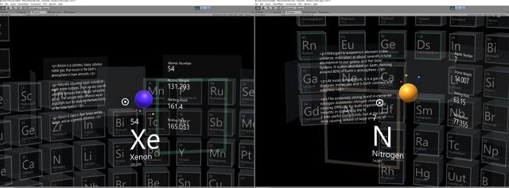
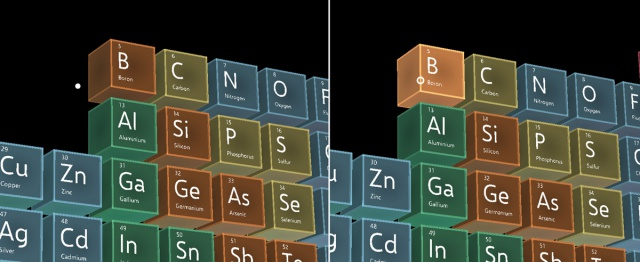
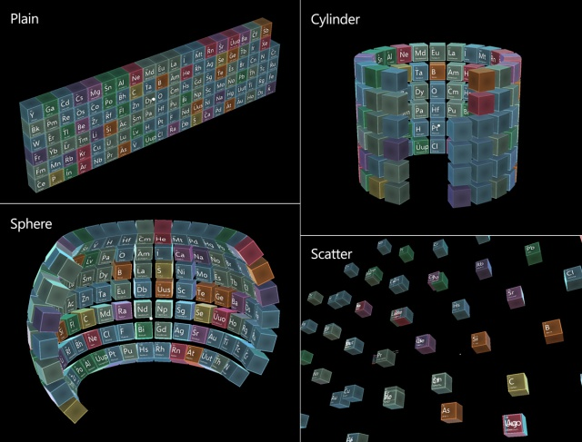

# Periodic Table of the Elements

>[!NOTE]
>This article discusses an exploratory sample we’ve created in the [Mixed Reality Design Labs](https://github.com/Microsoft/MRDesignLabs_Unity), a place where we share our learnings about and suggestions for mixed reality app development. Our design-related articles and code will evolve as we make new discoveries.

>[!NOTE]
>This sample app was designed for HoloLens 1st gen. See [Periodic Table of the Elements 2.0](periodic-table-of-the-elements-2.md) for HoloLens 2 version.

[Periodic Table of the Elements](https://github.com/Microsoft/MRDesignLabs_Unity_PeriodicTable) is an open-source sample app from Microsoft's Mixed Reality Design Labs. Learn how to lay out an array of objects in 3D space with various surface types using an **[Object collection](../../design/object-collection.md)**. Also learn how to create interactable objects that respond to standard inputs from HoloLens. You can use this project's components to create your own mixed reality app experience.

## Demo video 
> [!VIDEO https://www.microsoft.com/en-us/videoplayer/embed/RE4IkCF]

Recorded with HoloLens 2 using Mixed Reality Capture

## About the app

Periodic Table of the Elements visualizes the chemical elements and each of their properties in a 3D space. It incorporates the basic interactions of HoloLens such as gaze and air tap. Users can learn about the elements with animated 3D models. They can visually understand an element's electron shell and its nucleus - which is composed of protons and neutrons.

## Background

After I first experienced HoloLens, I knew I wanted to experiment with a periodic table app in mixed reality. Since each element has many data points that are displayed with text, I thought it would be great subject matter for exploring typographic composition in a 3D space. Giving users the chance to visualize the element's electron model was another interesting part of this project.

## Design

For the default view of the periodic table, I imagined three-dimensional boxes that would contain the electron model of each element. The surface of each box would be translucent so that the user could get a rough idea of the element's volume. With gaze and air tap, the user could open up a detailed view of each element. To make the transition between table view and detail view smooth and natural, I made it similar to the physical interaction of a box opening in real life.

 
*Design sketches*

In detail view, I wanted to visualize the information of each element with beautifully rendered text in 3D space. The animated 3D electron model is displayed in the center area and can be viewed from different angles.

 
*Interaction prototypes*

The user can change the surface type by air tapping the buttons on the bottom of the table - they can switch between plane, cylinder, sphere, and scatter.

## Common controls and patterns used in this app

### Interactable object (button)

[Interactable object](../../design/interactable-object.md) is an object, which can respond to basic HoloLens inputs. It's provided as a prefab/script, which you can easily apply to any object. For example, you can make a coffee cup in your scene interactable and respond to inputs such as gaze, air tap, navigation, and manipulation gestures. [Learn more](../../design/interactable-object.md)

### Object collection

[Object collection](../../design/object-collection.md) is an object, which helps you lay out multiple objects in various shapes. It supports plane, cylinder, sphere, and scatter. You can configure additional properties such as radius, number of rows and the spacing. [Learn more](../../design/object-collection.md)

## Technical details

You can find scripts and prefabs for the Periodic Table of the Elements app on the [Mixed Reality Design Labs GitHub](https://github.com/Microsoft/MRDesignLabs_Unity_PeriodicTable).

## Porting story for HoloLens 2

Read the story on how Periodic Table of the Elements app was updated with HoloLens 2's instinctual interactions.

[Periodic Table of the Elements 2.0](https://medium.com/@dongyoonpark/bringing-the-periodic-table-of-the-elements-app-to-hololens-2-with-mrtk-v2-a6e3d8362158)

## About the author

<table>
<tr>
<td width="60px"></td>
<td><a href="http://dongyoonpark.com" target="_blank"><b>Yoon Park</b></a> UX Designer @Microsoft</td>
</tr>
</table>

## See also

* [MRTK Examples Hub](/windows/mixed-reality/mrtk-unity/features/example-scenes/example-hub) - [(Download from Microsoft Store in HoloLens 2)](https://www.microsoft.com/en-us/p/mrtk-examples-hub/9mv8c39l2sj4)
* [Surfaces](sampleapp-surfaces.md) - [(Download from Microsoft Store in HoloLens 2)](https://www.microsoft.com/en-us/p/surfaces/9nvkpv3sk3x0)
* [Periodic Table of the Elements 2.0](periodic-table-of-the-elements-2.md)
* [Galaxy Explorer 2.0](galaxy-explorer-update.md)